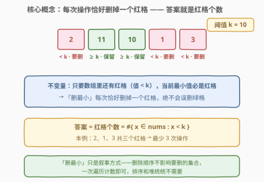
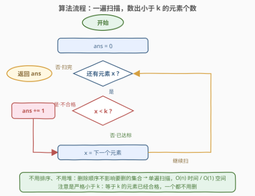
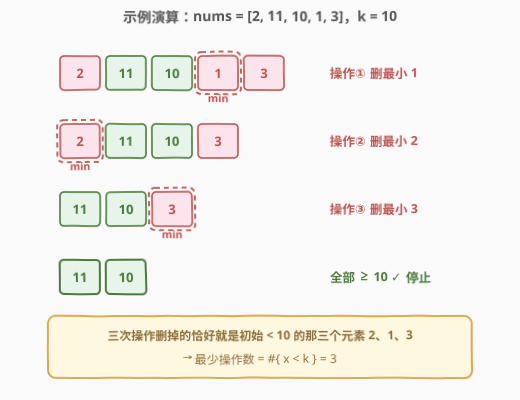

# 超过阈值的最少操作数 I

- **题目名称**：超过阈值的最少操作数 I
- **链接**：[3065. 超过阈值的最少操作数 I](https://leetcode.cn/problems/minimum-operations-to-exceed-threshold-value-i/)
- **难度**：简单
- **标签**：数组

## 1. 题目概述

给你一个下标从 **0** 开始的整数数组 `nums` 和一个整数 `k`。一次操作中，你可以删除 `nums` 中的**最小**元素。

你需要使数组中的**所有**元素都**大于或等于** `k`，请你返回需要的**最少**操作次数。

**示例 1**：

```text
输入：nums = [2,11,10,1,3], k = 10
输出：3
解释：第一次操作后，nums 变为 [2, 11, 10, 3]。
     第二次操作后，nums 变为 [11, 10, 3]。
     第三次操作后，nums 变为 [11, 10]。
     此时数组中所有元素都大于等于 10，停止操作。
```

**示例 2**：

```text
输入：nums = [1,1,2,4,9], k = 1
输出：0
解释：数组中所有元素都大于等于 1，无需任何操作。
```

**示例 3**：

```text
输入：nums = [1,1,2,4,9], k = 9
输出：4
解释：nums 中只有一个元素大于等于 9，所以需要执行 4 次操作。
```

**约束条件**：

- $1 \le \text{nums.length} \le 50$
- $1 \le \text{nums[i]} \le 10^9$
- $1 \le k \le 10^9$
- 输入保证至少存在一个满足 $\text{nums[i]} \ge k$ 的下标 $i$

> 💡 最后一条约束保证答案最多 $n-1$，数组永远不会被删空——不必担心「全删完了还达不到 k」的边界；同时注意合格线是**大于或等于** $k$，等于 $k$ 的元素不需要删。

---

## 2. 解题思路

### 2.1 暴力思路

老老实实按题意模拟：每一轮线性扫一遍数组求当前最小值并删除，直到剩余的最小值 $\ge k$ 为止。$n \le 50$，$O(n^2)$ 的模拟毫无压力。

但稍加观察就会发现：既然每次删的都是「最小」，**哪些元素会被删掉其实从一开始就注定了**——所有小于 $k$ 的元素谁都逃不掉，而大于等于 $k$ 的元素一个都不会被动到。逐轮模拟纯属浪费。

### 2.2 核心观察：数一数有多少个小于 k 的元素



记 $\text{cnt} = \#\{\,i : \text{nums[i]} < k\,\}$，即**严格小于** $k$ 的元素个数。用双向论证证明答案就是 $\text{cnt}$：

1. **下界（至少要 cnt 次）**：值小于 $k$ 的元素无论怎么操作都不可能「变合格」，唯一出路是被删除；而一次操作只删一个元素，所以操作次数 $\ge \text{cnt}$。

2. **恰好可达（cnt 次一定够）**：反过来，只要数组中还剩一个 $< k$ 的元素，当前数组的最小值必然 $< k$——也就是说，「删最小」这条规则保证**每一次操作删掉的恰好是一个不合格元素**，绝不会误伤 $\ge k$ 的合格元素。于是恰好 $\text{cnt}$ 次操作后，剩下的元素全部 $\ge k$。

两个方向夹逼：**答案 $= \text{cnt}$**。

> 💡 「每次删最小」是题面的烟雾弹：它既不改变要删的元素集合（所有 $< k$ 的都得删），也不会让你多删（最小值 $< k$ 时删的必是 $< k$ 的）。一次遍历计数即可，排序、堆统统不需要。

### 2.3 算法流程图



流程一句话：`ans = 0` → 从左到右逐个取元素 $x$ → $x < k$ 则 `ans++` → 扫完返回 `ans`。不需要排序，不需要堆，一个计数器走天下。

### 2.4 示例演算



以示例 1 走一遍：`nums = [2,11,10,1,3]`，$k=10$，初始 $< 10$ 的元素是 $2, 1, 3$ 共 3 个。

- 操作① 删最小 $1$ → `[2, 11, 10, 3]`
- 操作② 删最小 $2$ → `[11, 10, 3]`
- 操作③ 删最小 $3$ → `[11, 10]`，全部 $\ge 10$，停止

三次操作删掉的**恰好就是初始那三个 $< 10$ 的元素**。示例 2 中 $k=1$，所有元素 $\ge 1$，$\text{cnt}=0$；示例 3 中 $k=9$，$< 9$ 的有 $1,1,2,4$ 共 4 个，答案 4。

---

## 3. 参考代码

### C++

```cpp
class Solution {
  public:
    int minOperations(vector<int>& nums, int k) {
        int ans = 0;
        for (int x : nums) ans += (x < k);
        return ans;
    }
};
```

### Python

```python
class Solution:
    def minOperations(self, nums: List[int], k: int) -> int:
        return sum(x < k for x in nums)
```

> 💡 两处小细节：C++ 中 `ans += (x < k)` 把布尔值当 0/1 累加；Python 中 `sum` 直接消费布尔迭代器。另外比较必须是**严格小于**——「大于或等于 $k$」才算合格，$x = k$ 的元素要保留。

---

## 4. 复杂度分析

| 维度 | 复杂度 | 说明 |
|------|--------|------|
| 时间复杂度 | $O(n)$ | 单遍扫描，每个元素做一次比较；$n \le 50$ 实际是常数级 |
| 空间复杂度 | $O(1)$ | 只用一个计数器，不排序、不开堆、不产生新数组 |

---

## 5. 扩展：什么时候「数个数」会失效？

姐妹题 [3066. 超过阈值的最少操作数 II](https://leetcode.cn/problems/minimum-operations-to-exceed-threshold-value-ii/) 把操作改为：**删除两个最小的元素 $x \le y$，并把 $\min(x,y) \times 2 + \max(x,y)$ 放回数组**。此时：

- 合并会产生**新值**，元素不再「只减不增」——一个原本 $< k$ 的元素可能经过合并变得 $\ge k$，也可能仍然 $< k$ 需要继续合并；
- 「初始 $< k$ 的都得删」这条下界论证直接崩塌，答案与初始计数不再相等；
- 正确做法是用**小根堆**逐轮真实模拟：每次弹出两个最小值、算出新值塞回堆，直到堆顶 $\ge k$。新值可达 $3 \times 10^9$ 量级，C++ 需要用 `long long` 防溢出。

一句话判据：**操作只删除元素 → 数个数；操作会改写 / 生成元素 → 老实模拟**。

---

## 6. 面试要点

1. **为什么答案就是小于 k 的元素个数？**

   - 双向论证。下界：每个 $< k$ 的元素必须被删，一次只删一个；可达：只要还有 $< k$ 的元素，当前最小值必 $< k$，「删最小」保证每次恰好删掉一个不合格元素、绝不误删。二者夹逼，答案 $= \text{cnt}$。

2. **「删最小」这个规则对答案有影响吗？**

   - 对计数值没有影响——要删的元素集合从一开始就固定为 $\{x : x < k\}$。它真正的作用是保证过程「不浪费」：永远不会把 $\ge k$ 的合格元素删掉，从而按题意模拟自然达到下界。

3. **需要排序或者用堆吗？**

   - 都不需要。排序 $O(n \log n)$ 只是求计数的一条绕路；堆是 3066 那类「元素值会变化」的题才需要的工具。$n \le 50$ 时哪怕 $O(n^2)$ 模拟也能过，但面试要主动说出 $O(n)$ 计数解法并给出论证。

4. **时间与空间复杂度是多少？**

   - 时间 $O(n)$：每个元素一次比较；空间 $O(1)$：只有一个计数器。

5. **变体追问：改成每次删两个最小并放回 $2\min + \max$（即 3066），还能数个数吗？**

   - 不能。合并会生成新值，元素集合动态变化，「初始 $< k$ 的都得删」不再成立（新合成的值可能仍 $< k$，需要继续参与合并）。必须用小根堆模拟到堆顶 $\ge k$，并注意用 64 位整数防溢出。

---

## 7. 同类练习题

- [3066. 超过阈值的最少操作数 II](https://leetcode.cn/problems/minimum-operations-to-exceed-threshold-value-ii/)：姐妹题，删两个最小再放回合并值，「数个数」失效，改小根堆模拟
- [2148. 元素计数](https://leetcode.cn/problems/count-elements-with-strictly-smaller-and-greater-elements/)：同样一次遍历「数个数」，阈值比较换成「严格大于最小值且严格小于最大值」
- [2733. 既不是最小值也不是最大值](https://leetcode.cn/problems/neither-minimum-nor-maximum/)：按 min/max 阈值筛元素，练习严格 / 非严格比较的边界处理
- [2465. 不同的平均值数目](https://leetcode.cn/problems/number-of-distinct-averages/)：每轮真的删除 min/max 的模拟题，对照「何时可以只数个数、何时必须老实模拟」
