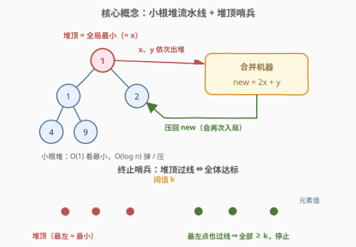
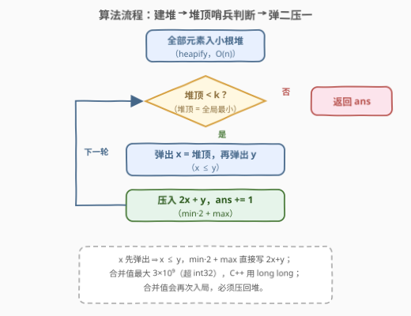

# LeetCode 超过阈值的最少操作数 II 题解

## 1. 题目概述

- **标题 / 题号**：超过阈值的最少操作数 II（#3066，medium）
- **链接**：https://leetcode.cn/problems/minimum-operations-to-exceed-threshold-value-ii/
- **难度**：中等
- **标签**：数组、模拟、堆（优先队列）

**题意**：给你一个下标从 **0** 开始的整数数组 `nums` 和一个整数 `k`。每次操作包含三步：

1. 选择 `nums` 中**最小**的两个整数 `x` 和 `y`；
2. 将 `x` 和 `y` 从 `nums` 中删除；
3. 将 $\min(x, y) \times 2 + \max(x, y)$ 添加到数组中的**任意位置**。

**注意**：只有当 `nums` **至少**包含两个元素时才能执行操作。

你需要使数组中所有元素都**大于等于** $k$，返回需要的**最少**操作次数。题目保证答案一定存在。

**示例 1**：

```text
输入：nums = [2,11,10,1,3], k = 10
输出：2
解释：第 1 次操作删除 1 和 2，加入 1*2+2=4，nums 变为 [4,11,10,3]；
     第 2 次操作删除 3 和 4，加入 3*2+4=10，nums 变为 [10,11,10]。
     此时所有元素都 ≥ 10，停止，答案为 2。
```

**示例 2**：

```text
输入：nums = [1,1,2,4,9], k = 20
输出：4
解释：四次操作后 nums 依次变为 [2,4,9,3] → [7,4,9] → [15,9] → [33]，
     33 ≥ 20，答案为 4。
```

**约束**：

- $2 \le \text{nums.length} \le 2 \times 10^5$
- $1 \le \text{nums}[i] \le 10^9$
- $1 \le k \le 10^9$
- 输入保证答案存在

> 💡 读题关键：操作是**强制**的——永远拿最小的两个，没有挑选余地；「添加到任意位置」是烟雾弹，顺序对后续毫无影响（之后只按**值**取数）。整条执行轨道**唯一确定**，「最少」二字其实是白送的——要做的只是**高效模拟**并数出步数。

> ⚠️ 溢出暗坑：$\min \times 2 + \max$ 单次就可达 $2 \times (10^9 - 1) + 10^9 \approx 3 \times 10^9$，超过 `int` 上限 $2.1 \times 10^9$；C++ 必须用 `long long`。

## 2. 解题思路

### 2.1 暴力思路：每轮线性扫描找最小两个

最直接的模拟：每轮操作花 $O(n)$ 扫描数组找出最小与次小，删除后把合并值追加到末尾。每轮操作让元素个数减一，至多执行 $n-1$ 轮，总复杂度 $O(n^2)$。$n = 2 \times 10^5$ 时约 $4 \times 10^{10}$ 次比较，必然超时。

另一条常见歧路：先排序，维护一个有序数组，每轮取头部两个、再用二分找位插入合并值。查找虽是 $O(\log n)$，但数组的**头部删除 / 中间插入**都要整体搬移 $O(n)$ 个元素——最坏仍是 $O(n^2)$，只是常数更小罢了。

病根在于：这是一个「**反复取最小 + 反复插入新值**」的动态极值集合问题——无序结构查得慢，有序结构动得慢，两头都快的数据结构只有一个：**堆**。

### 2.2 核心观察：小根堆流水线 + 堆顶哨兵



三个观察把暴力直接优化到 $O(n \log n)$：

1. **过程是确定性的**：操作永远取最小的两个，插入位置又无关紧要，整条轨道没有分叉。「最少操作数」就是这条唯一轨道走到「全部 $\ge k$」的自然步数——**不需要任何贪心策略与证明**，纯模拟即可。
2. **小根堆与操作严丝合缝**：建堆后，每轮「弹出堆顶两次 + 压入一个新值」，三次堆操作各 $O(\log n)$，看最小却是 $O(1)$——正好补上暴力法两头都慢的短板。
3. **堆顶就是哨兵**：小根堆的堆顶是**全局最小**。堆顶 $\ge k \Leftrightarrow$ 所有元素 $\ge k$。于是终止判断浓缩成一个 `while (heap.top() < k)`——达标即刻收工，绝不多走一步。

两个保证正确性的细节：

- **合并值严格变大且会再次入局**：$x \ge 1$ 时 $2x + y > y \ge x$，新值必大于两个旧值；示例 2 中第 ① 步产出的 $3$ 在第 ② 步又被消费。所以新值**必须压回堆**，不能输出到一边不管。同时元素个数每轮减一、值不断抬升，配合「答案保证存在」，循环必然终止。
- **溢出**：单次合并最大约 $3 \times 10^9$，且合并值还可能继续参与合并继续放大，堆的**元素类型**直接用 `long long`（Python 天然大整数，无此虑）。

> ⚠️ 循环条件写 `heap.top() < k` 而不加 `size() >= 2` 保护是安全的：若过程中出现「只剩 1 个元素且 $< k$」，则无法继续操作、目标永不可达，与「答案保证存在」矛盾。不信任输入时加上保护也无妨，合法输入下二者等价。

### 2.3 算法流程：建堆 → 哨兵判断 → 弹二压一



1. 把 `nums` 全部元素压入小根堆（C++ 用迭代器区间构造、Python 用 `heapify`，均为 $O(n)$）；
2. 循环：只要堆顶 $< k$——弹出 `x`（最小），再弹出 `y`（次小），压入 `2 * x + y`，`ans += 1`；
3. 堆顶 $\ge k$ 时退出循环，返回 `ans`。

小彩蛋：`x` 先出堆 ⇒ $x \le y$，于是 $\min \times 2 + \max$ 可以直接写成 `2 * x + y`，省掉 `min`/`max` 调用——**弹出顺序本身就编码了大小关系**。

### 2.4 示例演算

![示例演算：nums=[1,1,2,4,9], k=20 的四轮弹二压一全过程](../images/p3066_example_walkthrough.svg)

以示例 2（`nums = [1,1,2,4,9]`，`k = 20`）为例，堆中状态（红色为堆顶）逐步演化：

| 轮次 | 弹出 x, y | 压入 2x+y | 堆中剩余 | ans |
|------|-----------|-----------|----------|-----|
| 初始 | — | — | {1, 1, 2, 4, 9} | 0 |
| ① | 1, 1 | 3 | {2, 3, 4, 9} | 1 |
| ② | 2, 3 | 7 | {4, 7, 9} | 2 |
| ③ | 4, 7 | 15 | {9, 15} | 3 |
| ④ | 9, 15 | 33 | {33} | 4 |

堆顶 $33 \ge 20$，停止，返回 $4$。注意 ①②③ 产出的 $3, 7, 15$ 全部在后续轮次被再次消费——**合并值重新入局**是本题区别于「一遍扫描」题的本质特征。

示例 1（`k = 10`）同理：$\{1,2,3,10,11\}$ → ① 弹 $1,2$ 压 $4$ → ② 弹 $3,4$ 压 $10$ → 堆顶 $10 \ge 10$（**注意是 ≥ 不是 >**），返回 $2$。

## 3. 参考代码

### C++（小根堆模拟，long long 防溢出）

```cpp
class Solution {
  public:
    int minOperations(vector<int>& nums, int k) {
        // 合并值最大可达 3×10^9 且会继续增长，堆必须存 long long
        priority_queue<long long, vector<long long>, greater<long long>>
            pq(nums.begin(), nums.end());
        int ans = 0;
        while (pq.top() < k) {                 // 堆顶 = 全局最小，它达标即全体达标
            long long x = pq.top(); pq.pop();  // x = 最小
            long long y = pq.top(); pq.pop();  // y = 次小，x ≤ y
            pq.push(2 * x + y);                // min*2 + max = 2x + y
            ans++;
        }
        return ans;
    }
};
```

### Python（heapq 原地建堆）

```python
class Solution:
    def minOperations(self, nums: List[int], k: int) -> int:
        heapq.heapify(nums)            # 原地建堆，O(n)
        ans = 0
        while nums[0] < k:             # nums[0] 即堆顶（最小值）
            x = heapq.heappop(nums)    # 最小
            y = heapq.heappop(nums)    # 次小，x ≤ y
            heapq.heappush(nums, 2 * x + y)
            ans += 1
        return ans
```

> 💡 `heapify` 会**原地改动**入参数组；面试若想保持入参不变，先 `heap = nums[:]` 拷贝一份再建堆，语义更稳。Python 整数无上限，天然免疫溢出坑。

## 4. 复杂度分析

| 维度 | 复杂度 | 说明 |
|------|--------|------|
| 时间复杂度 | $O(n \log n)$ | 建堆 $O(n)$；至多 $n-1$ 轮操作，每轮 2 弹 1 压共 3 次 $O(\log n)$ 堆操作 |
| 空间复杂度 | $O(n)$ | 堆中存放不断减少的全部元素 |

## 5. 扩展：确定性堆模拟 vs 选择性堆贪心

本题属于「**确定性堆模拟**」：操作对象被题面钉死（最小的两个），代码里没有任何决策。这个家族里还有：

- **[1046. 最后一块石头的重量](https://leetcode.cn/problems/last-stone-weight/)**：镜像版——永远取**两个最大**相撞，大根堆模拟，同样零决策。
- **前传 [3065. 超过阈值的最少操作数 I](https://leetcode.cn/problems/minimum-operations-to-exceed-threshold-value-i/)**：没有合并操作，只需统计 $< k$ 的元素个数，一遍扫描 $O(n)$。加上「删除合并」后复杂度跃迁到 $O(n \log n)$，正好演示了**数据结构需求是如何被操作语义逼出来的**。

再往前一步是「**选择性堆贪心**」：操作对象可自由挑选，最优策略是「作用在当前极值上」，但这需要交换论证撑腰：

- **[1962. 移除石子使总数最小](https://leetcode.cn/problems/remove-stones-to-minimize-the-total/)**：每轮可选任意一堆减半，贪心选当前最大；
- **[2208. 将数组和减半的最少操作次数](https://leetcode.cn/problems/minimum-operations-to-halve-array-sum/)**：每轮减半任意元素直到总和减半，同样贪心最大，且终止条件（剩余和 $\le$ 目标）与本题「堆顶哨兵」一样是**聚合量过线即停**。

> 💡 分辨口诀：题面写「选择**最**X 的元素」→ 确定性模拟，堆只是加速器；题面写「选择**任意**元素」→ 需要贪心证明，堆是策略的执行器。更远的祖先是 Huffman 编码——反复合并两个最小频率节点并**累加代价**，本题的 $2x+y$ 正是那套合并思想换了统计目标。

## 6. 面试要点

1. **「最少操作数」为什么不需要任何贪心策略或证明？**

   - 操作本身是强制的：必须取最小的两个，且插入位置对后续无影响（取数只看值不看位置）。整条执行轨道唯一确定，答案就是模拟到「全部 $\ge k$」的自然步数，「最少」是题面修辞，不是优化目标。

2. **为什么 `while (heap.top() < k)` 一个条件就能判断「所有元素 ≥ k」？**

   - 小根堆堆顶是全局最小值。最小值 $\ge k$ 时，其余元素必然 $\ge k$；反之堆顶 $< k$ 则至少还有一个未达标。$O(1)$ 的哨兵检查替代了 $O(n)$ 的全量扫描。

3. **循环里不做 `size() >= 2` 的保护，为什么不会弹出空堆？**

   - 题目保证答案存在。若某时刻只剩 1 个元素且 $< k$，操作无法执行（需至少两个元素）、目标永不可达，与保证矛盾；因此「堆顶 $< k$」成立时堆中必有至少 2 个元素。加上保护防御非法输入也可以，合法输入下两者等价。

4. **C++ 这题的溢出点在哪里？只把乘法转成 long long 够吗？**

   - 不够。单次合并 $2x + y$ 最大约 $3 \times 10^9$ 已超 `int`；且合并值可能再次参与合并继续放大。堆的**元素类型**本身要用 `long long`，而不是在表达式里临时转型。

5. **暴力、有序数组、堆三种做法的本质差别是什么？**

   - 瓶颈是「每轮取最小两个 + 插入一个新值」：无序数组取最小 $O(n)$，有序数组插入删除要搬移 $O(n)$，都是一头快一头慢，总 $O(n^2)$；堆把看最小做到 $O(1)$、插删做到 $O(\log n)$，总 $O(n \log n)$——$n = 2 \times 10^5$ 时相差约四个数量级。

## 同类练习题

| # | 题目 | 与本题的关联 |
|---|------|-------------|
| 3065 | [超过阈值的最少操作数 I](https://leetcode.cn/problems/minimum-operations-to-exceed-threshold-value-i/) | 前传，无合并纯计数 $< k$ 的元素个数，对比理解「删除合并」操作如何逼出堆 |
| 1046 | [最后一块石头的重量](https://leetcode.cn/problems/last-stone-weight/) | 镜像确定性堆模拟——永远取两个**最大**相撞放回，换大根堆同款骨架 |
| 1962 | [移除石子使总数最小](https://leetcode.cn/problems/remove-stones-to-minimize-the-total/) | 操作对象可任选的堆贪心（每轮减半当前最大），对照体会「确定性 vs 有选择」的差别 |
| 2208 | [将数组和减半的最少操作次数](https://leetcode.cn/problems/minimum-operations-to-halve-array-sum/) | 堆贪心 + 聚合量过线即停的终止条件，与本题「堆顶哨兵」异曲同工 |
| 23 | [合并 K 个升序链表](https://leetcode.cn/problems/merge-k-sorted-lists/) | 小根堆「反复取最小、取完补一个」的另一经典场景（k 路归并） |
