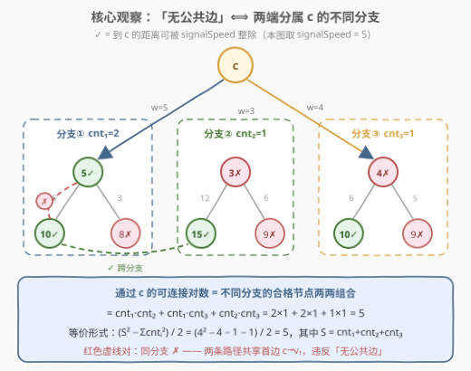
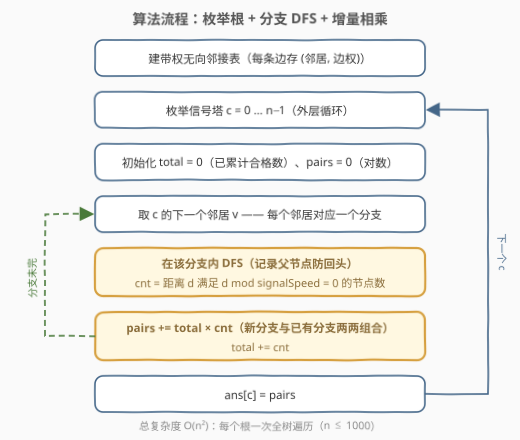
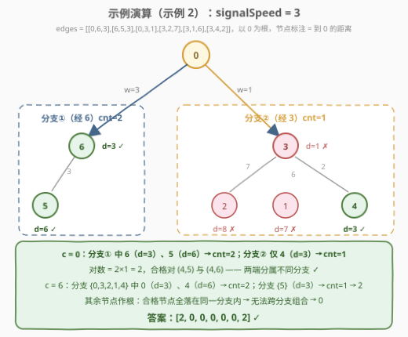

# 在带权树网络中统计可连接服务器对数目

- **题目名称**：在带权树网络中统计可连接服务器对数目
- **链接**：[3067. 在带权树网络中统计可连接服务器对数目](https://leetcode.cn/problems/count-pairs-of-connectable-servers-in-a-weighted-tree-network/)
- **难度**：中等
- **标签**：树、深度优先搜索、数组

## 1. 题目概述

给你一棵**无根带权树**，树中共有 $n$ 个节点，分别表示 $n$ 个服务器，服务器从 $0$ 到 $n-1$ 编号。同时给你一个数组 `edges`，其中 `edges[i] = [ai, bi, weighti]` 表示节点 $a_i$ 和 $b_i$ 之间有一条双向边，边权为 $weight_i$。再给你一个整数 `signalSpeed`。

如果两台服务器 $a$ 和 $b$ 是**通过服务器 $c$ 可连接的**，则：

- $a < b$，$a \ne c$ 且 $b \ne c$；
- 从 $c$ 到 $a$ 的距离可以被 `signalSpeed` **整除**；
- 从 $c$ 到 $b$ 的距离可以被 `signalSpeed` **整除**；
- 从 $c$ 到 $b$ 的路径与从 $c$ 到 $a$ 的路径**没有任何公共边**。

请返回长度为 $n$ 的整数数组 `count`，其中 `count[i]` 表示通过服务器 $i$ 可连接的服务器对的**数目**。

**示例 1**：

```text
输入：edges = [[0,1,1],[1,2,5],[2,3,13],[3,4,9],[4,5,2]], signalSpeed = 1
输出：[0,4,6,6,4,0]
解释：由于 signalSpeed 等于 1，count[c] 等于所有从 c 开始且没有公共边的路径对数目。
```

**示例 2**：

```text
输入：edges = [[0,6,3],[6,5,3],[0,3,1],[3,2,7],[3,1,6],[3,4,2]], signalSpeed = 3
输出：[2,0,0,0,0,0,2]
解释：通过服务器 0，有 2 个可连接服务器对 (4,5) 和 (4,6)。
通过服务器 6，有 2 个可连接服务器对 (4,5) 和 (0,5)。
```

**约束条件**：

- $2 \le n \le 1000$
- $\text{edges.length} = n - 1$
- $\text{edges[i].length} = 3$
- $0 \le a_i, b_i < n$
- $1 \le weight_i \le 10^6$
- $1 \le \text{signalSpeed} \le 10^6$
- 输入保证 `edges` 构成一棵合法的树。

> 💡 读题关键：四个条件里前三个都好查，真正的题眼是第四个「**无公共边**」——它是树结构给出的组合性质，不必逐对模拟路径求交。把 $c$ 当成根，「无公共边」可以直接翻译成「$a$、$b$ 分属 $c$ 的**不同子树分支**」，整道题就变成了一次带余数条件的分支计数。

---

## 2. 解题思路

### 2.1 暴力思路：逐对验证路径

最直接的做法是对题目条件照单全收：先跑 $n$ 次 BFS/DFS 预处理全源距离 $dist[c][u]$，再枚举三元组 $(c, a, b)$（$a < b$，均不等于 $c$），检查两个距离是否都能被 `signalSpeed` 整除，最后还要**回溯出两条完整路径、比对边集合是否相交**——光是三元组就有 $O(n^3)$ 个，每次还要 $O(n)$ 比对路径，总量 $O(n^4)$；$n = 1000$ 时完全不可行。

暴力失败的根源：把「无公共边」当成了一个需要**逐对验证**的谓词。实际上树中**任意两点间的路径唯一**，这个性质把「路径不相交」结构化成了一个无需验证的分类条件——按分支划分，见下。

### 2.2 核心观察：「无公共边」⟺ 分属不同分支



把 $c$ 当作根，$c$ 的每条邻边 $c \to v$ 定义一个**分支**（以 $v$ 为根的子树）。任一节点 $u \ne c$ 都恰好属于一个分支——就是 $c \to u$ 路径的**第一条边**所在的那支。于是：

- **同分支 ⟹ 非法**：$c \to a$ 与 $c \to b$ 的第一条边都是 $c \to v$，两条路径**必然共享这条首边**；
- **异分支 ⟹ 合法**：若两条路径除 $c$ 之外还有交点 $u$，那么 $u$ 到 $c$ 就有了两条不同的路径，与「树中路径唯一」矛盾。所以异分支的两条路径只在 $c$ 处相交，**没有任何公共边**。

> ⚠️ 注意「交点」与「公共边」的区别：两条路径都经过 $c$（这是题目允许的，$c$ 本来就是中转站），但异分支时除 $c$ 外再无交集。同理，同分支的判断只看**首边**是否相同，与后面走多远无关。

于是问题彻底改写：设根 $c$ 的第 $i$ 个分支中有 $cnt_i$ 个节点到 $c$ 的距离能被 `signalSpeed` 整除，则

$$
\text{count}[c] = \sum_{i < j} cnt_i \cdot cnt_j = \frac{S^2 - \sum_i cnt_i^2}{2}, \quad S = \sum_i cnt_i
$$

同一个分支内的节点两两不配（共享首边），不同分支的合格节点两两任意配——这就是一个纯粹的**跨组组合计数**。

### 2.3 算法流程：枚举根 + 分支 DFS + 增量相乘



1. 建带权无向邻接表；
2. 枚举每个节点 $c$ 作为「信号塔」（根）；
3. 对 $c$ 的**每个邻居** $v$（即每个分支）跑一次 DFS：从 $v$ 出发、初始距离为边权 $w(c, v)$，沿途累计距离，统计分支内 $d \bmod \text{signalSpeed} = 0$ 的节点数 $cnt$；
4. **增量合并**：`pairs += total * cnt; total += cnt`——每个新分支与之前所有分支的合格节点两两组合，恰好把每对不同分支的组合数一次；
5. 所有分支处理完后 `ans[c] = pairs`。

两个实现细节：

- **DFS 从邻居出发而非从 $c$ 出发**：起点距离已是首边权 $w \ge 1$，天然把 $c$ 自身排除在外（题目要求 $a \ne c$、$b \ne c$，即使距离 0 可整除也不该计入）；
- **沿分支 DFS 时记录父节点**，防止走回头路即可在无向图上完成子树遍历。

### 2.4 示例演算



以示例 2（`signalSpeed = 3`）走一遍，树形：$0 \leftrightarrow 6 \leftrightarrow 5$ 一支，$0 \leftrightarrow 3$ 带出 $3 \leftrightarrow \{2, 1, 4\}$ 一支：

| 根 $c$ | 各分支的合格节点数 | 对数 |
|--------|-------------------|------|
| $0$ | 经 6：$\{6(d{=}3), 5(d{=}6)\}$ → $cnt{=}2$；经 3：仅 $4(d{=}3)$ → $cnt{=}1$ | $2 \times 1 = 2$，合格对 $(4,5),(4,6)$ |
| $6$ | 经 0：$0(d{=}3), 4(d{=}6)$ → $cnt{=}2$；经 5：$5(d{=}3)$ → $cnt{=}1$ | $2 \times 1 = 2$，合格对 $(4,5),(0,5)$ |
| $1,2,4,5$ | 作根时其余全树是**同一个分支** | $0$ |
| $3$ | 四个分支中只有经 1 的分支有合格节点 $1(d{=}6)$，其余分支 $cnt=0$ | $0$（合格节点集中在一个分支，凑不出跨分支对） |

最终答案 $[2,0,0,0,0,0,2]$，与官方输出一致。注意 $c = 3$ 一行揭示了常见坑：**有合格节点 ≠ 有可连接对**，必须凑齐两个不同分支。

---

## 3. 参考代码

### C++（枚举根 + 迭代分支 DFS）

```cpp
class Solution {
  public:
    vector<int> countPairsOfConnectableServers(vector<vector<int>>& edges, int signalSpeed) {
        int n = edges.size() + 1;
        vector<vector<pair<int, int>>> g(n);
        for (auto& e : edges) {
            g[e[0]].emplace_back(e[1], e[2]);
            g[e[1]].emplace_back(e[0], e[2]);
        }

        vector<int> ans(n);
        for (int c = 0; c < n; ++c) {                  // 枚举信号塔（根）
            long long total = 0, pairs = 0;
            for (auto& [v, w] : g[c]) {                // 每个邻居 = 一个分支
                long long cnt = 0;
                stack<tuple<int, int, long long>> st;  // (节点, 父节点, 距 c 距离)
                st.emplace(v, c, w);                   // 从邻居出发，天然排除 c 自身
                while (!st.empty()) {
                    auto [u, p, d] = st.top(); st.pop();
                    if (d % signalSpeed == 0) ++cnt;   // 整除距离，计数
                    for (auto& [nx, nw] : g[u])
                        if (nx != p) st.emplace(nx, u, d + nw);  // 不走回头路
                }
                pairs += total * cnt;                  // 新分支 × 已有分支
                total += cnt;
            }
            ans[c] = pairs;
        }
        return ans;
    }
};
```

### Python（显式栈迭代 DFS，防链状树爆递归）

```python
class Solution:
    def countPairsOfConnectableServers(self, edges: List[List[int]], signalSpeed: int) -> List[int]:
        n = len(edges) + 1
        g = [[] for _ in range(n)]
        for a, b, w in edges:
            g[a].append((b, w))
            g[b].append((a, w))

        ans = []
        for c in range(n):                     # 枚举信号塔（根）
            total = pairs = 0
            for v, w in g[c]:                  # 每个邻居 = 一个分支
                cnt = 0
                stack = [(v, c, w)]            # (节点, 父节点, 距 c 距离)
                while stack:
                    u, p, d = stack.pop()
                    if d % signalSpeed == 0:
                        cnt += 1
                    for nx, nw in g[u]:
                        if nx != p:            # 不走回头路
                            stack.append((nx, u, d + nw))
                pairs += total * cnt           # 新分支 × 已有分支
                total += cnt
            ans.append(pairs)
        return ans
```

> 💡 两份代码结构完全一致。C++ 用 `long long` 存距离链（最长 $(n-1) \times 10^6 \approx 10^9$，`int` 虽勉强装下但边界不留隐患）；Python 用显式栈而非递归，因为链状树递归深度可达 $n-1 = 999$，贴着默认递归上限 1000，容易 `RecursionError`。

---

## 4. 复杂度分析

| 维度 | 复杂度 | 说明 |
|------|--------|------|
| 时间复杂度 | $O(n^2)$ | 枚举 $n$ 个根，每个根做一次全树遍历（访问 $n$ 个节点、扫过 $n-1$ 条边各两次）为 $O(n)$；$n \le 1000$ 时约 $10^6$ 次基本操作 |
| 空间复杂度 | $O(n)$ | 邻接表 $O(n)$、DFS 显式栈最深 $O(n)$；不计输出数组 |

---

## 5. 扩展：为什么不用换根 DP 把复杂度降到 O(n)？

「以每个点为根统计全树信息」的题目家族里，有一类可以 用**换根 DP** 从 $O(n^2)$ 优化到 $O(n)$——如 [834. 树中距离之和](https://leetcode.cn/problems/sum-of-distances-in-tree/)：根从 $u$ 挪到相邻的 $v$ 时，$v$ 子树内所有距离减 $w$、子树外所有距离加 $w$，距离和可以用两个标量增量维护。

本题的统计量是「**距离可被整除的节点数**」，它不是 $w$ 的可加函数：给一批距离统一加/减 $w$ 后，哪些落回整除状态取决于每个距离**模 `signalSpeed` 的余数**。要增量维护，就得为每棵子树保存「距离余数分布表」（$signalSpeed$ 个桶），子树合并、换根转移都要逐余数桶搬运，代价 $O(\text{signalSpeed})$，总量 $O(n \cdot \text{signalSpeed})$——`signalSpeed` 高达 $10^6$ 时反而远劣于 $O(n^2)$。

所以本题的数据范围 $n \le 1000$ 正是给「枚举根 + 每根一遍 DFS」的 $O(n^2)$ 设计的。这提醒我们：**换根 DP 的适用边界是「统计量可写成关于边权的可加/可乘泛函」**；一旦统计量被取模、整除这类非线性条件绑架，老老实实枚举根反而是正解。

---

## 6. 面试要点

1. **「无公共边」为什么等价于「$a$、$b$ 分属 $c$ 的不同分支」？**

   - 树中任意两点间路径唯一。以 $c$ 为根，$c \to a$ 与 $c \to b$ 的第一条边决定各自分支：同分支则首边相同，必有公共边；异分支时若两路径除 $c$ 外还有交点 $u$，则 $u$ 到 $c$ 出现两条不同路径，与树矛盾——故仅在 $c$ 处相交，无公共边。

2. **$c$ 自身到 $c$ 的距离为 0（任何数都整除），为什么不计入？**

   - 题目要求 $a \ne c$ 且 $b \ne c$。实现上 DFS 从 $c$ 的**邻居**出发、初始距离为边权 $w \ge 1$，$c$ 从未被访问，天然排除，不需要额外特判。

3. **`pairs += total * cnt` 这个增量式为什么正确？**

   - 按分支顺序处理：处理第 $k$ 个分支时，`total` 是前 $k-1$ 个分支的合格节点总数，新分支的每个合格节点与它们各配成一对——恰好枚举了每对不同分支的无序组合一次，不重不漏。等价于 $(S^2 - \sum cnt_i^2)/2$，但增量式一遍扫完，无需存所有 $cnt_i$。

4. **$n = 1000$ 的链状树，递归会不会出问题？**

   - 递归深度可达 $n - 1 = 999$：Python 默认递归上限正好是 1000，贴边会 `RecursionError`，必须用显式栈迭代（或 `setrecursionlimit`，但帧开销也大）；C++ 默认栈深一般够用，但两份代码统一用迭代写法更稳妥。

5. **有合格节点却没有可连接对，是怎么回事？**

   - 计数单位是「**跨分支的对**」。若某根下所有合格节点都挤在同一个分支（如示例 2 的 $c = 3$，只有节点 1 合格），或者树退化成链（每个内点只有两个分支，两端点只有一个分支），配不出异分支对，`count` 为 0。这也是为什么不把「合格节点数」直接乘除组合数，而必须按分支分组后再跨组组合。

---

## 7. 同类练习题

- [834. 树中距离之和](https://leetcode.cn/problems/sum-of-distances-in-tree/)：同款「以每个点为根统计全树距离」，但用换根 DP 降到 $O(n)$，对照本题理解换根的适用边界
- [1519. 子树中标签相同的节点数](https://leetcode.cn/problems/number-of-nodes-in-the-sub-tree-with-the-same-label/)：以每个节点为根跑 DFS 统计子树信息，与本题「每个根一次 DFS」同构
- [310. 最小高度树](https://leetcode.cn/problems/minimum-height-trees/)：枚举根评估全树性质的另一形态，通过度数剥离间接求每个根的高度
- [2246. 相邻字符不同的最长路径](https://leetcode.cn/problems/longest-path-with-different-adjacent-characters/)：DFS 回传「分支内最优」再跨分支拼接，与本题的跨分支相乘是同款套路
- [2368. 受限条件下可到达节点的数目](https://leetcode.cn/problems/reachable-nodes-with-restrictions/)：带权树 + DFS 遍历基本功，先剪掉受限边再统计可达节点
