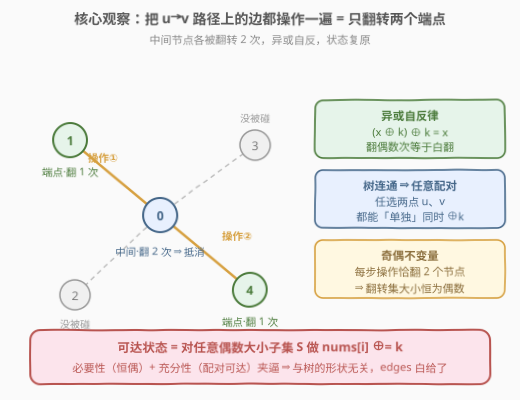
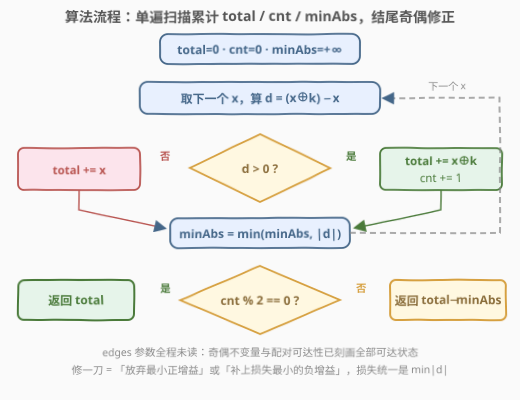
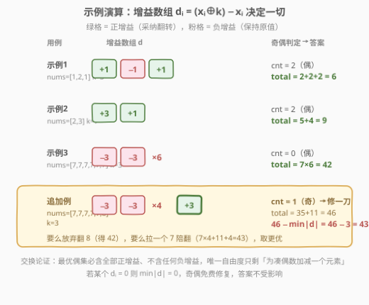

# 最大节点价值之和

- **题目名称**：最大节点价值之和
- **链接**：[3068. 最大节点价值之和](https://leetcode.cn/problems/find-the-maximum-sum-of-node-values/)
- **难度**：困难
- **标签**：贪心、位运算、树、动态规划

## 1. 题目概述

给定一棵 $n$ 个节点的**无向**树，节点编号 $0$ 到 $n-1$，边以数组 `edges` 给出。再给定**正**整数 $k$ 与非负整数数组 `nums`，其中 $nums[i]$ 是节点 $i$ 的**价值**。

Alice 想**最大化**所有节点价值之和。她可以执行以下操作**任意次**（**包括 0 次**）：选择一条边 $[u, v]$，并同时更新：

- $nums[u] \leftarrow nums[u] \oplus k$
- $nums[v] \leftarrow nums[v] \oplus k$

返回可得的最大价值和。

**示例 1**：

```text
输入：nums = [1,2,1], k = 3, edges = [[0,1],[0,2]]
输出：6
解释：选边 [0,2]，nums 变为 [2,2,2]，和为 6，为可达最大值。
```

**示例 2**：

```text
输入：nums = [2,3], k = 7, edges = [[0,1]]
输出：9
解释：选边 [0,1]，nums 变为 [5,4]，和为 9。
```

**示例 3**：

```text
输入：nums = [7,7,7,7,7,7], k = 3, edges = [[0,1],[0,2],[0,3],[0,4],[0,5]]
输出：42
解释：什么都不做就是最优（7 XOR 3 = 4 反而变小）。
```

**约束条件**：

- $2 \le n = nums.length \le 2 \times 10^4$
- $1 \le k \le 10^9$
- $0 \le nums[i] \le 10^9$
- `edges` 构成一棵合法的树（$n-1$ 条边，连通无环）

> 💡 关键读题点：操作次数**不限**、树**连通**、每次操作**恰好同时翻转两个节点**。这三条合在一起决定了「树的形状」其实无关紧要——见 2.2 的推导。

---

## 2. 解题思路

### 2.1 暴力思路：被「树」吓住的两条路

1. **枚举翻转子集**：每个节点最终要么翻转（异或过奇数次 $k$）要么不翻，直觉上枚举 $2^n$ 个子集再验证可达性——$n \le 2\times 10^4$，指数级直接爆炸。
2. **老老实实树形 DP**：官方 hints 给出的路线——设 $dp[x][c]$ 为子树 $x$ 的最大和，$c \in \{0,1\}$ 表示 $x$ 与父节点之间的边是否被选。转移时要枚举所有孩子边选/不选的组合，最终取 $dp[\text{root}][0]$。可行（$O(n)$），但要建邻接表、写 DFS、处理成对状态的合并，实现繁琐。

真正该问的问题是：**操作的能力边界到底在哪里？** 想清楚这一点，「树」的表象就会消失。

### 2.2 核心观察：边操作 ≡ 任意两点配对翻转，可达集 = 偶子集



用「**必要性 + 充分性**」双向夹逼所有可达状态：

**第一步（奇偶不变量，必要性）**：每次操作把**恰好 2 个**节点的翻转状态取反，因此任何时刻「被翻转（异或过奇数次 $k$）的节点总数」恒为**偶数**。这是任何可达状态必须满足的条件。

**第二步（路径抵消，充分性）**：树连通，任意两点 $u, v$ 之间存在唯一路径。把这条路径上的**每条边都操作一遍**：中间节点各被翻转 2 次，由异或自反律 $(x \oplus k) \oplus k = x$，状态完全复原；只有两个端点各被翻转 1 次。于是——

> **任意一对节点可以被「单独」同时翻转。**

两步合起来：把目标翻转集 $S$（偶数大小）两两配对，每对执行一次路径操作即可精确实现 $S$；而奇数大小的 $S$ 永远不可达。所以

$$\text{可达状态} = \big\{\,\text{对某个偶数大小子集 } S,\ \forall i \in S:\ nums[i] \mathrel{\oplus}= k\,\big\}$$

> 💡 **edges 白给了**：只要图连通，结论与树的形状彻底无关，问题退化为纯数组问题。这是本题最大的「啊哈」时刻——困难难度难在敢不敢扔掉树。

**贪心求解**：定义单点增益 $d_i = (nums[i] \oplus k) - nums[i]$。目标是选偶数大小的 $S$ 最大化 $\sum_{i \in S}(nums[i] \oplus k) + \sum_{i \notin S} nums[i]$：

1. **交换论证**：最优解必含**全部**正增益节点、不含**任何**负增益节点——若漏掉正增益 $i$ 却包含负增益 $j$，换入 $i$ 换出 $j$ 严格更优。于是无脑取所有 $d_i > 0$，设共 `cnt` 个；
2. `cnt` 为**偶** → 直接就是答案；
3. `cnt` 为**奇** → 修一刀：**要么放弃最小的正增益，要么额外拉入损失最小的负增益**。两种选择付出的代价统一是 $\min_i |d_i|$（若某 $d_i = 0$，则免费修复，答案不变）。

$$\text{ans} = \begin{cases} \text{total} & \text{cnt 为偶} \\ \text{total} - \min_i |d_i| & \text{cnt 为奇} \end{cases}$$

### 2.3 算法流程图



流程一句话：单遍扫描 `nums`，累计 `total`（贪心和）、`cnt`（正增益个数）、`minAbs`（最小绝对增益），结尾按 `cnt` 奇偶二选一输出。全程不读 `edges`。

### 2.4 示例演算



- **示例 1**：$d = [+1, -1, +1]$，正增益 2 个（偶），$total = 2+2+2 = 6$；
- **示例 2**：$d = [+3, +1]$，正增益 2 个（偶），$total = 5+4 = 9$；
- **示例 3**：$d = [-3] \times 6$，正增益 0 个（偶），$total = 42$；
- **追加例（奇修正触发）**：$nums = [7,7,7,7,7,8]$，$k=3$：$d = [-3,-3,-3,-3,-3,+3]$，正增益 1 个（奇）→ $total = 7\times5 + 11 = 46$，$\min|d| = 3$，答案 $46 - 3 = 43$。对应两条路：放弃翻 $8$ 得 $42$，或拉一个 $7$ 陪翻得 $7\times4 + 11 + 4 = 43$，取更优者。

---

## 3. 参考代码

### C++

```cpp
class Solution {
  public:
    long long maximumValueSum(vector<int>& nums, int k, vector<vector<int>>& edges) {
        long long total = 0;          // 贪心和：正增益取 x^k，否则取 x
        int cnt = 0;                  // 正增益（采纳翻转）的个数
        long long minAbs = LLONG_MAX; // 全局最小 |d|，奇数时用于修一刀
        for (int x : nums) {
            long long d = (long long)(x ^ k) - x;
            if (d > 0) {
                total += x ^ k;
                ++cnt;
            } else {
                total += x;
            }
            minAbs = min(minAbs, d > 0 ? d : -d);
        }
        return cnt % 2 == 0 ? total : total - minAbs;
    }
};
```

### Python

```python
class Solution:
    def maximumValueSum(self, nums: List[int], k: int, edges: List[List[int]]) -> int:
        total = cnt = 0
        min_abs = float("inf")
        for x in nums:
            d = (x ^ k) - x
            total += (x ^ k) if d > 0 else x
            cnt += d > 0
            min_abs = min(min_abs, abs(d))
        return total if cnt % 2 == 0 else total - min_abs
```

> ⚠️ **溢出陷阱**：$n \le 2\times10^4$、$nums[i] \le 10^9$，总和上界约 $2\times10^{13}$，超出 `int32`——C++ 必须用 `long long` 累加（$d$ 本身落在 $(−10^9, 10^9)$ 内，但顺手都用 `long long` 更稳）。Python 无此顾虑。

---

## 4. 复杂度分析

| 维度 | 复杂度 | 说明 |
|------|--------|------|
| 时间复杂度 | $O(n)$ | 单遍扫描 `nums`；`edges` 不参与计算（连通性已内化进「偶子集」结论） |
| 空间复杂度 | $O(1)$ | 仅 `total` / `cnt` / `minAbs` 三个滚动变量 |
| 对比树形 DP | $O(n)$ 时间 + $O(n)$ 栈空间 | 时间同为线性，但树形 DP 需建邻接表与递归，常数与实现成本都更高 |

---

## 5. 扩展：两套更「规矩」的 DP

**树形 DP（官方 hints 路线）**：任选根，设 $dp[x][c]$（$c \in \{0,1\}$：$x$ 与父节点的边是否被选）为子树 $x$ 内能取得的最大和。转移时枚举每个孩子的边选/不选，$x$ 本身被翻转的次数为 $c + \sum_y c_y$（父边 + 各子边），奇数次取 $nums[x] \oplus k$、偶数次取 $nums[x]$：

$$dp[x][c] = \max_{\{c_y\}} \left[\ \sum_y dp[y][c_y] + \big(c + \textstyle\sum_y c_y \text{ 为奇} ?\ nums[x] \oplus k : nums[x]\big)\ \right]$$

答案为 $dp[\text{root}][0]$（根无父边）。它正确但笨重——本质上是在用 DP 重新推导「翻转集恒偶」这条不变量。

**奇偶滚动 DP（竞赛万能模板）**：把「恰好翻转偶数个」编码进状态。$dp[0]$ / $dp[1]$ 分别表示已处理节点中翻转个数为偶 / 奇时的最大总和：

```python
class Solution:
    def maximumValueSum(self, nums: List[int], k: int, edges: List[List[int]]) -> int:
        even, odd = 0, float("-inf")   # 翻转个数为偶 / 奇的最大和
        for x in nums:
            even, odd = max(even + x, odd + (x ^ k)), max(odd + x, even + (x ^ k))
        return even
```

这个写法**不需要 `minAbs` 的 case 分析**，也不需要交换论证——「选偶数个」的约束由状态本身保证，最后 $dp[0]$ 即答案。凡是「恰好 / 至多若干个」这类全局约束，都可以用增设状态维的方式吸收掉，代价只是常数因子。

---

## 6. 面试要点

1. **为什么 `edges` 数组完全用不上？**

   - 双向夹逼：一方面每次操作恰翻 2 个节点，翻转集大小恒偶（必要性）；另一方面树连通，任意两点的路径操作会抵消中间节点，任意配对翻转可达（充分性）。两者合起来：可达翻转集 = 全体偶数大小子集，与树的形状无关。

2. **「偶子集充分可达」的构造具体怎么做？多条路径互相重叠怎么办？**

   - 把 $S$ 两两配对，每对取树上路径并操作路径上所有边。不同对的路径共享边时，该边被操作偶数次，对端点的影响成对抵消；最终每个节点被翻转的次数 = 包含它的「对」数，$\in S$ 恰为 1 次，否则 0 次。异或的交换律与自反律保证叠加次序无关。

3. **奇数修正为什么统一是 `total - min|d|`？**

   - 交换论证保证最优偶集 = 全部正增益集合 $P$，唯一不满足的是奇偶性：要么丢 $P$ 中最小的正增益，要么从 $P$ 外补损失最小的负增益。当 `cnt` 为奇时 $P$ 非空，这两个候选的最小代价恰好等于全局 $\min_i |d_i|$；若存在 $d_i = 0$，$\min|d| = 0$，修偶免费。

4. **这题的溢出与边界坑在哪？**

   - 总和上界 $2\times10^4 \times 10^9 \approx 2\times10^{13}$，C++ 用 `int` 累加必挂；`x ^ k` 本身不超 `int`（都 $< 2^{30}$），但差值与累加都建议 `long long`。另外 `n ≥ 2` 保证树至少一条边，但算法根本不依赖此条件。

5. **变体追问：如果给的不是树而是森林（不连通），会怎样？**

   - 配对翻转只能在**同一连通分量**内进行，奇偶不变量改为「每个分量内翻转数为偶」。做法：按分量分别执行上述贪心（每分量内部做奇偶修正）再求和。树是「全图一个分量」的特例。这个追问是检验是否真正理解不变量的试金石。

---

## 7. 同类练习题

- [1442. 形成两个异或相等数组的三元组数目](https://leetcode.cn/problems/count-triplets-that-can-form-two-arrays-of-equal-xor/)：同一块「异或区间抵消」观察（$a = b \Leftrightarrow$ 前缀异或相等），练 $S \oplus S = 0$
- [2527. 查询数组的异或美丽值](https://leetcode.cn/problems/find-xor-beauty-of-array/)：三重下标成对抵消到只剩单体，练「异或配对消失」的极端形态
- [3022. 给定操作次数内使剩余元素的或值最小](https://leetcode.cn/problems/minimize-or-of-remaining-elements-using-operations/)（[题解](../3001-3100/3022_给定操作次数内使剩余元素的或值最小.md)）：同款「操作语义翻译 + 贪心」——先把 $(i,j)$ 操作的本质看清，再按位从高位到低位贪心
- [337. 打家劫舍 III](https://leetcode.cn/problems/house-robber-iii/)：树上「选/不选」成对状态后序上传的祖师爷，对比本题扩展中的 $dp[x][c]$
- [1863. 找出所有子集的异或和再求和](https://leetcode.cn/problems/sum-of-all-subset-xor-totals/)：异或子集的基础手感题，按位独立计数，热身用
