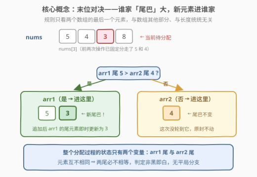
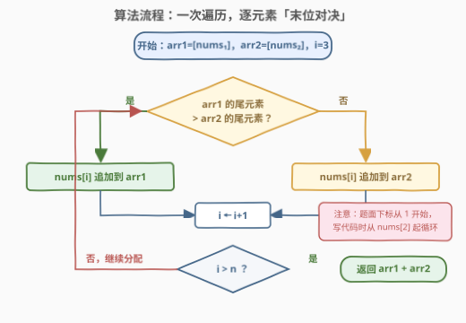

# LeetCode 将元素分配到两个数组中 I 题解

## 1. 题目概述

- **标题 / 题号**：将元素分配到两个数组中 I（#3069，easy）
- **链接**：https://leetcode.cn/problems/distribute-elements-into-two-arrays-i/
- **难度**：简单
- **标签**：数组、模拟

**题意**：给定一个下标从 **1** 开始、包含**互不相同**整数的数组 `nums`，长度为 `n`。通过 `n` 次操作把所有元素分配到两个数组 `arr1` 和 `arr2` 中：

- 第 1 次操作：将 `nums[1]` 追加到 `arr1`；
- 第 2 次操作：将 `nums[2]` 追加到 `arr2`；
- 第 $i$ 次（$i \ge 3$）：若 `arr1` 的最后一个元素**大于** `arr2` 的最后一个元素，则 `nums[i]` 追加到 `arr1`；否则追加到 `arr2`。

最后连接 `arr1` 和 `arr2` 得到 `result`（如 `arr1 = [1,2,3]`、`arr2 = [4,5,6]`，则 `result = [1,2,3,4,5,6]`），返回 `result`。

**示例 1**：

```text
输入：nums = [2,1,3]
输出：[2,3,1]
解释：前两次操作后 arr1 = [2]，arr2 = [1]。
第 3 次操作，2 > 1，故 3 进 arr1，得 arr1 = [2,3]，arr2 = [1]，result = [2,3,1]。
```

**示例 2**：

```text
输入：nums = [5,4,3,8]
输出：[5,3,4,8]
解释：前两次操作后 arr1 = [5]，arr2 = [4]。
第 3 次，5 > 4，3 进 arr1，arr1 = [5,3]；第 4 次，3 < 4，8 进 arr2，arr2 = [4,8]。
result = [5,3] + [4,8] = [5,3,4,8]。
```

**约束**：

- $3 \le n \le 50$
- $1 \le \text{nums}[i] \le 100$
- `nums` 中所有元素互不相同

> 💡 关键读题点有三处：① 题面下标从 1 开始，写代码时要换算成 0 开始；② 前两次操作是**固定**的，从第 3 次起才走比较分支；③ 比较的对象是两个数组**当前**的末尾元素——每追加一次，尾元素就随之改变，是动态的。

## 2. 解题思路

### 2.1 暴力思路：按题意逐字翻译就是最优

这道题没有「暴力 vs 最优」的分野——**按题意模拟本身就是渐近最优解**。每个元素至少要被看一次才能决定去向，$O(n)$ 已经是时间下界；更「暴力」的写法（比如每次从头扫描数组去找末尾元素，$O(n^2)$）只是白白浪费，因为动态数组的 `back()` 本来就是 $O(1)$。

真正的考点全在**读题**上，三个易错点：

1. **下标换算**：题面 1-based（`nums[1]`、`nums[2]`），代码 0-based——初始化取 `nums[0]`、`nums[1]`，循环从下标 `2` 开始；
2. **尾巴是活的**：`nums[i]` 进了某个数组，该数组的末尾元素立刻变成 `nums[i]`，影响下一次比较；
3. **无平局**：元素互不相同 ⇒ 任意时刻两尾必不相等，`if / else` 两分支覆盖全部情况，不用纠结相等怎么办。

### 2.2 核心观察：整个分配过程只有两个「状态变量」



规则只盯着 `arr1` 的末尾元素与 `arr2` 的末尾元素做一次比较，**与两个数组的其他元素、长度、内部顺序统统无关**。于是：

- 决策只需要 $O(1)$：读两个 `back()` 比大小；
- 状态更新也是 $O(1)$：追加即换尾；
- 元素互不相同保证两尾必不相等，判定非黑即白。

换句话说，如果把「两条尾巴」看作状态机的全部状态，那么这题就是一个每步转移 $O(1)$ 的线性状态机，从头扫到尾即可。

### 2.3 算法流程图



流程一句话：`arr1 = [nums[0]]`、`arr2 = [nums[1]]` 初始化 → 从下标 2 起逐个取 `nums[i]` → 比较两尾，大的那边收留它 → `i` 前进 → 扫描结束返回 `arr1 + arr2`。全程一遍过，无回溯、无预处理。

### 2.4 示例演算

![示例演算：nums=[5,4,3,8] 的四次操作](../images/p3069_example_walkthrough.svg)

以示例 2 `nums = [5,4,3,8]` 走一遍：

- 第 1 次：固定，`arr1 = [5]`；
- 第 2 次：固定，`arr2 = [4]`；
- 第 3 次：比较尾 $5 > 4$，`3` 进 `arr1`，`arr1 = [5,3]`——注意此时 `arr1` 的尾已经从 5 换成了 3；
- 第 4 次：比较尾 $3 < 4$，`8` 进 `arr2`，`arr2 = [4,8]`；
- 拼接：`result = [5,3] + [4,8] = [5,3,4,8]`，与官方输出一致。

第 4 次比较用的是 3 而不是 5，这个「换尾」细节正是本题唯一容易翻车的地方。

## 3. 参考代码

### C++

```cpp
class Solution {
  public:
    vector<int> resultArray(vector<int>& nums) {
        vector<int> arr1{nums[0]}, arr2{nums[1]};
        for (int i = 2; i < (int)nums.size(); ++i) {
            if (arr1.back() > arr2.back())
                arr1.push_back(nums[i]);
            else
                arr2.push_back(nums[i]);
        }
        arr1.insert(arr1.end(), arr2.begin(), arr2.end());
        return arr1;
    }
};
```

### Python

```python
class Solution:
    def resultArray(self, nums: List[int]) -> List[int]:
        arr1, arr2 = [nums[0]], [nums[1]]
        for x in nums[2:]:
            (arr1 if arr1[-1] > arr2[-1] else arr2).append(x)
        return arr1 + arr2
```

> 💡 说明：约束 $n \ge 3$ 保证 `nums[0]`、`nums[1]` 必然存在，无需特判；`(arr1 if cond else arr2).append(x)` 用条件表达式直接选中目标列表，省掉 if/else 两行。Python 的 `arr1 + arr2` 天然完成拼接；C++ 用 `insert` 把 `arr2` 接到 `arr1` 尾部，避免额外开结果数组。

## 4. 复杂度分析

| 维度 | 复杂度 | 说明 |
|------|--------|------|
| 时间复杂度 | $O(n)$ | 每个元素恰好一次 $O(1)$ 尾部比较 + $O(1)$ 追加，拼接 $O(n)$ |
| 空间复杂度 | $O(n)$ | `arr1`、`arr2` 共存下全部 $n$ 个元素；不计返回值则额外空间 $O(1)$ |
| 正确性保障 | 元素互异 | 任意时刻两尾必不相等，比较结果唯一，分支无歧义 |

## 5. 扩展：姊妹题 3072（当「查尾」升级成「计数」）

[3072. 将元素分配到两个数组中 II](https://leetcode.cn/problems/distribute-elements-into-two-arrays-ii/)（困难）把本题的判定规则整个换掉：

- 定义 $\text{greaterCount}(\text{arr}, x)$ 为 `arr` 中**严格大于** $x$ 的元素个数；
- 第 $i$ 次操作比较的是 $\text{greaterCount}(\text{arr1}, \text{nums}[i])$ 与 $\text{greaterCount}(\text{arr2}, \text{nums}[i])$，前者大（或相等）进 `arr1`，否则进 `arr2`。

规则一换，「只盯尾巴」就不够用了——查询的对象从**一个位置**（末尾）变成**一段值域**（所有大于 $x$ 的元素个数），且数组还在动态增长。可行做法是给两个数组各配一棵**树状数组**（值域离散化后维护计数，查询前缀和之差），每步 $O(\log n)$ 地回答「有几个元素比我大」。对照着看能提炼出模拟题的一条进化路线：**状态查询从 $O(1)$ 退化到需要数据结构支撑时，模拟本身不难，难的是给查询选对加速器**。

## 6. 面试要点

1. **为什么按题意模拟就是最优解？**

   - 每个元素必须至少被访问一次才能确定归属，$\Omega(n)$ 是时间下界；模拟恰好一遍扫描、每步 $O(1)$，已触底。面试中说清「下界 + 达到下界」比炫技更能加分。

2. **本题最容易写错的地方在哪？**

   - 三处：1-based 转 0-based 时循环起点写成 `i = 1`；忘记前两次操作是固定分配、从第 3 次起才比较；忽略「追加后尾元素立即更新」，导致下一次比较用了旧尾巴（例如示例 2 第 4 次应比较 3 与 4，而非 5 与 4）。

3. **如果元素允许重复，代码还成立吗？**

   - 成立。规则本身用「大于 → arr1，否则 → arr2」给全了所有情况的归属，两尾相等时落入 else 分支进 `arr2`。「元素互不相同」只是保证比较非平局，让流程更确定，并非正确性前提。

4. **能否只维护两个尾变量、不存整个数组，把空间压到 $O(1)$？**

   - 不能省。返回值要求 `arr1` 与 `arr2` 保持**元素进入的完整顺序**，两个数组本身就是输出的一部分，$O(n)$ 空间不可避免——「输出即状态」时，不要试图省这部分空间。

5. **追问（3072 方向）：判定改成「统计大于 x 的元素个数」怎么做？**

   - 给 `arr1`、`arr2` 各建一棵树状数组（值域离散化），追加元素即单点 +1，查询即后缀计数（总数 − 前缀和），每步 $O(\log n)$。这是「模拟 + 数据结构加速查询」的标准组合。

## 同类练习题

| # | 题目 | 与本题的关联 |
|---|------|-------------|
| 3072 | [将元素分配到两个数组中 II](https://leetcode.cn/problems/distribute-elements-into-two-arrays-ii/) | 本题困难版续作，判定升级为「严格大于 x 的元素计数」，练树状数组/平衡树加速模拟 |
| 3046 | [分割数组](https://leetcode.cn/problems/split-the-array/)（[题解](../3001-3100/3046_分割数组.md)） | 同是「把元素分进两个数组」，但目标是判可行性（每个数字至多出现两次），对照「构造分配」与「判定可分」两种问法 |
| 844 | [比较含退格的字符串](https://leetcode.cn/problems/backspace-string-compare/) | 模拟退格键对字符串的逐步演化，练「按规则推进状态」的基本功 |
| 735 | [行星碰撞](https://leetcode.cn/problems/asteroid-collision/)（[题解](../0701-0800/735_行星碰撞.md)） | 栈模拟碰撞规则，新元素到达时只与「栈顶」交互——和本题「只与尾部交互」同款局部性 |
| 946 | [验证栈序列](https://leetcode.cn/problems/validate-stack-sequences/)（[题解](../0901-1000/946_验证栈序列.md)） | 给定压入/弹出序列，模拟栈「能弹就弹」的贪心判定，进一步体会模拟类题的确定性流程 |
