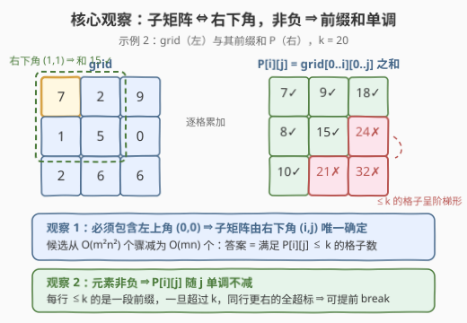
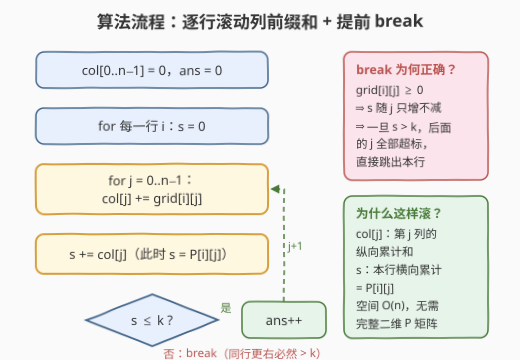
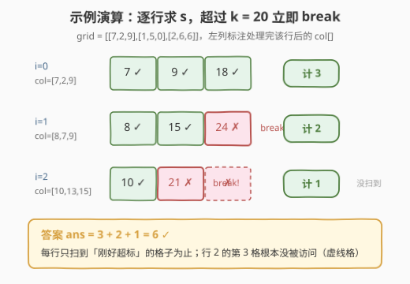

# 元素和小于等于 k 的子矩阵的数目

- **题目名称**：元素和小于等于 k 的子矩阵的数目
- **链接**：[3070. 元素和小于等于 k 的子矩阵的数目](https://leetcode.cn/problems/count-submatrices-with-top-left-element-and-sum-less-than-k/)
- **难度**：中等
- **标签**：数组、矩阵、前缀和

## 1. 题目概述

给你一个下标从 0 开始的整数矩阵 `grid` 和一个整数 $k$，返回**包含 `grid` 左上角元素**、且**元素和小于或等于 $k$** 的子矩阵的数目。

> 💡 子矩阵是矩阵内的一段连续矩形区域。本题额外要求该区域必须覆盖左上角格子 `(0, 0)`——这个约束是全题的钥匙。

**示例 1**：

```text
输入：grid = [[7,6,3],[6,6,1]], k = 18
输出：4
解释：只有 4 个子矩阵满足：包含左上角元素，且元素和 ≤ 18。
```

**示例 2**：

```text
输入：grid = [[7,2,9],[1,5,0],[2,6,6]], k = 20
输出：6
```

**约束条件**：

- $m = \text{grid.length}$，$n = \text{grid}[i].\text{length}$
- $1 \le m, n \le 1000$
- $0 \le \text{grid}[i][j] \le 1000$
- $1 \le k \le 10^9$

---

## 2. 解题思路

### 2.1 暴力思路

子矩阵由「上边界、下边界、左边界、右边界」四个自由度决定，四层循环枚举所有子矩阵有 $O(m^2 n^2)$ 个，再花 $O(mn)$ 逐个求和，总计 $O(m^3 n^3)$；即便用前缀和把单次求和降到 $O(1)$，也要遍历 $O(m^2 n^2)$ 个候选。在 $m, n \le 1000$ 的规模下约 $10^{12}$ 个，必然超时。

突破口藏在题目限制里：**子矩阵必须包含左上角元素**。这意味着左上角固定为 `(0, 0)`，四个自由度塌缩成一个——子矩阵**由右下角 `(i, j)` 唯一确定**，即 `grid[0..i][0..j]` 这一块。候选数从 $O(m^2 n^2)$ 骤减为 $O(mn)$。

### 2.2 核心观察：枚举右下角 + 非负性 ⇒ 前缀 break



**观察 1：答案 = 满足 $P[i][j] \le k$ 的格子数。**

记 $P[i][j]$ 为以 `(0,0)` 为左上角、`(i,j)` 为右下角的子矩阵元素和（二维前缀和）。统计满足 $P[i][j] \le k$ 的 `(i, j)` 对数即可。

**观察 2：非负元素 ⇒ 单调性 ⇒ 可提前 break。**

由于 $\text{grid}[i][j] \ge 0$，固定行 $i$ 时 $P[i][j]$ 关于 $j$ **单调不减**——每行的合格格子必是一段**前缀**。于是行内从左到右累加，一旦超过 $k$ 就能直接 `break`，后面的格子必然全部超标。

**观察 3：不必预建完整二维前缀和，一维滚动即可。**

$$P[i][j] = \underbrace{\sum_{r \le i}\text{grid}[r][j]}_{\text{col}[j]\text{：列前缀和}} \text{ 在行内累加}$$

维护一维数组 `col[j]`（第 $j$ 列从第 0 行累加到当前行的和），每处理一行做 `col[j] += grid[i][j]`；行内再用变量 $s$ 从左到右累加 `col[j]`，累加完恰好有 $s = P[i][j]$。空间从 $O(mn)$ 降到 $O(n)$。

> ⚠️ **溢出提醒**：全矩阵和最大 $1000 \times 1000 \times 1000 = 10^9$，贴近 `int` 上限（约 $2.1 \times 10^9$）。C++ 建议直接用 `long long` 累加，规避边界风险；Python 无此顾虑。

### 2.3 算法流程图



双循环结构：外层逐行更新 `col` 数组（列前缀和滚动前移），内层从左到右累加 $s$ 并计数，$s > k$ 立即跳出本行。

### 2.4 示例演算



以示例 2 `grid = [[7,2,9],[1,5,0],[2,6,6]]`，$k = 20$ 演算：

| 行 $i$ | 处理后 `col[]` | 行内 $s$ 依次取值 | 计数 |
|--------|---------------|-------------------|------|
| 0 | $[7, 2, 9]$ | $7$✓，$9$✓，$18$✓ | 3 |
| 1 | $[8, 7, 9]$ | $8$✓，$15$✓，$24$✗ → break | 2 |
| 2 | $[10, 13, 15]$ | $10$✓，$21$✗ → break | 1 |

答案 $= 3 + 2 + 1 = 6$，与官方一致。注意行 2 的第 3 格压根没被访问——break 剪枝省掉的不止一格，当合格前缀很短时每行只扫极少数格子。

---

## 3. 参考代码

### C++

```cpp
class Solution {
  public:
    int countSubmatrices(vector<vector<int>>& grid, int k) {
        int m = grid.size(), n = grid[0].size();
        vector<long long> col(n, 0);              // col[j]：第 j 列从第 0 行到当前行的和
        int ans = 0;
        for (int i = 0; i < m; i++) {
            long long s = 0;                      // 行内累加，s = P[i][j]
            for (int j = 0; j < n; j++) {
                col[j] += grid[i][j];
                s += col[j];
                if (s > k) break;                 // 非负 ⇒ 同行更右必然超标
                ans++;
            }
        }
        return ans;
    }
};
```

### Python

```python
class Solution:
    def countSubmatrices(self, grid: List[List[int]], k: int) -> int:
        n = len(grid[0])
        col = [0] * n                    # col[j]：第 j 列从第 0 行到当前行的和
        ans = 0
        for row in grid:
            s = 0                        # 行内累加，s = P[i][j]
            for j, x in enumerate(row):
                col[j] += x
                s += col[j]
                if s > k:                # 非负 ⇒ 同行更右必然超标
                    break
                ans += 1
        return ans
```

---

## 4. 复杂度分析

| 维度 | 复杂度 | 说明 |
|------|--------|------|
| 时间复杂度 | $O(m \cdot n)$ | 最坏每格访问一次；break 剪枝下合格前缀越短越快，通常远低于上界 |
| 空间复杂度 | $O(n)$ | 一维列前缀和数组；若预建完整二维前缀和则为 $O(mn)$ |

---

## 5. 扩展：约束一旦松动，套路如何失效

本题的简单性建立在两条约束上，值得逐条推演它们失效后的世界：

1. **「必须含左上角」松绑**（任意子矩阵）：候选回到 $O(m^2 n^2)$，需按上下边界压缩成行后套一维套路——和恰为 target 用哈希计数（[1074. 元素和为目标值的子矩阵数目](https://leetcode.cn/problems/number-of-submatrices-that-sum-to-target/)），和 $\le k$ 的最值用有序集合（[363. 矩形区域不超过 K 的最大数值和](https://leetcode.cn/problems/max-sum-of-rectangle-no-larger-than-k/)）。
2. **「非负」松绑**（出现负数）：$P[i][j]$ 关于 $j$ 的单调性被破坏，break 剪枝失效，合格格子不再是一段前缀——同样只能回到 1074/363 的一维化框架。
3. **更进一步**：由 $P[i][j] \ge P[i-1][j]$（非负性），每行合格前缀的宽度随 $i$ 增长**单调不增**，合格区域呈「阶梯形」。理论上可用只退不进的指针维护行间边界（每行边界不超过上一行，指针单向左移，总移动量 $\le n$），将扫描总量压到均摊 $O(m + n)$，但需要额外维护边界处的前缀和增量；在 $m, n \le 1000$ 下 break 版已足够快，不必过度设计。

---

## 6. 面试要点

1. **为什么子矩阵由右下角唯一确定？**

   - 子矩阵必须包含 `(0, 0)`，而子矩阵是连续矩形区域，故其上边界、左边界都只能取 0，仅剩右下角 `(i, j)` 一个自由度。一一对应使候选数从 $O(m^2 n^2)$ 降为 $O(mn)$。

2. **break 剪枝为什么正确？**

   - 元素非负 ⇒ 固定行 $i$ 时 $P[i][j]$ 随 $j$ 单调不减 ⇒ 一旦 $s = P[i][j] > k$，同一行更右侧的 $j'$ 必有 $P[i][j'] \ge P[i][j] > k$，跳过它们不会漏解。

3. **为什么用一维 col 滚动而不是标准二维前缀和？**

   - $P[i][j]$ 的计算顺序恰好是「逐行、行内从左到右」，与 `col[j] += grid[i][j]`、`s += col[j]` 的滚动节奏完全一致，无需容斥公式（$P = P_{上} + P_{左} - P_{左上} + \text{grid}$），空间也从 $O(mn)$ 降到 $O(n)$，还天然配合 break 提前终止。

4. **有哪些实现上的坑？**

   - 全矩阵和最大 $10^9$，贴近 `int` 上限，C++ 用 `long long` 累加最稳；`k` 本身可达 $10^9$，与 `int` 比较前注意类型一致；`break` 是跳过本行剩余列，不是终止整个外层循环（下一行的合格前缀可能更短，但仍需检查）。

5. **如果矩阵含负数还能这么做吗？**

   - 不能。单调性消失后合格格子不再构成行前缀，break 会漏解。需按行压缩 + 前缀和哈希（计数型）或有序集合（最值型），即 1074/363 的套路。

---

## 7. 同类练习题

- [1292. 元素和小于等于阈值的正方形的最大边长](https://leetcode.cn/problems/maximum-side-length-of-a-square-with-sum-less-than-or-equal-to-threshold/)：题意最接近——矩阵非负、条件同为「和 ≤ k」，用二维前缀和 + 单调剪枝（本库已收录题解）
- [304. 二维区域和检索 - 矩阵不可变](https://leetcode.cn/problems/range-sum-query-2d-immutable/)：二维前缀和模板题，容斥公式的标准出处（本库已收录题解）
- [1074. 元素和为目标值的子矩阵数目](https://leetcode.cn/problems/number-of-submatrices-that-sum-to-target/)：任意子矩阵 + 允许负数，按行压缩套「560 子数组和为 K」哈希计数
- [363. 矩形区域不超过 K 的最大数值和](https://leetcode.cn/problems/max-sum-of-rectangle-no-larger-than-k/)：任意矩形「和 ≤ k 求最大」，按行压缩 + 有序集合二分，观察 2 单调性失效后的替补方案
