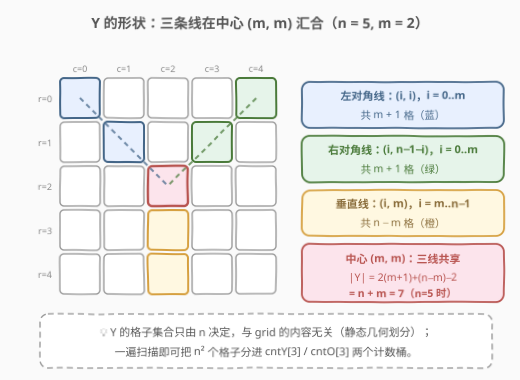
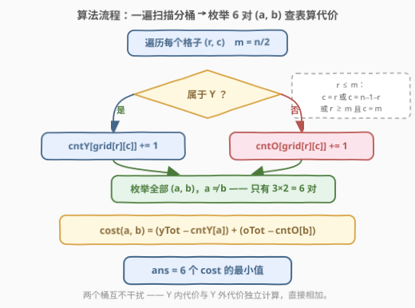
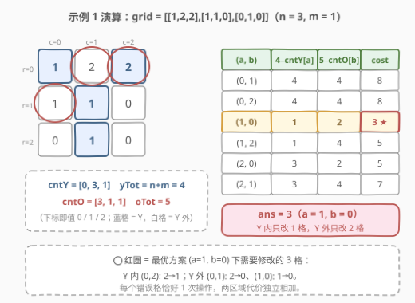

# 在矩阵上写出字母 Y 所需的最少操作次数

- **题目名称**：在矩阵上写出字母 Y 所需的最少操作次数
- **链接**：[3071. 在矩阵上写出字母 Y 所需的最少操作次数](https://leetcode.cn/problems/minimum-operations-to-write-the-letter-y-on-a-grid/)
- **难度**：中等
- **标签**：数组、哈希表、计数、矩阵

## 1. 题目概述

给你一个下标从 0 开始、大小为 $n \times n$ 的矩阵 `grid`，其中 $n$ 为**奇数**，且 `grid[r][c]` 的值为 `0`、`1` 或 `2`。

如果一个单元格属于以下三条线中的任一条，就认为它是**字母 Y 的一部分**：

1. 从左上角单元格开始到矩阵中心单元格结束的**对角线**；
2. 从右上角单元格开始到矩阵中心单元格结束的**对角线**；
3. 从中心单元格开始到矩阵底部边界结束的**垂直线**。

当且仅当满足以下**全部条件**时，可以判定矩阵上写有字母 Y：

- 属于 Y 的所有单元格的值相等；
- 不属于 Y 的所有单元格的值相等；
- Y 内的值与 Y 外的值**不同**。

每次操作可以将任意单元格的值改为 `0`、`1` 或 `2`。返回写出 Y 所需的**最少操作次数**。

**示例 1**：

```text
输入：grid = [[1,2,2],[1,1,0],[0,1,0]]
输出：3
解释：操作后，Y 内的值全为 1，Y 外的值全为 0。
     (0,0) 和 (0,2) 两格各需 1 次操作，(2,0) 需 1 次，共 3 次。
```

**示例 2**：

```text
输入：grid = [[0,1,0,1,0],[2,1,0,1,2],[2,2,2,0,1],[2,2,2,2,2],[2,1,2,2,2]]
输出：12
解释：操作后，Y 内的值全为 0，Y 外的值全为 2。
```

**约束条件**：

- $3 \le n \le 49$
- $n == \text{grid.length} == \text{grid}[i].\text{length}$
- $0 \le \text{grid}[i][j] \le 2$
- $n$ 为奇数

> ⚠️ 读题陷阱：目标不是一个「画在空格子上的 Y」，而是**整个矩阵**都要染色——Y 内所有格子同值 $a$，Y 外所有格子同值 $b$，且 $a \ne b$。只把 Y 的笔画涂对是不够的，$n^2$ 个格子**每个**都必须归入两色之一。

---

## 2. 解题思路

### 2.1 暴力思路

最终状态完全由一对目标值 $(a, b)$ 决定（$a$ = Y 内的值，$b$ = Y 外的值，$a \ne b$）。值域只有 $\{0,1,2\}$，合法组合仅 $3 \times 2 = 6$ 对。

最直接的暴力：对每对 $(a,b)$，**重扫整个矩阵**，数出「Y 区域内不等于 $a$ 的格子数 + Y 区域外不等于 $b$ 的格子数」，取最小值。时间 $O(6 n^2)$，$n \le 49$ 时约 $1.4 \times 10^4$ 次判断，轻松通过。

但这 6 次扫描做了大量重复劳动——每个格子「属不属于 Y」被判断了 6 遍，值 $v$ 的归属也被反复数。更糟的写法是逐格贪心「看它离哪个值近」，那是把问题想成局部决策，实际上**全局只有 6 种最终形态**，局部贪心没有意义。

### 2.2 核心观察：静态几何划分 + 分桶计数 + 枚举 6 对目标值



**观察 1：Y 的格子集合只由 $n$ 决定，与 `grid` 内容无关。** 设 $m = \lfloor n/2 \rfloor$（中心下标），则：

| 线段 | 坐标规律 | 格子数 |
|------|----------|--------|
| 左对角线 | $(i, i)$，$0 \le i \le m$ | $m+1$ |
| 右对角线 | $(i, n-1-i)$，$0 \le i \le m$ | $m+1$ |
| 垂直线 | $(i, m)$，$m \le i \le n-1$ | $n-m$ |

中心 $(m,m)$ 被三条线**共享**，由容斥：

$$|Y| = 2(m+1) + (n-m) - 2 = n + m$$

**观察 2：改动代价只依赖两张计数表。** 给定目标 $(a,b)$，一个格子需要操作当且仅当它的值不等于所在区域的目标值，且恰好需要 1 次操作（直接改成目标值）。于是：

$$\text{cost}(a,b) = \underbrace{\big(|Y| - \text{cntY}[a]\big)}_{Y\ \text{内改成}\ a} + \underbrace{\big(|\bar Y| - \text{cntO}[b]\big)}_{Y\ \text{外改成}\ b}$$

其中 `cntY[v]` = Y 内值为 $v$ 的格子数，`cntO[v]` = Y 外值为 $v$ 的格子数。**一次遍历**即可统计出这两张 $3 \times 1$ 的表，之后每对 $(a,b)$ 只需 $O(1)$ 查表。

**观察 3：只剩 6 对组合，枚举即可。** $a \ne b$ 共 6 对，逐对算 $\text{cost}$ 取最小。

> 💡 **为什么不能「Y 内取 cntY 最大的值、Y 外取 cntO 最大的值」**：$a \ne b$ 的约束把两个选择**耦合**了。若 `cntY` 和 `cntO` 的最大值都落在同一个值上（例如都很想用 1），就必须有一方退而求其次。正确做法要么枚举 6 对，要么固定 $b$ 后在 $\text{cntY}$ 的「最大与次大」里挑一个 $\ne b$ 的。值域只有 3，直接枚举最省心。

> 💡 **代价为何可以两区域独立拆分**：每个格子恰属于 Y、非 Y 之一，改 Y 内格子不影响 Y 外格子的最优决策——两边的代价互不干扰，可以直接相加。这是「划分 + 分治计数」能成立的前提。

### 2.3 算法流程



```text
1. m = n // 2，初始化 cntY[3] = cntO[3] = 0
2. 遍历所有格子 (r, c)：
     inY ⟺ (r ≤ m 且 (c = r 或 c = n−1−r)) 或 (r ≥ m 且 c = m)
     inY 为真 → cntY[grid[r][c]] += 1
     否则     → cntO[grid[r][c]] += 1
3. yTot = n + m, oTot = n² − yTot
4. 枚举所有 (a, b)，a ≠ b：
     ans = min(ans, (yTot − cntY[a]) + (oTot − cntO[b]))
5. 返回 ans
```

> ⚠️ 判定 `inY` 时注意 $r = m$ 这一行：$c = r$ 与 $c = n-1-r$ 此时都指向中心列（$n$ 为奇数时 $m = n-1-m$），加上第三个条件 $c = m$，中心格被三个条件同时命中——用「或」连接天然去重，不会重复计数。

### 2.4 示例演算



以示例 1 `grid = [[1,2,2],[1,1,0],[0,1,0]]`（$n=3, m=1$）走一遍。Y 的 4 个格子：$(0,0)=1$、$(0,2)=2$、$(1,1)=1$、$(2,1)=1$；Y 外 5 个格子：$(0,1)=2$、$(1,0)=1$、$(1,2)=0$、$(2,0)=0$、$(2,2)=0$。

**计数表**：$\text{cntY} = [0, 3, 1]$，$\text{cntO} = [3, 1, 1]$，$yTot = 4$，$oTot = 5$。

**枚举 6 对 $(a,b)$**：

| $(a,b)$ | Y 内改成 $a$：$4-\text{cntY}[a]$ | Y 外改成 $b$：$5-\text{cntO}[b]$ | cost |
|---------|------|------|------|
| $(0,1)$ | $4-0=4$ | $5-1=4$ | 8 |
| $(0,2)$ | $4$ | $5-1=4$ | 8 |
| $(1,0)$ | $4-3=1$ | $5-3=2$ | **3** ★ |
| $(1,2)$ | $1$ | $5-1=4$ | 5 |
| $(2,0)$ | $4-1=3$ | $5-3=2$ | 5 |
| $(2,1)$ | $3$ | $5-1=4$ | 7 |

最小值 $\text{ans} = 3$（$a=1, b=0$，与示例一致：Y 内留 3 个现成的 1 只改 $(0,2)$，Y 外留 3 个现成的 0 只改 $(0,1)$ 和 $(1,0)$）。

> ⚠️ 注意 $(a,b)=(1,1)$ 这种「两边都用最大计数值」的组合**不合法**（$a \ne b$ 是硬约束），这正是 2.2 中「耦合」的具体体现。

---

## 3. 参考代码

### C++（一次遍历分桶 + 枚举 6 对）

```cpp
class Solution {
  public:
    int minimumOperationsToWriteY(vector<vector<int>>& grid) {
        int n = grid.size(), m = n / 2;
        int cntY[3] = {0}, cntO[3] = {0};
        for (int r = 0; r < n; ++r) {
            for (int c = 0; c < n; ++c) {
                bool inY = (r <= m && (c == r || c == n - 1 - r)) ||
                           (r >= m && c == m);          // 中心格三条件共享，or 天然去重
                if (inY) ++cntY[grid[r][c]];
                else     ++cntO[grid[r][c]];
            }
        }
        int yTot = n + m, oTot = n * n - yTot;
        int ans = INT_MAX;
        for (int a = 0; a < 3; ++a)
            for (int b = 0; b < 3; ++b)
                if (a != b)
                    ans = min(ans, yTot - cntY[a] + oTot - cntO[b]);
        return ans;
    }
};
```

### Python

```python
class Solution:
    def minimumOperationsToWriteY(self, grid: List[List[int]]) -> int:
        n, m = len(grid), len(grid) // 2
        cnt_y, cnt_o = [0] * 3, [0] * 3
        for r in range(n):
            for c in range(n):
                in_y = (r <= m and c in (r, n - 1 - r)) or (r >= m and c == m)
                if in_y:
                    cnt_y[grid[r][c]] += 1
                else:
                    cnt_o[grid[r][c]] += 1
        y_tot, o_tot = sum(cnt_y), sum(cnt_o)
        return min(
            y_tot - cnt_y[a] + o_tot - cnt_o[b]
            for a in range(3) for b in range(3) if a != b
        )
```

> 💡 `yTot` 直接用 `sum(cntY)` 也可以，$|Y| = n+m$ 公式用来做对拍自检更方便。

---

## 4. 复杂度分析

| 维度 | 复杂度 | 说明 |
|------|--------|------|
| 时间复杂度 | $O(n^2)$ | 遍历矩阵一次 $O(n^2)$；枚举 6 对目标值仅 $O(1)$（值域为常数 3） |
| 空间复杂度 | $O(1)$ | 只需 6 个计数器（`cntY[3]` + `cntO[3]`），与 $n$ 无关 |

对比暴力 $O(6n^2)$：渐近同阶，但本解法矩阵只扫一遍，「属于 Y」的几何判断每格只做一次，常数约为暴力的 $1/6$；当值域扩大时（见第 5 节）优势会更明显。

---

## 5. 扩展：值域推广与约束松弛

**值域为 $K$ 时**：枚举 $(a,b)$ 变成 $O(K^2)$，总时间 $O(n^2 + K^2)$。若 $K$ 很大（如 $10^5$），可以不枚举：固定 $b$ 时，$a$ 的最优选择是 $\text{cntY}$ 最大且 $a \ne b$ 的值——预处理 `cntY` 的最大值与次大值（各带下标），每对只需 $O(1)$，总时间 $O(n^2 + K)$。

**若去掉 $a \ne b$ 约束**（允许 Y 内外同值）：两个区域彻底解耦，分别取 $\max(\text{cntY})$、$\max(\text{cntO})$ 对应的值即可，连枚举都省了。本题的考点恰恰在那个不等约束引入的**耦合**上。

**若 $n$ 为偶数**：三条线没有公共中心，题目本身失去定义（这也是约束强调 $n$ 为奇数的原因）。面试可提一句：奇数保证 $m = n-1-m$，中心唯一。

**操作的无关性**：本题每次操作可把格子改成**任意**值，所以每个「错误」格子恰好 1 次操作。若题目改成「每次只能 +1（模 3）」，代价就不再是「错误格子数」，需要按「当前值 → 目标值」的距离逐格累加，但「枚举 $(a,b)$ + 分桶计数」的骨架依然成立——只是桶里要按差值细分。

---

## 6. 面试要点

1. **怎么判定一个格子属于 Y？**

   - 设 $m = n/2$：`(r ≤ m && (c == r || c == n−1−r)) || (r ≥ m && c == m)`。左对角线走到中心为止（$r \le m$），垂直线从中心到底（$r \ge m$），中心 $(m,m)$ 被多个条件同时覆盖但用「或」连接不会重复计数。

2. **Y 的格子数是多少？怎么推？**

   - $|Y| = n + m$。容斥：左对角 $m+1$ 格 + 右对角 $m+1$ 格 + 垂直 $n-m$ 格，中心被数了 3 次、实际算 1 次，减去多算的 2。

3. **为什么必须枚举 $(a,b)$，不能两个区域各自取众数？**

   - $a \ne b$ 的约束把两边的选择耦合。当 `cntY` 与 `cntO` 的众数撞在同一个值上时（示例 1 中 Y 内 3 个 1、Y 外最多的是 0，未撞；构造一个两边众数都是 1 的例子即见分晓），必须有一方让位。枚举全部 6 对是值域为 3 时最不易错的写法。

4. **代价公式为什么是「总数 − 留下数」？**

   - 每个格子要么已是目标值（0 次操作），要么改成目标值（1 次，因为操作可以改成任意值）。区域代价 = 区域大小 − 区域内已是目标值的格子数，即 $|Y| - \text{cntY}[a]$。

5. **与 2032/2870 这类计数题的共同骨架是什么？**

   - 「值域小 → 分桶计数；答案由少数候选组合决定 → 枚举候选、查表算代价」。本题多了一步**几何预处理**（把格子划分成两个区域分别建桶），这步与 [2482. 行和列中一和零的差值](https://leetcode.cn/problems/difference-between-ones-and-zeros-in-row-and-column/) 的行列前缀统计同源。

---

## 7. 同类练习题

- [2133. 检查是否每一行每一列都包含全部整数](https://leetcode.cn/problems/check-if-every-row-and-column-contains-all-numbers/)：矩阵 + 小值域计数判定的同族题
- [2482. 行和列中一和零的差值](https://leetcode.cn/problems/difference-between-ones-and-zeros-in-row-and-column/)：按行列分区预统计 + 查表合成，本题「分桶」思想的邻居
- [2032. 至少在两个数组中出现的值](https://leetcode.cn/problems/two-out-of-three/)（[题解](../2001-2100/2032_至少在两个数组中出现的值.md)）：值域小 → 多计数桶合并查表
- [2870. 使数组为空的最少操作次数](https://leetcode.cn/problems/minimum-number-of-operations-to-make-array-empty/)（[题解](../2801-2900/2870_使数组为空的最少操作次数.md)）：计数分组 + 按组独立求最少操作，同款「计数 → 少数候选 → 查代价」骨架
- [1207. 独一无二的出现次数](https://leetcode.cn/problems/unique-number-of-occurrences/)（[题解](../1201-1300/1207_独一无二的出现次数.md)）：双层计数（先数元素、再数频率），计数家族基础题
