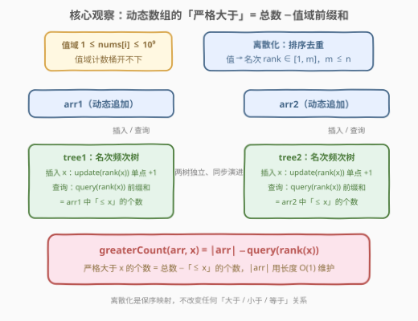
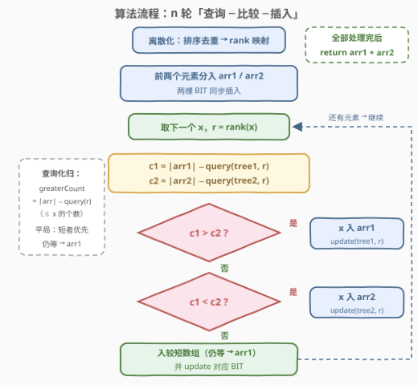
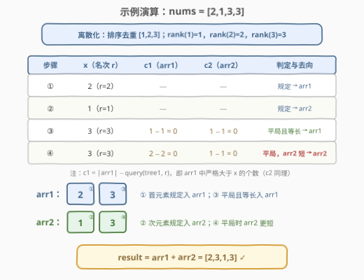

# 将元素分配到两个数组中II

- **题目名称**：将元素分配到两个数组中 II
- **链接**：[3072. 将元素分配到两个数组中 II](https://leetcode.cn/problems/distribute-elements-into-two-arrays-ii/)
- **难度**：困难
- **标签**：树状数组、线段树、数组、模拟

## 1. 题目概述

给你一个下标从 **1** 开始、长度为 $n$ 的整数数组 `nums`。定义函数 `greaterCount(arr, val)`：返回数组 `arr` 中**严格大于** `val` 的元素数量。

你需要用 $n$ 次操作将 `nums` 的所有元素分配到两个数组 `arr1` 和 `arr2` 中：

- 第 1 次操作：将 `nums[1]` 追加到 `arr1`；
- 第 2 次操作：将 `nums[2]` 追加到 `arr2`；
- 之后第 $i$（$i \ge 3$）次操作：
  - 若 `greaterCount(arr1, nums[i]) > greaterCount(arr2, nums[i])`，将 `nums[i]` 追加到 `arr1`；
  - 若 `<`，追加到 `arr2`；
  - 若相等，追加到**元素数量较少**的数组；
  - 若仍相等（长度也相同），追加到 `arr1`。

连接 `arr1` 和 `arr2` 形成数组 `result`（`arr1` 在前），返回 `result`。

**示例 1**：

```text
输入：nums = [2,1,3,3]
输出：[2,3,1,3]
解释：4 次操作后 arr1 = [2,3]，arr2 = [1,3]。
```

**示例 2**：

```text
输入：nums = [5,14,3,1,2]
输出：[5,3,1,2,14]
解释：5 次操作后 arr1 = [5,3,1,2]，arr2 = [14]。
```

**示例 3**：

```text
输入：nums = [3,3,3,3]
输出：[3,3,3,3]
解释：4 次操作后 arr1 = [3,3]，arr2 = [3,3]。
```

**约束条件**：

- $3 \le n \le 10^5$
- $1 \le \text{nums}[i] \le 10^9$

> 💡 读题关键：分配规则本身只是平凡模拟，全部难度集中在 `greaterCount`——它要对两个**不断追加元素的动态集合**反复询问「严格大于 $x$ 的有几个」，且每次询问都紧跟着一次插入。「查询 + 插入都要快」正是「单点修改 + 前缀查询」类数据结构（树状数组 / 线段树）的标准信号。

---

## 2. 解题思路

### 2.1 暴力思路：每次线性扫描

按题意逐步模拟：第 $i$ 次操作时，线性扫描 `arr1`、`arr2` 各数一遍大于 `nums[i]` 的元素个数，再按规则归类。

- 单次 `greaterCount` 花 $O(\text{len})$，两棵数组都要数，总计 $O(n^2)$；
- $n = 10^5$ 时约 $10^{10}$ 次比较，必然超时。

姊妹题 [3069. 将元素分配到两个数组中 I](https://leetcode.cn/problems/distribute-elements-into-two-arrays-i/) 是本题的「轻量版」：判定只看两个数组**最后一个元素**谁大，$O(1)$ 定去向，模拟即可。本题把判定升级成「双侧计数」，又把 $n$ 抬到 $10^5$——规则复杂度与数据规模双重加码，逼你上数据结构。

> ⚠️ 瓶颈定位：查询 $O(\text{len})$ × 查询次数 $n$。要让每次「计数」降到 $O(\log n)$、插入也保持 $O(\log n)$，树状数组（BIT）是代码量最小的选择。

### 2.2 核心观察：离散化 + 双树状数组



**第一步：转化查询。**「严格大于 $x$ 的个数」用总数减去「$\le x$ 的个数」：

$$\text{greaterCount}(arr, x) = |arr| - \#\{v \in arr : v \le x\}$$

「$\le x$ 的个数」按**值域**做频次前缀和即可；而 $|arr|$ 就是数组当前长度，$O(1)$ 可得，根本不用查树。

**第二步：离散化。** 值域高达 $10^9$，计数桶开不下；但所有被查询的值都来自 `nums`，至多 $n$ 个。把 `nums` 排序去重得到 `sorted`，每个值映射成名次 $\text{rank}(x) \in [1, m]$（$m \le n$）。离散化是**保序映射**：$x < y \iff \text{rank}(x) < \text{rank}(y)$，「值 $\le x$」等价于「名次 $\le \text{rank}(x)$」，大小关系原样保留。

**第三步：双树状数组。** 给 `arr1`、`arr2` 各配一棵维护**名次频次**的 BIT：

- 插入 $x$：在 $\text{rank}(x)$ 处**单点 +1**（`update`）；
- 查询：$\text{query}(\text{rank}(x))$ 返回该数组中名次 $\le \text{rank}(x)$（即值 $\le x$）的元素个数。

于是每轮操作（记 $r = \text{rank}(\text{nums}[i])$）：

$$c_1 = |\text{arr1}| - \text{query}(\text{tree1}, r), \qquad c_2 = |\text{arr2}| - \text{query}(\text{tree2}, r)$$

比较 $c_1, c_2$ 决定去向，插入后同步 `update` 对应的树。

> 💡 名场面：这是「离线离散化 + 在线模拟」的教科书应用——虽然元素逐个分配，但 `nums` 开局就全部给出，被查询的值集合已知，于是可以先把 `rank` 映射建好再开始模拟，两不相误。

### 2.3 算法流程



1. **离散化**：`sorted = nums 排序去重`，建 $O(1)$ 查表的 `rank` 哈希（或每次二分）；
2. **初始化**：`arr1 = [nums[0]]`、`arr2 = [nums[1]]`，两棵 BIT 分别在 $\text{rank}(\text{nums}[0])$、$\text{rank}(\text{nums}[1])$ 处 +1；
3. **模拟 $i = 2 \dots n-1$**：
   - $r = \text{rank}(\text{nums}[i])$；
   - $c_1 = |\text{arr1}| - \text{query}(\text{tree1}, r)$，$c_2 = |\text{arr2}| - \text{query}(\text{tree2}, r)$；
   - $c_1 > c_2$ 入 `arr1`；$c_1 < c_2$ 入 `arr2`；相等时**短者优先，仍等归 arr1**；
   - 插入后对相应 BIT 执行 `update(r)`；
4. **输出**：`return arr1 + arr2`。

> ⚠️ 平局规则容易写错：$c_1 = c_2$ 时比较的是**两个数组的长度**（不是别的），长度也相等时归 `arr1`。合并成一个布尔条件：入 arr1 $\iff c_1 > c_2$ **或**（$c_1 = c_2$ 且 $|\text{arr1}| \le |\text{arr2}|$），其余入 arr2。

### 2.4 示例演算



以 `nums = [2,1,3,3]` 为例。离散化后 `sorted = [1,2,3]`，$\text{rank}(1)=1,\ \text{rank}(2)=2,\ \text{rank}(3)=3$：

| 操作 | $x$（名次 $r$） | $c_1 = \lvert\text{arr1}\rvert - q_1(r)$ | $c_2 = \lvert\text{arr2}\rvert - q_2(r)$ | 判定 | 结果 |
|------|------|------|------|------|------|
| ① | 2（r=2） | — | — | 规定入 arr1 | arr1=[2] |
| ② | 1（r=1） | — | — | 规定入 arr2 | arr2=[1] |
| ③ | 3（r=3） | $1-1=0$ | $1-1=0$ | $0=0$ 且等长 → arr1 | arr1=[2,3] |
| ④ | 3（r=3） | $2-2=0$ | $1-1=0$ | $0=0$，arr2 更短 → arr2 | arr2=[1,3] |

最终 `result = [2,3] + [1,3] = [2,3,1,3]`，与官方输出一致。

> 💡 注意 ④：虽然 $c_1 = c_2 = 0$，但此刻 $|\text{arr1}| = 2 > |\text{arr2}| = 1$，元素去了**更短**的 `arr2`——这正是平局分支的考点。示例 2（`[5,14,3,1,2]`）里 ③ 同样是「$1=1$ 且等长」入 arr1，随后 $c_1=2 > c_2=1$ 连续三轮都入 arr1，最终 `arr2` 只剩孤零零的 14。

---

## 3. 参考代码

### C++（离散化 + 双树状数组）

```cpp
class Solution {
  public:
    vector<int> resultArray(vector<int>& nums) {
        int n = nums.size();
        // 离散化：排序去重，值 -> 名次 [1, m]
        vector<int> sorted(nums);
        sort(sorted.begin(), sorted.end());
        sorted.erase(unique(sorted.begin(), sorted.end()), sorted.end());
        int m = sorted.size();
        auto rank = [&](int x) {
            return int(lower_bound(sorted.begin(), sorted.end(), x) - sorted.begin()) + 1;
        };

        // 两棵树状数组：tree[k] 维护 arr_k 中各名次的频次
        vector<int> tree1(m + 1, 0), tree2(m + 1, 0);
        auto update = [&](vector<int>& t, int i) {
            for (; i <= m; i += i & (-i)) t[i]++;
        };
        auto query = [&](vector<int>& t, int i) {  // 名次 <= i 的元素个数
            int s = 0;
            for (; i > 0; i -= i & (-i)) s += t[i];
            return s;
        };

        vector<int> arr1{nums[0]}, arr2{nums[1]};
        update(tree1, rank(nums[0]));
        update(tree2, rank(nums[1]));

        for (int i = 2; i < n; i++) {
            int r = rank(nums[i]);
            int c1 = (int)arr1.size() - query(tree1, r);  // arr1 中 > x 的个数
            int c2 = (int)arr2.size() - query(tree2, r);  // arr2 中 > x 的个数
            if (c1 > c2 || (c1 == c2 && arr1.size() <= arr2.size())) {
                arr1.push_back(nums[i]);
                update(tree1, r);
            } else {
                arr2.push_back(nums[i]);
                update(tree2, r);
            }
        }
        arr1.insert(arr1.end(), arr2.begin(), arr2.end());
        return arr1;
    }
};
```

### Python（离散化 + 双树状数组）

```python
class Solution:
    def resultArray(self, nums: List[int]) -> List[int]:
        sorted_vals = sorted(set(nums))
        m = len(sorted_vals)
        rank = {v: i + 1 for i, v in enumerate(sorted_vals)}  # 值 -> 名次

        tree1, tree2 = [0] * (m + 1), [0] * (m + 1)

        def update(tree, i):
            while i <= m:
                tree[i] += 1
                i += i & (-i)

        def query(tree, i):  # 名次 <= i 的元素个数
            s = 0
            while i > 0:
                s += tree[i]
                i -= i & (-i)
            return s

        arr1, arr2 = [nums[0]], [nums[1]]
        update(tree1, rank[nums[0]])
        update(tree2, rank[nums[1]])

        for x in nums[2:]:
            r = rank[x]
            c1 = len(arr1) - query(tree1, r)  # arr1 中 > x 的个数
            c2 = len(arr2) - query(tree2, r)  # arr2 中 > x 的个数
            if c1 > c2 or (c1 == c2 and len(arr1) <= len(arr2)):
                arr1.append(x)
                update(tree1, r)
            else:
                arr2.append(x)
                update(tree2, r)

        return arr1 + arr2
```

> 💡 两种实现完全同构：`rank` 用哈希表（Python）或二分（C++）皆可；树状数组只有「上跳 / 下跳」两条链——`update` 沿 $i \mathrel{+}= i \& (-i)$ 向上更新所有覆盖 $i$ 的区间，`query` 沿 $i \mathrel{-}= i \& (-i)$ 向下拼出前缀 $[1, i]$。

---

## 4. 复杂度分析

| 维度 | 复杂度 | 说明 |
|------|--------|------|
| 时间复杂度 | $O(n \log n)$ | 离散化排序 $O(n \log n)$；$n-2$ 轮模拟，每轮 rank 查找 + 两次 `query` + 一次 `update` 共 $O(\log n)$ |
| 空间复杂度 | $O(n)$ | 两棵树状数组 $O(m)$（$m \le n$ 为不同值个数），外加离散化数组与输出数组 $O(n)$ |

---

## 5. 扩展：其他等价实现

**线段树**：与 BIT 完全等价——单点 +1、区间 $[1, r]$ 求和。代码更长，但当统计需求继续升级（区间最值、懒标记、区间修改）时只有线段树接得住；本题这种「单点改 + 前缀和」BIT 是最短路径。

**Python 的 `SortedList`**：LeetCode 环境自带 `sortedcontainers`，维护两个有序列表，`bisect_right(x)` 给出「$\le x$ 的个数」，插入用 `add`，同为 $O(\log n)$：

```python
from sortedcontainers import SortedList

class Solution:
    def resultArray(self, nums: List[int]) -> List[int]:
        sl1, sl2 = SortedList([nums[0]]), SortedList([nums[1]])
        arr1, arr2 = [nums[0]], [nums[1]]
        for x in nums[2:]:
            c1, c2 = len(sl1) - sl1.bisect_right(x), len(sl2) - sl2.bisect_right(x)
            if c1 > c2 or (c1 == c2 and len(arr1) <= len(arr2)):
                arr1.append(x); sl1.add(x)
            else:
                arr2.append(x); sl2.add(x)
        return arr1 + arr2
```

**为什么不用「有序数组 + 二分」**：二分查询 $O(\log n)$ 没问题，但**中间插入**要整体搬移 $O(n)$，总计退回 $O(n^2)$。需要「既有序、又可动态插入」时，BIT / 线段树 / 平衡树（`SortedList` 的底层）才是正解。

---

## 6. 面试要点

1. **「严格大于 x 的个数」是怎么转成树状数组查询的？**

   严格大于 = 总数 − 小于等于。$\text{query}(r)$ 给出名次 $\le r$ 的频次前缀和（即值 $\le x$ 的个数）；数组长度另行用变量 $O(1)$ 维护，相减即得，一次查询只碰一棵树的前缀链。

2. **为什么必须离散化？离散化会不会破坏大小关系？**

   值域 $10^9$ 开不下桶，但询问只涉及 `nums` 中出现过的 $m \le n$ 个值。离散化是保序映射：$x < y \iff \text{rank}(x) < \text{rank}(y)$，所有「大于 / 小于 / 等于」判定不受影响，只是把值域压缩到 $[1, m]$。

3. **本题为什么能「先离散化、再在线模拟」？**

   `nums` 开局就完整给出，所有可能被查询的值集合已知——这是**离线**预处理的机会。若元素是流式到达且值域无界，就得换成平衡树（`SortedList`）或动态开点 / 值域压缩线段树。

4. **平局分支的完整规则是什么？一个条件怎么写对？**

   $c_1 = c_2$ 时选**元素更少**的数组；长度也相等选 `arr1`。并入主条件：「入 arr1 $\iff c_1 > c_2$ 或（$c_1 = c_2$ 且 $\text{len}_1 \le \text{len}_2$）」，其余入 arr2。漏掉「等长归 arr1」或把长度比较写成 $<$，都是高频 WA 点。

5. **树状数组为什么同时扛得住插入和查询？**

   两个方向沿 lowbit 链走：`update` 从 $i$ 出发 $i \mathrel{+}= i \& (-i)$ 更新所有覆盖 $i$ 的区间节点；`query` 从 $i$ 出发 $i \mathrel{-}= i \& (-i)$ 把 $[1, i]$ 拆成若干不重叠区间求和。两条链长度都是 $O(\log n)$，恰好匹配本题「每轮一插两查」的节奏。

---

## 7. 同类练习题

- [3069. 将元素分配到两个数组中 I](https://leetcode.cn/problems/distribute-elements-into-two-arrays-i/)：本题的姊妹轻量版（末元素比较 + $n \le 100$），纯模拟即可，对比体会「规则升级 + 规模升级」如何逼出数据结构
- [1649. 通过指令创建有序数组](https://leetcode.cn/problems/create-sorted-array-through-instructions/)：同样「离散化 + 树状数组统计严格小于 / 严格大于的个数」，几乎同款模板，只是代价取 min
- [315. 计算右侧小于当前元素的个数](https://leetcode.cn/problems/count-of-smaller-numbers-after-self/)：离散化 + 树状数组做「逐位置计数」的经典逆序对题，本仓库已有题解
- [1409. 查询带键的排列](https://leetcode.cn/problems/queries-on-a-permutation-with-key/)：树状数组「单点加 + 前缀和查排名」的另一面——按位置而非值域建树
- [493. 翻转对](https://leetcode.cn/problems/reverse-pairs/)：值域统计进阶，多了「值的两倍」这类需要把 $2v$ 一并离散化的技巧
