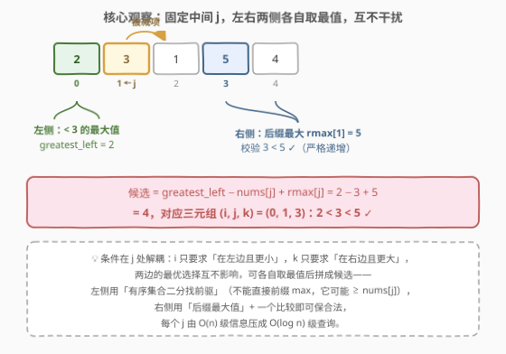
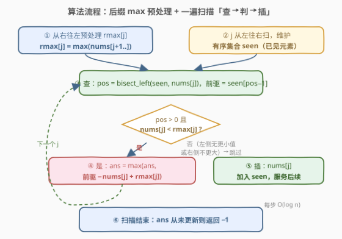

# 最大递增三元组

- **题目名称**：最大递增三元组
- **链接**：[3073. 最大递增三元组](https://leetcode.cn/problems/maximum-increasing-triplet-value/)
- **难度**：中等
- **标签**：数组、有序集合、二分查找

## 1. 题目概述

> ⚠️ 本题为 LeetCode 付费题，题意描述根据官方示例用例与 hints 重建，可能与官方题面有出入。

给定一个长度为 $n$、下标从 0 开始的整数数组 `nums`。

找一个三元组 $(i, j, k)$，满足：

- $0 \le i < j < k \le n-1$（下标递增）；
- $\text{nums}[i] < \text{nums}[j] < \text{nums}[k]$（**值严格递增**）。

目标是**最大化**三元组的值 $\text{nums}[i] - \text{nums}[j] + \text{nums}[k]$。如果不存在这样的三元组，返回 $-1$。

**示例 1**（官方测试用例）：

```text
输入：nums = [5,6,9]
输出：8
解释：唯一合法三元组 (i, j, k) = (0, 1, 2)：5 < 6 < 9 ✓，
     值 = 5 − 6 + 9 = 8。
```

**示例 2**（补充示例）：

```text
输入：nums = [2,3,1,5,4]
输出：4
解释：取 (i, j, k) = (0, 1, 3)：2 < 3 < 5 ✓，值 = 2 − 3 + 5 = 4。
     下标 3 的 5 虽然左侧有更小的 3，但它右边只剩 4，构不成三元组。
```

**示例 3**（补充示例）：

```text
输入：nums = [5,4,3,2,1]
输出：-1
解释：数组严格递减，不存在任何递增三元组。
```

**约束条件**（重建）：

- $3 \le \text{nums.length} \le 10^5$
- $1 \le \text{nums}[i] \le 10^9$

> ⚠️ 读题陷阱：① 递增是**严格**的，等值元素不能充当「更小/更大」的一侧；② 目标里中间项 $\text{nums}[j]$ 是**被减项**，直觉想挑小的 $j$，但 $i$、$k$ 两侧的最优值都依赖 $\text{nums}[j]$ 的大小，不能孤立地最小化中间项；③ 无解时返回 $-1$，不要用 0 当哨兵——0 也可能是「从未找到合法三元组」与「找到了但值为 0」的歧义值。

---

## 2. 解题思路

### 2.1 暴力思路

三重循环枚举 $(i, j, k)$，判合法后打擂。时间 $O(n^3)$，$n = 10^5$ 时天文数字。

稍作改进：固定中间 $j$，再枚举 $i < j$ 与 $k > j$，仍是 $O(n^2)$，$10^{10}$ 次量级，依旧超时。

浪费在哪？对每个 $j$，我们反复扫描左右两侧，却只想要两个数：**左边比 $\text{nums}[j]$ 小的最大值**、**右边的最大值**。这两个信息完全可以增量维护。

### 2.2 核心观察：枚举中间 j，两侧独立取最值



固定中间下标 $j$，目标拆成互不干扰的三块：

1. **左侧**：$\text{greatest\_left}(j) = \max\{\text{nums}[i] : i < j,\ \text{nums}[i] < \text{nums}[j]\}$。它只关心「在左边」和「值更小」两件事——把已扫过的元素放进**有序集合**，用二分找 $\text{nums}[j]$ 的**严格前驱**即可，$O(\log n)$。
2. **中间**：$\text{nums}[j]$ 本身，是被减项。
3. **右侧**：$k$ 只要求「在右边且值更大」。右侧取**后缀最大值** $\text{rmax}[j] = \max(\text{nums}[j+1..n-1])$，再用一次比较 $\text{nums}[j] < \text{rmax}[j]$ 校验严格递增——根本不需要知道 $k$ 的具体位置。

于是每个合法 $j$ 贡献候选：

$$\text{cand}(j) = \text{greatest\_left}(j) - \text{nums}[j] + \text{rmax}[j]$$

答案即所有合法 $j$ 中 $\text{cand}(j)$ 的最大值。

> 💡 **为什么枚举中间 $j$ 而不是 $i$ 或 $k$**：目标 $\text{nums}[i] - \text{nums}[j] + \text{nums}[k]$ 中，$j$ 是唯一被减项，且约束 $i < j < k$、$\text{nums}[i] < \text{nums}[j] < \text{nums}[k]$ 以 $j$ 为轴对称分布——枚举 $j$ 后两侧各自变成独立的单变量优化。若枚举 $k$，左侧还要同时挑一对 $(i, j)$ 并满足两个约束，解耦不了。

> ⚠️ **左侧为什么不能直接用前缀 max**：前缀 max 可能 $\ge \text{nums}[j]$，不满足严格小于。例如 `nums = [10, 5, 6, 20]`，对 $j = 2$（值 6）：前缀 max 是 10，但合法的左侧最大值是 5（$10 > 6$ 不可用），正确答案 $5 - 6 + 20 = 19$。必须用有序集合二分找严格前驱——这正是本题与 2874（无单调约束版）的本质区别，也是官方标签给出 Ordered Set 的原因。

### 2.3 算法流程图



一遍扫描，每个位置做「**查 → 判 → 插**」三件事：

1. **预处理**：从右往左递推 $\text{rmax}[j]$，哨兵 $\text{rmax}[n-1] = 0$（右侧无元素，必不合法）。
2. **查**：`pos = bisect_left(seen, nums[j])`，若 `pos > 0`，严格前驱为 `seen[pos-1]`。
3. **判**：`pos > 0` 且 `nums[j] < rmax[j]` 同时成立，才用 前驱 − nums[j] + rmax[j] 更新答案。
4. **插**：把 `nums[j]` 放入有序集合，成为后续位置的左侧候选。

> ⚠️ **必须用 `bisect_left`（下界）而不是 `bisect_right`（上界）**：`bisect_left` 保证取出的前驱**严格小于** $\text{nums}[j]$；若用 `bisect_right`，集合中有等值元素时前驱可能等于 $\text{nums}[j]$，违反严格递增。「先查后插」则保证候选集只含下标更小的元素，语义干净。

### 2.4 示例演算

![示例演算：nums = [2,3,1,5,4] 的逐步状态](../images/p3073_example_walkthrough.svg)

以 `nums = [2,3,1,5,4]` 走一遍完整流程（`seen` 为处理当前元素**之前**的有序集合）：

| j | x | seen | pos | 前驱 | rmax[j] | 候选 | ans |
|---|---|-------|-----|------|---------|------|-----|
| 0 | 2 | { } | 0 | — | 5 | 左侧空 ✗ | −1 |
| 1 | 3 | {2} | 1 | 2 | 5 ✓ | 2−3+5 = 4 ★ | 4 |
| 2 | 1 | {2,3} | 0 | — | 5 | 左侧无更小 ✗ | 4 |
| 3 | 5 | {1,2,3} | 3 | 3 | 4 ✗ | 5 ≥ 4，右侧不足 | 4 |
| 4 | 4 | {1,2,3,5} | 3 | 3 | 0 ✗ | 哨兵 | 4 |

遍历结束 `ans = 4`，对应三元组 $(0, 1, 3)$：$2 < 3 < 5$。注意 $j = 3$ 的教学价值：左侧条件完美（前驱 3），但右侧最大只有 4，一条腿长一条腿短，照样不合法——**两侧校验缺一不可**。

---

## 3. 参考代码

### C++

```cpp
class Solution {
  public:
    long long maximumTripletValue(vector<int>& nums) {
        int n = nums.size();
        vector<int> rmax(n, 0);                    // rmax[j] = max(nums[j+1..n-1])，rmax[n-1]=0 哨兵
        for (int j = n - 2; j >= 0; j--)
            rmax[j] = max(rmax[j + 1], nums[j + 1]);

        multiset<int> seen;                        // 已扫过的元素（保持有序，支持重复值）
        long long ans = -1;
        for (int j = 0; j < n; j++) {
            auto it = seen.lower_bound(nums[j]);   // 首个 >= nums[j] 的位置
            if (it != seen.begin() && nums[j] < rmax[j])
                ans = max(ans, (long long)*prev(it) - nums[j] + rmax[j]);
            seen.insert(nums[j]);                  // 今天插入，服务明天的查询
        }
        return ans;
    }
};
```

### Python

```python
from sortedcontainers import SortedList

class Solution:
    def maximumTripletValue(self, nums: List[int]) -> int:
        n = len(nums)
        rmax = [0] * n                             # rmax[j] = max(nums[j+1..])，哨兵 0
        for j in range(n - 2, -1, -1):
            rmax[j] = max(rmax[j + 1], nums[j + 1])

        seen = SortedList()                        # 已扫过的元素，有序可二分
        ans = -1
        for j, x in enumerate(nums):
            pos = seen.bisect_left(x)              # 首个 >= x 的位置
            if pos > 0 and x < rmax[j]:
                ans = max(ans, seen[pos - 1] - x + rmax[j])
            seen.add(x)
        return ans
```

> 💡 两个实现细节：① 值域为正整数，哨兵 $\text{rmax}[n-1] = 0$ 天然使最后一个位置不合法；② `bisect_left`/`lower_bound` 找到的是首个 $\ge x$ 的位置，其**前一个**元素必然严格 $< x$，严格递增由数据结构保证，无需额外去重。

---

## 4. 复杂度分析

| 维度 | 复杂度 | 说明 |
|------|--------|------|
| 时间复杂度 | $O(n \log n)$ | 每个元素 1 次有序集合二分查找 + 1 次插入，均 $O(\log n)$ |
| 空间复杂度 | $O(n)$ | 后缀 max 数组与有序集合各存 $O(n)$ 个元素 |

其中 $n = \text{len(nums)}$。答案上界约 $10^9 - 1 + 10^9 \approx 2 \times 10^9$，**贴着 32 位 int 上限**（$2147483647$）——勉强放得下但极度危险，C++ 建议直接用 `long long`；Python 无此顾虑。

---

## 5. 扩展：三个变体讨论

**变体一：去掉单调约束（2874）**。若只要求 $i < j < k$、不要严格递增，左侧直接用前缀 max 维护「历史最大值」，再维护「历史最大差 $\max(\text{prefix\_max} - \text{nums}[j])$」，一遍 $O(n)$ 扫描解决——正是 [2874. 有序三元组中的最大值 II](https://leetcode.cn/problems/maximum-value-of-an-ordered-triplet-ii/)。对照本题可见：**单调约束把「前缀 max」逼成了「前缀严格前驱查询」**，复杂度从 $O(n)$ 涨到 $O(n \log n)$。

**变体二：只问存在性（334）**。若只判「是否存在递增三元组」，无需知道值是多少，贪心双阈值 $O(n)$：维护 `first`/`second` 两个最小阈值，见 [334. 递增的三元子序列](https://leetcode.cn/problems/increasing-triplet-subsequence/)。存在性不需要最优两侧，所以连有序集合都省了。

**变体三：没有 sortedcontainers 怎么办**。Python 标准库可用 `bisect.insort` 往普通 list 里插（查找 $O(\log n)$、插入 $O(n)$ 搬移，总量 $O(n^2)$ 字节移动，$n = 10^5$ 时有超时风险）；更稳的做法是**离线离散化值域 + 树状数组维护前缀 max**（按值从小到大插入，查询排名小于当前值的位置上的最大值），$O(n \log n)$ 且只依赖标准库。C++ 的 `multiset` 天然可用，无需变体。

---

## 6. 面试要点

1. **为什么枚举中间 j，而不是枚举 i 或 k？**

   - $j$ 是唯一被减项，且两个约束 $i < j$、$\text{nums}[i] < \text{nums}[j]$ 与 $k > j$、$\text{nums}[k] > \text{nums}[j]$ 以 $j$ 为轴分布。枚举 $j$ 后，左侧和右侧变成两个**互不影响**的单变量优化，可各自独立取最值再拼成候选；枚举 $k$ 则左侧要同时协调一对 $(i, j)$，约束耦合，解不开。

2. **左侧为什么不能直接维护前缀最大值？**

   - 需要**严格小于** $\text{nums}[j]$ 的最大值；前缀 max 可能 $\ge \text{nums}[j]$ 而不合法（如 `[10,5,6,20]` 中 $j=2$：前缀 max 是 10，合法左值只有 5）。所以要用有序集合二分找严格前驱。对照 2874（无单调约束）可直接用前缀 max、做到 $O(n)$。

3. **右侧为什么一个后缀 max 数组就够了，不用知道 k 在哪？**

   - $k$ 侧约束是「存在某个右边的值严格更大」。取右侧最大值 $\text{rmax}[j]$ 后，$\text{nums}[j] < \text{rmax}[j]$ 一个比较即可判定存在性（rmax 必然取自某个 $k > j$）；若成立它还自动是右侧最优。合法性判定与最值选择合二为一，位置信息无关紧要。

4. **二分时 `bisect_left` 和 `bisect_right` 有区别吗？**

   - 有，且是易错点：集合含等值元素时，`bisect_right` 的前驱可能**等于** $\text{nums}[j]$，违反严格递增；`bisect_left` 的前驱必然严格小于。C++ 对应 `lower_bound`（而非 `upper_bound`）取 `prev(it)`。

5. **溢出与哨兵怎么设计？**

   - 答案上界 $\approx 2 \times 10^9$，贴 32 位上限，C++ 用 `long long` 防御。无解哨兵用 $-1$ 且初始化 `ans = -1`——值域为正保证了合法候选恒 $> 0$，`ans` 仍为 $-1$ 即无解；`rmax[n-1]` 用 0 哨兵自动否决最后一个位置。

---

## 7. 同类练习题

- [334. 递增的三元子序列](https://leetcode.cn/problems/increasing-triplet-subsequence/)（[题解](../0301-0400/334_递增的三元子序列.md)）：同一「递增三元组」的存在性判定，贪心双阈值 $O(n)$，对照本题看「最优值 vs 存在性」的难度差
- [2873. 有序三元组中的最大值 I](https://leetcode.cn/problems/maximum-value-of-an-ordered-triplet-i/)：去掉单调约束的同型目标，$n \le 100$ 可暴力三重循环
- [2874. 有序三元组中的最大值 II](https://leetcode.cn/problems/maximum-value-of-an-ordered-triplet-ii/)：2873 的大 $n$ 版，前缀 max + 最大差 $O(n)$，与本题对照理解「单调约束把前缀 max 逼成有序集合前驱查询」
- [503. 下一个更大元素 II](https://leetcode.cn/problems/next-greater-element-ii/)：单调栈求「右侧第一个更大」，与本题后缀 max 的「右侧最大更大」判定互为补充的单侧更大问题
