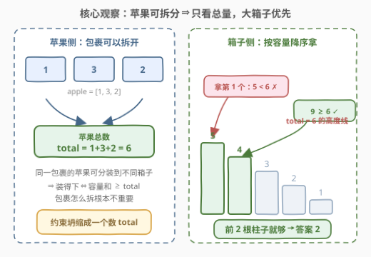
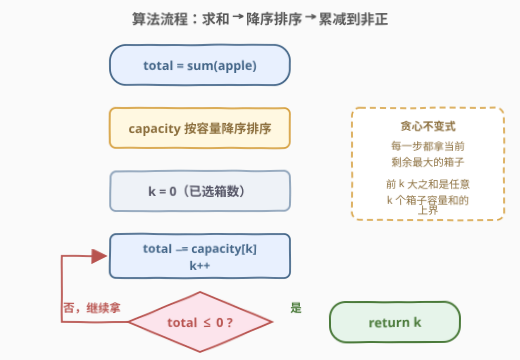
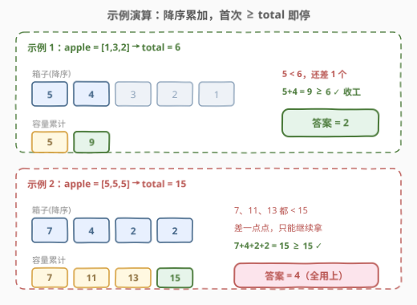

# LeetCode 重新分装苹果 题解

## 1. 题目概述

- **标题 / 题号**：重新分装苹果（#3074，easy）
- **链接**：https://leetcode.cn/problems/apple-redistribution-into-boxes/
- **难度**：简单
- **标签**：贪心、数组、排序

**题意**：给你一个长度为 $n$ 的数组 `apple` 和另一个长度为 $m$ 的数组 `capacity`：

- 一共有 $n$ 个**包裹**，第 $i$ 个包裹中装着 `apple[i]` 个苹果；
- 还有 $m$ 个**箱子**，第 $i$ 个箱子的容量为 `capacity[i]` 个苹果。

请你选择一些箱子，将这 $n$ 个包裹中的苹果**重新分装**到箱子中，返回需要选择的箱子的**最小**数量。

**注意**：同一个包裹中的苹果可以分装到**不同的**箱子中。

**示例 1**：

```text
输入：apple = [1,3,2], capacity = [4,3,1,5,2]
输出：2
解释：使用容量为 4 和 5 的箱子。总容量大于或等于苹果的总数，所以可以完成重新分装。
```

**示例 2**：

```text
输入：apple = [5,5,5], capacity = [2,4,2,7]
输出：4
解释：需要使用所有箱子。
```

**约束**：

- $1 \le n = \text{apple.length} \le 50$
- $1 \le m = \text{capacity.length} \le 50$
- $1 \le \text{apple}[i], \text{capacity}[i] \le 50$
- 输入数据保证可以将包裹中的苹果重新分装到箱子中。

> 💡 读题关键：题面看似是「包裹 → 箱子」的分配问题，但**「同一个包裹中的苹果可以分装到不同的箱子」**这句话是题眼——苹果一旦可以拆散，包裹的边界就形同虚设，唯一的硬约束只剩「所选箱子的总容量 ≥ 苹果总数」。

## 2. 解题思路

### 2.1 暴力思路：枚举箱子子集

最直接的想法是把「选哪些箱子」当成子集枚举：$m$ 个箱子共 $2^m$ 种选法，对每种选法检查容量和是否 $\ge \text{total} = \sum \text{apple}[i]$，取元素个数最小的可行子集。

- $m = 50$ 时 $2^{50} \approx 10^{15}$，完全不可行；
- 即使加上「按子集大小从小到大枚举」的剪枝，本质上仍在指数级空间里搜索。

暴力失败的根源：**题目的可行性只依赖一个标量——所选箱子的容量和**，与「哪个包裹进了哪个箱子」毫无关系，根本不需要在组合空间里搜索具体方案。

### 2.2 核心观察：可拆分 ⇒ 只比总量；降序贪心



**观察 1（问题坍缩）**：因为同一包裹的苹果可以拆到不同箱子里，一组箱子 $S$ 能装下所有苹果 $\iff$ $\sum_{j \in S} \text{capacity}[j] \ge \text{total}$。

- 必要性显然：箱子装不下总量就必然装不下；
- 充分性是构造：把苹果看作 $\text{total}$ 个「散装个体」，从大箱子开始逐箱往里倒、装满一个换下一个——只要总容量够，就能全部装下（苹果是整数个、箱子容量也是整数个，逐个放不会出现「半个苹果」的尴尬）。

于是问题坍缩为：**选最少数量的箱子，使容量和 $\ge \text{total}$**——包裹结构彻底退场。

**观察 2（排序贪心）**：固定箱子个数 $k$，任意 $k$ 个箱子的容量和 $\le$ **最大的 $k$ 个箱子的容量和**（降序数组的前 $k$ 项之和是所有 $k$-子集和的上确界）。所以：

- 若某个 $k$ 箱组合能装下，那么「前 $k$ 大」也一定能装下；
- 答案 = 最小的 $k$，使得**降序前缀和首次 $\ge \text{total}$**。

这正是**交换论证**的标准形态：假设最优解选了小箱子 $b$ 而弃用大箱子 $a$（$\text{capacity}[a] \ge \text{capacity}[b]$），把 $b$ 换成 $a$ 后总容量不减、箱子数不变，方案依然可行——所以「拿最大的」永不吃亏。

> 💡 一句话总结：**苹果只看总和，箱子只挑最大**。排序后从大到小累加，越过 `total` 的那一步就是答案。

### 2.3 算法流程：求和 → 降序 → 累减



三步走，一次线性扫描收尾：

1. 求苹果总数 $\text{total} = \sum \text{apple}[i]$（`apple` 本身**不需要排序**，它的内部结构无关紧要）；
2. 将 `capacity` 按**降序**排序；
3. 从最大的箱子开始，逐个执行 $\text{total} \mathrel{-}= \text{capacity}[k]$、$k{+}{+}$，当 $\text{total} \le 0$ 时返回 $k$——此时前 $k$ 大箱子的容量和恰好首次覆盖苹果总数。

用「累减」而不是「另开变量加前缀和」，可以少维护一个累加器，语义也更贴题：`total` 表示**还剩多少苹果没装下**，减到非正数即完工。

### 2.4 示例演算



| 输入 | total | capacity 降序 | 前缀和推进 | 首次 ≥ total | 答案 |
|------|-------|---------------|------------|--------------|------|
| `apple=[1,3,2]`, `capacity=[4,3,1,5,2]` | $6$ | $[5,4,3,2,1]$ | $5 \to 9$ | $9 \ge 6$（第 2 个） | $2$ |
| `apple=[5,5,5]`, `capacity=[2,4,2,7]` | $15$ | $[7,4,2,2]$ | $7 \to 11 \to 13 \to 15$ | $15 \ge 15$（第 4 个） | $4$ |

注意示例 2 的边界：最后一步恰好**等于** `total`，判定条件必须是 $\ge$（代码里写作 `total <= 0`），写成严格大于会漏掉这种「刚好装满」的情况。

## 3. 参考代码

### C++（降序排序 + 累减）

```cpp
class Solution {
  public:
    int minimumBoxes(vector<int>& apple, vector<int>& capacity) {
        int total = accumulate(apple.begin(), apple.end(), 0);
        sort(capacity.rbegin(), capacity.rend());   // 容量降序
        for (int i = 0; i < (int)capacity.size(); ++i) {
            total -= capacity[i];                   // 装走 capacity[i] 个苹果
            if (total <= 0) return i + 1;           // 首次覆盖，前 i+1 个箱子
        }
        return capacity.size();                     // 题目保证有解，兜底
    }
};
```

### Python（sorted + enumerate）

```python
class Solution:
    def minimumBoxes(self, apple: List[int], capacity: List[int]) -> int:
        total = sum(apple)
        for i, c in enumerate(sorted(capacity, reverse=True)):
            total -= c
            if total <= 0:
                return i + 1
        return len(capacity)
```

> 💡 两个版本逻辑完全一致。C++ 用 `rbegin()/rend()` 实现原地降序，不额外开数组；Python 的 `sorted` 返回新列表（$O(m)$ 辅助空间），若想原地可用 `capacity.sort(reverse=True)`。数据规模 $n, m \le 50$、值 $\le 50$，`total` 上限 $2500$，`int` 绰绰有余。

## 4. 复杂度分析

| 维度 | 复杂度 | 说明 |
|------|--------|------|
| 时间复杂度 | $O(n + m \log m)$ | 求和 $O(n)$ + 排序 $O(m \log m)$ + 一次线性扫描 $O(m)$；瓶颈在排序 |
| 空间复杂度 | $O(\log m)$ | C++ 原地 `sort` 的递归栈开销；Python `sorted` 为 $O(m)$ 辅助数组，均可视为数据规模下的常数级 |

## 5. 扩展：若苹果不可拆分，一步坠入 NP-hard

本题轻松的全部前提是**苹果可拆分**。把这句注意删掉——每个包裹必须**整体**放进一个箱子——问题立刻变成经典的**装箱问题（bin packing）**：

- 判定「$k$ 个箱子能否装下」是 NP-complete，最小化箱子数是 NP-hard；
- $n, m \le 50$ 规模下没有多项式精确算法，只能靠状压 DP（$m \le 20$ 左右）、分支限界或 FIRST-FIT 等近似算法（FFD 保证不超过最优解 $\frac{11}{9} + \frac{6}{9}$ 倍）。

另一个实用的变体方向：若题目改成**多次查询**（同一个 `capacity`，反复问不同 `apple` 数组的最少箱数），应预处理降序数组的**前缀和** `pre`，每次查询二分找第一个 $\text{pre}[k] \ge \text{total}$ 的位置，单次查询 $O(\log m)$——把「排序一次」的成本摊销到所有查询上。

## 6. 面试要点

1. **为什么「同一包裹的苹果可以分装到不同箱子」是本题的题眼？**

   - 它把「包裹 → 箱子」的分配问题坍缩成标量比较：一组箱子可行 $\iff$ 容量和 $\ge \text{total}$。必要性显然，充分性由「逐箱倒满」的构造保证。若不可拆分则退化为 bin packing（NP-hard），难度天壤之别。

2. **为什么从大到小选箱子一定最优？请给出严格论证。**

   - 交换论证：固定箱数 $k$，任取一个可行 $k$-子集，把其中容量最小的箱子与被弃用的更大箱子交换，总容量不减、可行性保持；反复交换后任意可行 $k$-子集都能替换成「前 $k$ 大」。故答案即降序前缀和首次 $\ge \text{total}$ 的位置。

3. **为什么 `apple` 数组完全不用排序、甚至不用保留结构？**

   - 可行性判据只含 $\text{total} = \sum \text{apple}[i]$ 一个统计量。交换、重排 `apple` 的任何元素都不改变 `total`，自然不影响答案——题目里 `apple` 的存在感只剩求和。

4. **累减写法 `total -= capacity[i]` 与前缀和 + 二分相比如何？**

   - 单次查询下两者同为 $O(m \log m)$（瓶颈都是排序），累减写法更短、边界更少。多次查询时前缀和 + 二分把单次降到 $O(\log m)$；但注意若 `capacity` 可被修改则需重排，摊销失效。

5. **判定条件为什么是 `total <= 0` 而不是 `< 0`？**

   - 「刚好装满」是可行解：示例 2 中前缀和 $15$ 恰好等于 `total`，必须计入。累减语义下对应 `total == 0` 也返回，故写 `<= 0`。这类 off-by-one 是排序贪心题最常见的手滑点。

## 同类练习题

| # | 题目 | 与本题的关联 |
|---|------|-------------|
| 1710 | [卡车上的最大单元数](https://leetcode.cn/problems/maximum-units-on-a-truck/) | 与本题互为镜像——本题「苹果总量固定，求最少箱子」，1710「箱子数固定，求最大装载量」，同一个「按效益排序后贪心」骨架，方向相反 |
| 1833 | [雪糕的最大数量](https://leetcode.cn/problems/maximum-ice-cream-bars/) | 排序后从小到大累计直到预算耗尽，与本题「从大到小累计直到覆盖总量」完全同构，只是累加方向与终止条件对偶 |
| 455 | [分发饼干](https://leetcode.cn/problems/assign-cookies/) | 排序 + 双指针贪心的入门经典，交换论证思想的最佳练手题 |
| 1005 | [K 次取反后最大化的数组和](https://leetcode.cn/problems/maximize-sum-of-array-after-k-negations/) | 排序贪心的另一变体（按绝对值安排取反顺序），体会「排序确定贪心顺序」这一通用手法 |
