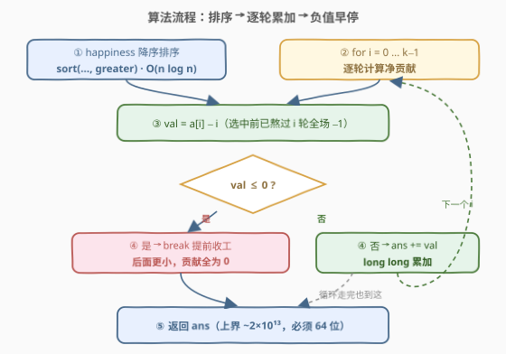
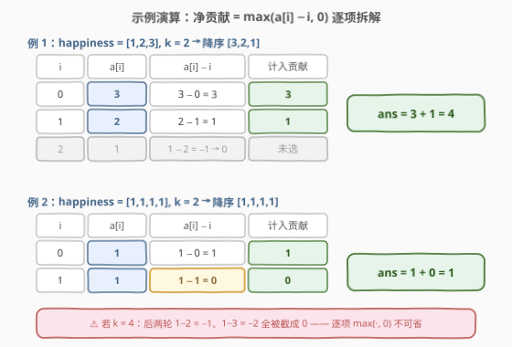

# LeetCode 幸福值最大化的选择方案 题解

## 1. 题目概述

- **标题 / 题号**：幸福值最大化的选择方案（#3075，medium）
- **链接**：https://leetcode.cn/problems/maximize-happiness-of-selected-children/
- **难度**：中等
- **标签**：贪心、数组、排序

**题意**：给定长度为 $n$ 的数组 `happiness` 与**正整数** $k$。第 $i$ 个孩子的**幸福值**为 $\text{happiness}[i]$。组织 $k$ 轮筛选，每轮选出 1 个孩子，共选出 $k$ 个。

**每轮选出 1 个孩子时，所有尚未被选中的孩子的幸福值减少 1**。幸福值**不能变成负数**，只有为正时才会减少。

目标是使选中的 $k$ 个孩子的幸福值之和最大，返回该最大值。

**示例 1**：

```text
输入：happiness = [1,2,3], k = 2
输出：4
解释：第 1 轮选幸福值为 3 的孩子，剩余孩子幸福值变为 [0,1]；
     第 2 轮选幸福值为 1 的孩子（2 已被磨掉 1），剩余变为 [0]。
     总和 = 3 + 1 = 4。
```

**示例 2**：

```text
输入：happiness = [1,1,1,1], k = 2
输出：1
解释：第 1 轮选一个 1，剩余变为 [0,0,0]；第 2 轮选 0。
     总和 = 1 + 0 = 1。
```

**示例 3**：

```text
输入：happiness = [2,3,4,5], k = 1
输出：5
解释：只选一轮，直接取最大值 5。
```

**约束**：

- $1 \le n = \text{happiness.length} \le 2 \times 10^5$
- $1 \le \text{happiness}[i] \le 10^8$
- $1 \le k \le n$

> ⚠️ 读题陷阱：① 减 1 只作用于**尚未被选中**的孩子，选中即「落袋为安」，之后不再变化；② 幸福值下限为 0，只有为正才减——所以衰减是「磨到 0 为止」，不是无限下探；③ 每轮必须选 1 人、恰好选 $k$ 轮（$k \le n$，不存在选不满的问题）。

## 2. 解题思路

### 2.1 暴力思路

直接模拟：每轮扫描未选集合取最大值，再对剩余孩子全体 $\max(v-1, 0)$。时间 $O(nk)$，$n, k \le 2\times10^5$ 时最坏 $4 \times 10^{10}$，必然超时。

更本质的浪费在于：「每轮全体同步减 1」对未选集合是**均匀**操作，任何两个未选孩子的相对大小都不变——反复扫描比较纯粹在做重复功。

### 2.2 核心观察：解耦「选谁」与「第几轮选」

![核心概念：降序排序后，第 i 个的净贡献 = max(a[i] − i, 0)](../images/p3075_greedy_concept.svg)

**关键解耦**：第 $i$ 轮（$i$ 从 0 计）被选中孩子的净幸福 = $\max(\text{初值} - i,\ 0)$——只依赖**它自己的初值**和**轮次 $i$**，与其他轮选了谁完全无关（它经历的是「此前 $i$ 轮、每轮全体减 1」的固定衰减，磨到 0 为止）。

于是问题变成：从 $n$ 个数中选 $k$ 个，并给它们分配互不相同的轮次 $0, 1, \dots, k-1$，最大化 $\sum \max(v_c - \text{轮次},\ 0)$。由**排序不等式**（大值配小衰减）：

1. **选谁**：显然取**前 $k$ 大**（更大的值放在同一轮次贡献不会更小）；
2. **顺序**：第 $i$ 大的值配第 $i$ 轮——大值先选少被磨，小值晚选多被磨。

设降序排序后为 $a[0] \ge a[1] \ge \dots$，得到封闭式：

$$\text{ans} = \sum_{i=0}^{k-1} \max(a[i] - i,\ 0)$$

> 💡 **交换论证**：若某方案把大值 $x$ 放在轮次 $i$、小值 $y \le x$ 放在轮次 $j > i$，对调两者轮次，其余孩子的衰减计数完全不变，而 $\max(x-i,0)+\max(y-j,0) \le \max(x-i,0)+\max(y-i,0)$ 一类逐项比较可知对调不劣——最优解中必然是「大的先选」。

> ⚠️ **必须与 0 取 max**：大量重复小值的用例（如示例 2 的 `[1,1,1,1]`）中 $a[i] - i$ 会出现 0 甚至负数，此时贡献是 **0** 而非负数。且降序后 $a[i]$ 非增、$i$ 递增，$a[i]-i$ 单调不增——**一旦 $\le 0$ 即可提前 break**，后面全是 0 贡献。

### 2.3 算法流程图



三步走：**排序 → 逐轮累加 → 负值早停 → 返回**。

1. **排序**：`happiness` 降序排序，$O(n \log n)$；
2. **遍历**：$i$ 从 0 到 $k-1$，计算净贡献 $\text{val} = a[i] - i$；
3. **早停**：$\text{val} \le 0$ 直接退出循环（后续贡献全为 0）；
4. **累加**：`ans += val`，最终返回 `ans`（注意用 64 位）。

### 2.4 示例演算



**例 1**：`happiness = [1,2,3], k = 2`，降序得 $[3,2,1]$：

| $i$ | $a[i]$ | $a[i]-i$ | 计入贡献 |
|-----|--------|----------|----------|
| 0 | 3 | 3 | 3 |
| 1 | 2 | 1 | 1 |

$\text{ans} = 3 + 1 = 4$ ✓

**例 2**：`happiness = [1,1,1,1], k = 2`，降序得 $[1,1,1,1]$：

| $i$ | $a[i]$ | $a[i]-i$ | 计入贡献 |
|-----|--------|----------|----------|
| 0 | 1 | 1 | 1 |
| 1 | 1 | 0 | 0（未到负数，正好 0） |

$\text{ans} = 1 + 0 = 1$ ✓。若把 $k$ 放大到 4，第 3、4 轮的 $1-2=-1$、$1-3=-2$ 都被截断成 0——这正是「与 0 取 max」的意义。

## 3. 参考代码

### C++

```cpp
class Solution {
  public:
    long long maximumHappinessSum(vector<int>& happiness, int k) {
        sort(happiness.begin(), happiness.end(), greater<int>());  // 降序：大的先选少被磨
        long long ans = 0;
        for (int i = 0; i < k; i++) {
            int val = happiness[i] - i;   // 第 i 轮选中，此前已熬过 i 轮全场 −1
            if (val <= 0) break;          // 后面更小，净贡献全为 0，提前收工
            ans += val;
        }
        return ans;
    }
};
```

### Python

```python
class Solution:
    def maximumHappinessSum(self, happiness: List[int], k: int) -> int:
        happiness.sort(reverse=True)               # 降序：大的先选少被磨
        ans = 0
        for i in range(k):
            val = happiness[i] - i                 # 第 i 轮选中，此前已熬过 i 轮全场 −1
            if val <= 0:
                break                              # 后面更小，净贡献全为 0
            ans += val
        return ans
```

> 💡 Python 也可写成一行 `return sum(max(x - i, 0) for i, x in enumerate(happiness[:k]))`，但带 `break` 的写法在小值铺满的用例上更省遍历。

## 4. 复杂度分析

| 维度 | 复杂度 | 说明 |
|------|--------|------|
| 时间复杂度 | $O(n \log n)$ | 排序主导；累加至多 $O(k)$，负值早停后通常更少 |
| 空间复杂度 | $O(1)$ | 原地排序，仅常数额外变量（不计语言自身的排序栈） |

其中 $n = \text{len(happiness)}$。**溢出提醒**：答案上界约为 $k \times 10^8 \le 2 \times 10^{5} \times 10^{8} = 2 \times 10^{13}$，远超 32 位 `int` 上限（$\approx 2.1 \times 10^9$）——C++ 必须用 `long long` 累加与返回；Python 无此顾虑。单次 $a[i] - i$ 最大 $10^8$，`int` 足够。

## 5. 扩展：只取前 k 大的更快姿势与一个易错变形

**变体一：不完整排序**。只需要前 $k$ 大时，C++ 可用 `nth_element`（平均 $O(n)$）或 `partial_sort`（$O(n \log k)$）：

```cpp
nth_element(happiness.begin(), happiness.begin() + k,
            happiness.end(), greater<int>());   // 前 k 个到位（内部无序），再单独排前 k 个
```

Python 对应 `heapq.nlargest(k, happiness)`，$O(n \log k)$。$k \ll n$ 时显著快于全量排序。

**变体二（易错）：能否「前 k 大求和，再减 $0+1+\dots+(k-1)$」**？不能——等差和写法忽略了**下限 0 的截断**。反例 `[1,1,1,1], k = 4`：前 4 大之和 $= 4$，等差和 $= 6$，得 $-2$；而正确答案是 $1$（第 3、4 轮的负贡献被截成 0）。截断的存在使「逐项 $\max$」不可省。

**变体三（模型变形）**：若规则改成「每轮开始时先全体减 1、再选人」，则第 $i$ 轮选中者的衰减变成 $i+1$，答案改为 $\sum_{i<k} \max(a[i] - i - 1,\ 0)$——只是衰减偏移一格，套路不变。若「选中的孩子落袋后也继续被磨」，与答案无关：选中即结算，之后的变化不再计入。

## 6. 面试要点

1. **为什么贪心「每轮选当前最大」是对的？**

   - 衰减只依赖轮次：第 $i$ 轮选中者的净幸福 = $\max(\text{初值} - i, 0)$，与其他选择无关，问题解耦为「选集合 + 分配轮次」。由排序不等式，大值配小衰减最优，即取前 $k$ 大、第 $i$ 大配第 $i$ 轮。另外每轮全体同步减 1 保持未选集合的（非严格）大小关系，当前最大必然出自全局前 $k$ 大，模拟视角下贪心同样成立。

2. **封闭式 $\sum \max(a[i]-i, 0)$ 里的 $i$ 为什么恰好是衰减量？**

   - 第 $i$ 轮选中之前恰好发生了 $i$ 轮「全体未选者减 1」，该孩子每轮都在未选集合中，共减 $i$；幸福值为正才减，故与 0 取 max。

3. **什么时候可以提前退出？为什么是对的？**

   - 降序后 $a[i]$ 单调不增而 $i$ 递增，$a[i]-i$ 单调不增；一旦 $\le 0$，其后的每一项都 $\le 0$，截断后贡献全为 0，`break` 不损失任何分值。

4. **数据类型有什么坑？**

   - 上界 $\approx 2 \times 10^{13}$ 超 32 位；C++ 累加变量与返回值都要 `long long`。中间量 $a[i]-i$ 不超 $10^8$，可用 `int`。

5. **「求和再减等差数列」这个化简错在哪？**

   - 错在忽略 0 截断：负的 $a[i]-i$ 项贡献是 0 而非负数。反例 `[1,1,1,1], k=4`：等差化简得 $-2$，正确为 $1$。凡是有「下限截断」的衰减模型，逐项取 $\max$ 都不可合并。

## 同类练习题

| # | 题目 | 与本题的关联 |
|---|------|-------------|
| 1005 | [K 次取反后最大化的数组和](https://leetcode.cn/problems/maximize-sum-of-array-after-k-negations/)（[题解](../1001-1100/1005_K次取反后最大化的数组和.md)） | 同为「排序定优先级 + 贪心施加操作」，按绝对值分配取反次数 |
| 1833 | [雪糕的最大数量](https://leetcode.cn/problems/maximum-ice-cream-bars/)（[题解](../1801-1900/1833_雪糕的最大数量.md)） | 排序后贪心计数「最多能拿几个」，与本题「拿前 k 个」互为镜像 |
| 2279 | [装满石头的背包的最大数量](https://leetcode.cn/problems/maximum-bags-with-full-capacity-of-rocks/)（[题解](../2201-2300/2279_装满石头的背包的最大数量.md)） | 排序 + 贪心消耗预算补差额，同样靠「小的先处理」的交换论证 |
| 2578 | [最小和分割](https://leetcode.cn/problems/split-with-minimum-sum/)（[题解](../2501-2600/2578_最小和分割.md)） | 数位重排贪心，「大 digit 配低位」与本题「大值配小衰减」同为排序不等式应用 |
