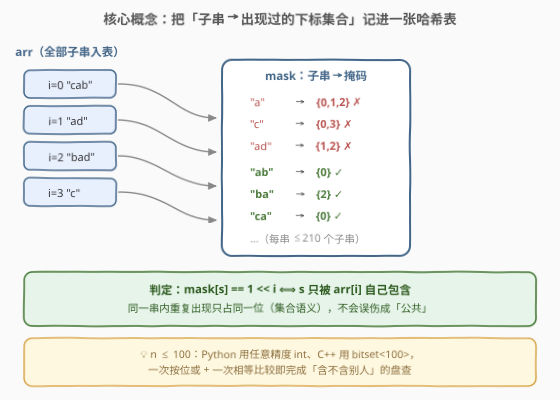
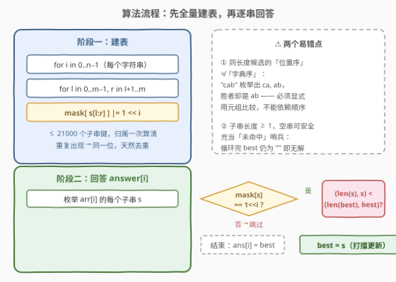
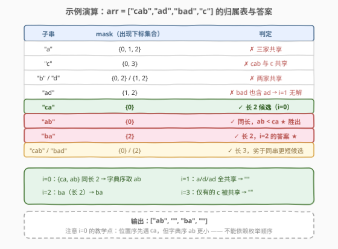

# LeetCode 数组中的最短非公共子字符串 题解

## 1. 题目概述

- **标题 / 题号**：数组中的最短非公共子字符串（#3076，medium）
- **链接**：https://leetcode.cn/problems/shortest-uncommon-substring-in-an-array/
- **难度**：中等
- **标签**：字符串、哈希表、枚举（官方标签另有 Trie、数组）

**题意**：给定一个数组 `arr`，其中有 $n$ 个**非空**字符串。

求一个长度为 $n$ 的字符串数组 `answer`，满足：`answer[i]` 是 `arr[i]` **最短**的子字符串，且它**不是 `arr` 中其他任何字符串的子字符串**。若有多个满足条件的子字符串，`answer[i]` 取其中**字典序最小**的一个；若不存在这样的子字符串，`answer[i]` 为空字符串 `""`。

**示例 1**：

```text
输入：arr = ["cab","ad","bad","c"]
输出：["ab","","ba",""]
解释：
- 对于 "cab"，最短且未在其他字符串中出现过的子串是 "ca" 或 "ab"，
  取字典序更小的 "ab"。
- 对于 "ad"，不存在这样的子串（"a"、"d"、"ad" 都被别的串包含）。
- 对于 "bad"，最短的非公共子串是 "ba"。
- 对于 "c"，"c" 同时是 "cab" 的子串，无解。
```

**示例 2**：

```text
输入：arr = ["abc","bcd","abcd"]
输出：["","","abcd"]
解释：只有 "abcd" 的整串未被其他字符串包含；
     "abc" 与 "bcd" 的每个子串都被别的串覆盖。
```

**约束**：

- $2 \le n = \text{arr.length} \le 100$
- $1 \le \text{arr[i].length} \le 20$
- `arr[i]` 只包含小写英文字母。

> ⚠️ 读题陷阱：① 「不是**其他任何**字符串的子串」——只与其他 $n-1$ 个串比较，**与自己无关**，子串在 `arr[i]` 内部重复出现不影响资格；② 双重 tie-break：先**长度最短**、再**字典序最小**；③ 无解时输出空字符串 `""`，不是 `"-1"` 之类的哨兵。

## 2. 解题思路

### 2.1 暴力思路

对每个 $i$，枚举 `arr[i]` 的每个子串 $s$（长度 $\le 20$ 的串至多 $\frac{20\times 21}{2}=210$ 个子串），再对每个 $j \ne i$ 调用一次 `find` 检查 $s$ 是否为 `arr[j]` 的子串，全部落空才算候选。

单次包含检查 $O(L^2)$（$L=20$），总时间 $O(n^2 L^4)$ 量级——约 $10^8$ 字符操作，本题数据下勉强能过，但写法笨重。

浪费在哪？**同一个子串 $s$ 会在不同 $i$ 的枚举里被反复盘查**「是否出现在别人家」。而「包含 $s$ 的字符串集合」是一个全局唯一的事实，算一次就够了。

### 2.2 核心观察：一张哈希表记录「子串 → 出现过的下标集合」



把**所有字符串的所有子串**塞进一张哈希表，键是子串 $s$，值是「包含 $s$ 的字符串下标集合」，用**位掩码**表示：

$$\text{mask}[s] \mathrel{|}= 1 \ll i \quad (\text{对 } arr[i] \text{ 的每个子串 } s)$$

于是判定一步到位：

$$s \text{ 是 } arr[i] \text{ 的非公共子串} \iff \text{mask}[s] = 1 \ll i$$

即掩码里**只有自己这一位**——不含任何其他下标。

> 💡 **为什么记「下标集合」而不是「出现次数」**：同一字符串内部重复出现不算「其他字符串」。若只记计数，`"aa"` 中的 `"a"` 计数为 2，会被误判成公共子串；记集合则天然把「自己内部重复」折叠成同一个 bit，只需一个 `|=`。

> 💡 **为什么敢用位掩码**：$n \le 100$，Python 的 `int` 任意精度直接用；C++ 用 `bitset<100>`，一次按位或、一次相等比较都是 $O(n/w)$ 的常数操作。

### 2.3 算法流程图



两阶段流水线：

1. **建表**：外层枚举 $i$，双层枚举子串起点 $l$、终点 $r$，执行 $\text{mask}[s] \mathrel{|}= 1 \ll i$。全表 $\le n \cdot \frac{L(L+1)}{2} = 21000$ 个键。
2. **回答**：对每个 $i$ 重新枚举自己的子串 $s$，凡 $\text{mask}[s] = 1 \ll i$ 者为候选，按 $(\text{len}(s),\ s)$ 元组打擂，最小者即 `answer[i]`；无候选则保持空串。

> ⚠️ **打擂必须显式比较字典序**：枚举得到的子串按**出现位置**排序，位置序 ≠ 字典序（如 `"ba"` 的两个长度 1 子串，位置序是 `b, a`，字典序是 `a < b`）。用元组 `(len(s), s)` 与 `(len(best), best)` 整体比较最稳。

### 2.4 示例演算



以 `arr = ["cab","ad","bad","c"]` 建表（下标：`cab=0`、`ad=1`、`bad=2`、`c=3`），关键子串的掩码：

| 子串 | mask（出现下标） | 判定 |
|------|-----------------|------|
| `a` | {0,1,2} | ✗ 三家共享 |
| `c` | {0,3} | ✗ `cab` 与 `c` 共享 |
| `b` | {0,2} | ✗ |
| `d` | {1,2} | ✗ |
| `ad` | {1,2} | ✗ `bad` 也含 `ad` |
| `ca` | {0} | ✓ 长 2 候选（$i=0$） |
| `ab` | {0} | ✓ 长 2 候选，`ab < ca` 胜出 |
| `ba` | {2} | ✓ 即 $i=2$ 的答案 |
| `cab` / `bad` | {0} / {2} | ✓ 长度 3，劣于同串更短候选 |

汇总：$i=0$ 在同长的 `ca`/`ab` 中取字典序小的 **`ab`**；$i=1$ 的 `a`、`d`、`ad` 全被共享 → **`""`**；$i=2$ 得 **`ba`**；$i=3$ 仅有的子串 `c` 与 `cab` 共享 → **`""`**。输出 `["ab","","ba",""]`，与官方一致。

## 3. 参考代码

### C++

```cpp
class Solution {
  public:
    vector<string> shortestSubstrings(vector<string>& arr) {
        int n = arr.size();
        unordered_map<string, bitset<100>> mask;      // 子串 -> 出现过的下标集合
        for (int i = 0; i < n; i++) {
            int m = arr[i].size();
            for (int l = 0; l < m; l++)
                for (int r = l + 1; r <= m; r++)
                    mask[arr[i].substr(l, r - l)][i] = true;   // 集合去重：|= 1<<i
        }

        vector<string> ans(n);
        for (int i = 0; i < n; i++) {
            int m = arr[i].size();
            for (int l = 0; l < m; l++)
                for (int r = l + 1; r <= m; r++) {
                    string s = arr[i].substr(l, r - l);
                    if (mask[s].count() != 1 || !mask[s][i]) continue;  // 含别人
                    if (ans[i].empty() || s.size() < ans[i].size() ||
                        (s.size() == ans[i].size() && s < ans[i]))
                        ans[i] = s;                   // (长度, 字典序) 双关键字打擂
                }
        }
        return ans;
    }
};
```

### Python

```python
class Solution:
    def shortestSubstrings(self, arr: List[str]) -> List[str]:
        n = len(arr)
        mask = defaultdict(int)                       # 子串 -> 出现过的下标位掩码
        for i, s in enumerate(arr):
            m = len(s)
            for l in range(m):
                for r in range(l + 1, m + 1):
                    mask[s[l:r]] |= 1 << i            # 集合语义：同串重复只占一位

        ans = []
        for i, s in enumerate(arr):
            best = ""                                 # 空串 = 未命中哨兵
            m = len(s)
            for l in range(m):
                for r in range(l + 1, m + 1):
                    t = s[l:r]
                    if mask[t] == 1 << i and (best == "" or (len(t), t) < (len(best), best)):
                        best = t                      # 元组比较：先短后字典序
            ans.append(best)
        return ans
```

> 💡 两个实现细节：① 子串非空（$r > l$），所以空串可以安全地充当「未命中」哨兵，循环结束仍为 `""` 即无解；② 建表阶段同一子串重复出现只做按位或，无需去重列表，代码与语义同时变短。

## 4. 复杂度分析

记 $n = \text{len(arr)} \le 100$，$L = \max \text{len(arr[i])} \le 20$。

| 维度 | 复杂度 | 说明 |
|------|--------|------|
| 时间复杂度 | $O(n \cdot L^3)$ | 子串共 $O(n L^2)$ 个，每个做一次哈希插入/查询，单次哈希与比较耗 $O(L)$；总量约 $10^6$ 字符操作 |
| 空间复杂度 | $O(n \cdot L^3)$ | 哈希表最多 $O(n L^2)$ 个键，每键最长 $L$ 字符，另存 $O(n/w)$ 掩码 |

规模甜区题：数据放大三倍数量级仍无压力，这也是官方 hint 直接建议「暴力枚举子串 + 哈希表」的原因。

## 5. 扩展：Trie 视角与更大数据范围

**Trie 解法（官方标签 Trie）**。哈希表键存的是完整子串，前缀被重复哈希、重复存储。改用 **Trie**：把每个 `arr[i]` 的每个后缀沿树插入（覆盖其全部子串），节点上聚合一个「经过该节点的下标掩码」。查询子串 $s$ 即从根走 $s$ 的路径，看终点节点掩码是否等于 $1 \ll i$。与哈希表完全同构（键 = 根到节点的路径），但共享前缀省空间、逐字符转移免去整串哈希，时间仍是 $O(n L^3)$——数据规模不变时属于「换了台发动机，车速一样」。

**数据范围更大怎么办**。若 $L$ 放大到 $10^5$ 级、询问仍是「哪些子串只属于一个源串」，子串级枚举本身不可行，需要**广义后缀自动机 / 后缀数组**：把所有串用互异分隔符拼成一个大串，「子串归属」转化为「子串对应的等价类区间内出现过几个源串颜色」，再以离线扫 + 树状数组/线段树维护颜色数。本题 $L \le 20$ 的甜区用不上，但面试追问「暴力为什么敢写、边界在哪」时能答出这条升级路线，是加分项。

## 6. 面试要点

1. **为什么值记「下标集合」而不是「出现次数」？**

   - 「非公共」的定义是与**其他**串比较，自己内部重复不算数。记次数会把 `"aa"` 的 `"a"`（次数 2）误判为公共；记集合（位掩码）时同一下标重复 `|=` 自动折叠成一个 bit，判定条件退化为一次 `mask[s] == 1 << i` 比较。

2. **tie-break 怎么写最不容易错？**

   - 双关键字（长度、字典序）直接用元组比较：`(len(s), s) < (len(best), best)`。不要依赖枚举顺序——按 $l, r$ 枚举得到的是**位置序**，同长度子串的字典序与出现顺序无关。

3. **两阶段（先全量建表、再逐串回答）比「边查边建」好在哪里？**

   - 子串归属是全局事实，建一次表服务所有 $n$ 个查询；若对每个 $i$ 现查其他串，同一子串会被重复盘查 $O(n)$ 遍。这是典型的「预处理换查询」取舍，与 187（重复 DNA）先哈希再筛选同构。

4. **什么时候输出空串？如何避免把空串误当候选？**

   - 当 `arr[i]` 的**每个**子串都被别的串包含时无解（如 `"abc"` 遇上 `"abcd"`）。因为有效子串长度 $\ge 1$，空串天然可作「未命中」哨兵，循环后仍为 `""` 直接输出。

5. **`bitset<100>` 与 `unordered_set<int>` 怎么选？**

   - $n \le 100$ 时 `bitset` 一次按位或 / 一次相等判断都是两条指令级操作，且值语义可直接放进 `unordered_map` 的 value；$n$ 上千后位掩码比较退化为 $O(n/w)$ 且哈希 value 过大，应换 `unordered_set` 存下标、用 `size()==1` 判定。

## 同类练习题

| # | 题目 | 与本题的关联 |
|---|------|-------------|
| 3042 | [统计前后缀下标对 I](https://leetcode.cn/problems/count-prefix-and-suffix-pairs-i/)（[题解](../3001-3100/3042_统计前后缀下标对I.md)） | 同为「枚举子串 + 哈希/Trie 判包含」的小数据甜区题，可对照本题看建表时机 |
| 187 | [重复的 DNA 序列](https://leetcode.cn/problems/repeated-dna-sequences/)（[题解](../0101-0200/187_重复的DNA序列.md)） | 定长子串哈希计数（可升级滚动哈希），「先建表再筛」的两阶段套路同源 |
| 208 | [实现 Trie (前缀树)](https://leetcode.cn/problems/implement-trie-prefix-tree/)（[题解](../0201-0300/208_实现Trie.md)） | 本题第 5 节 Trie 解法的数据结构基础 |
| 820 | [单词的压缩编码](https://leetcode.cn/problems/short-encoding-of-words/) | 判断「是否为其他单词的子串（后缀）」后去重，与本题同玩「子串归属」但方向相反——删被包含者而非找独占者 |
| 718 | [最长重复子数组](https://leetcode.cn/problems/maximum-length-of-repeated-subarray/)（[题解](../0701-0800/718_最长重复子数组.md)） | 两个串的**公共**子串判定，与本题的**非公共**子串互为镜像，DP/哈希双解法 |
