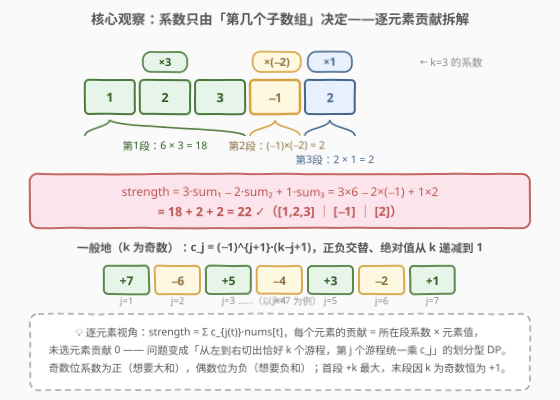
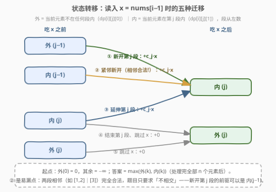
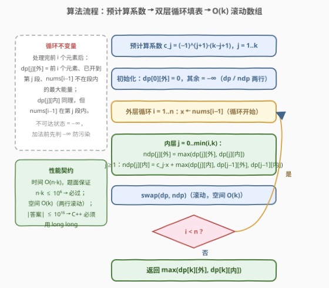

# LeetCode K 个不相交子数组的最大能量值 题解

## 1. 题目概述

- **标题 / 题号**：K 个不相交子数组的最大能量值（#3077，hard）
- **链接**：https://leetcode.cn/problems/maximum-strength-of-k-disjoint-subarrays/
- **难度**：困难
- **标签**：数组、动态规划

**题意**：给定长度为 $n$、下标从 0 开始的整数数组 `nums` 和一个**正奇数** $k$。

$x$ 个子数组的**能量值**定义为 $\text{strength} = \text{sum}[1] \cdot x - \text{sum}[2] \cdot (x-1) + \text{sum}[3] \cdot (x-2) - \cdots + \text{sum}[x] \cdot 1$，更正式地，是满足 $1 \le i \le x$ 的所有 $i$ 对应的 $(-1)^{i+1} \cdot \text{sum}[i] \cdot (x-i+1)$ 之和，其中 $\text{sum}[i]$ 是第 $i$ 个子数组的和。

需要在 `nums` 中选择 $k$ 个**不相交**子数组（从左到右编号 $1..k$），使得能量值**最大**。返回最大能量值。选出的子数组**不需要**覆盖整个数组。

**示例 1**：

```text
输入：nums = [1,2,3,-1,2], k = 3
输出：22
解释：选 nums[0..2]、nums[3..3]、nums[4..4]，
     能量值 = (1+2+3)×3 − (−1)×2 + 2×1 = 18 + 2 + 2 = 22。
```

**示例 2**：

```text
输入：nums = [12,-2,-2,-2,-2], k = 5
输出：64
解释：唯一方案是 5 个单元素子数组（k = n，毫无选择余地），
     能量值 = 12×5 − (−2)×4 + (−2)×3 − (−2)×2 + (−2)×1 = 60+8−6+4−2 = 64。
```

**示例 3**：

```text
输入：nums = [-1,-2,-3], k = 1
输出：-1
解释：必须选 1 个子数组，全负也得硬选，最优是 [-1]，能量值 −1。
```

**约束**：

- $1 \le n \le 10^4$
- $-10^9 \le \text{nums}[i] \le 10^9$
- $1 \le k \le n$
- $1 \le n \cdot k \le 10^6$
- $k$ 是奇数

> ⚠️ 读题陷阱：①「不相交」≠「不相邻」——相邻但无公共元素完全合法（示例 2 的 5 个单元素段两两相邻）；② 必须**恰好** $k$ 个子数组，全负也不能少选（示例 3 返回 $-1$ 而非 $0$）；③ 子数组按**从左到右**的顺序编号，系数随编号确定，与具体位置无关；④ $k$ 为奇数 ⇒ 首段系数 $+k$、末段系数恒为 $+1$，正负交替。

## 2. 解题思路

### 2.1 暴力思路

枚举 $k$ 个子数组等价于枚举 $2k$ 个端点（每段一个起点、一个终点，段间从左到右排列），组合数约 $O(n^{2k})$ 量级，$k$ 最大可到 $n$，天文数字。

那贪心呢？「奇数位系数为正、偶数位为负」似乎暗示：正系数段取最大子数组、负系数段取最小子数组？**不行**——段按左右顺序编号，前一段的**终点**锁死后一段的起点可选范围，段与段的位置互相制衡；极端如示例 2 的 $k=n$，所有段被迫是单元素，毫无选择。局部最优无法组合成全局最优，只能 DP。

### 2.2 核心观察：系数只由「第几个子数组」决定——逐元素贡献拆解



把公式按子数组展开：第 $j$ 个子数组（从左数）的系数是**固定**的

$$c_j = (-1)^{j+1} \cdot (k - j + 1)$$

与子数组的**位置、长度统统无关**。于是

$$\text{strength} = \sum_{j=1}^{k} c_j \cdot \text{sum}_j = \sum_{t \text{ 被选}} c_{j(t)} \cdot \text{nums}[t]$$

即**每个元素的贡献 = 它所在段的系数 × 它的值**，未选元素贡献 $0$。问题变成经典的**划分型 DP**：从左到右切出恰好 $k$ 个游程（允许中间跳过间隙），第 $j$ 个游程整体乘 $c_j$，最大化总和。

从左往右扫描，**当前元素该乘哪个系数，只取决于「已经开到第几段」以及「它是否接在当前段后面」**，由此得到三要素状态：

$$dp[i][j][0/1] = \text{前 } i \text{ 个元素、已开到第 } j \text{ 段的最大能量}$$

其中第三维：$0$ = `nums[i-1]` 不在任何段内（**外**），$1$ = `nums[i-1]` 在第 $j$ 段内（**内**）。读入 $x = \text{nums}[i-1]$ 时的转移：

$$dp[i][j][0] = \max(dp[i-1][j][0],\ dp[i-1][j][1]) \quad \text{（跳过 } x\text{）}$$

$$dp[i][j][1] = c_j \cdot x + \max\underbrace{\big(dp[i-1][j][1]\big)}_{\text{延伸第 } j \text{ 段}},\ \underbrace{\big(dp[i-1][j-1][0],\ dp[i-1][j-1][1]\big)}_{\text{新开第 } j \text{ 段（相邻也合法！）}}$$

> 💡 **新开第 $j$ 段的前驱为什么可以是 $dp[i-1][j-1][1]$**：它表示前一个元素恰好是第 $j-1$ 段的结尾，当前元素紧贴着新开第 $j$ 段——两段**相邻但不相交**，完全合法。这是本题最容易漏掉的转移（详见 2.4 的教学点）。

起点 $dp[0][0][0] = 0$，其余 $-\infty$；答案 $\max(dp[n][k][0], dp[n][k][1])$——$j$ 必须**精确**走到 $k$，强制恰好 $k$ 段。

### 2.3 状态转移图与算法流程





转移只有五种：跳过、延伸、结束再跳过、隔隙新开、紧邻新开（见转移图）。实现上 $dp$ 只依赖上一行 $dp[i-1][\cdot][\cdot]$，用 $dp / ndp$ 两行滚动即可把空间压到 $O(k)$。注意两层含义的 $-\infty$ 哨兵：不可达状态（元素不够开 $j$ 段）必须保持 $-\infty$，C++ 里参与加法前先判断，防止「污染值」被当成合法状态。

### 2.4 示例演算

![示例演算：nums = [1,2,3,-1,2] 的 DP 表与最优路径](../images/p3077_example_walkthrough.svg)

以示例 1（`nums = [1,2,3,-1,2]`，$k=3$，$c = [3, -2, 1]$）走一遍，每格为 $(外 / 内)$（$j=0$ 列恒为 $(0, -\infty)$，表中省略）：

| i | x | j=1（×3） | j=2（×−2） | j=3（×1） |
|---|---|-----------|------------|-----------|
| 0 | — | $-\infty/-\infty$ | $-\infty/-\infty$ | $-\infty/-\infty$ |
| 1 | 1 | $-\infty$ / **3** | $-\infty/-\infty$ | $-\infty/-\infty$ |
| 2 | 2 | 3 / **9** | $-\infty$ / −1 | $-\infty/-\infty$ |
| 3 | 3 | 9 / **18** | −1 / 3 | $-\infty$ / 2 |
| 4 | −1 | 18 / 15 | 3 / **20** | 2 / 2 |
| 5 | 2 | 18 / 21 | 20 / 16 | 2 / **22** |

答案 $= \max(2, 22) = 22$，最优方案 $[1,2,3] \times 3 + [-1] \times (-2) + [2] \times 1 = 18+2+2$。

> ⚠️ **两个教学点**：① $i=4$ 时 $dp[4][2][内] = 20$ **不是**延伸 $dp[3][2][内]=3$（$3 + (-1)(-2) = 5$），而是由 $dp[3][1]$ 的最优 $18$ **新开**第 2 段（$18 + (-1)(-2) = 20$）——$[1,2,3]$ 与 $[-1]$ 相邻但合法；② $j=2$ 列在 $i=1$ 时全为 $-\infty$：1 个元素开不出 2 段，不可达状态绝不能参与转移。

## 3. 参考代码

### C++

```cpp
class Solution {
  public:
    long long maximumStrength(vector<int>& nums, int k) {
        int n = nums.size();
        const long long NEG = LLONG_MIN / 4;               // 安全的 −∞：加法不溢出
        // c[j] = (−1)^(j+1)·(k−j+1)：第 j 个子数组（从左数）的固定系数
        vector<long long> c(k + 1, 0);
        for (int j = 1; j <= k; j++)
            c[j] = (j & 1 ? 1LL : -1LL) * (k - j + 1);

        // dp[j][0/1]：前 i 个元素、已开到第 j 段；0=当前元素不在段内，1=在第 j 段内
        vector<array<long long, 2>> dp(k + 1, {NEG, NEG}), ndp(k + 1, {NEG, NEG});
        dp[0][0] = 0;                                       // 还没处理任何元素，0 段
        for (int i = 0; i < n; i++) {
            long long x = nums[i];
            for (int j = 0; j <= min(i + 1, k); j++) {
                ndp[j][0] = max(dp[j][0], dp[j][1]);        // 跳过 x
                long long best = NEG;
                if (j >= 1)
                    best = max({dp[j][1],                   // 延伸第 j 段
                                dp[j - 1][0], dp[j - 1][1]}); // 新开第 j 段（相邻合法）
                ndp[j][1] = (best == NEG) ? NEG : best + x * c[j];  // 先判 −∞ 防污染
            }
            for (int j = min(i + 1, k) + 1; j <= k; j++)    // 不可达段保持 −∞
                ndp[j] = {NEG, NEG};
            swap(dp, ndp);
        }
        return max(dp[k][0], dp[k][1]);
    }
};
```

### Python

```python
class Solution:
    def maximumStrength(self, nums: List[int], k: int) -> int:
        n = len(nums)
        # c[j] = (−1)^(j+1)·(k−j+1)：第 j 个子数组（从左数）的固定系数
        c = [0] * (k + 1)
        for j in range(1, k + 1):
            c[j] = (k - j + 1) * (1 if j % 2 else -1)

        NEG = float('-inf')                    # −∞ 参与加法仍是 −∞，天然防污染
        dp = [[NEG, NEG] for _ in range(k + 1)]   # dp[j] = [外, 内]
        dp[0][0] = 0
        for i, x in enumerate(nums, 1):
            ndp = [[NEG, NEG] for _ in range(k + 1)]
            for j in range(0, min(i, k) + 1):
                ndp[j][0] = max(dp[j][0], dp[j][1])                  # 跳过 x
                if j >= 1:
                    ndp[j][1] = max(dp[j][1],                        # 延伸第 j 段
                                    dp[j - 1][0], dp[j - 1][1]) + x * c[j]  # 新开（相邻合法）
            dp = ndp
        return max(dp[k][0], dp[k][1])
```

> 💡 实现细节：① C++ 的 $-\infty$ 用 `LLONG_MIN / 4`，且加法前先判 `best == NEG`——不可达态永远保持精确的 $-\infty$，不会被「$-\infty + x \cdot c_j$」的污染值冒充；Python 的 `float('-inf')` 加有限数仍是 $-\infty$，无此顾虑。② 内层 $j$ 只需循环到 $\min(i, k)$：$i$ 个元素至多开 $i$ 段。③ 答案理论下界约为 $-n \cdot k \cdot 10^9 \ge -10^{15}$、上界同量级，32 位 int 必炸，C++ 必须 `long long`。

## 4. 复杂度分析

| 维度 | 复杂度 | 说明 |
|------|--------|------|
| 时间复杂度 | $O(n \cdot k)$ | 外层 $n$ 个元素 × 内层至多 $k$ 个段数；题面保证 $n \cdot k \le 10^6$，是出题人给的复杂度契约 |
| 空间复杂度 | $O(k)$ | $dp / ndp$ 两行滚动，每行 $k+1$ 个 $(外, 内)$ 状态 |

系数预计算 $O(k)$。$|ans| \le n \cdot k \cdot 10^9 \le 10^{15}$，远超 32 位范围但稳落 `long long`（约 $9.2 \times 10^{18}$）之内；实测 $n \cdot k = 10^6$ 的随机数据约 1~2ms。

## 5. 扩展：反向扫描——系数与 k 解耦

**换个方向看，系数表会变漂亮**。从右往左给段编号：从左数第 $i$ 段 = 从右数第 $j = k - i + 1$ 段，代入 $c_i = (-1)^{i+1}(k-i+1)$ 得

$$c = (-1)^{k-j+2} \cdot j = (-1)^{j+1} \cdot j \quad (k \text{ 为奇数})$$

即**从右数的第 $j$ 段系数恒为 $(-1)^{j+1} \cdot j$（$+1, -2, +3, -4, \cdots$），与 $k$ 完全无关**——这正是「$k$ 为奇数」条件埋下的对称性。官方提示采用的从右往左 DP 就用这张系数表（$\text{get}(j) = j$ 若 $j$ 奇，否则 $-j$），转移结构与本文的前向版本完全镜像，殊途同归。

另外两个边界值得体会：

- **$k = n$**（示例 2）：每个元素被迫自成一单元素段，DP 退化为直接套公式，毫无选择——检验实现的好用例；
- **$k = 1$**（示例 3）：退化为「**必选**一个子数组的最大和」，全负时也要返回最大的那个负数（Kadane 的强制非空版），与「可不选」的 53 题对照。

## 6. 面试要点

1. **为什么状态需要第三维（在内/在外）？**

   - 段从左到右编号，当前元素该乘 $c_j$（延伸第 $j$ 段）还是 $c_{j+1}$（新开下一段），取决于前一元素是否已在段内；且「不相交」只禁止共享元素、不禁止相邻，必须区分「刚结束第 $j$ 段」（外）和「正在第 $j$ 段中」（内）两种局面，二维状态表达不了。

2. **为什么不能贪心地「正系数段取最大子数组、负系数段取最小子数组」？**

   - 段的位置互相制衡：前段终点锁死后段起点域。极端例子 $k = n$ 时所有段被迫为单元素；一般情形下，第 1 段多吞一个正元素可能把第 2 段（负系数，想要负和）的「负元素库」截走。交替符号 + 位置耦合 ⇒ 局部最优不可组合，只能 DP。

3. **「恰好 k 个」在代码里如何体现？全负数组会怎样？**

   - 答案只取 $dp[n][k][\cdot]$，$j$ 必须精确到达 $k$；$j$ 中途「够好就停」的方案不会进入答案。全负时（示例 3）返回的是最优的负数 $-1$ 而非 $0$——如果写成「至多 $k$ 段」或把初始答案设为 $0$，就会错。

4. **数据范围给了什么提示？**

   - $n \cdot k \le 10^6$ 是复杂度契约：$O(nk)$ 的 DP 是标算，$O(nk\log)$ 都可能勉强；$-10^9 \le \text{nums}[i]$ 且系数绝对值最大 $k$，$|ans| \le 10^{15}$，C++ 必须 64 位整数。

5. **滚动数组和 $-\infty$ 哨兵有哪些坑？**

   - 只依赖上一行 ⇒ 两行滚动即可，但每轮要么整行重置、要么保证 $j > i$ 的格子保持 $-\infty$（$i$ 个元素开不出 $j > i$ 段）；C++ 中 $-\infty$ 参与加法会溢出或产生「污染值」，用 `LLONG_MIN / 4` 并在加法前判断，Python 用 `float('-inf')` 天然安全。

## 同类练习题

| # | 题目 | 与本题的关联 |
|---|------|-------------|
| 689 | [三个无重叠子数组的最大和](https://leetcode.cn/problems/maximum-sum-of-3-non-overlapping-subarrays/) | 同款「$j$ 段 + 在/不在」划分型 DP 的 $k=3$、系数全 $+1$ 特例，对照理解状态设计 |
| 1031 | [两个非重叠子数组的最大和](https://leetcode.cn/problems/maximum-sum-of-two-non-overlapping-subarrays/) | $k=2$ 且子数组定长，前缀和 + 枚举分割点的轻量版 |
| 1911 | [最大交替子序列和](https://leetcode.cn/problems/maximum-alternating-subsequence-sum/) | 同样的「奇偶位系数 $\pm$」贡献拆解，但选的是子序列（无需连续），一遍 $O(n)$ DP |
| 1746 | [经过一次操作后的最大子数组和](https://leetcode.cn/problems/maximum-subarray-sum-after-one-operation/) | 子数组 DP 附加一维「是否已用操作」的状态扩展练习 |
| 1186 | [删除一次得到子数组最大和](https://leetcode.cn/problems/maximum-subarray-sum-with-one-deletion/) | Kadane 加一维「是否已删」的变体，体会第三维状态的增删取舍 |
