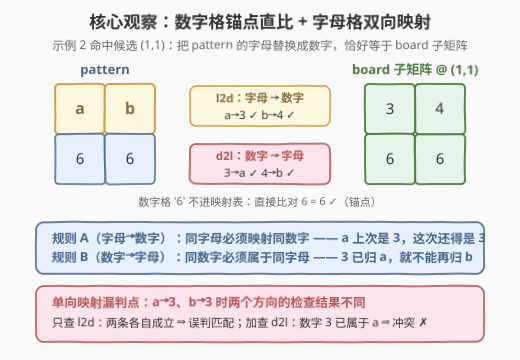
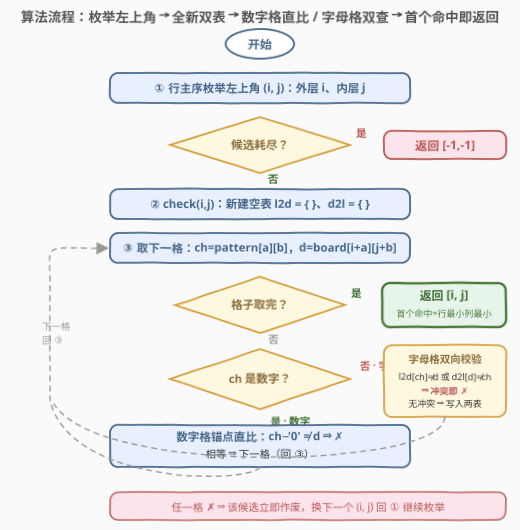
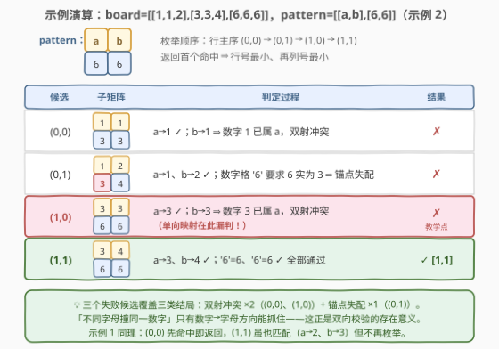

# 矩阵中的字母数字模式匹配 I

- **题目名称**：矩阵中的字母数字模式匹配 I
- **链接**：[3078. 矩阵中的字母数字模式匹配 I](https://leetcode.cn/problems/match-alphanumerical-pattern-in-matrix-i/)
- **难度**：中等
- **标签**：数组、哈希表、字符串、矩阵

## 1. 题目概述

> ⚠️ 本题为 LeetCode 付费题，题意描述根据官方示例用例与 hints 重建，可能与官方题面有出入。

给定一个二维整数矩阵 `board` 和一个二维字符矩阵 `pattern`，其中 $0 \le \text{board}[r][c] \le 9$，`pattern` 的每个元素是一位数字或一个小写英文字母。

你的任务是在 `board` 中找到**匹配** `pattern` 的子矩阵。

如果用一些数字替换 `pattern` 中的字母（每个**不同**的字母对应**不同**的数字），能使结果矩阵与整数矩阵 `part` 完全相同，则称 `part` 与 `pattern` **匹配**。换句话说：

- 两个矩阵维度相同；
- 若 $\text{pattern}[r][c]$ 是数字，则 $\text{part}[r][c]$ 必须是**相同的**数字；
- 若 $\text{pattern}[r][c]$ 是字母 $x$：
  - 对每个 $\text{pattern}[i][j] = x$ 的位置，$\text{part}[i][j]$ 与 $\text{part}[r][c]$ **相同**（同字母 ⇒ 同数字）；
  - 对每个 $\text{pattern}[i][j] \ne x$ 的位置，$\text{part}[i][j]$ 与 $\text{part}[r][c]$ **不同**（不同字母 ⇒ 不同数字）。

返回长度为 2 的数组 `[i, j]`，即匹配 `pattern` 的 `board` 子矩阵**左上角**的行号和列号。若有多个匹配的子矩阵，返回**行号最小**的；行号相同则返回**列号最小**的。若无匹配，返回 `[-1, -1]`。

**示例 1**：

```text
输入：board = [[1,2,2],[2,2,3],[2,3,3]], pattern = ["ab","bb"]
输出：[0,0]
解释：取映射 a → 1、b → 2，左上角 (0,0) 的 2×2 子矩阵 [[1,2],[2,2]] 匹配。
注意 (1,1) 处的子矩阵 [[2,3],[3,3]]（a → 2、b → 3）同样匹配，但它出现得更晚，
按「行号最小、再列号最小」的规则返回 [0,0]。
```

**示例 2**：

```text
输入：board = [[1,1,2],[3,3,4],[6,6,6]], pattern = ["ab","66"]
输出：[1,1]
解释：取映射 a → 3、b → 4，左上角 (1,1) 的子矩阵 [[3,4],[6,6]] 匹配。
注意 (1,0) 处的子矩阵 [[3,3],[6,6]] 不匹配——a、b 是不同字母，对应的值必须不同。
```

**示例 3**：

```text
输入：board = [[1,2],[2,1]], pattern = ["xx"]
输出：[-1,-1]
解释：模式要求两个位置的值相同（x 处处同值），但 board 中任何 1×2 子矩阵的两个值都不同，无匹配。
```

**约束条件**：

- $1 \le \text{board.length} \le 50$
- $1 \le \text{board[i].length} \le 50$
- $0 \le \text{board[i][j]} \le 9$
- $1 \le \text{pattern.length} \le 50$
- $1 \le \text{pattern[i].length} \le 50$
- $\text{pattern[i][j]}$ 是一位数字（`'0'`–`'9'`）或一个小写英文字母（`'a'`–`'z'`）

> 💡 **读题关键**：匹配不是「逐格相等」，而是「**替换一致性**」——数字格是**锚点**（值必须逐格相等），字母格允许自由取值，但字母与数字之间必须构成**双射**：同一个字母处处同值、不同字母取不同值。另外返回规则（行号最小、再列号最小）恰好等于「行主序枚举的**第一个**命中」——枚举顺序天然吸收了 tie-break，无需收集所有解再比较。

---

## 2. 解题思路

### 2.1 暴力思路：枚举左上角，难点全在「怎么判匹配」

左上角的枚举没有悬念：候选共 $(m-r+1)(n-c+1)$ 个（$m, n$ 为 `board` 的行数、列数，$r, c$ 为 `pattern` 的），官方 hint 也直说 *Use brute force and check all the possible submatrices*。

真正的坑在**匹配判定**。第一反应可能是：**枚举字母的取值**——$k$ 个不同字母从 10 个数字里取互异的值，共 $A_{10}^{k}$ 种组合，逐种替换后整块比对。字母一多就指数爆炸，而且完全是浪费：判定「**是否存在**合法替换」根本不需要知道字母**取什么值**，只需要验证取值的**一致性**——一趟扫描即可，这就是下面的核心观察。

### 2.2 核心观察：字母 ⇄ 数字的双射不变式



把「替换」定义翻译成两条可执行的不变式。对候选子矩阵（左上角 $(x, y)$）的每个**字母格** $(a, b)$，记 $d = \text{board}[x+a][y+b]$、$ch = \text{pattern}[a][b]$：

- **不变式 A（字母 → 数字）**：字母 $ch$ 之前映射过的数字必须是 $d$——保证**同字母处处同值**；
- **不变式 B（数字 → 字母）**：数字 $d$ 之前被映射过的字母必须是 $ch$——保证**同数字不换主人**，等价于**不同字母必取不同数字**。

两个方向用两张哈希表 `l2d`（字母→数字）与 `d2l`（数字→字母）同步维护：任一方向冲突，该候选立即失败；全部格子通过，即匹配成立。这正是 205「同构字符串」/ 290「单词规律」/ 890「查找和替换模式」一脉相承的**双向哈希双射判定**模板，从一维字符串原样搬进二维子矩阵。

**为什么单向不够**：只查 A 方向会漏掉「两个不同字母映射到同一个数字」。示例 2 的 (1,0) 候选：`a→3`、`b→3`，A 方向各自检查都通过；但 B 方向立刻发现数字 3 已经属于 `a`，不能再属于 `b`——这是本题最容易写错的单点，也是示例 2 特意安排 (1,0) 这个「差一点就匹配」候选的用意。

**数字格是免费的锚点**：直接比对 `board` 值与字符面值，不进映射表。

> 💡 **一个微妙的语义点**：双射只在**字母之间**成立。按「替换」定义，字母取的值允许与 `pattern` 中**显式写出的数字**相同——例如 `pattern = ["a","3"]` 可以匹配子矩阵 `[3,3]`（把 a 替换成 3 后整块恰好相等）。主流 AC 实现均按此语义判定，实现时不必给「字母的取值」与「显式数字」之间加互斥检查。

### 2.3 算法流程图



四个要点：

1. **行主序枚举**：外层 $i$、内层 $j$，第一个命中的候选天然满足「行号最小、再列号最小」；
2. **每候选全新双表**：映射是当前 $r \times c$ 子矩阵的**局部约定**，换一个左上角必须清空重来，残留映射会把合法候选误杀；
3. **字母格先双查后写入**：A、B 两个方向都不冲突才写表；一旦写坏，后面全错；
4. **早退**：任一格失配立即放弃该候选，不恋战。

### 2.4 示例演算



以示例 2 演算（`board` 为 3×3，`pattern` 为 2×2，共 4 个候选，行主序依次检查）：

| 候选 | 子矩阵 | 判定过程 | 结果 |
|------|--------|----------|------|
| (0,0) | [[1,1],[3,3]] | `a→1` ✓；`b→1`：数字 1 已属于 a ⇒ **双射冲突** | ✗ |
| (0,1) | [[1,2],[3,4]] | `a→1`、`b→2` ✓；数字格 '6' 要求 6，实际是 3 ⇒ **锚点失配** | ✗ |
| (1,0) | [[3,3],[6,6]] | `a→3` ✓；`b→3`：数字 3 已属于 a ⇒ **双射冲突** | ✗ |
| (1,1) | [[3,4],[6,6]] | `a→3`、`b→4` ✓；'6'=6 ✓、'6'=6 ✓ 全部通过 | ✓ **返回 [1,1]** |

四个候选恰好覆盖全部三种结局：**双射冲突**（两种姿势：a、b 撞在 1 上与撞在 3 上）、**锚点失配**（一种）、**命中**（一种）。其中两处双射冲突都只有 B 方向（数字→字母）能抓住——单向映射的实现在这里会漏判 (0,0) 与 (1,0)，直接错答。

---

## 3. 参考代码

### C++（枚举左上角 + 双数组双射校验）

```cpp
class Solution {
  public:
    vector<int> findPattern(vector<vector<int>>& board, vector<string>& pattern) {
        int m = board.size(), n = board[0].size();
        int r = pattern.size(), c = pattern[0].size();
        // 行主序枚举左上角，首个命中即「行号最小、再列号最小」
        for (int x = 0; x + r <= m; ++x)
            for (int y = 0; y + c <= n; ++y)
                if (check(board, pattern, x, y)) return {x, y};
        return {-1, -1};
    }

  private:
    bool check(vector<vector<int>>& board, vector<string>& pattern, int x, int y) {
        int l2d[26], d2l[10];                  // 字母→数字，数字→字母（值域仅 10，用数组即可）
        fill(begin(l2d), end(l2d), -1);
        fill(begin(d2l), end(d2l), -1);
        for (int i = 0; i < (int)pattern.size(); ++i)
            for (int j = 0; j < (int)pattern[i].size(); ++j) {
                int d = board[x + i][y + j];
                char ch = pattern[i][j];
                if (isdigit(ch)) {             // 数字格：锚点直比
                    if (ch - '0' != d) return false;
                } else {                       // 字母格：双向校验后写入
                    int k = ch - 'a';
                    if (l2d[k] != -1 && l2d[k] != d) return false;  // 同字母必须同数字
                    if (d2l[d] != -1 && d2l[d] != k) return false;  // 同数字必须同字母
                    l2d[k] = d;
                    d2l[d] = k;
                }
            }
        return true;
    }
};
```

### Python（`get` 默认值写法，双向校验零分支）

```python
class Solution:
    def findPattern(self, board: List[List[int]], pattern: List[str]) -> List[int]:
        m, n = len(board), len(board[0])
        r, c = len(pattern), len(pattern[0])

        def check(x: int, y: int) -> bool:
            l2d, d2l = {}, {}                  # 每个候选子矩阵一张全新的双向映射表
            for i in range(r):
                for j in range(c):
                    d, ch = board[x + i][y + j], pattern[i][j]
                    if ch.isdigit():                           # 数字格：锚点直比
                        if int(ch) != d:
                            return False
                    else:                                      # 字母格：双向校验
                        if l2d.get(ch, d) != d:                # 同字母必须同数字
                            return False
                        if d2l.get(d, ch) != ch:               # 同数字必须同字母
                            return False
                        l2d[ch], d2l[d] = d, ch
            return True

        for x in range(m - r + 1):             # 行主序枚举，首个命中即行最小、列最小
            for y in range(n - c + 1):
                if check(x, y):
                    return [x, y]
        return [-1, -1]
```

> 💡 `l2d.get(ch, d) != d` 的妙处：字母首次出现时默认值恰为 $d$，检查天然通过；只有「之前映射过且不同」才触发失败——双向校验压成一个比较，无显式分支。

> 💡 **面试节奏**：先讲清匹配语义（锚点 + 双射），再点出「单向映射漏判」这个单点错误（直接拿示例 2 的 (1,0) 当反例），最后主动算复杂度上界——本题暴力即正解，能说明白为什么不需要更快算法，比硬套模板更加分。

---

## 4. 复杂度分析

| 维度 | 复杂度 | 说明 |
|------|--------|------|
| 时间复杂度 | $O\big((m-r+1)(n-c+1) \cdot rc\big)$ | 枚举 $(m-r+1)(n-c+1)$ 个左上角，每个候选最多扫 $rc$ 格（失配即早退）；50 上限下 $(51-r) \cdot r \le 650$，总量 $\le 650^2 \approx 4 \times 10^5$ |
| 空间复杂度 | $O(|\Sigma|)$ | 两张映射表共 $O(26 + 10) = O(1)$；每个候选重建，不随输入规模增长 |
| 暴力替换枚举 | $O(A_{10}^{k} \cdot rc)$ | $k$ 个字母枚举互异取值，指数级——仅作对照，说明「判定可行性 ≠ 枚举构造」 |

---

## 5. 扩展：数据放大的思路与实现坑清单

**放大数据的思考方向**：若把 `board` 放大到 $10^3 \times 10^3$（假想的 II 版），$O(mnrc)$ 达 $10^{12}$ 不可行。经典出路是 890「查找和替换模式」的**首现位置编码**思想：对每个字符记录「同字符上一次出现的位置（无则记哨兵）」，两串的编码逐位相等 ⟺ 双射成立——这把「双射匹配」退化成「普通匹配」，随后即可上二维滚动哈希或二维 KMP。混合数字格的版本还需把锚点格与编码格拼接处理，属于竞赛级改造，面试点到思路即可。

**实现坑清单**（本题 AC 与 WA 之间的全部距离）：

- 映射表**跨候选复用**：上一个候选的残留映射（如 `a→3`）会把当前合法候选误杀——必须每个候选清空；
- 只建**单向表**：漏判「不同字母撞同一个数字」，示例 2 会错答 `[1,0]`；
- 枚举顺序**列优先**：违反「行号优先」的 tie-break，答出错误位置；
- 忘了 `pattern` 可能**放不进** `board`：用 `x + r <= m` 型边界条件，$m - r + 1 \le 0$ 时循环体自然一次不执行，直接返回 `[-1,-1]`。

---

## 6. 面试要点

1. **为什么必须双向映射？单向会错在哪？**

   - 只查「字母→数字」只能保证同字母同值，抓不住「两个不同字母撞同一个数字」。示例 2 的 (1,0)：`a→3`、`b→3`，A 方向各自都过；B 方向（数字→字母）发现 3 已属于 a，一票否决。单向实现会错答 `[1,0]`。

2. **多解时返回哪个？枚举顺序如何天然保证？**

   - 行号最小、再列号最小。行主序（外层行、内层列）枚举左上角，返回**第一个**命中的候选即满足——tie-break 融进枚举顺序，无需收集再比较。

3. **映射表什么时候清空？为什么不能全局维护一张？**

   - 每换一个左上角就重建。映射是「当前 $r \times c$ 子矩阵内」的局部约定：上个候选可能建立了 `a→3`，当前候选里 a 对应的格子是 4——残留映射会把合法候选误杀，方向相反时也可能误放行。

4. **字母映射到的数字，需要与 pattern 中显式出现的数字不同吗？**

   - 不需要。按「替换」主定义，双射只约束**字母之间**互异，字母取值撞上显式数字格是允许的（如 `pattern = ["a","3"]` 匹配 `[3,3]`）。主流 AC 实现均如此判定。若面试官追问，可指出题面第三条 bullet 的字面读法与「替换」定义存在微妙出入，以替换语义为准——这是很强的读题细节展示。

5. **时间复杂度上界？为什么暴力就是正解？**

   - $O\big((m-r+1)(n-c+1) \cdot rc\big)$，数据范围内 $\le 650^2 \approx 4 \times 10^5$ 次格子访问。本题考察点在匹配语义的正确实现（双射 + 局部性），不在速度；主动算出上界并说明无需优化，是「知道自己在做什么」的信号。

---

## 7. 同类练习题

- [890. 查找和替换模式](https://leetcode.cn/problems/find-and-replace-pattern/)（[题解](../0801-0900/890_查找和替换模式.md)）：双向双射判定的单词批量版，其「首现位置编码」进阶解法正是本题数据放大方向的源头
- [3034. 匹配模式数组的子数组数目 I](https://leetcode.cn/problems/number-of-subarrays-that-match-a-pattern-i/)（[题解](../3001-3100/3034_匹配模式数组的子数组数目I.md)）：一维版「子数组 vs 模式」匹配（相邻关系编码视角），与本题凑成「关系匹配 / 双射匹配」一对姐妹题
- [1074. 元素和为目标值的子矩阵数量](https://leetcode.cn/problems/number-of-submatrices-that-sum-to-target/)（[题解](../1001-1100/1074_元素和为目标值的子矩阵数量.md)）：子矩阵枚举 + 降维哈希的二维套路，枚举姿势可与本题互参
- [205. 同构字符串](https://leetcode.cn/problems/isomorphic-strings/)：一维双向双射判定母题，本题即它的「子矩阵扫描」形态
- [290. 单词规律](https://leetcode.cn/problems/word-pattern/)：双射判定的单词级版本，双向查表的入门练手
