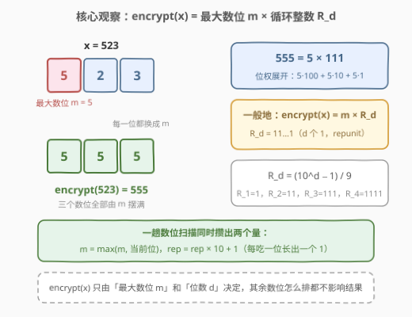
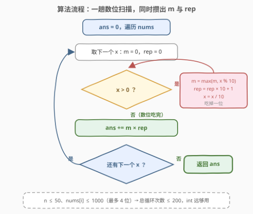
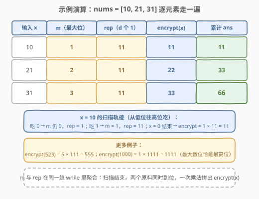

# 求出加密整数的和

- **题目名称**：求出加密整数的和
- **链接**：[3079. 求出加密整数的和](https://leetcode.cn/problems/find-the-sum-of-encrypted-integers/)
- **难度**：简单
- **标签**：数组、数学

## 1. 题目概述

给你一个整数数组 `nums`，数组中的元素都是**正**整数。定义一个加密函数 `encrypt`，`encrypt(x)` 将一个整数 `x` 中**每一个**数位都用 `x` 中的**最大**数位替换。比方说 `encrypt(523) = 555` 且 `encrypt(213) = 333`。

请你返回数组中所有元素加密后的**和**。

**示例 1**：

```text
输入：nums = [1,2,3]
输出：6
解释：加密后的元素位 [1,2,3]。加密元素的和为 1 + 2 + 3 == 6。
```

**示例 2**：

```text
输入：nums = [10,21,31]
输出：66
解释：加密后的元素为 [11,22,33]。加密元素的和为 11 + 22 + 33 == 66。
```

**约束条件**：

- $1 \le \text{nums.length} \le 50$
- $1 \le \text{nums}[i] \le 1000$

> 💡 读题关键：单看一个数，加密结果只由两个量决定——**最大数位 $m$** 和**位数 $d$**。别把「替换数位」想成字符串操作题，它本质是个数位统计题。

---

## 2. 解题思路

### 2.1 暴力思路：转字符串，找最大字符，重建字符串

最直观的做法：对每个 $x$，转成字符串 → 找出最大字符 → 构造「最大字符重复 $\text{len}$ 次」的新串 → 转回整数累加。

这当然正确，但对每个数做了两次进制转换（数值 → 字符串 → 数值），还额外分配了临时字符串。本题规模下毫无压力，可「把每一位都替换成同一个值」这件事其实有纯算术结构可挖——一旦挖出来，连字符串都不用碰。

### 2.2 核心观察：encrypt(x) = m × R_d（循环整数）



把 $d$ 位数 $x$ 的每一位都换成最大数位 $m$，按位权展开：

$$\text{encrypt}(x) = m \cdot 10^{d-1} + m \cdot 10^{d-2} + \cdots + m \cdot 10^{0} = m \times \underbrace{(10^{d-1} + \cdots + 10 + 1)}_{R_d} = m \times R_d$$

其中 $R_d = \underbrace{11 \cdots 1}_{d \text{ 个 } 1}$，数学上称为**循环整数**（repunit），满足 $R_d = \frac{10^d - 1}{9}$。

> 💡 也就是说，$\text{encrypt}(x)$ 完全由「最大数位 $m$」和「位数 $d$」决定，**其余数位怎么排都不影响结果**——523、235、352 加密后全是 555。

更妙的是，这两个量可以在**同一趟数位扫描**里同时攒出来：

- $m = \max(m,\ x \bmod 10)$ —— 消费当前位（$\max$ 是无序统计量，从低位往高位吃顺序无所谓）；
- $\text{rep} = \text{rep} \times 10 + 1$ —— 每吃掉一位，`rep` 长出一个 1。

**循环不变量**：扫描完 $k$ 位后，$m$ 是这 $k$ 位的最大数位，$\text{rep} = R_k$。当 $x$ 归零时恰好处理完全部 $d$ 位，$\text{encrypt}(x) = m \times \text{rep}$ 一步拼出。

以 523 为例：从低位往高位依次吃 3、2、5 → $m = 5$，$\text{rep} = 111$ → $5 \times 111 = 555$。

### 2.3 算法流程：一趟扫描，双聚合，一次乘法收尾



1. `ans = 0`；
2. 遍历每个 $x$：初始化 `m = 0, rep = 0`；
3. `while x > 0`：`m = max(m, x % 10)`，`rep = rep * 10 + 1`，`x = x / 10`；
4. `ans += m * rep`；
5. 全部处理完返回 `ans`。

> ⚠️ 约束保证 $\text{nums}[i] \ge 1$，循环至少执行一次，$m$ 不会停留在 0；若数组可能含 0（本题不会），需特判 `encrypt(0) = 0`。

### 2.4 示例演算



| 输入 $x$ | 扫描后的 $m$ | $\text{rep}$（$d$ 个 1） | $\text{encrypt}(x)$ | 累计 ans |
|----------|--------------|--------------------------|---------------------|----------|
| 10 | 1 | 11 | 11 | 11 |
| 21 | 2 | 11 | 22 | 33 |
| 31 | 3 | 11 | 33 | **66** |

注意 $x = 10$ 的轨迹：先吃个位 0（$m$ 仍为 0、$\text{rep} = 1$），再吃十位 1（$m = 1$、$\text{rep} = 11$）——最大数位可以最后才出现。1000 则演示了另一个极端：最大数位恰是最高位，$\text{encrypt}(1000) = 1 \times 1111 = 1111$。

---

## 3. 参考代码

### C++（数位扫描，双聚合）

```cpp
class Solution {
  public:
    int sumOfEncryptedInt(vector<int>& nums) {
        int ans = 0;
        for (int x : nums) {
            int m = 0, rep = 0;
            while (x > 0) {
                m = max(m, x % 10);
                rep = rep * 10 + 1;   // 每吃一位长出一个 1
                x /= 10;
            }
            ans += m * rep;           // encrypt(x) = m × R_d
        }
        return ans;
    }
};
```

### Python（同款数位扫描）

```python
class Solution:
    def sumOfEncryptedInt(self, nums: List[int]) -> int:
        ans = 0
        for x in nums:
            m, rep = 0, 0
            while x:
                m = max(m, x % 10)
                rep = rep * 10 + 1
                x //= 10
            ans += m * rep
        return ans
```

> 💡 Python 还有字符串一行流：`return sum(int(max(s) * len(s)) for s in map(str, nums))`。`max(s)` 取最大字符——数字字符的字典序与数值序一致（ASCII 码 `'0' < '1' < … < '9'` 连续），`max(s) * len(s)` 即「最大字符重复 `len` 次」。两个版本都对，见第 6 节的取舍讨论。

---

## 4. 复杂度分析

| 维度 | 复杂度 | 说明 |
|------|--------|------|
| 时间复杂度 | $O(nD)$，$D$ 为最大位数（本题 $D \le 4$） | 每个数逐位扫一遍；$n \le 50$ → 至多 200 次基本操作 |
| 空间复杂度 | $O(1)$ | 仅 `m` / `rep` / `ans` 三个变量；字符串版为 $O(D)$ 临时串 |

> 💡 答案上界：$50 \times 9999 = 499950 < 2^{31} - 1$，`int` 完全够用，无需 `long long`。

---

## 5. 扩展：repunit 与「如果数很大」

**循环整数小知识**：$R_d = \frac{10^d - 1}{9}$，即 $1, 11, 111, 1111, \ldots$。它在数论题里是常客：$R_3 = 111 = 3 \times 37$，$R_4 = 1111 = 11 \times 101$，「$d$ 位全 1 能否被素数 $p$ 整除」等价于 $10^d \equiv 1 \pmod{9p}$ 的整除判定。本题只是它最朴素的出场方式：**「全替换成 $m$」⟺「$m \times R_d$」**。

**若 $\text{nums}[i]$ 大到 64 位装不下**（比如 $10^{30}$）：C++ 的 `int`/`long long` 数位扫描照样能算 $m$ 和 $d$，但拼 $m \times R_d$ 时会溢出，得退回字符串版（或大数库）；Python 的 `int` 天然任意精度，两个版本都能直接跑——这正是 Python 一行流在大数场景的价值。

**变体题**：加密规则改成「替换成最小非零位」「替换成个位」「替换成数位和」——模板完全不变，只改聚合函数（`max` → `min` / 末值 / 求和）。识别出「一趟扫描 + 聚合统计量」的骨架，这类题都是同一道题。

---

## 6. 面试要点

1. **为什么 $\text{encrypt}(x) = m \times R_d$？**

   - 每一位都换成 $m$ 后，按位权展开是 $d$ 项 $m \cdot 10^k$ 求和，提出公因子 $m$ 得 $m \times (10^{d-1} + \cdots + 1) = m \times R_d$。本质是「每位相同的多位数 = 该数字 × 循环整数」。

2. **`rep = rep * 10 + 1` 的递推依据是什么？**

   - $R_k = 10 \cdot R_{k-1} + 1$：在 $k-1$ 个 1 的末尾再补一个 1。从 `rep = 0` 出发递推 $d$ 次恰得 $R_d$。也可以直接算 $(10^d - 1) / 9$，但递推免掉幂运算，且和 $m$ 的更新共用同一个循环。

3. **循环不变量怎么表述？**

   - 扫描完 $k$ 位后：$m$ = 已扫 $k$ 位的最大数位，$\text{rep} = R_k$。终止时 $x = 0$，全部 $d$ 位恰好处理完，两份原料同时到位。

4. **字符串版和算术版怎么取舍？**

   - 都正确。字符串版直观、Python 里一行写完；算术版 $O(1)$ 空间、无编码转换开销、语言无关性强，还能自然推广到大数/变体规则。面试里真正加分的不是写哪一版，而是先说出「结果只由 $m$ 和 $d$ 决定」这个观察。

5. **溢出要不要担心？**

   - 本题不用：$n \le 50$、$\text{nums}[i] \le 1000$ → 单项 $\le 9999$、总和 $\le 499950$。但「先算上界再选类型」的习惯值得口头带一句——扩展到 $10^{18}$ 级别时 `int` 版会静默溢出。

---

## 7. 同类练习题

- [7. 整数反转](https://leetcode.cn/problems/reverse-integer/)：同一趟 `%10` / `//10` 数位扫描，边扫边重组整数，本题扫描骨架的直接来源（本仓库已有题解）
- [1281. 整数的各位积和之差](https://leetcode.cn/problems/subtract-the-product-and-sum-of-digits-of-an-integer/)：一趟扫描同时聚合「积」与「和」两个统计量，与 m/rep 双聚合同款（本仓库已有题解）
- [258. 各位相加](https://leetcode.cn/problems/add-digits/)：数位求和的反复折叠（数根），数位扫描家族的基础件（本仓库已有题解）
- [2269. 找到一个数字的 K 美丽值](https://leetcode.cn/problems/find-the-k-beauty-of-a-number/)：把整数当字符串切定长窗口，数位处理的另一视角（本仓库已有题解）
- [9. 回文数](https://leetcode.cn/problems/palindrome-number/)：反转一半数位做比较，「边扫边构造」思想的近亲（本仓库已有题解）
