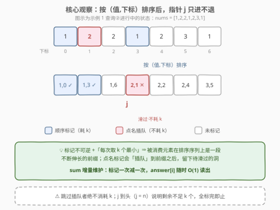
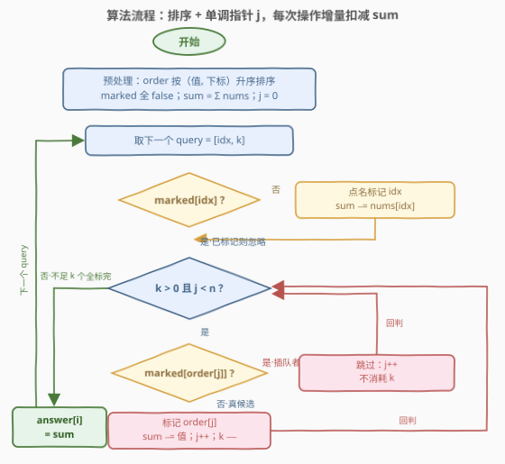

# LeetCode 执行操作标记数组中的元素 题解

## 1. 题目概述

- **标题 / 题号**：执行操作标记数组中的元素（#3080，medium）
- **链接**：https://leetcode.cn/problems/mark-elements-on-array-by-performing-queries/
- **难度**：中等
- **标签**：数组、排序、模拟、堆（优先队列）、哈希表

**题意**：给定长度为 $n$、下标从 0 开始的正整数数组 `nums`，以及长度为 $m$ 的操作数组 `queries`，其中 `queries[i] = [index_i, k_i]`。

一开始所有元素**未标记**。第 $i$ 次操作依次执行：

1. 如果下标 `index_i` 对应元素还没标记，标记它；
2. 然后标记 $k_i$ 个未标记的**最小**元素——值相等时优先标记下标较小的；若未标记元素少于 $k_i$ 个，全部标记。

返回长度为 $m$ 的数组 `answer`，`answer[i]` 为第 $i$ 次操作后**未标记元素之和**。

**示例 1**：

```text
输入：nums = [1,2,2,1,2,3,1], queries = [[1,2],[3,3],[4,2]]
输出：[8,3,0]
解释：
操作①：标记下标 1，再标记 2 个最小未标记（下标 0、3），未标和 = 2+2+3+1 = 8；
操作②：下标 3 已标记则忽略点名，再标记 3 个最小未标记（下标 6、2、4），未标和 = 3；
操作③：下标 4 已标记则忽略点名，再标记 2 个最小但只剩下标 5，全标完，未标和 = 0。
```

**示例 2**：

```text
输入：nums = [1,4,2,3], queries = [[0,1]]
输出：[7]
解释：标记下标 0，再标记 1 个最小未标记（下标 2），未标和 = 4+3 = 7。
```

**约束**：

- $1 \le m \le n \le 10^5$
- $1 \le \text{nums}[i] \le 10^5$
- $0 \le \text{index}_i, k_i \le n - 1$

> ⚠️ 读题陷阱：① 点名的 `index` 若已标记，**忽略**而不是报错，也不补标别的；② 「值相等优先标下标较小的」意味着 $k$ 个最小的选取是一个**全序**问题（值，下标）二元组比较，不是只按值排；③ $k_i$ 可以是 0——一次操作可能只点名、不取最小；④ 未标记元素之和最大 $10^5 \times 10^5 = 10^{10}$，**超出 32 位 int**。

## 2. 解题思路

### 2.1 暴力思路

每次操作：扫描一遍数组收集未标记元素，排序后取前 $k$ 小标记，再扫一遍求未标记之和。单次 $O(n \log n)$，总计 $O(m \cdot n \log n)$；$n = m = 10^5$ 时约 $10^{10}$ 量级，必然超时。

浪费在哪？两个地方：**每次重新找最小**与**每次重新求和**。而标记是**不可逆**的——一个元素一旦标记就永远退出舞台，这提示最小值候选只会单调向前消耗，和也可以增量扣减。

### 2.2 核心观察：按（值, 下标）排序 + 单调指针



把所有下标按 **（值, 下标）** 升序排序得到序列 `order`。三次关键观察：

1. **消费是前缀式的**：每次「取 $k$ 个最小未标记」取走的正是 `order` 中**最靠左的若干个未标记元素**。标记不可逆，所以指针 `j` 沿 `order` 从左到右**只进不退**。
2. **点名会造成「插队」**：`queries` 直接点名的 `index` 可能落在 `order` 中 `j` 的**右侧**（它是大值元素，轮不到指针消费却被提前标记了）。指针走到它时直接滑过即可——**滑过不消耗 k**，因为它不是本次 $k$ 个名额标记的。
3. **sum 增量维护**：初始 `sum = Σ nums`，每标记一个元素 `sum -= 该值`，`answer[i]` 直接读 `sum`，$O(1)$ 出答案。

于是整个算法只需要：一个 `marked[]` 布尔数组、一个单调指针 `j`、一个滚动变量 `sum`。

> 💡 **本质**：这是「有序序列上多轮取最小」的模拟题——静态顺序用**排序 + 指针**即可；若元素会动态变化（如值被修改）才需要堆。本题标记只是删除，顺序静态，排序指针比堆更轻。

### 2.3 算法流程图



每个操作分两步：

- **点名步**：`marked[idx]` 为假才标记并扣减 `sum`；已标记则跳过。
- **取最小步**：内循环条件 `k > 0 且 j < n`。遇到 `order[j]` 已标记（插队者）则 `j++` 滑过；否则标记、扣减、`j++`、`k--`。`j` 到头说明剩余不足 $k$ 个，全标完自然退出。

### 2.4 示例演算

![示例演算：nums = [1,2,2,1,2,3,1] 的逐步状态](../images/p3080_example_walkthrough.svg)

以示例 1 走一遍完整流程（排序序列 `(1,0) (1,3) (1,6) (2,1) (2,2) (2,4) (3,5)`，初始 `sum = 12`）：

| 操作 | query | 点名 idx | 指针 j 的动作 | 操作后 sum |
|------|-------|----------|---------------|-----------|
| ① | [1,2] | 标记 idx=1，sum 12→10 | (1,0) 标记→9；(1,3) 标记→8；k 用完 | **8** |
| ② | [3,3] | idx=3 已标，忽略 | (1,6) 标记→7；(2,1) 已标**滑过**；(2,2) 标记→5；(2,4) 标记→3 | **3** |
| ③ | [4,2] | idx=4 已标，忽略 | (3,5) 标记→0；j 到头，只标 1 个（不足 2） | **0** |

操作②是教学点：`(2,1)` 被操作①点名「插队」标记，指针滑过它时**不消耗 k**——若误耗一个名额，会少标 `(2,4)`，答案错成 5 而非 3。

## 3. 参考代码

### C++

```cpp
class Solution {
  public:
    vector<long long> unmarkedSumArray(vector<int>& nums, vector<vector<int>>& queries) {
        int n = nums.size();
        vector<int> order(n);
        iota(order.begin(), order.end(), 0);
        sort(order.begin(), order.end(), [&](int a, int b) {
            return nums[a] != nums[b] ? nums[a] < nums[b] : a < b;   // (值, 下标) 全序
        });

        vector<char> marked(n, 0);
        long long sum = accumulate(nums.begin(), nums.end(), 0LL);
        vector<long long> ans;
        ans.reserve(queries.size());

        int j = 0;
        for (auto& q : queries) {
            int idx = q[0], k = q[1];
            if (!marked[idx]) {                    // ① 点名步：未标记才标记
                marked[idx] = 1;
                sum -= nums[idx];
            }
            while (k > 0 && j < n) {               // ② 取最小步：j 单调右移
                if (marked[order[j]]) { j++; continue; }   // 插队者：滑过，不耗 k
                marked[order[j]] = 1;
                sum -= nums[order[j]];
                j++; k--;
            }
            ans.push_back(sum);
        }
        return ans;
    }
};
```

### Python

```python
class Solution:
    def unmarkedSumArray(self, nums: List[int], queries: List[List[int]]) -> List[int]:
        n = len(nums)
        order = sorted(range(n), key=lambda i: (nums[i], i))   # (值, 下标) 全序

        marked = [False] * n
        total = sum(nums)
        ans = []

        j = 0
        for idx, k in queries:
            if not marked[idx]:                   # ① 点名步：未标记才标记
                marked[idx] = True
                total -= nums[idx]
            while k > 0 and j < n:                # ② 取最小步：j 单调右移
                if marked[order[j]]:              # 插队者：滑过，不耗 k
                    j += 1
                    continue
                marked[order[j]] = True
                total -= nums[order[j]]
                j += 1
                k -= 1
            ans.append(total)
        return ans
```

> 💡 两个实现细节：① `k` 用**局部拷贝**（Python 直接解包），不要修改 `queries` 里的原值；② C++ 排序比较器把「值相等按下标」写进全序，等价于 `key=(nums[i], i)`，这样并列值时的选取顺序由数据结构保证，无需特判。

## 4. 复杂度分析

| 维度 | 复杂度 | 说明 |
|------|--------|------|
| 时间复杂度 | $O(n \log n + m)$ | 排序主导；指针 $j$ 的总移动 ≤ $2n$（$n$ 次真标记 + $n$ 次滑过插队者），每个元素至多被扫过一次，均摊 $O(1)$ |
| 空间复杂度 | $O(n)$ | `order`、`marked` 各 $O(n)$（不计返回值） |

其中 $n = \text{len(nums)}$，$m = \text{len(queries)} \le n$。注意 `sum` 上界 $10^5 \times 10^5 = 10^{10}$，超出 32 位 int 上限（约 $2.1 \times 10^9$），C++ 必须用 `long long`；Python 天然大整数无此顾虑。

## 5. 扩展：小根堆解法与退化情形

**小根堆版**：把所有 $(\text{值}, \text{下标})$ 压入小根堆，取最小步每次弹出堆顶——若已标记则丢弃继续弹（**惰性删除**），否则标记扣减，重复直到弹满 $k$ 次或堆空。均摊同样 $O(n \log n)$：每个元素至多入堆、出堆各一次。它与排序指针版**完全等价**，只是把「静态有序」换成了「堆序」——本题值不动态变化，排序 + 指针没有堆的常数与内存开销，实测更快。堆版本的价值在于**值会变的场景**（如元素被加值/减值后重新参与比较），那时排序失效、堆（或平衡树）才不可替代。

**退化情形**：若题目没有「点名」操作、只有「每次取 $k$ 个最小」，被标记集合就是排序序列的纯前缀，连 `marked[]` 都可以省——直接 `j += k` 跳步即可。点名的存在才引入了 `marked[]` 判重与「滑过不耗 k」的分支，这正是本题的中等难度所在。

## 6. 面试要点

1. **为什么排序之后指针 j 只前进不后退？**

   - 「取 $k$ 个最小未标记」永远取（值, 下标）全序下最靠左的未标记元素，而标记不可逆——被取走的元素永久退出，后续操作的最小候选只会更靠右。$j$ 的总位移不超过 $n$，这是均摊 $O(1)$ 取最小的根源。

2. **「跳过已标记不消耗 k」为什么是错的反例最多的小细节？**

   - 插队的元素是被**点名**标记的，不属于「本次 $k$ 个最小名额」。示例 1 操作②中 `(2,1)` 已被点名标记，若滑过它时误执行 `k--`，实际只标 2 个最小，`answer` 错成 5。同理点名步标记的元素也绝不占 $k$ 个名额。

3. **复杂度里 m 去哪了？内层 while 不是最多跑 k 次吗？**

   - $k$ 每次可达 $n-1$，但**真标记**才消耗 $k$，全局真标记总数 ≤ $n$；滑过插队者的次数同样 ≤ $n$（每个元素至多被滑过一次）。所以内层总步数 ≤ $2n$，均摊后每次操作 $O(1)$，总复杂度被排序的 $O(n \log n)$ 主导。

4. **什么时候该用堆，什么时候排序 + 指针就够？**

   - 判据是「候选集是否静态有序」。本题标记即删除、值不变，顺序一次排定，指针单调消费，排序版最优（$O(n \log n)$ 一次 + $O(1)$ 均摊每次）。若元素值会动态修改、或最小值查询与插入交错，静态排序失效，才需要堆 / 有序集合支持 $O(\log n)$ 的动态取最小。

5. **有哪些边界与溢出陷阱？**

   - $k_i$ 可为 0（内循环一次不跑，只处理点名）；点名已标记的 idx 要**幂等忽略**；剩余不足 $k$ 个时 `j < n` 条件自然兜底全标完；`sum` 上界 $10^{10}$ 必须 64 位；返回类型是 `long long` 数组，不是 int。

## 同类练习题

| # | 题目 | 与本题的关联 |
|---|------|-------------|
| 1942 | [最小未被占据椅子的编号](https://leetcode.cn/problems/the-number-of-the-smallest-unoccupied-chair/)（[题解](../1901-2000/1942_最小未被占据椅子的编号.md)） | 小根堆模拟「占用/释放」+ 惰性思想，对照本题看动态场景何时必须上堆 |
| 2251 | [花期内花的数目](https://leetcode.cn/problems/number-of-flowers-in-full-bloom/)（[题解](../2201-2300/2251_花期内花的数目.md)） | 离线排序 + 双指针消费事件，与本题同属「排序化无序查询，指针单调推进」范式 |
| 2166 | [设计位集](https://leetcode.cn/problems/design-bitset/)（[题解](../2101-2200/2166_设计位集.md)） | 维护标记位 + 实时统计 1 的个数，对照本题的 `marked[]` + `sum` 增量维护 |
| 1589 | [所有排列中的最大和](https://leetcode.cn/problems/maximum-sum-obtained-of-any-permutation/)（[题解](../1501-1600/1589_所有排列中的最大和.md)） | 查询覆盖次数差分统计 + 值排序贪心配权，同为「排序让查询影响按序分配」的思路 |
| 1109 | [航班预订统计](https://leetcode.cn/problems/corporate-flight-bookings/) | 差分数组把区间操作增量化，与本题「sum 增量扣减避免重算」异曲同工 |
