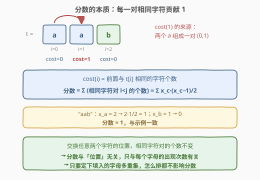
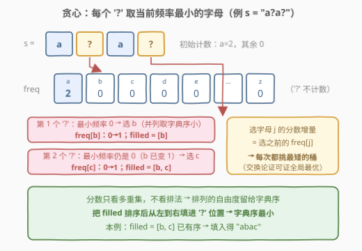
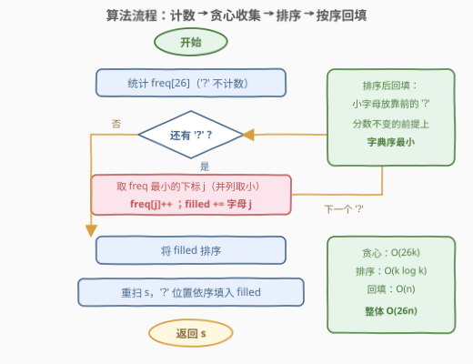
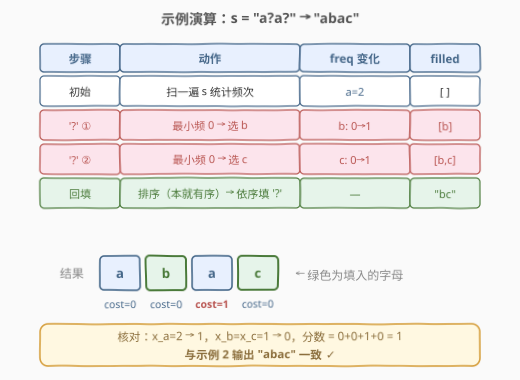

# 替换字符串中的问号使分数最小

- **题目名称**：替换字符串中的问号使分数最小
- **链接**：[3081. 替换字符串中的问号使分数最小](https://leetcode.cn/problems/replace-question-marks-in-string-to-minimize-its-value/)
- **难度**：中等
- **标签**：贪心，哈希表，字符串，计数，排序，堆（优先队列）

## 1. 题目概述

给你一个字符串 `s`，其中 `s[i]` 要么是小写英文字母，要么是问号 `'?'`。

对于长度为 $m$ 且**只含小写英文字母**的字符串 `t`，定义函数 $cost(i)$ 为下标 $i$ 之前（范围 $[0, i-1]$ 中）出现过的与 $t[i]$ **相同**字符的次数。字符串 `t` 的**分数**为所有下标 $i$ 的 $cost(i)$ 之和。

比如 `t = "aab"`：$cost(0)=0$、$cost(1)=1$、$cost(2)=0$，分数为 $0+1+0=1$。

任务：用小写英文字母替换 `s` 中**所有**问号，使 `s` 的**分数最小**。返回替换后分数最小的字符串；若有多个分数最小的字符串，返回**字典序最小**的一个。

**示例 1**：

```text
输入：s = "???"
输出："abc"
解释："abc" 每个位置的 cost 均为 0，分数 0；同为 0 分的还有 "cba"、"abz" 等，返回字典序最小的 "abc"。
```

**示例 2**：

```text
输入：s = "a?a?"
输出："abac"
解释："abac" 的 cost 依次为 0, 0, 1, 0，分数 1；不存在分数更小的填法，且 "abac" 是字典序最小的。
```

**约束条件**：

- $1 \le \text{s.length} \le 10^5$
- `s[i]` 要么是小写英文字母，要么是 `'?'`

> ⚠️ 读题两个坑：其一，$cost(i)$ 数的是**之前**出现过的相同字符，不含 $i$ 自身；其二，答案是**双目标**——先分数最小、并列时字典序最小，只顾分数会翻车。

---

## 2. 解题思路

### 2.1 暴力思路

枚举每个 `'?'` 填 26 个字母的所有组合——$26^k$ 种（$k$ 为问号个数），$k$ 可达 $10^5$，指数级直接爆炸。哪怕只求分数最小（不管字典序），也可以把问题当「把 $k$ 个球放进 26 个桶」的分配问题，但双目标叠加后没有直接的组合公式可套。

退一步想：分数的定义是逐位置的，看起来和排列方式强相关；但如果能证明**分数只依赖每个字母的出现次数**，问题就从「排列组合」塌缩成「计数分配」——这正是本题的突破口。

### 2.2 核心观察：分数 = 相同字符对数，与位置无关 + 贪心选最矮桶



**观察一：分数只依赖频次，不依赖位置。**

把 $cost(i)$ 逐项拆开：$cost(i)$ 数的是满足 $j<i$ 且 $t[j]=t[i]$ 的下标 $j$ 的个数。对整个求和，每一对满足 $j<i,\ t[j]=t[i]$ 的下标对 $(j,i)$ 恰好贡献 $1$。所以：

$$\text{分数}(t)=\#\{(j,i): j<i,\ t[j]=t[i]\}=\sum_{c}\binom{x_c}{2}=\sum_{c}\frac{x_c\,(x_c-1)}{2}$$

其中 $x_c$ 是字母 $c$ 的出现次数（$c$ 的每两处出现构成一对）。**交换任意两个字符的位置，配对数不变**——分数只由「每个字母各出现几次」这个多重集决定，与它们排在哪些位置毫无关系。

> 💡 这一转化把问题劈成两半：**填哪些字母**（决定分数）与**怎么排**（不影响分数，留给字典序自由发挥）。



**观察二：每个 `'?'` 贪心取当前频率最小的字母。**

设已确定部分的频次为 $\text{freq}[\cdot]$，再填一个字母 $j$ 会使分数增加 $\text{freq}[j]$（它与此前的每个同字母两两配对）。要让总分数最小，每一步都应把增量压到最低——**选当前 $\text{freq}$ 最小的字母**，选完后 $\text{freq}[j]$ 加一。并列时取字典序小的字母（交换论证：把某个选择换成更小的字母，最终多重集排序回填后的串字典序不增，分数不变）。

**观察三：排序后从左到右回填，字典序最小。**

由观察一，`'?'` 位置填哪些字母一旦定下（多重集 `filled`），怎么排都不影响分数。要让结果字典序最小，就把 `filled` **排序**，然后重扫 `s`，按顺序把最小的字母放进最靠前的 `'?'`。注意 `filled` 里可能有重复字母（比如 10 个 `'?'` 全填 `a` 的情况），排序后依序放入即可。

### 2.3 算法流程图



流程一句话：统计 26 字母频次（`'?'` 跳过）→ 对每个 `'?'` 取当前 $\text{freq}$ 最小的字母（并列取小），频次加一并收集到 `filled` → `filled` 排序 → 重扫 `s`，`'?'` 位置依序填入 → 返回。选最小频次那步可以每步暴力扫 26 个桶，也可以用小根堆，二者复杂度同阶。

### 2.4 示例演算



以 `s = "a?a?"` 走一遍：初始 $\text{freq}[a]=2$ 其余 0。第 1 个 `'?'`：最小频 0，并列中字典序最小是 `b`，$\text{freq}[b]$ 变 1，`filled=[b]`；第 2 个 `'?'`：最小频仍是 0（`b` 已是 1），选 `c`，`filled=[b,c]`。排序（本就有序）后回填两个 `'?'` 位置，得 `"abac"`。核对：$x_a=2\to 1$，$x_b=x_c=1\to 0$，分数 $1$，与示例一致。再看 `"???"`：依次选 `a`、`b`、`c`（每次都把最小桶抬高一格），回填得 `"abc"`，分数 0 且字典序最小。

---

## 3. 参考代码

### C++（暴力扫 26 桶版）

```cpp
class Solution {
  public:
    string minimizeStringValue(string s) {
        array<int, 26> freq{};
        for (char c : s)
            if (c != '?') freq[c - 'a']++;

        string filled;                       // 记录所有 '?' 要填入的字母（未排序）
        for (char c : s)
            if (c == '?') {
                int best = 0;                // 从小到大扫，严格小于才更新 → 并列取字典序小
                for (int j = 1; j < 26; ++j)
                    if (freq[j] < freq[best]) best = j;
                freq[best]++;
                filled += char('a' + best);
            }
        sort(filled.begin(), filled.end());

        for (int i = 0, j = 0; i < (int)s.size(); ++i)
            if (s[i] == '?') s[i] = filled[j++];
        return s;
    }
};
```

### Python

```python
class Solution:
    def minimizeStringValue(self, s: str) -> str:
        freq = [0] * 26
        for c in s:
            if c != '?':
                freq[ord(c) - 97] += 1

        filled = []
        for c in s:
            if c == '?':
                j = min(range(26), key=lambda x: (freq[x], x))  # 频次最小，并列取小
                freq[j] += 1
                filled.append(chr(97 + j))
        filled.sort()

        res = []
        it = iter(filled)
        for c in s:
            res.append(next(it) if c == '?' else c)
        return ''.join(res)
```

> 💡 两个实现细节：① 挑最小桶时**并列取字典序小的字母**，这是字典序最优的一部分（配合排序回填）；② 回填用双指针/迭代器依序取，别对每个 `'?'` 再做 `min`，那会把复杂度乘上 26。

---

## 4. 复杂度分析

| 维度 | 复杂度 | 说明 |
|------|--------|------|
| 时间复杂度 | $O(26\,n)$ | 计数 $O(n)$；贪心每个 `'?'` 扫 26 桶共 $O(26k)$；排序 $O(k\log k)$（或对 26 字母计数排序 $O(26+k)$）；回填 $O(n)$；$k \le n$，总体 $O(26n)$，$n \le 10^5$ 时约 $2.6\times 10^6$ 次基本操作 |
| 空间复杂度 | $O(n)$ | `filled` 最多存 $k \le n$ 个字母（排序若用计数排序则额外空间 $O(26)$）；返回串本身 $O(n)$ |

---

## 5. 扩展：小根堆版与「灌水」均摊

**小根堆版**：把 $(\text{freq}, c)$ 压入小根堆，每个 `'?'` 弹堆顶、频次加一、推回去，$k$ 次操作 $O(k\log 26)$，与暴力扫 26 桶同阶但代码更具「贪心气质」：

```cpp
priority_queue<pair<int, char>, vector<pair<int, char>>, greater<>> pq;
for (int j = 0; j < 26; ++j) pq.push({freq[j], char('a' + j)});
// 每个 '?' ：auto [f, c] = pq.top(); pq.pop(); pq.push({f + 1, c}); filled += c;
```

**进一步 $O(n + 26\log 26)$**：其实不必逐个 `'?'` 模拟。$k$ 个问号等价于「灌水」——把所有桶抬到某个公共水位线，剩余名额再从 `a` 到 `z` 依次分发（每次发给最矮且字典序最小的桶，与逐步贪心完全等价）。先排序 26 个初始频次，二分或线性求出水位线与余数即可 $O(26\log 26)$ 定出每个字母的最终增量，再展开成 `filled` 字符序列。$n \le 10^5$ 时暴力 26 桶已绰绰有余，此优化仅作思维延伸。

---

## 6. 面试要点

1. **为什么分数与字符位置无关？**

   - $cost(i)$ 逐项求和后，每一对满足 $j<i$、$t[j]=t[i]$ 的下标对恰贡献 $1$，总分 $=\sum_c x_c(x_c-1)/2$ 只含频次 $x_c$。交换位置不改变配对数，故分数只由字符多重集决定。

2. **贪心「每次选最低频字母」为什么正确？**

   - 增量视角：向频次为 $f_j$ 的字母 $j$ 再放一个字符，分数恰好增加 $f_j$。最小化每步增量即每步取最矮桶；交换论证——若最优解某步选了较高桶，与更低桶互换后各步增量不增、总数不变，故贪心可达最优。

3. **字典序最小是怎么保证的？两处配合缺一不可？**

   - 是。① 选字母时**并列取字典序小的**，保证 `filled` 多重集本身最优；② `filled` **排序后依序回填** `'?'` 位置，保证最靠前的问号拿到最小的字母。只做 ② 不做 ①，`"a?"`（初始 $\text{freq}[b]=\text{freq}[c]=0$）可能填出 `"ac"` 而非 `"ab"`。

4. **时间与空间复杂度是多少？**

   - 暴力 26 桶版时间 $O(26n)$、堆版 $O(n + k\log 26)$；空间 $O(n)$ 存 `filled` 与结果串（计数排序版辅助空间 $O(26)$）。

5. **变体追问：若 cost 定义改成「整个串中与 $t[i]$ 相同的字符个数」（含自身）呢？**

   - 那么每个位置的 cost 变为 $x_{t[i]}$，总分 $=\sum_c x_c^2$，仍是纯频次函数，位置依旧无关；贪心的增量变为 $2f_j+1$，仍随 $f_j$ 单调，所以「每次选最矮桶 + 排序回填」的策略原封不动成立。

---

## 7. 同类练习题

- [1647. 字符频次唯一的最小删除次数](https://leetcode.cn/problems/minimum-deletions-to-make-character-frequencies-unique/)：同为「分数只看频次」的转化，贪心调整各字母频次
- [621. 任务调度器](https://leetcode.cn/problems/task-scheduler/)：按频次贪心构造排列，练「频次视角 + 构造」组合拳
- [767. 重构字符串](https://leetcode.cn/problems/reorganize-string/)：小根堆按频率贪心放置，本题堆版解法的近亲
- [1702. 修改后的最大二进制字符串](https://leetcode.cn/problems/maximum-binary-string-after-change/)：字典序目标下的贪心构造，对照「排序回填锁字典序」的思路
