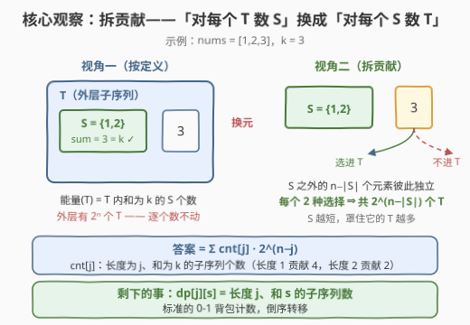
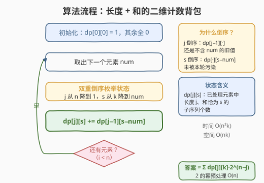

# LeetCode 求出所有子序列的能量和 题解

## 1. 题目概述

- **标题 / 题号**：求出所有子序列的能量和（#3082，hard）
- **链接**：https://leetcode.cn/problems/find-the-sum-of-the-power-of-all-subsequences/
- **难度**：困难
- **标签**：数组、动态规划、0-1 背包

**题意**：给你一个长度为 $n$ 的整数数组 `nums` 和一个**正**整数 $k$。

一个整数数组的**能量**定义为和**等于** $k$ 的子序列的数目。

请你返回 `nums` 中**所有子序列**的**能量和**。由于答案可能很大，请将它对 $10^9 + 7$ **取余**后返回。

> 💡 注意双重嵌套：「能量」本身已经是「子序列的计数」，而要求的又是「对所有子序列求能量之和」——相当于数的是**子序列对的个数**：外层子序列 $T$ 与内层子序列 $S \subseteq T$，且 $\text{sum}(S) = k$。

**示例 1**：

```text
输入：nums = [1,2,3], k = 3
输出：6
解释：能量非 0 的子序列共 5 个：[1,2,3] 能量为 2，[1,2]、[1,3]、[2,3]、[3] 能量均为 1，
合计 2 + 1 + 1 + 1 + 1 = 6。
```

**示例 2**：

```text
输入：nums = [2,3,3], k = 5
输出：4
解释：[2,3,3] 能量为 2（两个 3 任选其一），[2,3]（两种取法）能量均为 1，合计 2 + 1 + 1 = 4。
```

**示例 3**：

```text
输入：nums = [1,2,3], k = 7
输出：0
解释：不存在和为 7 的子序列，所有子序列能量均为 0。
```

**约束**：

- $1 \le n \le 100$
- $1 \le \text{nums}[i] \le 10^4$
- $1 \le k \le 100$

## 2. 解题思路

### 2.1 暴力思路

最直接的做法是老老实实按定义双层枚举：外层枚举 $2^n$ 个子序列 $T$，内层再枚举 $T$ 的 $2^{|T|}$ 个子序列 $S$ 统计和为 $k$ 的个数。等价地，每个元素有三种状态（不进 $T$ / 进 $T$ 不进 $S$ / 进 $T$ 且进 $S$），总量 $O(3^n)$。在 $n \le 100$ 下 $3^n$ 是天文数字，连外层的 $2^{100} \approx 10^{30}$ 都无法枚举，暴力必死。

突破口在于换一个数的东西：**别对每个 $T$ 数它内部的 $S$，而是对每个 $S$ 数包含它的 $T$**。

### 2.2 核心观察：拆贡献——长度为 $j$ 的子序列贡献 $2^{n-j}$



答案是一个双重计数，**交换求和顺序**（换元）：

$$
\text{答案} \;=\; \sum_{T}\; \#\{S \subseteq T : \text{sum}(S)=k\} \;=\; \sum_{S:\,\text{sum}(S)=k}\; \#\{T \supseteq S\}
$$

固定一个和为 $k$ 的子序列 $S$，有多少个外层子序列 $T$ 包含它？$T$ 只需把 $S$ 全收进来，剩下的 $n - |S|$ 个元素**每个都可选 / 可不选**，互不干扰——共 $2^{n-|S|}$ 个。

> 💡 **一句话**：长度为 $j$、和为 $k$ 的子序列，对答案的贡献是 $2^{n-j}$；长度越短，能「罩住」它的外层子序列越多。

于是问题被还原成一个纯计数背包：**统计长度为 $j$、和为 $k$ 的子序列个数 $\text{cnt}[j]$**，则

$$
\text{答案} \;=\; \sum_{j=1}^{n} \text{cnt}[j] \cdot 2^{\,n-j}
$$

用 $k \le 100$ 这条约束卡状态：定义二维 0-1 背包

$$dp[j][s] = \text{已处理元素中，长度为 } j \text{、元素和恰为 } s \text{ 的子序列个数}$$

初始 $dp[0][0] = 1$（空序列），每来一个元素 `num`，转移为「不选 / 选」两分支的计数版：

$$dp[j][s] \mathrel{+}= dp[j-1][s-\text{num}]$$

### 2.3 算法流程图



结构与经典 0-1 背包完全同构，只是把「最大价值」换成了「方案数」，并多出一维长度：

1. 初始化 $dp[0][0] = 1$，其余为 0；
2. 逐个处理元素 `num`：**长度 $j$ 从大到小**、**和 $s$ 从 $k$ 到 `num` 从大到小**（双重倒序，保证读到的 $dp[j-1][s-\text{num}]$ 是未处理当前元素的旧值）；
3. 全部处理完后，按 $\sum_j dp[j][k] \cdot 2^{n-j}$ 聚合答案（2 的幂可预处理）。

### 2.4 示例演算

![示例演算：nums=[1,2,3], k=3 的 dp 表变化](../images/p3082_example_walkthrough.svg)

以示例 1 `nums = [1,2,3]`，$k = 3$ 演算（只列出非全零行；下标为和 $s$）：

| 处理元素 | $dp[1][0..3]$ | $dp[2][0..3]$ | 新产生的子序列 |
|----------|---------------|---------------|----------------|
| （初始） | $[0,0,0,0]$ | $[0,0,0,0]$ | $dp[0][0]=1$ |
| $+1$ | $[0,1,0,0]$ | $[0,0,0,0]$ | $\{1\}$ |
| $+2$ | $[0,1,1,0]$ | $[0,0,0,1]$ | $\{2\}$、$\{1,2\}$（和恰为 3！）|
| $+3$ | $[0,1,1,1]$ | $[0,0,0,1]$ | $\{3\}$；$dp[2][3]$ 需要补 $dp[1][0]=0$，不变 |

收尾聚合：$\text{cnt}[1] = dp[1][3] = 1$（即 $\{3\}$），$\text{cnt}[2] = dp[2][3] = 1$（即 $\{1,2\}$），$\text{cnt}[3] = dp[3][3] = 0$：

$$\text{答案} = 1 \times 2^{3-1} + 1 \times 2^{3-2} + 0 = 4 + 2 = 6 \;✓$$

## 3. 参考代码

### C++

```cpp
class Solution {
  public:
    int sumOfPower(vector<int>& nums, int k) {
        const int MOD = 1'000'000'007;
        int n = nums.size();
        // dp[j][s]：已处理元素中，长度为 j、和为 s 的子序列个数
        vector<vector<int>> dp(n + 1, vector<int>(k + 1, 0));
        dp[0][0] = 1;
        for (int num : nums) {
            for (int j = n; j >= 1; j--) {              // 长度倒序：每个元素只用一次
                for (int s = k; s >= num; s--) {        // 和倒序：同 0-1 背包
                    dp[j][s] = (dp[j][s] + dp[j - 1][s - num]) % MOD;
                }
            }
        }
        vector<int> pow2(n + 1, 1);                     // 预处理 2 的幂
        for (int i = 1; i <= n; i++) pow2[i] = 2LL * pow2[i - 1] % MOD;
        long long ans = 0;
        for (int j = 1; j <= n; j++)                    // 长度 j 的子序列贡献 2^(n-j)
            ans = (ans + 1LL * dp[j][k] * pow2[n - j]) % MOD;
        return ans;
    }
};
```

### Python

```python
class Solution:
    def sumOfPower(self, nums: List[int], k: int) -> int:
        MOD = 10**9 + 7
        n = len(nums)
        # dp[j][s]：已处理元素中，长度为 j、和为 s 的子序列个数
        dp = [[0] * (k + 1) for _ in range(n + 1)]
        dp[0][0] = 1
        for num in nums:
            for j in range(n, 0, -1):              # 长度倒序：每个元素只用一次
                for s in range(k, num - 1, -1):    # 和倒序：同 0-1 背包
                    dp[j][s] = (dp[j][s] + dp[j - 1][s - num]) % MOD
        return sum(dp[j][k] * pow(2, n - j, MOD) for j in range(1, n + 1)) % MOD
```

## 4. 复杂度分析

| 维度 | 复杂度 | 说明 |
|------|--------|------|
| 时间复杂度 | $O(n^2 k)$ | $n$ 个元素 × 长度 $j \le n$ × 和 $s \le k$；$n, k \le 100$ 时约 $10^6$ 次转移 |
| 空间复杂度 | $O(nk)$ | 二维 dp 表 $(n+1) \times (k+1)$；另有 $O(n)$ 的 2 的幂表 |

## 5. 扩展：一维滚动——把 $2^{n-j}$ 「边走边乘」进状态

其实 $2^{n-j}$ 不必留到最后再乘：把它吸收进 dp 的定义，就能砍掉长度维。

设一维数组 $dp[s] = \sum_{S:\,\text{sum}(S)=s} 2^{\,\text{已处理元素数} - |S|}$，即「每个和为 $s$ 的子序列带上自己的超集个数」。处理新元素 `num` 时，每个已有方案面临两个分支：

- **不把 num 收进 $S$**：num 仍可进 / 不进外层 $T$，所有计数**翻倍**；
- **把 num 收进 $S$**：和从 $s-\text{num}$ 迁移到 $s$，继承旧值（长度 +1 与已处理 +1 抵消，指数不变）。

$$dp[s] \;\leftarrow\; 2 \cdot dp[s] + dp[s - \text{num}]$$

```python
class Solution:
    def sumOfPower(self, nums: List[int], k: int) -> int:
        MOD = 10**9 + 7
        dp = [0] * (k + 1)          # dp[s] = Σ 2^(已处理数-|S|)，S 为和等于 s 的子序列
        dp[0] = 1
        for num in nums:
            for s in range(k, num - 1, -1):      # 倒序：dp[s-num] 保持旧值
                dp[s] = (dp[s] * 2 + dp[s - num]) % MOD
            for s in range(min(num - 1, k), -1, -1):  # 和选不上 num 的：只翻倍
                dp[s] = dp[s] * 2 % MOD
        return dp[k]
```

时间降到 $O(nk)$，空间 $O(k)$。

> ⚠️ 两个细节：① 第二段循环（纯翻倍）的上界是 $\min(\text{num}-1,\, k)$——当 $\text{num} > k$ 时 $s$ 只能取到 $k$，越界会下标错误；② 顺序必须「先倒序迁移、再翻倍低位」，若先翻倍会把 $dp[s-\text{num}]$ 也翻进去，重复计算。

## 6. 面试要点

1. **为什么暴力不可行，正确突破口是什么？**

   - 按定义双层枚举是 $O(3^n)$（每元素三状态），$n \le 100$ 必然超时。突破口是**拆贡献 / 交换求和顺序**：把「对每个 $T$ 数内部的 $S$」换成「对每个 $S$ 数罩住它的 $T$」，后者是组合数 $2^{n-|S|}$，直接闭式给出。

2. **$2^{n-j}$ 的组合意义是什么？**

   - 固定长度 $j$、和为 $k$ 的子序列 $S$ 后，$S$ 以外的 $n-j$ 个元素彼此独立地决定「进 / 不进外层子序列 $T$」，共 $2^{n-j}$ 种——所以短子序列贡献反而更大。

3. **dp 的两重倒序分别在防什么？**

   - 与 0-1 背包一维化同理：$j$ 倒序保证 $dp[j-1][\cdot]$ 是未包含当前元素的旧值（每个元素至多选一次）；$s$ 倒序保证 $dp[\cdot][s-\text{num}]$ 尚未被本轮更新。任何一个改为正序，就退化成「可重复选取」的完全背包计数。

4. **为什么必须逐步取模？**

   - 方案数上界是 $\binom{100}{50} \approx 10^{29}$，远超 64 位整数；C++ 中间乘法（如 $dp[j][k] \times pow2[n-j]$）要先用 `long long` 中转再取模。

5. **和 494 目标和的区别与联系？**

   - 494 也是「和为定值的子序列计数」0-1 背包，但只数一层；本题外面多套了一层「对所有子序列求和」的包装，需要先用拆贡献剥掉外壳，才能露出里面那个标准背包计数。另外 2915 与本题状态设计完全相同（长度 + 和），只是把计数改成了求最长——状态设计可复用，目标函数不同。

## 同类练习题

| # | 题目 | 与本题的关联 |
|---|------|-------------|
| 494 | [目标和](https://leetcode.cn/problems/target-sum/) | 0-1 背包计数的标准变体（± 号转选取），剥掉本题外壳后剩下的就是这类裸计数 |
| 2915 | [和为目标值的最长子序列的长度](https://leetcode.cn/problems/length-of-the-longest-subsequence-that-sums-to-target/) | 与本题共享「长度 + 和」二维背包状态，把计数换成求最长，对照体会目标函数之变 |
| 1155 | [掷骰子等于目标和的方法数](https://leetcode.cn/problems/number-of-dice-rolls-with-target-sum/) | 分组背包计数入门，状态同为「和」，每步候选是一个集合而非单个元素 |
| 2585 | [获得分数的方法数](https://leetcode.cn/problems/number-of-ways-to-earn-points/) | 分组背包计数进阶，多种题目类型各有限选次数，是 1155 的带容量版本 |
