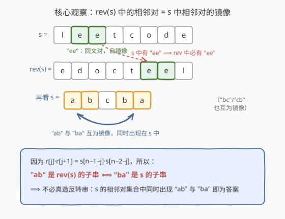
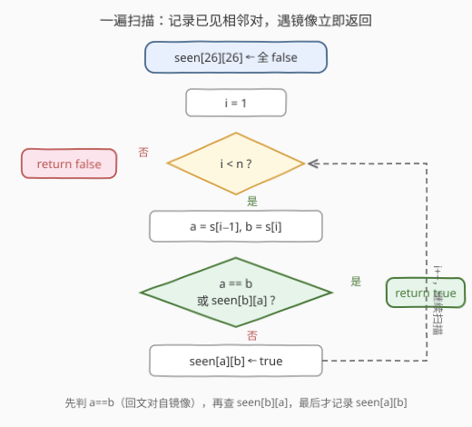
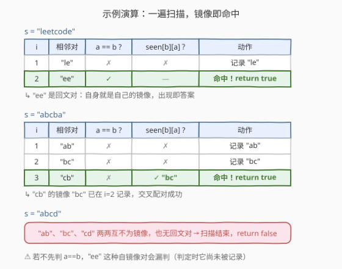

# 字符串及其反转中是否存在同一子字符串

- **题目名称**：字符串及其反转中是否存在同一子字符串
- **链接**：[3083. 字符串及其反转中是否存在同一子字符串](https://leetcode.cn/problems/existence-of-a-substring-in-a-string-and-its-reverse/)
- **难度**：简单
- **标签**：哈希表，字符串

## 1. 题目概述

给你一个字符串 `s`，请你判断字符串 `s` 是否存在一个**长度为 2** 的子字符串，在 `s` **反转后的字符串**中也出现。

如果存在这样的子字符串，返回 `true`；如果不存在，返回 `false`。

**示例 1**：

```text
输入：s = "leetcode"
输出：true
解释：子字符串 "ee" 的长度为 2，它也出现在 reverse(s) == "edocteel" 中。
```

**示例 2**：

```text
输入：s = "abcba"
输出：true
解释：所有长度为 2 的子字符串 "ab"、"bc"、"cb"、"ba" 也都出现在 reverse(s) == "abcba" 中。
```

**示例 3**：

```text
输入：s = "abcd"
输出：false
解释：字符串 s 中不存在满足「在其反转后的字符串中也出现」且长度为 2 的子字符串。
```

**约束条件**：

- $1 \le \text{s.length} \le 100$
- 字符串 `s` 仅由小写英文字母组成

> 💡 读题关键：问的不是「回文子串」，而是「某个长度 2 子串既在 `s` 里，也在 `reverse(s)` 里」。`s` 与 `reverse(s)` 共享的是**字符多元组集合的镜像**，这是全题的突破口。

---

## 2. 解题思路

### 2.1 暴力思路

按题面直接模拟：先构造 `rev = reverse(s)`，再枚举 `s` 的每个长度 2 子串 `s[i:i+2]`，判断它是否为 `rev` 的子串（`rev.find()` / `in`）。

```python
class Solution:
    def isSubstringPresent(self, s: str) -> bool:
        rev = s[::-1]
        return any(s[i:i + 2] in rev for i in range(len(s) - 1))
```

枚举 $O(n)$ 个子串、每次子串匹配 $O(n)$，总时间 $O(n^2)$。$n \le 100$ 时毫无压力，但这个写法**完全没有利用反转的结构性质**——面试中说出它只是为了引出下面的观察。

### 2.2 核心观察：镜像二元组——不必真造反转串



设 $r = \text{reverse}(s)$，则 $r[j] = s[n-1-j]$。于是 $r$ 的每个长度 2 子串满足：

$$r[j]\,r[j+1] \;=\; s[n-1-j]\,s[n-2-j]$$

也就是说，$r$ 里的每个相邻对 $(x, y)$，恰好是 $s$ 里某个相邻对 $(y, x)$ 的**镜像**（顺序颠倒）。反之，$s$ 的每个相邻对镜像后也出现在 $r$ 中。于是得到等价刻画：

$$\text{"ab" 是 } r \text{ 的子串} \iff \text{"ba" 是 } s \text{ 的子串}$$

> 💡 **问题转化**：原条件「子串 $ab$ 既在 $s$ 中，也在 $r$ 中」等价于——**$s$ 的相邻对集合中，"ab" 与 "ba" 同时出现**（特别地，"aa" 这类回文对自镜像，出现即满足）。

字母表只有 26 个小写字母，长度 2 的二元组共 $26^2 = 676$ 种，可用 `bool seen[26][26]`（或编码 $a \times 26 + b$ 的位掩码）做 $O(1)$ 的记录与查询，**根本不需要显式构造反转串**。

### 2.3 算法流程图



一遍扫描，对每个相邻对 $(a, b) = (s[i-1], s[i])$ 依次判定：

1. **$a = b$**：回文对自镜像，直接返回 `true`；
2. **$\text{seen}[b][a]$ 为真**：镜像对已在左侧出现过，返回 `true`；
3. 否则记录 $\text{seen}[a][b] = \text{true}$，继续右移。

> ⚠️ 顺序不能颠倒：必须**先判定、后记录**，且 $a=b$ 要单独前置判断——否则 "ee" 这种自镜像对在判定时自己还没进表，会被漏判（示例 1 恰好是这种情形）。

### 2.4 示例演算



- `s = "leetcode"`：$i=1$ 记录 "le"；$i=2$ 遇到 $(e,e)$，$a=b$ 命中，返回 **true**；
- `s = "abcba"`：依次记录 "ab"、"bc"；$i=3$ 遇到 $(c,b)$，查 $\text{seen}[b][a] = \text{seen}[b][c]$，即镜像 "bc" 已记录，返回 **true**；
- `s = "abcd"`："ab"、"bc"、"cd" 两两互不为镜像，也无回文对，扫描结束返回 **false**。

---

## 3. 参考代码

### C++（一遍扫描 + 二维布尔表）

```cpp
class Solution {
  public:
    bool isSubstringPresent(string s) {
        bool seen[26][26] = {};
        for (int i = 1; i < (int)s.size(); ++i) {
            int a = s[i - 1] - 'a', b = s[i] - 'a';
            if (a == b || seen[b][a]) return true;
            seen[a][b] = true;
        }
        return false;
    }
};
```

### Python（一遍扫描 + 集合）

```python
class Solution:
    def isSubstringPresent(self, s: str) -> bool:
        seen = set()
        for a, b in zip(s, s[1:]):
            if a == b or b + a in seen:
                return True
            seen.add(a + b)
        return False
```

### Python（先建集合再查镜像，两阶段写法）

```python
class Solution:
    def isSubstringPresent(self, s: str) -> bool:
        seen = {s[i:i + 2] for i in range(len(s) - 1)}
        return any(p[::-1] in seen for p in seen)
```

> 💡 两阶段写法不需要特判 $a=b$：集合先**完整建好**再查询，"ee" 进集合后查它自己的镜像（还是 "ee"）自然命中。特判只在「边扫边记」的一遍扫描版里必需——这是一个很典型的「判定时机与数据完备性」的细节。

---

## 4. 复杂度分析

| 维度 | 复杂度 | 说明 |
|------|--------|------|
| 时间复杂度 | $O(n)$ | 一遍扫描，每个相邻对做 $O(1)$ 的查表与记录；$n \le 100$ 实际是常数级 |
| 空间复杂度 | $O(1)$ | `bool[26][26]` 固定 676 个布尔，与 $n$ 无关；Python 集合版至多存 $\min(n-1, 676)$ 个二元组，仍是常数上界 |

---

## 5. 扩展：推广到长度为 k 的子串

把「长度 2」换成任意长度 $k$，镜像刻画依然成立：

$$\text{"}t\text{" 是 } \text{reverse}(s) \text{ 的子串} \iff \text{reverse}(t) \text{ 是 } s \text{ 的子串}$$

解法同构：把 $s$ 的每个长度 $k$ 子串塞进哈希集合，再检查是否存在某个子串的**反序串**也在集合中，时间 $O(nk)$、空间 $O(nk)$。当 $k$ 较大时可用**滚动哈希**（正反双向滚动）把单次操作压到 $O(1)$，思路与 [187. 重复的DNA序列](https://leetcode.cn/problems/repeated-dna-sequences/) 的 2 位编码完全一致。

另一个小技巧：676 个二元组可以压进一个 676 bit 的整数（两个 64 位字或 `__int128`），`mask |= 1ULL << (a * 26 + b)` 记录、`(mask >> (b * 26 + a)) & 1` 查询，省掉二维数组，在嵌入式/竞赛场景偶尔有用。

---

## 6. 面试要点

1. **为什么不需要真的构造反转串？**

   - 反转只改变下标方向：$r[j]r[j+1] = s[n-1-j]\,s[n-2-j]$，即 $r$ 的相邻对集合是 $s$ 的相邻对集合的**逐对镜像**。因此「长度 2 子串在两边都出现」等价于「$s$ 的相邻对集合中同时存在 "ab" 与 "ba"」。

2. **"aa" 这样的回文对为什么特殊？如何处理？**

   - 它的镜像就是自己，出现即满足条件。两阶段写法（先建全集合再查）天然覆盖；一遍扫描写法必须在记录前先判 $a=b$，否则查询时自己尚未入表会漏判。

3. **seen 表为什么开 26×26 就够？**

   - 长度 2 且字母表为 26 的小写字母，二元组总数 $26^2=676$，是常数；用 `bool[26][26]` 或位掩码均可，空间 $O(1)$。

4. **时间与空间复杂度是多少？**

   - $O(n)$ 时间：每个相邻对 $O(1)$ 判定；$O(1)$ 空间：布尔表大小只依赖字母表，与 $n$ 无关（Python 集合版上界 676 个元素，同样常数）。

5. **变体追问：若子串长度改为 $k$，或字母表改为任意字符，怎么改？**

   - 长度 $k$：哈希集合存长度 $k$ 子串，检查反序串是否也在集合中，$O(nk)$；大 $k$ 用正反双向滚动哈希降到 $O(n)$。任意字符集：把字符映射成整数 ID（哈希或数组映射）后同理，空间上界变为 $|\Sigma|^2$（或用哈希集合避免开满）。

---

## 7. 同类练习题

- [344. 反转字符串](https://leetcode.cn/problems/reverse-string/)：手撕反转，理解 $r[j] = s[n-1-j]$ 下标映射的基础
- [187. 重复的DNA序列](https://leetcode.cn/problems/repeated-dna-sequences/)：定长子串 + 哈希集合（编码/滚动哈希），本题扩展节的加长版
- [28. 找出字符串中第一个匹配项的下标](https://leetcode.cn/problems/find-the-index-of-the-first-occurrence-in-a-string/)：子串包含判定的通用形态（暴力 $O(nm)$ / KMP）
- [796. 旋转字符串](https://leetcode.cn/problems/rotate-string/)：另一类「字符串变换后的包含/相等」判定，同练变换等价性观察
- [804. 唯一摩尔斯密码词](https://leetcode.cn/problems/unique-morse-code-words/)：词 → 编码串 → 哈希集合去重，巩固「小字母表 + 集合」的签到套路
