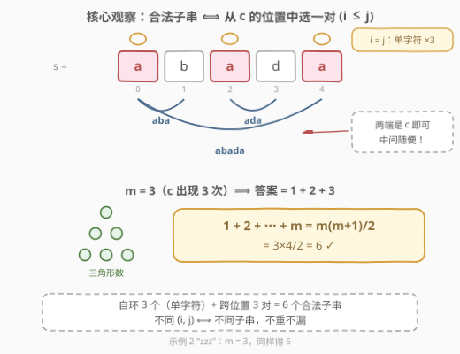
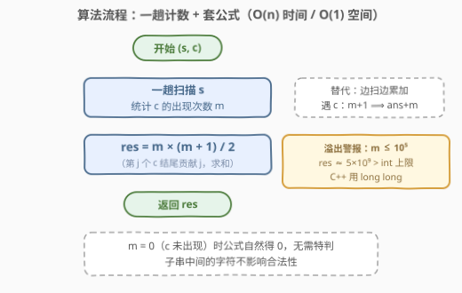
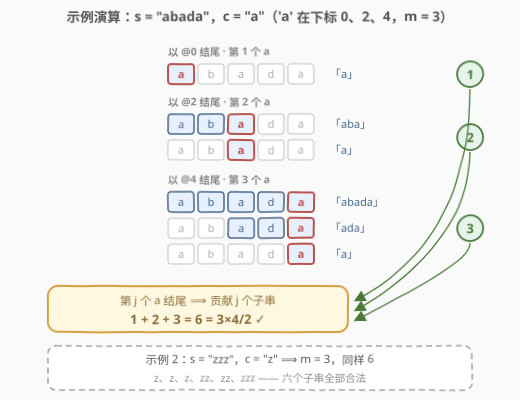

# LeetCode 统计以给定字符开头和结尾的子字符串总数 题解

## 1. 题目概述

- **标题 / 题号**：统计以给定字符开头和结尾的子字符串总数（#3084，medium）
- **链接**：https://leetcode.cn/problems/count-substrings-starting-and-ending-with-given-character/
- **难度**：中等
- **标签**：数学、字符串、计数、哈希表

**题意**：给你一个字符串 `s` 和一个字符 `c`。返回 `s` 中以 `c` **开头**且以 `c` **结尾**的**非空子字符串**总数。

子字符串是字符串中连续的非空字符序列。注意：单个字符 `c` 本身既是开头也是结尾，天然算一个合法子串。

**示例 1**：

```text
输入：s = "abada", c = "a"
输出：6
解释：以 "a" 开头和结尾的子字符串有 6 个：
"a"（下标 0）、"aba"、"abada"、
"a"（下标 2）、"ada"、"a"（下标 4）。
```

**示例 2**：

```text
输入：s = "zzz", c = "z"
输出：6
解释：s 共有 6 个子字符串，它们全部以 "z" 开头和结尾。
```

**约束**：

- $1 \le \text{s.length} \le 10^5$
- `s` 和 `c` 均由小写英文字母组成。

> ⚠️ 读题陷阱：一是 $n$ 可达 $10^5$，$O(n^2)$ 枚举约 $5\times10^9$ 个子串必超时；二是 `s` 全为 `c` 时答案约 $5\times10^9$，**超出 32 位 int 上界**（$2^{31}-1 \approx 2.1\times10^9$），C++ 必须用 `long long`。

## 2. 解题思路

### 2.1 暴力思路：枚举首尾

最直白的做法是两层循环枚举所有子串 `s[l..r]`，判定 `s[l] == c && s[r] == c`。单次判定 $O(1)$，但 $n = 10^5$ 时子串总数约 $5\times10^9$，必然超时。

小优化：只有 `c` 的出现位置才可能当首尾，于是「枚举所有下标对」可以收缩为「枚举 c 的位置对」。但最坏情况 `s` 全是 `c`（如示例 2），位置数 $m = n$，仍是 $O(m^2) = O(n^2)$。要彻底解决，必须**换计数视角**——不枚举子串，而是数位置对。

### 2.2 核心观察：合法子串 ⟺ 从 c 的位置中选一对 (i ≤ j)



推理链只有三步：

1. 子串由首尾下标 $(l, r)$ **唯一确定**（$l \le r$）；
2. 合法当且仅当 `s[l] == c` 且 `s[r] == c`——**中间是什么字符完全无所谓**；
3. 因此每个合法子串 ⟺ 从 `c` 的出现位置集合 $\{p_1 < p_2 < \cdots < p_m\}$ 中选出一对 $(p_i, p_j)$（允许 $i = j$，对应单字符子串）。

「从 $m$ 个位置中选可重复的两个组成有序对 $i \le j$」正是**可重复组合**：

$$\binom{m+1}{2} = \frac{m(m+1)}{2}$$

拆开看更直观：$i < j$ 的对数是 $\binom{m}{2} = \frac{m(m-1)}{2}$（长度 $\ge 2$ 的子串），加上 $i = j$ 的 $m$ 个（单字符子串），合计 $\frac{m(m-1)}{2} + m = \frac{m(m+1)}{2}$。

> 💡 **一句话结论**：数出 `c` 在 `s` 中出现 $m$ 次，答案就是 $1 + 2 + \cdots + m = \frac{m(m+1)}{2}$。`c` 一次都不出现时 $m = 0$，公式自然给出 0，无需特判。

还有一个同样重要的**前缀视角**（2.4 的演算会用）：以第 $j$ 个 `c` 结尾的合法子串**恰好有 $j$ 个**——开头可以从第 $1 \sim j$ 个 `c` 中任选。对 $j$ 从 $1$ 到 $m$ 求和，同样是 $\frac{m(m+1)}{2}$。

### 2.3 算法流程：一趟计数 + 套公式



把结论翻译成算法只需两步：

1. **一趟扫描** `s`，统计 `c` 的出现次数 `m`（一个计数变量即可，无需建表）；
2. **套公式**返回 `m * (m + 1) / 2`。

> ⚠️ 溢出是本题最大的实现陷阱：$m \le 10^5 \Rightarrow \frac{m(m+1)}{2} \approx 5\times10^9 > 2^{31}-1$。C++ 中若 `m` 声明为 `int`，`m * (m + 1)` 在**乘法发生时**就已经溢出，必须让 `m` 本身是 `long long`（官方函数签名也返回 `long long`）；Python 原生大整数无此烦恼。

### 2.4 示例演算



以 `s = "abada"`, `c = "a"` 走一遍前缀视角。`'a'` 出现在下标 0、2、4，即 $m = 3$：

| 结尾位置 | 是第几个 a | 以它结尾的合法子串 | 贡献 |
|----------|-----------|--------------------|------|
| 下标 0 | 第 1 个 | `"a"` | 1 |
| 下标 2 | 第 2 个 | `"a"`、`"aba"` | 2 |
| 下标 4 | 第 3 个 | `"a"`、`"ada"`、`"abada"` | 3 |

合计 $1 + 2 + 3 = 6 = \frac{3\times4}{2}$，与示例 1 一致。示例 2 `"zzz"` 同理：$m = 3$，六个子串 `"z"`×3、`"zz"`×2、`"zzz"` 全部合法，答案同为 6。

## 3. 参考代码

### C++（count + long long）

```cpp
class Solution {
  public:
    long long countSubstrings(string s, char c) {
        long long m = count(s.begin(), s.end(), c);   // c 的出现次数
        return m * (m + 1) / 2;                       // 1 + 2 + ... + m
    }
};
```

### Python（str.count）

```python
class Solution:
    def countSubstrings(self, s: str, c: str) -> int:
        m = s.count(c)
        return m * (m + 1) // 2
```

逐位累加版（对应 2.4 的前缀视角，思路更能推广到变体）：

```python
class Solution:
    def countSubstrings(self, s: str, c: str) -> int:
        ans = m = 0
        for ch in s:
            if ch == c:
                m += 1        # ch 是第 m 个 c
                ans += m      # 以它结尾的合法子串恰有 m 个
        return ans
```

> 💡 三个版本复杂度同阶。`count` 版最短；逐位累加版把「按结尾位置拆贡献」写显式了，遇到变体（如 2083 任意字母版按字母分组求和）时直接照搬这个骨架即可。

## 4. 复杂度分析

| 维度 | 复杂度 | 说明 |
|------|--------|------|
| 时间复杂度 | $O(n)$ | 一趟扫描计数 $O(n)$，公式计算 $O(1)$，$n = \text{len}(s)$ |
| 空间复杂度 | $O(1)$ | 只需一个计数变量（26 桶计数表也视为常数空间） |

$n = 10^5$ 下线性扫描轻松通过；对比暴力的 $O(n^2) \approx 5\times10^9$ 次判定，快了 5 个数量级。

## 5. 扩展：任意字母版与变体速查

- **任意字母版（2083）**：若不限定字符 `c`，只要「首尾是**同一个**字母」即可，则对 26 个字母分别计数 $m_\alpha$，答案为 $\sum_{\alpha} \frac{m_\alpha(m_\alpha+1)}{2}$。本题就是其中单独一项。
- **要求长度 ≥ 2**：去掉 $i = j$ 的单字符贡献，答案变为 $\frac{m(m-1)}{2}$。
- **要求严格回文**：首尾同字符只是回文的**必要条件**，此时不能只看端点，需中心扩展或 Manacher（见 647）。
- **范式总结**：「频率 → 组合数」是配对计数题的通用套路——$i \le j$（允许相同）贡献 $\binom{m+1}{2}$，$i < j$（严格不同）贡献 $\binom{m}{2}$，遇到配对计数先想这两个公式。

## 6. 面试要点

1. **为什么合法子串和位置对 $(i \le j)$ 一一对应？**

   - 子串由 $(l, r)$ 唯一确定，合法 ⟺ `s[l]`、`s[r]` 都是 `c`，故 $l$、$r$ 必须取自 `c` 的位置集合并满足 $l \le r$；反过来任取这样一对位置就唯一还原一个合法子串。双向都成立，计数不重不漏。

2. **$\frac{m(m+1)}{2}$ 的两种推导方式？**

   - 组合视角：可重复选 2 个即 $\binom{m+1}{2}$，或拆成 $\binom{m}{2} + m$；前缀视角：第 $j$ 个 `c` 结尾贡献 $j$ 个子串，求和 $1+2+\cdots+m$。

3. **溢出点在哪？怎么防？**

   - $m \le 10^5$ 时答案约 $5\times10^9$，超 32 位 int。C++ 中 `int m` 执行 `m * (m + 1)` 在乘法时就溢出，必须让 `m` 为 `long long`（或先强制转换）；Python、Java（`long`）同理注意类型。

4. **`c` 不出现时需要特判吗？**

   - 不需要：$m = 0$ 时公式自然给出 0。逐位累加版同样返回 0，两版行为一致。

5. **和 1512 好数对的区别在哪？**

   - 1512 只数 $i < j$ 的严格对，每组频率贡献 $\binom{m}{2}$；本题允许 $i = j$（单字符子串），多出 $m$ 项。二者同属「频率 → 组合数」范式，先判清「允许配对自身吗」再套公式。

## 同类练习题

| # | 题目 | 与本题的关联 |
|---|------|-------------|
| 2083 | [求以相同字母开头和结尾的子串总数](https://leetcode.cn/problems/substrings-that-begin-and-end-with-the-same-letter/)（[题解](../2001-2100/2083_求以相同字母开头和结尾的子串总数.md)） | 本题的任意字母泛化版，对 26 个字母分别套 $\frac{m(m+1)}{2}$ 再求和 |
| 1512 | [好数对的数目](https://leetcode.cn/problems/number-of-good-pairs/)（[题解](../1501-1600/1512_好数对的数目.md)） | 同为「频率 → 组合数」计数，但只数 $i < j$，贡献 $\binom{m}{2}$ |
| 3042 | [统计前后缀下标对 I](https://leetcode.cn/problems/count-prefix-and-suffix-pairs-i/)（[题解](../3001-3100/3042_统计前后缀下标对I.md)） | 哈希分组后按对计数的字符串版，分组方式更花哨但配对本质相同 |
| 1010 | [总持续时间可被 60 整除的歌曲](https://leetcode.cn/problems/pairs-of-songs-with-total-durations-divisible-by-60/)（[题解](../1001-1100/1010_总持续时间可被60整除的歌曲对.md)） | 按余数分组再用组合数数对，配对计数经典应用 |
| 647 | [回文子串](https://leetcode.cn/problems/palindromic-substrings/)（[题解](../0601-0700/647_回文子串.md)） | 首尾同字符是回文的必要条件，从「必要条件计数」进阶到「完全回文计数」 |
