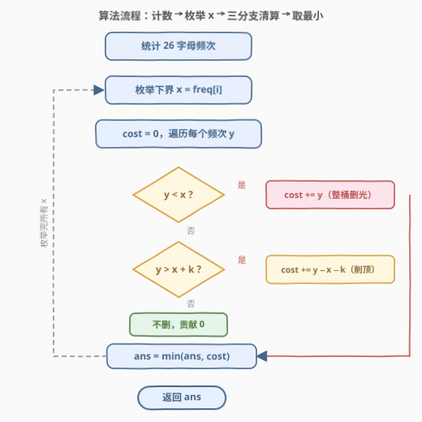
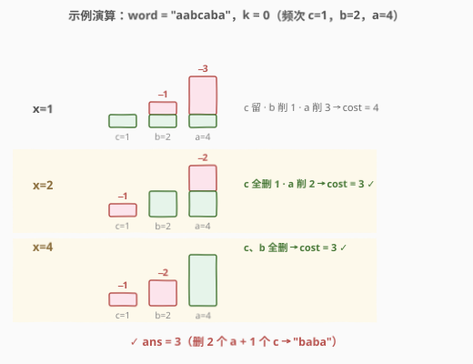

# LeetCode 成为K特殊字符串需要删除的最少字符数 题解

## 1. 题目概述

- **标题 / 题号**：成为 K 特殊字符串需要删除的最少字符数（#3085，medium）
- **链接**：https://leetcode.cn/problems/minimum-deletions-to-make-string-k-special/
- **难度**：中等
- **标签**：贪心，哈希表，字符串，计数，排序

**题意**：给你一个字符串 `word` 和一个整数 `k`。

如果 $|\text{freq}(word[i]) - \text{freq}(word[j])| \le k$ 对于字符串中**所有**下标 $i$ 和 $j$ 都成立，则认为 `word` 是 **k 特殊字符串**。此处 $\text{freq}(x)$ 表示字符 $x$ 在 `word` 中的出现频率，$|y|$ 表示 $y$ 的绝对值。

任务：返回使 `word` 成为 **k 特殊字符串** 需要删除的字符的**最小**数量。

**示例 1**：

```text
输入：word = "aabcaba", k = 0
输出：3
解释：删除 2 个 "a" 和 1 个 "c"，word 变为 "baba"，此时 freq('a') == freq('b') == 2，任意两频率之差为 0 ≤ k。
```

**示例 2**：

```text
输入：word = "dabdcbdcdcd", k = 2
输出：2
解释：删除 1 个 "a" 和 1 个 "d"，word 变为 "bdcbdcdcd"，此时 freq('b')==2、freq('c')==3、freq('d')==4，任意两频率之差最多为 2 ≤ k。
```

**示例 3**：

```text
输入：word = "aaabaaa", k = 2
输出：1
解释：删除 1 个 "b"，word 变为 "aaaaaa"，此时每个字母的频率都是 6。
```

**约束**：

- $1 \le \text{word.length} \le 10^5$
- $0 \le k \le 10^5$
- `word` 仅由小写英文字母组成

> ⚠️ 读题一个坑：约束只对**仍留在串中**的字符生效——某个字母被删光后，它就不再参与「任意两频率之差」的比较。所以「把小众字母整桶删光」往往是划算的。

## 2. 解题思路

### 2.1 暴力思路

删除的本质是**降低若干字母的出现频率**（不能增加）。最终态只取决于「每个字母剩几个」这个多重集，与删的是哪些位置无关——所以问题立刻塌缩到 26 个频率桶上：寻找一组目标频率 $x'_c \le \text{freq}(c)$（或整桶删光），使得保留桶的频率极差 $\le k$，最小化总删除数 $\sum_c (\text{freq}(c) - x'_c)$。

朴素的 DP 或枚举每个桶的目标值是 $O(n^{26})$ 级别的灾难；但注意到「k 特殊」等价于「所有保留频率落在某个长度为 $k$ 的窗口 $[x,\ x+k]$ 内」，其中 $x$ 就是**最终保留下来的最小频率**——只需枚举这个窗口的左端点 $x$。

### 2.2 核心观察：枚举最终最小频率 x，各桶独立清算

![核心概念：低于 x 全删，落在 [x, x+k] 保留，超过 x+k 削顶](../images/p3085_kspecial_concept.svg)

**观察一：最优解中，频率最小的那个字母一个都不用删。**

设最终保留频率的最小值为 $m$，取到最小值的字母为 $c$。若 $c$ 也被删过若干个，把 $c$ 的删除全部撤销（频率从 $m$ 回升），$c$ 与其他任何保留字母的频率差只会**缩小**（其余频率都 $\ge m$ 且 $\le m+k$），约束依然满足，而删除数更少——矛盾。故 $m$ 一定是**某个字母的原始频率**，只需在 26 个桶的原始频率中枚举 $x$。

**观察二：给定下界 $x$，每个桶怎么删一目了然。**

设某字母原始频率为 $y$：

1. $y < x$：**整桶删光**（贡献 $y$）——保留 $t\ (0 < t < x)$ 个虽然也可能合法，但那样最终最小频率其实是 $t$ 而非 $x$，属于「枚举更小 $x$」的分支，按「$x$ 就是最终最小值」的口径处理不会漏解；
2. $x \le y \le x+k$：**一个不删**（贡献 $0$）；
3. $y > x+k$：**削顶到恰好 $x+k$**（贡献 $y - x - k$）——多删浪费，少删非法。

各桶的清算互不干扰，总代价直接相加，对 26 个候选 $x$ 取最小即可。

> 💡 一句话：**枚举「存活的最低水位线」$x$，水位线下的桶清空、窗口 $[x, x+k]$ 内的桶不动、超过 $x+k$ 的桶削平**。

### 2.3 算法流程图



流程一句话：一次扫描统计 26 字母频次 → 枚举每个**出现过**的频率作为下界 $x$ → 内层遍历 26 桶按三分支累加代价 → 所有候选取最小返回。双重循环上界都是 26，常数极小。

### 2.4 示例演算



以 `word = "aabcaba", k = 0` 走一遍：频次 $\text{freq}(a)=4,\ \text{freq}(b)=2,\ \text{freq}(c)=1$，排序得 $[1, 2, 4]$。

- $x=1$：$c$ 保留；$b$ 削 $2-1=1$；$a$ 削 $4-1=3$ → 代价 $4$；
- $x=2$：$c < 2$ 全删 $1$；$b$ 保留；$a$ 削 $4-2=2$ → 代价 $\mathbf{3}$ ✓；
- $x=4$：$c$ 全删 $1$；$b$ 全删 $2$；$a$ 保留 → 代价 $\mathbf{3}$ ✓。

最小代价 $3$，与示例一致（对应删 2 个 `a` + 1 个 `c` 得 `"baba"`；或删 1 个 `c` + 2 个 `b` 得 `"aaaa"`，同代价）。再核对示例 3：`aaabaaa` 中 $\text{freq} = [1(b), 6(a)]$，$x=6$ 时 $b$ 全删 $1$、$a$ 保留，代价 $1$ ✓。

## 3. 参考代码

### C++

```cpp
class Solution {
  public:
    int minimumDeletions(string word, int k) {
        array<int, 26> freq{};
        for (char c : word) freq[c - 'a']++;

        int ans = INT_MAX;
        for (int i = 0; i < 26; ++i) {
            int x = freq[i];
            if (x == 0) continue;               // 只枚举出现过的字母频率作下界
            int cost = 0;
            for (int j = 0; j < 26; ++j) {
                int y = freq[j];
                if (y < x) cost += y;                 // 水位线下：整桶删光
                else if (y > x + k) cost += y - x - k; // 窗口上方：削顶到 x+k
            }
            ans = min(ans, cost);
        }
        return ans;
    }
};
```

### Python

```python
class Solution:
    def minimumDeletions(self, word: str, k: int) -> int:
        freq = sorted(Counter(word).values())
        ans = inf
        for x in freq:                            # 枚举最终最小频率 x
            cost = sum(y if y < x else y - x - k
                       for y in freq if y < x or y > x + k)
            ans = min(ans, cost)
        return ans
```

> 💡 实现细节：① 只枚举**出现过的**频率（`x == 0` 的空桶跳过），以 $x=0$ 为下界只会把所有桶削到 $\le k$，必不优于以最小实际频率为下界；② 内层判空桶无所谓，`y=0` 落在「不删」分支天然贡献 0。

## 4. 复杂度分析

| 维度 | 复杂度 | 说明 |
|------|--------|------|
| 时间复杂度 | $O(n + 26^2)$ | 统计频次 $O(n)$；枚举 26 个下界 × 内层扫 26 桶共 $O(26^2)=676$ 次基本操作，$n \le 10^5$ 时计数占主导 |
| 空间复杂度 | $O(26)$ | 仅需一个 26 桶频次数组（Python 的 `Counter` 同阶，键数 $\le 26$） |

## 5. 扩展：排序 + 二分，消掉内层循环

把频次排序为 $f_0 \le f_1 \le \dots \le f_{m-1}$（$m \le 26$），并预处理前缀和。对下界 $x=f_i$：

$$\text{cost}(x) = \underbrace{\text{prefix}[\text{bisect\_left}(f, x)]}_{\text{低于 } x\text{ 的全删}} + \underbrace{\text{suffix}[t+1] - (m-1-t)\,(x+k)}_{t=\text{bisect\_right}(f, x+k)-1,\ \text{削顶部分}}$$

二分定位「严格小于 $x$」与「不超过 $x+k$」的两条分界线，单个 $x$ 的代价 $O(\log 26)$ 求出，整体 $O(n + 26\log 26)$。本题 26 桶下两版实测无差别，此优化在「值域大、桶多」的同类题（如元素种数不受限的变体）中才是关键。

## 6. 面试要点

1. **为什么最优解中频率最小的字母不会被删？**

   - 设最终最小保留频率为 $m$。若取得 $m$ 的字母还被删过，把它的删除全部撤销：其余保留频率都在 $[m,\ m+k]$ 内，该字母频率回升只会缩小与它们的差，k 特殊性不被破坏，而删除数严格减少——与最优性矛盾。因此 $m$ 必为某个原始频率，枚举 26 个桶的频率即可覆盖全部候选。

2. **$y < x$ 时为什么敢「整桶删光」？不会漏掉保留一部分的方案吗？**

   - 保留 $t\ (0 < t < x)$ 个若合法，该方案真正的最小保留频率是 $t < x$，会在「枚举 $x'=t$」的分支中以更准确的口径被评估。按「$x$ 恰为最终最小值」的约定逐分支计算，所有最终态恰好被枚举一次，不重不漏。

3. **为什么 $y > x+k$ 时恰好削到 $x+k$？各桶真能独立决策？**

   - 约束只涉及频率两两之差，给定 $x$（最小值固定不被删），其余桶的合法区间都是同一个 $[x,\ x+k]$，互不耦合；削到 $x+k$ 是「合法前提下删得最少」，多删浪费、少删违约，故独立取到各桶最优，相加即该 $x$ 下的全局最优。

4. **时间与空间复杂度？**

   - 计数 $O(n)$ + 双重 26 循环 $O(26^2)$，总 $O(n + 26^2)$；空间 $O(26)$。排序 + 二分可优化到 $O(n + 26\log 26)$。

5. **变体追问：$k=0$ 时算法退化成什么？**

   - $k=0$ 即所有保留频率**相等**：枚举公共目标频率 $x$，低于它的桶删光、高于它的桶削平——正是「选出若干等频字母」的特例，算法无需任何改动直接适用。

## 同类练习题

| # | 题目 | 与本题的关联 |
|---|------|-------------|
| 1647 | [字符频次唯一的最小删除次数](https://leetcode.cn/problems/minimum-deletions-to-make-character-frequencies-unique/) | 同为「频次整形 + 最少删除」，把约束从「挤进窗口」换成「两两互异」 |
| 621 | [任务调度器](https://leetcode.cn/problems/task-scheduler/) | 频次视角的最值贪心，练「按频次构造/整形」的组合拳 |
| 767 | [重构字符串](https://leetcode.cn/problems/reorganize-string/) | 大根堆按频率贪心放置，频次类题的构造向近亲 |
| 3016 | [输入单词需要的最少按键次数 II](https://leetcode.cn/problems/minimum-number-of-pushes-to-type-word-ii/) | 按频次排序贪心分配按键位，同仓库 3001-3100 区间内可对照阅读 |
