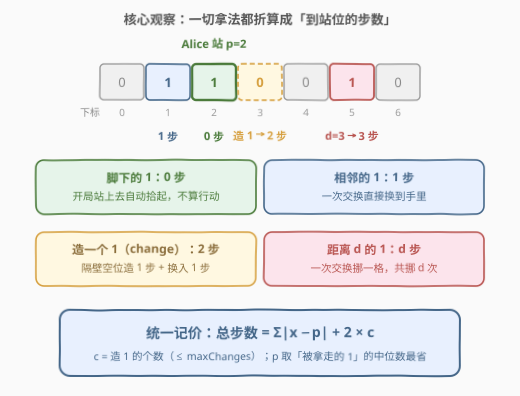
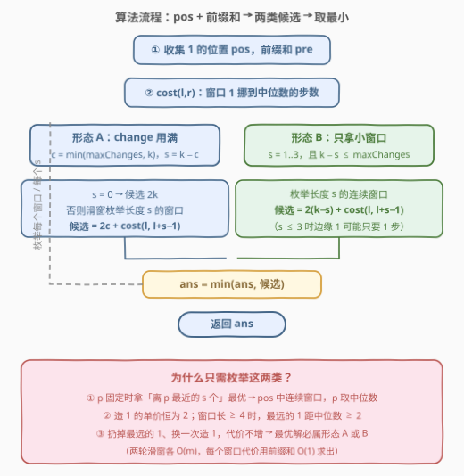

# 拾起K个1需要的最少行动次数

- **题目名称**：拾起 K 个 1 需要的最少行动次数
- **链接**：[3086. 拾起 K 个 1 需要的最少行动次数](https://leetcode.cn/problems/minimum-moves-to-pick-k-ones/)
- **难度**：困难
- **标签**：贪心，数组，前缀和，滑动窗口

## 1. 题目概述

给定下标从 **0** 开始、长度为 $n$ 的二进制数组 `nums`，以及一个**正整数** $k$ 和一个**非负整数** `maxChanges`。

Alice 玩一个游戏：开局她任选一个下标 `aliceIndex` 站定。若 `nums[aliceIndex] == 1`，她会拾起一个 1 且该位归 0（这**不算**行动）。随后她可以执行**任意多次行动**（包括零次），每次行动必须**恰好**执行以下之一：

1. 选任意 `j != aliceIndex` 且 `nums[j] == 0`，把 `nums[j]` 置 1。此类行动**至多执行 `maxChanges` 次**；
2. 选相邻下标 $x, y$（$|x - y| = 1$）且 `nums[x] == 1, nums[y] == 0`，交换两者（`nums[y]=1`、`nums[x]=0`）。若 $y = $ `aliceIndex`，Alice 拾起这个 1，`nums[y]` 归 0。

返回 Alice 拾起**恰好** $k$ 个 1 所需的**最少**行动次数。

**示例 1**：

```text
输入：nums = [1,1,0,0,0,1,1,0,0,1], k = 3, maxChanges = 1
输出：3
解释：Alice 站在下标 1 上：开局白嫖 1 个（nums[1] 归 0）；在下标 2 造一个 1（第 1 次行动），
把 (2,1) 交换拾起（第 2 次行动）；再把 (0,1) 交换拾起（第 3 次行动）。
```

**示例 2**：

```text
输入：nums = [0,0,0,0], k = 2, maxChanges = 3
输出：4
解释：没有现成的 1，只能造：每次「造 1 + 换入」共 2 步，2 个 1 共 4 步。
```

**约束条件**：

- $2 \le n \le 10^5$
- $0 \le \text{nums}[i] \le 1$
- $1 \le k \le 10^5$
- $0 \le \text{maxChanges} \le 10^5$
- $\text{maxChanges} + \sum \text{nums} \ge k$

> ⚠️ 读题一个坑：「拾起」只发生在**开局站位白嫖**和 **$y = $ aliceIndex 的交换**上；行动 1 只是「造 1」，造出来的 1 还得靠行动 2 一步一步挪到脚边才算数——所以「造一个 1」的真实单价是 2 步，不是 1 步。

---

## 2. 解题思路

### 2.1 暴力思路

每次行动都有 $O(n)$ 种选择（造在哪个空位 / 交换哪对相邻格子），操作序列的可能性是指数级的。直接 BFS 状态 `(nums 数组, aliceIndex, 已拾起数, 已造 1 数)`，状态空间高达 $2^n \cdot n$，$n \le 10^5$ 直接爆炸。

正确的打开方式是先给**每种「拿 1 的方式」定价**，把游戏塌缩成一个纯粹的组合优化问题：选一个站位 $p$、选一组要拿走的已有 1、决定造几个 1，总步数取最小。

### 2.2 核心观察：统一记价——总步数 = Σ|x−p| + 2c



**观察一（定价表）：站位 $p$ 固定后，四种来源单价全部固定。**

| 来源 | 单价 | 说明 |
|------|------|------|
| 脚下的 1 | $0$ 步 | 开局站上去自动拾起 |
| 相邻的 1（$p \pm 1$） | $1$ 步 | 交换一次直接换入 |
| 造 1（change） | 恒 $2$ 步 | 在隔壁空位「造 1 步 + 换入 1 步」，造远了只会更贵；至多 `maxChanges` 个 |
| 距离 $d \ge 2$ 的已有 1 | $d$ 步 | 一次交换挪一格，共挪 $d$ 次 |

妙处在于：**白嫖价 0 和相邻价 1，恰好就是「距离 0」和「距离 1」**。于是任何方案（站位 $p$、拿走的已有 1 集合 $S$、造 $c$ 个）的总步数统一为一个公式：

$$\text{总步数} = \sum_{x \in S} |x - p| + 2c, \qquad |S| + c = k,\ c \le \text{maxChanges}$$

**观察二（$S$ 是 `pos` 中的连续区间，$p$ 取中位数）。**

把所有 1 的下标排成有序数组 `pos`。固定 $p$ 时，拿 $s$ 个已有 1 当然拿「离 $p$ 最近的 $s$ 个」——它们在 `pos` 中是**连续区间**；固定 $S$ 时，$\sum|x-p|$ 在 $p$ = $S$ 的**中位数**处最小。可行性也不用担心：$S$ 连续且 $p$ 在 $S$ 内部，则任何「不属于 $S$ 的 1」都不可能夹在某个 $x \in S$ 与 $p$ 之间（否则它离 $p$ 更近、理应入选），按**离 $p$ 从近到远**的顺序逐个交换，路径上要么本来就是 0、要么是自己人留下的空位——恰好用 $\sum|x-p|$ 步完成，不会发生「别的 1 挡道」。

**观察三（关键贪心：最优解只有两种形态）。**

造 1 的单价恒为 2。若窗口长度 $s \ge 4$，最远的那个 1 到中位数的距离必然 $\ge 2$（$s=4$ 时窗口 $[a,b,c,d]$ 的距离和恒为 $c+d-a-b$，扔掉任一端至少省 2；$s \ge 5$ 更显然）。于是只要 change 还有余额，**扔掉最远的 1、换一次造 1，总代价不增**。反复收缩下去，最优解只可能是：

- **形态 A**：change 用满（$c = \min(\text{maxChanges},\ k)$），剩余 $s = k - c$ 个已有 1 构成**任意大小**的连续窗口；
- **形态 B**：窗口很小（$s \le 3$，此时窗口边缘的 1 单价可能是 0/1，比造 1 的 2 步划算），其余全部造 1。

> 💡 一句话：**距离和 + 2×造 1 数统一记价，连续窗口 + 中位数站位选已有 1，再用「造 1 单价 2」把大窗口收缩成 A/B 两种形态**——正是这步收缩把「枚举所有窗口长度」的 $O(nk)$ 降成两轮 $O(n)$ 滑窗。

### 2.3 算法流程图



流程一句话：收集 `pos` 并做前缀和 → `cost(l, r)` 用「中位数左右两段」的前缀和 $O(1)$ 算出窗口距离和 → 形态 A 滑窗枚举长度 $k - \min(\text{maxChanges}, k)$ 的所有窗口，形态 B 枚举长度 $1 \sim 3$ 的所有窗口 → 全部候选取最小。两轮滑窗都是 $O(m)$（$m$ 为 1 的个数），每个窗口代价 $O(1)$。

### 2.4 示例演算

![示例演算：pos=[0,1,5,6,9] 的三类候选对比，答案 3](../images/p3086_pick_ones_walkthrough.svg)

以示例 1 走一遍：`pos = [0, 1, 5, 6, 9]`，$k = 3$，`maxChanges = 1`。

- **形态 B（$s=3, c=0$）**：最优 3 窗口 $[5,6,9]$，$p=6$：$1+0+3=4$ 步；
- **形态 A/B（$s=2, c=1$）**：窗口 $[0,1]$，距离和 $1$，加造 1 的 $2$ 步 → 共 $3$ 步 ✓；窗口 $[5,6]$ 同样 $3$ 步 ✓；
- 其余候选更贵：$[0,1,5] \to 5$、$[1,5,6] \to 6$、$[6,9] \to 2+3=5$……

最小值 $3$，对应官方解释的操作序列：**站 1 白嫖 → 隔壁的 1 一步换入 → 造 1 个再花 2 步拿入**。再核对示例 2：$m = 0$ 没有现成的 1，形态 A 给出 $2k = 4$ ✓。

---

## 3. 参考代码

### C++

```cpp
class Solution {
  public:
    long long minimumMoves(vector<int>& nums, int k, int maxChanges) {
        vector<int> pos;                              // 所有 1 的下标
        for (int i = 0; i < (int)nums.size(); ++i)
            if (nums[i] == 1) pos.push_back(i);
        int m = pos.size();
        vector<long long> pre(m + 1);                 // pos 的前缀和
        for (int i = 0; i < m; ++i) pre[i + 1] = pre[i] + pos[i];

        // pos[l..r] 全部挪到中位数 pos[mid] 的总步数（前缀和 O(1)）
        auto cost = [&](int l, int r) -> long long {
            int mid = l + (r - l) / 2;
            long long p = pos[mid];
            long long left = p * (mid - l + 1) - (pre[mid + 1] - pre[l]);
            long long right = (pre[r + 1] - pre[mid + 1]) - p * (r - mid);
            return left + right;
        };

        long long ans = LLONG_MAX;

        // 形态 A：change 用满，c = min(maxChanges, k)，剩余 s = k - c 个靠已有 1
        int c = min(maxChanges, k), s = k - c;
        if (s == 0) ans = min(ans, 2LL * k);          // 没有现成 1 可拿，全靠造
        else
            for (int l = 0; l + s <= m; ++l)          // 约束保证 s <= m
                ans = min(ans, 2LL * c + cost(l, l + s - 1));

        // 形态 B：只拿 s = 1..3 的小窗口，其余靠造 1（需 k - s <= maxChanges）
        for (int s = 1; s <= min({3, k, m}); ++s) {
            if (k - s > maxChanges) continue;
            for (int l = 0; l + s <= m; ++l)
                ans = min(ans, 2LL * (k - s) + cost(l, l + s - 1));
        }
        return ans;
    }
};
```

### Python

```python
class Solution:
    def minimumMoves(self, nums: List[int], k: int, maxChanges: int) -> int:
        pos = [i for i, x in enumerate(nums) if x]     # 所有 1 的下标
        m = len(pos)
        pre = [0] * (m + 1)                            # pos 的前缀和
        for i, p in enumerate(pos):
            pre[i + 1] = pre[i] + p

        def cost(l: int, r: int) -> int:               # 窗口挪到中位数的步数
            mid = (l + r) // 2
            p = pos[mid]
            left = p * (mid - l + 1) - (pre[mid + 1] - pre[l])
            right = (pre[r + 1] - pre[mid + 1]) - p * (r - mid)
            return left + right

        ans = inf

        # 形态 A：change 用满，s = k - c 个已有 1 构成任意大窗口
        c, s = min(maxChanges, k), k - min(maxChanges, k)
        if s == 0:
            ans = min(ans, 2 * k)                      # 全靠造 1
        elif s <= m:
            ans = min(ans, min(2 * c + cost(l, l + s - 1)
                               for l in range(m - s + 1)))

        # 形态 B：只拿 s = 1..3 的小窗口，其余靠造 1
        for s in range(1, min(3, k, m) + 1):
            if k - s > maxChanges:                     # change 不够补齐，跳过
                continue
            ans = min(ans, min(2 * (k - s) + cost(l, l + s - 1)
                               for l in range(m - s + 1)))
        return ans
```

> 💡 实现细节：① 约束 $\text{maxChanges} + \sum \text{nums} \ge k$ 保证形态 A 的 $s \le m$，滑窗必有解；② `cost` 中左半段是「中位数×个数 − 左段位置和」、右半段是「右段位置和 − 中位数×个数」，距离和最大约 $10^5 \times 10^5 = 10^{10}$，必须用 `long long`；③ 形态 B 中 $c = k - s$ 若超过 `maxChanges` 则该 $s$ 直接跳过。

---

## 4. 复杂度分析

| 维度 | 复杂度 | 说明 |
|------|--------|------|
| 时间复杂度 | $O(n)$ | 收集 `pos` 一遍 $O(n)$；形态 A 一轮滑窗 $O(m)$ + 形态 B 三轮 $O(3m)$，每个窗口代价经前缀和 $O(1)$ 求出 |
| 空间复杂度 | $O(n)$ | `pos` 数组与前缀和数组，最坏全是 1 时 $m = n$ |

---

## 5. 扩展：为什么不能像 1703 那样枚举所有窗口长度？

本题的近亲 [1703. 得到连续 K 个 1 的最少相邻交换次数](https://leetcode.cn/problems/minimum-adjacent-swaps-for-k-consecutive-ones/) 只有「挪已有的 1」一种手段，必须对**每个**窗口长度 $s \in [k, m]$ 都跑一轮滑窗，靠增量更新把总复杂度压到 $O(n)$。本题多了「造 1」这条单价恒为 2 的后门：窗口长到 $\ge 4$ 之后，边缘 1 的边际单价 $\ge 2$，永远不会比造 1 更划算——大窗口被整体「外包」给造 1，只剩 $s \le 3$ 的零头需要亲自枚举。**新增的替代品越便宜，原问题需要精细枚举的规模越小**，这步「形态收缩」正是本题标为困难的题眼。

---

## 6. 面试要点

1. **为什么每种拿法能统一成「距离和 + 2c」？造 1 为什么恒 2 步？**

   - 站 $p$ 拿下标 $x$ 的已有 1：一次交换挪一格、落点必须为 0，逐格挪过来共 $|x-p|$ 步；$x=p$ 白嫖、$x=p\pm1$ 一步，正是距离 0 和 1。造 1 必须造在空位上，再挪到 $p$ 才算拾起——造在相邻空位最省，恒「造 1 + 换 1」共 2 步。

2. **为什么 $S$ 是 `pos` 连续区间、$p$ 取中位数？路径不会别的 1 被挡住吗？**

   - 固定 $p$ 拿最近的 $s$ 个 → 连续区间；固定 $S$ 距离和在中位数处最小。挡道问题不存在：非 $S$ 的 1 若夹在 $x \in S$ 与 $p$ 之间，它离 $p$ 更近、理应入选——矛盾。按离 $p$ 从近到远的顺序拿，路径全是空位。

3. **为什么最优解只有形态 A / B 两种？**

   - 造 1 单价恒 2；窗口 $s \ge 4$ 时最远元素距中位数 $\ge 2$，扔掉它换一次造 1 代价不增。反复收缩，终止态要么 change 用满（A），要么窗口 $\le 3$（B）。这是把 $O(nk)$ 枚举降到 $O(n)$ 的关键。

4. **时间与空间复杂度？**

   - 两轮滑窗 $O(m)$ + 收集 $O(n)$，总 $O(n)$；空间 $O(n)$。距离和可达 $10^{10}$，注意 64 位整数。

5. **变体追问：若 `maxChanges = 0`（不能造 1）算法退化成什么？**

   - 形态 A 收缩为 $s = k$ 的单轮滑窗、形态 B 仍枚举 $s \le 3$（若 $k \le 3$ 有交集）——即「在 `pos` 上选长度 $k$ 的连续窗口、代价为到中位数的距离和」，正是 1703 的核心子问题。

---

## 7. 同类练习题

- [1703. 得到连续 K 个 1 的最少相邻交换次数](https://leetcode.cn/problems/minimum-adjacent-swaps-for-k-consecutive-ones/)：同款「pos + 中位数 + 滑窗」，但没有造 1 后门，必须对所有窗口长度做增量滑窗
- [1151. 最少交换次数来组合所有的 1](https://leetcode.cn/problems/minimum-swaps-to-group-all-1s-together/)：定长滑窗数 1 的入门版，体会「窗口内 0 的个数」这一代价
- [2448. 使数组相等的最小开销](https://leetcode.cn/problems/minimum-cost-to-make-array-equal/)：$\sum |x - p|$ 在中位数处取最小的裸模板题
- [2602. 使数组元素全部相等的最少操作次数](https://leetcode.cn/problems/minimum-operations-to-make-all-array-elements-equal/)：中位数距离和 + 前缀和 + 二分，批量查询版练手
