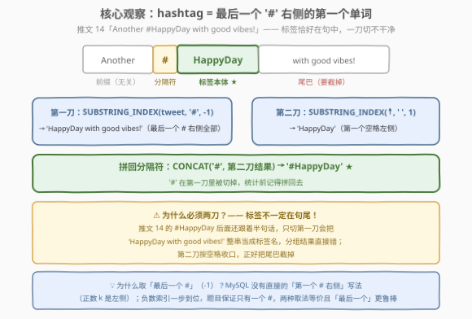
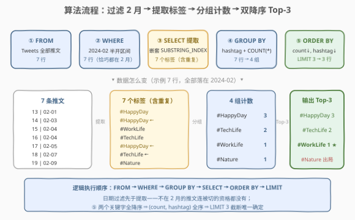
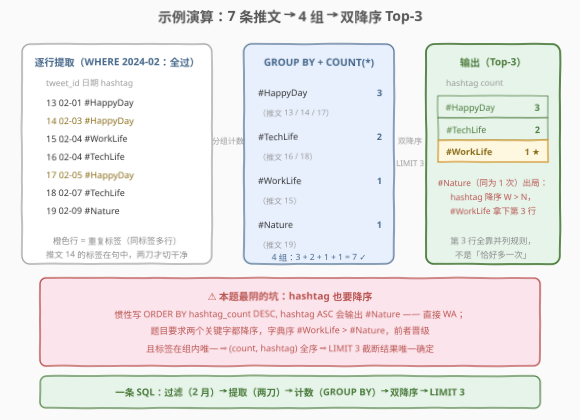

# 查找热门话题标签

- **题目名称**：查找热门话题标签
- **链接**：[3087. 查找热门话题标签 🔒](https://leetcode.cn/problems/find-trending-hashtags/)
- **难度**：中等
- **标签**：数据库、SQL、字符串处理、`SUBSTRING_INDEX`、`GROUP BY` 聚合、Top-K 排序、LeetCode 锁题

## 1. 题目概述

> ⚠️ 本题为 LeetCode 付费题（锁题），题意描述根据官方示例用例与外部资料重建，可能与官方题面有出入。

**表结构**：`Tweets`

| 列名 | 类型 |
|------|------|
| user_id | int |
| tweet_id | int |
| tweet_date | date |
| tweet | varchar |

- `tweet_id` 是这张表的主键（值互不相同）。
- 每行是一条推文：发帖用户 `user_id`、发帖日期 `tweet_date`、正文 `tweet`。
- 每条推文**恰好包含一个话题标签**（hashtag）——正文中一个以 `#` 开头的词（如 `#HappyDay`）。

**背景**：社交媒体的「趋势榜 / 热搜」——统计一个时间窗口内各话题标签被提及的次数，取最热的前几名。

**目标**：写一条 SQL 查询，找出 **2024 年 2 月**期间最热门（被提及次数最多）的 **top 3** 话题标签。

**输出格式**：`hashtag`、`hashtag_count` 两列，按 `hashtag_count` **降序**、`hashtag` **降序**排列，只取前 3 行。

**示例 1**：

```text
输入：Tweets 表
+---------+----------+------------------------------------------------+------------+
| user_id | tweet_id | tweet                                          | tweet_date |
+---------+----------+------------------------------------------------+------------+
| 135     | 13       | Enjoying a great start to the day. #HappyDay   | 2024-02-01 |
| 136     | 14       | Another #HappyDay with good vibes!             | 2024-02-03 |
| 137     | 15       | Productivity peaks! #WorkLife                  | 2024-02-04 |
| 138     | 16       | Exploring new tech frontiers. #TechLife        | 2024-02-04 |
| 139     | 17       | Gratitude for today's moments. #HappyDay       | 2024-02-05 |
| 140     | 18       | Innovation drives us. #TechLife                | 2024-02-07 |
| 141     | 19       | Connecting with nature's serenity. #Nature     | 2024-02-09 |
+---------+----------+------------------------------------------------+------------+

输出：
+-----------+---------------+
| hashtag   | hashtag_count |
+-----------+---------------+
| #HappyDay | 3             |
| #TechLife | 2             |
| #WorkLife | 1             |
+-----------+---------------+

解释：
#HappyDay 出现在推文 13、14、17 中，共 3 次；
#TechLife 出现在推文 16、18 中，共 2 次；
#WorkLife 只出现在推文 15 中，共 1 次。
注意 #Nature 同样只出现 1 次，但排序要求 hashtag 也降序——
字典序 #WorkLife > #Nature，第 3 行归 #WorkLife。
```

**约束条件**（重建推测）：

- `tweet` 中恰好含一个 `#` 开头的话题标签（可能在句中，也可能在句尾）；
- `tweet_date` 为合法日期；
- 判题数据量小，不同标签数有限。

> 💡 **审题关键**：① 时间窗口——只统计 **2024 年 2 月**（2024 是闰年，2 月有 29 天）；② 提取——把散落在正文里的 `#标签` 切出来；③ 聚合——按标签分组计数；④ 排序截断——**两个关键字都降序** + `LIMIT 3`，其中 hashtag 的降序并列规则是本题最阴的坑（见 2.4）。

---

## 2. 解题思路

### 2.1 暴力思路：应用层统计 / 相关子查询逐组计数

「工程暴力」是把整表拉到应用层：

```sql
SELECT * FROM Tweets;
```

然后在程序里对每行做正则提取 + 哈希表计数 + 排序取前三——**趋势榜本质是分组聚合**，这门 SQL 的看家本领被整体外包，$n$ 行数据还全部过网络。

SQL 层的「暴力」是手写计数——不用 `GROUP BY`，对提取出的每个标签用**相关子查询**现数一遍：

```sql
-- Extracted(hashtag)：先把标签提取成列，再逐行计数
SELECT DISTINCT hashtag,
       (SELECT COUNT(*) FROM Extracted e2
         WHERE e2.hashtag = e1.hashtag) AS hashtag_count
FROM Extracted e1
ORDER BY hashtag_count DESC, hashtag DESC
LIMIT 3;
```

语义正确，但外层每行都要让内层把 `Extracted` 再扫一遍，$n$ 行即 $O(n^2)$ 次比较——「每个标签数一遍」其实是同一件事重复了 $n$ 次，而 `GROUP BY` 内部一次哈希/排序就能把所有组的计数同时算完。

> ⚠️ 暴力思路的根本问题：把「分组统计」这一**整体聚合**拆成了逐行的重复劳动。分组计数是 `GROUP BY` 的原生语义——先提取、再分组、后排序，三步各归其位。

### 2.2 核心观察：两刀切出 hashtag + 一步分组计数



提取是本题唯一的「新东西」，一个**嵌套 `SUBSTRING_INDEX`** 就能完成：

1. **第一刀**：`SUBSTRING_INDEX(tweet, '#', -1)`——取**最后一个** `#` **右侧的全部内容**。对推文 14 `'Another #HappyDay with good vibes!'` 得到 `'HappyDay with good vibes!'`；
2. **第二刀**：`SUBSTRING_INDEX(第一刀结果, ' ', 1)`——取**第一个空格左侧**的内容，把标签后面的尾巴 `' with good vibes!'` 截掉，得到 `'HappyDay'`；
3. **补前缀**：`CONCAT('#', …)`——把第一刀切掉的 `#` 拼回去，得到 `'#HappyDay'`。

两个细节值得口头点出：

- **标签不一定在句尾**（推文 14 的 `#HappyDay` 后面还有半句话），所以第一刀之后必须再按空格切一刀——只切一刀会把 `'HappyDay with good vibes!'` 整串当成标签名，分组直接错；
- MySQL 的 `SUBSTRING_INDEX` **没有**「第一个分隔符右侧」的直接形态（正数 $k$ 取的是左侧），负数索引「最后一个分隔符右侧」正好一步到位；题目保证每条推文只有一个 `#`，两种取法等价，取「最后一个」是无脑鲁棒的选择。

剩下的就是标准动作：`WHERE` 圈住 2024 年 2 月，`GROUP BY` 按标签分组，`COUNT(*)` 计数，`ORDER BY` 双降序，`LIMIT 3` 截断——后半段与 [586. 订单最多的客户](../0501-0600/586_订单最多的客户.md) 的骨架完全同源，本题只是多了一步「把标签从正文里切出来」。

> 💡 正则一行等价：`REGEXP_SUBSTR(tweet, '#[[:alnum:]_]+')` 直接匹配「`#` + 字母数字下划线词」，连空格尾巴、标点尾巴（如 `#HappyDay!`）都能防——见解法 B。

### 2.3 算法流程图



**逻辑执行步骤**：

| 步骤 | SQL 片段 | 作用 | 示例数据流 |
|------|----------|------|-----------|
| ① | `FROM Tweets` | 读取全部推文 | 7 行 |
| ② | `WHERE tweet_date …` | 只留 2024 年 2 月 | 7 行（恰巧都在 2 月） |
| ③ | `SELECT 嵌套 SUBSTRING_INDEX` | 逐行提取标签 | 7 个标签（含重复） |
| ④ | `GROUP BY hashtag` + `COUNT(*)` | 按标签分组计数 | 4 组：3 / 2 / 1 / 1 |
| ⑤ | `ORDER BY … LIMIT 3` | 双降序取前三 | 3 行输出 |

> 💡 SQL 逻辑执行顺序为 `FROM → WHERE → GROUP BY → SELECT → ORDER BY → LIMIT`：② 的日期过滤发生在 ③ 提取**之前**——不在 2 月的推文连被切的资格都没有；④ 按 ③ 的表达式分组（MySQL 允许按 `SELECT` 别名分组，跨库更稳的写法是重复完整表达式或先在 CTE 里物化标签列）。

### 2.4 示例演算



**逐行提取**（② 过滤后 7 行全保留——都在 2024-02）：

| tweet_id | tweet_date | 提取出的 hashtag |
|----------|------------|------------------|
| 13 | 2024-02-01 | #HappyDay |
| 14 | 2024-02-03 | #HappyDay ← 句中标签，两刀才切干净 |
| 15 | 2024-02-04 | #WorkLife |
| 16 | 2024-02-04 | #TechLife |
| 17 | 2024-02-05 | #HappyDay |
| 18 | 2024-02-07 | #TechLife |
| 19 | 2024-02-09 | #Nature |

**分组计数**：`#HappyDay` 3 次（推文 13/14/17）、`#TechLife` 2 次（16/18）、`#WorkLife` 1 次（15）、`#Nature` 1 次（19）——共 4 组，$3+2+1+1=7$ ✓。

**排序截断**（`ORDER BY hashtag_count DESC, hashtag DESC LIMIT 3`）：

| 排位 | hashtag | hashtag_count | 说明 |
|------|---------|---------------|------|
| 1 | #HappyDay | 3 | 次数断层第一 |
| 2 | #TechLife | 2 | 次数第二 |
| 3 | **#WorkLife** | 1 | **并列 1 次，hashtag 降序 W > N，挤掉 #Nature** |

> ⚠️ **本题最阴的坑**：`#WorkLife` 与 `#Nature` 都出现 1 次，题目要求 hashtag 也**降序**——字典序 `#WorkLife > #Nature`，第 3 行归 `#WorkLife`。惯性写 `hashtag ASC` 会输出 `#Nature` 直接 WA。这条规则也不是可有可无的装饰：标签在组内唯一，`(count, hashtag)` 构成**全序**，正是它让 `LIMIT 3` 的截断结果**唯一确定**——否则并列第 3 该截谁全看引擎心情。

---

## 3. 参考代码

### SQL（解法 A：嵌套 `SUBSTRING_INDEX`，推荐）

```sql
# Write your MySQL query statement below
SELECT
    CONCAT('#', SUBSTRING_INDEX(SUBSTRING_INDEX(tweet, '#', -1), ' ', 1)) AS hashtag,
    COUNT(*) AS hashtag_count
FROM Tweets
WHERE tweet_date >= '2024-02-01' AND tweet_date < '2024-03-01'
GROUP BY hashtag
ORDER BY hashtag_count DESC, hashtag DESC
LIMIT 3;
```

> 💡 **写法要点**：
> - **日期用半开区间** `>= '2024-02-01' AND < '2024-03-01'`：不必背「2 月有几天」，谓词不裹函数、**可以走 `tweet_date` 索引**（sargable，见 5.1）；
> - **`GROUP BY hashtag`**：MySQL 允许按 `SELECT` 别名分组（`GROUP BY 1` 的序号写法同理）；跨库更稳的写法是重复完整表达式，或先在 CTE 里物化标签列再按列名分组；
> - **内层 `-1`、外层 `1`**：一个取「最后一个 `#` 右侧」、一个取「第一个空格左侧」，两刀方向别记反；
> - **`COUNT(*)` 与 `COUNT(1)` 等价**：计的是行数，标签列为空的行（理论上不存在）也会被算进组里。

### SQL（解法 B：`REGEXP_SUBSTR` 正则一步提取）

```sql
# Write your MySQL query statement below
SELECT
    REGEXP_SUBSTR(tweet, '#[[:alnum:]_]+') AS hashtag,
    COUNT(*) AS hashtag_count
FROM Tweets
WHERE tweet_date BETWEEN '2024-02-01' AND '2024-02-29'
GROUP BY hashtag
ORDER BY hashtag_count DESC, hashtag DESC
LIMIT 3;
```

> 💡 **解法 B 的取舍**：
> - `#[[:alnum:]_]+` 直接匹配「`#` + 字母数字下划线词」，**一行干掉两刀**，还能防住 `#HappyDay!` 这种标点尾巴——嵌套 `SUBSTRING_INDEX` 版会把 `!` 一起切进来（判题数据规整，两种都能过）；
> - 需要 MySQL 8.0+（LeetCode 判题环境满足）；若推文可能不含 `#`，`REGEXP_SUBSTR` 返回 `NULL` 会被并成一组，防御性补一个 `WHERE tweet LIKE '%#%'`；
> - 日期这里顺手示范 `BETWEEN '2024-02-01' AND '2024-02-29'`——2024 是闰年恰好 29 天；平年把终点写死成 29 号有进位陷阱，见 5.1。

### Python（pandas）

```python
import pandas as pd


def find_trending_hashtags(tweets: pd.DataFrame) -> pd.DataFrame:
    feb = tweets[tweets["tweet_date"].dt.strftime("%Y%m") == "202402"].copy()
    feb["hashtag"] = "#" + feb["tweet"].str.extract(r"#(\w+)")
    counts = (
        feb.groupby("hashtag")["tweet_id"]
        .count()
        .reset_index(name="hashtag_count")
        .sort_values(["hashtag_count", "hashtag"], ascending=[False, False])
    )
    return counts.head(3).reset_index(drop=True)
```

> 💡 **pandas 对照**（付费题无官方函数签名，函数名按题名约定）：
> - `dt.strftime("%Y%m") == "202402"` 即日期过滤；`.copy()` 避免 SettingWithCopyWarning；
> - `str.extract(r"#(\w+)")` 的**捕获组**只返回 `#` 后面的词，`"#" +` 拼回前缀——对应 SQL 的「两刀 + CONCAT」；
> - `groupby(...).count().reset_index(name=…)` 对应 `GROUP BY + COUNT(*)`；`sort_values` 两个键都降序对应 `ORDER BY … DESC, … DESC`；`head(3)` 即 `LIMIT 3`。

---

## 4. 复杂度分析

设 $n$ 为落在 2024 年 2 月的推文行数，$L$ 为推文平均长度，$d$ 为不同标签数（$d \le n$）。

| 维度 | 复杂度 | 说明 |
|------|--------|------|
| **时间复杂度** | $O(n \cdot L + d \log d)$ | 单趟扫描逐行提取（每行 $O(L)$），分组计数 $O(n)$，对 $d$ 组排序；`LIMIT 3` 理论上用 top-K 可压到 $O(d \log 3) \approx O(d)$，判题规模无感 |
| **空间复杂度** | $O(d \cdot L)$ | 分组哈希表与输出同阶，只与不同标签数相关 |

> - 相关子查询暴力版（2.1）外层每行触发一次内层全表扫描，$O(n^2)$——数据量一大立刻现形；
> - 若 `tweet_date` 上有索引，半开区间谓词可走**范围扫描**，只触碰 2 月的行——这正是 5.1 sargability 的意义；无索引时 ② 的过滤只是全表扫描的一部分，不产生额外开销。

---

## 5. 扩展

### 5.1 日期过滤的四种写法与 sargability

| 写法 | 正确性 | 走索引（sargable） | 备注 |
|------|--------|--------------------|------|
| `tweet_date >= '2024-02-01' AND tweet_date < '2024-03-01'` | ✓ | ✓ | **首选**：半开区间，闰平年通吃，不用背每月天数 |
| `BETWEEN '2024-02-01' AND '2024-02-29'` | ✓（2024 闰年） | ✓ | 终点写死 29 号——平年有陷阱（见下） |
| `YEAR(tweet_date) = 2024 AND MONTH(tweet_date) = 2` | ✓ | ✗ 列上裹函数 | 索引失效，退化全表扫描 |
| `DATE_FORMAT(tweet_date, '%Y%m') = '202402'` | ✓ | ✗ 同上 | 可读性好（官方题解常用），代价同上 |

> ⚠️ **闰年陷阱**：非闰年写 `BETWEEN … AND '2025-02-29'`，MySQL 在非严格模式下会把非法日期 `'2025-02-29'`「进位」成 `'2025-03-01'`，**悄悄把 3 月 1 日也圈进来**。本题 2024 年是闰年侥幸无坑；写死终点日期换个月份就是隐患，半开区间一劳永逸。

### 5.2 Top-K 排序：tie-break 不是装饰

分组计数后按 `(hashtag_count, hashtag)` **双降序**再 `LIMIT 3`：

- **确定性**：标签在组内唯一 ⇒ `(count, hashtag)` 是全序 ⇒ 截断结果唯一。只按 `count` 排序时，并列第 3 截谁都行，结果不确定，判题必挂；
- **方向**：hashtag 也是 **DESC**——示例里 `#WorkLife` 正是靠这条规则挤掉 `#Nature`。读题时把 `ORDER BY` 的每个关键字**连同方向**抄下来，是 SQL 题防 WA 的基本功；
- **每月 Top-3 变体**：窗口函数一步到位——先按 `月份 × 标签` 分组计数，再在月份分区内排名取前三：

```sql
WITH monthly AS (
    SELECT DATE_FORMAT(tweet_date, '%Y-%m') AS ym, hashtag, COUNT(*) AS cnt
    FROM (SELECT tweet_date,
                 CONCAT('#', SUBSTRING_INDEX(SUBSTRING_INDEX(tweet, '#', -1), ' ', 1)) AS hashtag
          FROM Tweets) t
    GROUP BY ym, hashtag
)
SELECT ym, hashtag, cnt
FROM (
    SELECT *, ROW_NUMBER() OVER (PARTITION BY ym ORDER BY cnt DESC, hashtag DESC) AS rn
    FROM monthly
) ranked
WHERE rn <= 3;
```

### 5.3 一条推文多个标签：炸行与续作 3103

本题白送了「每条推文恰含一个标签」的保证；真实社交数据里一条推文带一堆 `#tag` 是常态。续作 **[3103. 查找热门话题标签 II 🔒](https://leetcode.cn/problems/find-trending-hashtags-ii/)**（Hard）就解除了这条保证——表结构、时间窗口、双降序 Top-3 全部照旧，考点变成**把「一行多标签」炸成「一行一标签」**再分组：

- **递归 CTE**：从每个推文起，每轮剥出最靠左的标签 + 剩余串，直到剥完（`SUBSTRING_INDEX`/`REGEXP_SUBSTR` 逐段推进）；
- **数字表 / `JSON_TABLE` 交叉连接**：`REGEXP_SUBSTR(tweet, '#\\w+', 1, k)` 取第 $k$ 个标签，$k$ 从 1 交叉连接到标签数上限。

炸完之后，分组、计数、双降序、Top-K 的后半段与本题一字不差——**「先规整成一行一事实，再聚合」**，是 SQL 处理「单元格内多值」的通用范式。

---

## 6. 面试要点

1. **嵌套 `SUBSTRING_INDEX` 的两刀各在切什么？**

   > 内层 `SUBSTRING_INDEX(tweet, '#', -1)` 取**最后一个** `#` 右侧的全部内容；外层 `SUBSTRING_INDEX(…, ' ', 1)` 再取第一个空格左侧的词，截掉标签后的尾巴；最后 `CONCAT('#', …)` 把切掉的 `#` 拼回去。对应推文 14：`Another #HappyDay with good vibes!` → `HappyDay with good vibes!` → `HappyDay` → `#HappyDay`。

2. **第二刀为什么不可省？**

   > 标签不一定在句尾——推文 14 的 `#HappyDay` 后面还跟着半句话。只切第一刀会把 `'HappyDay with good vibes!'` 整串当标签名，分组结果直接错。按 `'#'` 切完必须再按 `' '` 收口，这也是「分隔符不止一种、方向不止一个」时嵌套 `SUBSTRING_INDEX` 的通用套路。

3. **日期过滤为什么推荐半开区间？什么是 sargable？**

   > `>= '2024-02-01' AND < '2024-03-01'` 不用关心 2 月天数（闰平年通吃），且谓词不裹函数，优化器能对 `tweet_date` 索引做范围扫描——「谓词可下推到索引」即 sargable（Search ARGument ABLE）。`YEAR()`/`MONTH()`/`DATE_FORMAT()` 作用在列上会让索引失效、退化全表扫描；写死 `BETWEEN … AND '02-29'` 在平年还有非法日期进位把 3 月 1 日圈进来的暗坑。

4. **`ORDER BY` 的两个关键字为什么都降序？去掉 hashtag 排序会怎样？**

   > 题目明确要求按 count、hashtag **双降序**。`(count, hashtag)` 在组内构成全序，让 `LIMIT 3` 的截断唯一确定——示例里 `#WorkLife` 与 `#Nature` 并列 1 次，字典序 W > N 使 `#WorkLife` 晋级。只按 count 排序时并列截断不确定，判题直接 WA。

5. **如果一条推文里有多个 hashtag，怎么改？**

   > 先「炸行」把一行多标签拆成一行一标签：递归 CTE 逐个剥出标签，或数字表/`JSON_TABLE` + `REGEXP_SUBSTR(tweet, '#\\w+', 1, k)` 按序号取第 $k$ 个。炸完再 `GROUP BY` 计数，后半段不变。这正是续作 3103（Hard）的考点，也是「单元格多值」的通用处理范式。

> 💡 **一句话总结**：3087 = 字符串提取 + 分组计数 + Top-K。嵌套 `SUBSTRING_INDEX` 两刀（最后一个 `#` 右侧 → 首个空格左侧）切出标签，`WHERE` 半开区间圈住 2024-02，`GROUP BY + COUNT(*)` 计数，`ORDER BY count DESC, hashtag DESC LIMIT 3` 收尾——最容易翻车的是 hashtag 的**降序**并列规则与闰年 29 号这种写死的区间终点。

---

## 7. 同类练习题

- [3103. 查找热门话题标签 II 🔒](https://leetcode.cn/problems/find-trending-hashtags-ii/)：同名续作（Hard）——解除「每条推文只有一个标签」的保证，递归 CTE / `JSON_TABLE` 炸行后再走本题的分组计数骨架
- [586. 订单最多的客户](https://leetcode.cn/problems/customer-placing-the-largest-number-of-orders/)（[题解](../0501-0600/586_订单最多的客户.md)）：`GROUP BY + COUNT + ORDER BY DESC + LIMIT 1`——本题的 Top-1 极简版；该题保证答案唯一，对照体会本题 tie-break 规则的必要性
- [1141. 查询近 30 天活跃用户数](https://leetcode.cn/problems/user-activity-for-the-past-30-days-i/)（[题解](../1101-1200/1141_查询近30天活跃用户数.md)）：日期窗口过滤专项——`DATEDIFF`/`BETWEEN` 圈出时间区间内的记录再分组，与本题 ② 同考点
- [1517. 查找拥有有效邮箱的用户](https://leetcode.cn/problems/find-users-with-valid-e-mails/)（[题解](../1501-1600/1517_查找拥有有效邮箱的用户.md)）：`REGEXP`/`LIKE` 字符串家族——从「提取」到「判定」，与本题正则解法 B 互补
- [182. 查找重复的电子邮箱](https://leetcode.cn/problems/duplicate-emails/)（[题解](../0101-0200/182_查找重复的电子邮箱.md)）：`GROUP BY + COUNT` 入门——把本题的计数骨架单独练一遍，追加 `HAVING COUNT(*) > 1` 即「找出现 ≥ 2 次的标签」
