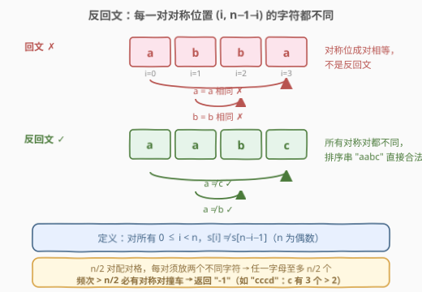
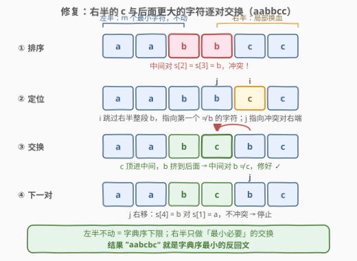
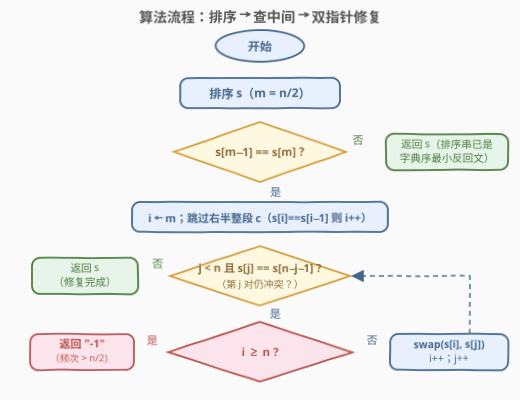
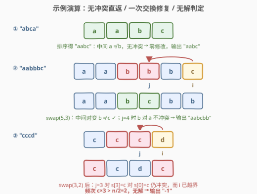

# 使字符串反回文

- **题目名称**：使字符串反回文
- **链接**：[3088. 使字符串反回文](https://leetcode.cn/problems/make-string-anti-palindrome/)
- **难度**：困难
- **标签**：贪心，字符串，排序，计数

## 1. 题目概述

> ⚠️ 本题为 LeetCode 付费题（🔒），题意描述依据官方示例用例与 hints 整理重建，可能与官方题面有出入。

我们称一个长度为**偶数** $n$ 的字符串 $s$ 为**反回文**（anti-palindrome）的，如果对每一个下标 $0 \le i < n$ 都有 $s[i] \ne s[n - i - 1]$——即每一对**中心对称**位置上的字符都不相同。

给定字符串 $s$，可以进行**任意次**（包括 0 次）操作：一次操作可以选择 $s$ 中的两个字符并交换它们。任意次交换等价于**任意重排**。

任务：返回能得到的**字典序最小**的反回文字符串；如果 $s$ 不可能成为反回文，返回 `"-1"`。

**示例 1**：

```text
输入：s = "abca"
输出："aabc"
解释："aabc" 满足 s[0]≠s[3]（a≠c）且 s[1]≠s[2]（a≠b），是 "abca" 的一种重排，且字典序最小。
```

**示例 2**：

```text
输入：s = "abba"
输出："aabb"
解释："aabb" 满足 s[0]≠s[3]（a≠b）且 s[1]≠s[2]（a≠b），直接排序即得。
```

**示例 3**：

```text
输入：s = "cccd"
输出："-1"
解释：无论怎么重排，c 有 3 个，必有某个对称对两端都是 c，无法构成反回文。
```

**约束条件**：

- $2 \le \text{s.length} \le 10^5$
- $\text{s.length} \bmod 2 = 0$
- `s` 只包含小写英文字母

> ⚠️ 读题一个坑：求的不是「能否变成反回文」这种判定，而是**字典序最小**的构造——这要求每一步交换都有明确方向，不能随便修好就收工。

---

## 2. 解题思路

### 2.1 暴力思路

最直接的暴力是枚举 $s$ 的所有重排，逐个检查是否反回文，取字典序最小者——$n!$ 级别，$n \le 10^5$ 下毫无希望。稍微改进的暴力是从左到右逐位贪心：每个位置尝试放当前剩余最小的字符，再递归检查后缀能否补完——但「后缀可行性」本身就需要判定，依旧昂贵。

突破口在于两点：① 反回文的约束是**成对**的（$n/2$ 个对称对），可行性由**字母频次**一票决定；② 字典序最小的重排天然与「排序」挂钩。二者结合，得到一个排序 + 局部修复的线性级贪心。

### 2.2 核心观察：排序 + 中间冲突局部修复



**观察一：无解当且仅当某字母频次 $> n/2$（抽屉原理）。**

反回文把 $n$ 个位置配成 $n/2$ 对，每对必须放**两个不同**的字符。若字母 $c$ 出现 $\text{freq}(c) > n/2$ 次，则由抽屉原理必有某一对两端都是 $c$，矛盾。反之频次都不超过 $n/2$ 时一定可解——下面的构造算法本身就是证明。

**观察二：排序后只需检查中间一对。**

把 $s$ 排序。若某对 $(l,\ n-1-l)$（$l < m-1$，$m = n/2$）满足 $s[l] = s[n-1-l]$，由于数组有序，闭区间 $[l,\ n-1-l]$ 内**所有**字符都相同，这个块必然覆盖中间一对 $(m-1,\ m)$，即 $s[m-1] = s[m]$。逆否命题：**只要中间一对不同，排序串本身就是反回文**。而排序串又是所有重排中字典序最小的，此时直接返回即可——这正是示例 1、2 的情形。

**观察三：中间相同时，冲突只发生在「中间块」，左半不动、右半局部换血即可。**

设 $s[m-1] = s[m] = c$。排序串中相同的 $c$ 连成一块 $[a, b]$ 跨过中点。所有冲突对都涉及 $c$：左半的 $c$ 位于 $[a, m-1]$，右半的 $c$ 位于 $[m, b]$。修复策略（也是字典序最优策略）：

1. **左半保持不动**——左半已是 $m$ 个最小字符的升序排列，是前半部分字典序的理论下限，动它只会更差；
2. 右半中紧贴中点的 $c$（位置 $m, m+1, \dots$）与**右半中第一个大于 $c$ 的字符**（位置 $b+1$ 起的字符，设指针为 $i$）逐个交换。换进来的字符 $> c$，与左侧的 $c$ 配对不同，修好当前对；被挤到后面的 $c$ 配对的左字符只会更小（$< c$），同样不冲突。

指针 $j$ 从 $m$ 向右扫描，每修好一对其指向的冲突就消失；一旦 $s[j] \ne s[n-j-1]$（当前对不冲突）即可停止——再往外的左字符 $\le$ 当前左字符、右字符又 $\ge c$，后续各对自动安全。若修复途中 $i$ 越界（右半再无更大的字符可换），说明 $\text{freq}(c) > n/2$，返回 `"-1"`——与观察一殊途同归。



> 💡 一句话记忆：**排序打底（字典序最小），中间打架（唯一冲突点），右半换血（大字符顶进来）**。

### 2.3 算法流程图



流程一句话：排序 → 检查 $s[m-1]$ 与 $s[m]$：不同则直接返回；相同则令 $i$ 从 $m$ 出发跳过整段 $c$（定位右半首个非 $c$ 字符），$j$ 从 $m$ 出发，只要第 $j$ 对仍冲突就交换 $s[i]$、$s[j]$ 并同步右移双指针；$i$ 越界返回 `"-1"`，冲突消失即返回结果。

### 2.4 示例演算



三个代表情形：`"abca"` 排序得 `"aabc"`，中间 $a \ne b$，零修改直接返回；`"aabbbc"` 排序后中间 $b = b$，$i$ 跳到末尾的 $c$，交换 $s[5]$ 与 $s[3]$ 得 `"aabcbb"`，下一对 $b$ 对 $a$ 不冲突，收工；`"cccd"` 排序后中间 $c = c$，交换 $s[3]$ 与 $s[2]$ 得 `"ccdc"`，但下一对 $s[3]=c$ 对 $s[0]=c$ 仍冲突，而 $i$ 已越界——频次 $3 > 2 = n/2$，返回 `"-1"`。

---

## 3. 参考代码

### C++

```cpp
class Solution {
  public:
    string makeAntiPalindrome(string s) {
        sort(s.begin(), s.end());
        int n = s.size(), m = n / 2;
        if (s[m - 1] == s[m]) {                 // 中间冲突，唯一需要修复的位置
            int i = m;
            while (i < n && s[i] == s[i - 1]) i++; // i = 右半第一个 != c 的字符
            for (int j = m; j < n && s[j] == s[n - j - 1]; ++i, ++j) {
                if (i >= n) return "-1";        // c 的频次 > n/2，无解
                swap(s[i], s[j]);               // 更大的字符顶进中间，c 挤到后面
            }
        }
        return s;
    }
};
```

### Python

```python
class Solution:
    def makeAntiPalindrome(self, s: str) -> str:
        cs = sorted(s)
        n, m = len(cs), len(cs) // 2
        if cs[m - 1] == cs[m]:
            i = m
            while i < n and cs[i] == cs[i - 1]:   # 跳过右半的整段 c
                i += 1
            j = m
            while j < n and cs[j] == cs[n - j - 1]:  # 第 j 对仍冲突就继续修
                if i >= n:
                    return "-1"                  # 频次 > n/2，无解
                cs[i], cs[j] = cs[j], cs[i]
                i, j = i + 1, j + 1
        return "".join(cs)
```

> 💡 两个实现细节：① 修复循环的进入条件是 `s[j] == s[n-j-1]`（当前对冲突），**第一次不冲突就停**，不要把右半全部重排；② `i` 在循环外先跳过 $c$ 块、循环内只随每次交换右移一格，两指针职责分离，边界最不容易写错。

---

## 4. 复杂度分析

| 维度 | 复杂度 | 说明 |
|------|--------|------|
| 时间复杂度 | $O(n \log n)$ | 排序主导；修复循环中 $i$、$j$ 各自单调右移，总计 $O(n)$。改用计数排序（仅小写字母）可降到 $O(n + 26)$ |
| 空间复杂度 | $O(n)$ | Python 需要字符数组与 `join` 结果；C++ 原地排序仅 $O(\log n)$ 递归栈，返回串不计额外空间 |

---

## 5. 扩展：计数排序与配对视角

**计数排序版 $O(n + 26)$**：$n$ 达 $10^5$ 时 `sort` 已足够快，但若追求理论极限，可先统计 26 个字母频次、按序展开得到排序串，其余步骤不变——标签中的「计数排序」即指此优化。

**配对视角的横向对比**：本题与「重构字符串」（767）是同一套**频次阈值**思想在不同约束下的投影：

| 题目 | 约束 | 可行性阈值 | 构造手法 |
|------|------|-----------|----------|
| 767 重构字符串 | **相邻**位置不同 | $\max \text{freq} \le \lceil n/2 \rceil$ | 隔位填充 / 按频次交替放 |
| 3088 使字符串反回文 | **对称**位置不同 | $\max \text{freq} \le n/2$（$n$ 为偶） | 排序 + 中间局部换血 |

两者都是「把字符两两配成不许相同的对」的鸽笼问题，只是配对的方式一个沿数组滑、一个关于中心对称。掌握这个视角，遇到「距离 $k$ 内不同」（358）、「交替放不同字符」等变体都能快速定位可行性条件。

---

## 6. 面试要点

1. **无解条件是什么？如何证明？**

   - 某字母频次 $> n/2$ 时无解：$n/2$ 个对称对每对至多容纳该字母 1 个（两端必须不同），上限 $n/2$，抽屉原理逼出冲突。反之频次均 $\le n/2$ 时算法总能构造出解，故这是无解的**充要**条件。

2. **为什么排序后只需检查中间一对？**

   - 若某对 $(l, n-1-l)$ 两端相等，有序性保证闭区间 $[l, n-1-l]$ 整块相同，该块必然覆盖中间一对，故中间也相等。逆否：中间不等 ⇒ 没有任何一对相等 ⇒ 排序串已是反回文，且是字典序最小的重排。

3. **为什么左半保持不动、只动右半就能得到字典序最小？**

   - 左半是 $m$ 个最小字符的升序排列，是任何重排在位置 $0..m-1$ 上的字典序下限。右半的修复也逐位取最小可行值：与 $c$ 配对的位置只能放非 $c$，其中最小的是紧随 $c$ 块之后的字符；$c$ 随后填到与更小左字符配对的位置，恰好满足约束且不产生更大前缀。

4. **修复循环为什么遇到第一对不冲突就可以停？**

   - $j$ 停下时，更外侧的左字符 $s[n-j-1'] \le s[n-j-1]$（左侧有序），而右侧剩余字符要么是 $c$（$> $ 左侧那些更小的字符），要么是比 $c$ 更大的字符，均不可能与左字符相等，后续各对自动安全。

5. **复杂度多少？如何优化到线性？**

   - 排序 $O(n\log n)$ + 双指针线性修复；由于只有 26 个小写字母，排序可换计数排序，总体 $O(n + 26)$。

---

## 7. 同类练习题

- [767. 重构字符串](https://leetcode.cn/problems/reorganize-string/)：同为「频次阈值 + 贪心重排」，相邻不同 ↔ 对称不同，配对视角的姐妹题
- [621. 任务调度器](https://leetcode.cn/problems/task-scheduler/)：最高频次决定可行性下界，桶/配对构造思想与本题一脉相承
- [3035. 回文字符串的最大数量](https://leetcode.cn/problems/maximum-palindromes-after-operations/)：排序 + 贪心凑「回文」，与本题「反回文」互为镜像练习
- [409. 最长回文串](https://leetcode.cn/problems/longest-palindrome/)：对称位配对计数的入门题，体会成对视角
- [358. K 距离间隔重排字符串](https://leetcode.cn/problems/rearrange-string-k-distance-apart/)🔒：把「相邻不同」推广为「任意距离 $k$ 内不同」，重排构造的更一般形态
