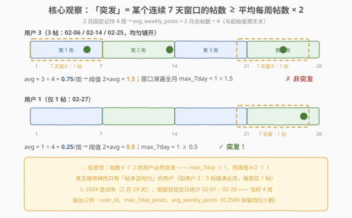
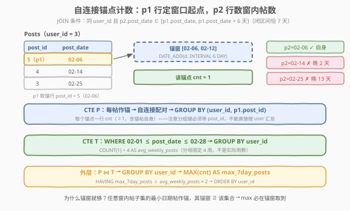
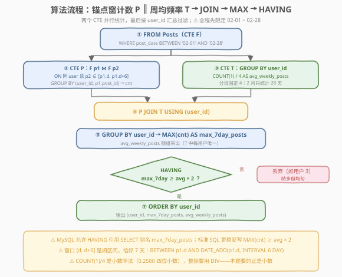
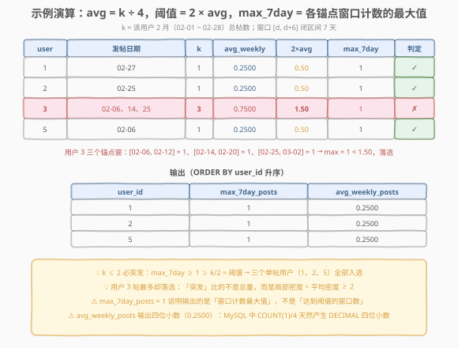

# LeetCode 查找突发行为 题解

## 1. 题目概述

- **标题 / 题号**：查找突发行为（#3089，medium）
- **链接**：https://leetcode.cn/problems/find-bursty-behavior/
- **难度**：中等
- **标签**：数据库、SQL、自连接、窗口函数、`RANGE` 窗口、日期函数、LeetCode 锁题

> ⚠️ 本题为 LeetCode 付费题（锁题），题意描述根据官方示例用例与外部资料重建，可能与官方题面有出入。（题面已与社区镜像 doocs/leetcode 的官方中文翻译交叉核对，示例输入输出与 GraphQL 接口返回一致，出入风险较低。）

**表结构**：`Posts`

| 列名 | 类型 |
|------|------|
| post_id | int |
| user_id | int |
| post_date | date |

- `post_id` 是这张表的主键（取值互不相同）。
- 每行表示某用户在某天发的一篇帖子（同一用户同一天可以有多篇）。

**目标**：编写一个解决方案，找到在 **2024 年 2 月**发帖行为中表现出**突发行为**的用户。**突发行为**指：该用户在 2024 年 2 月**存在一个连续 7 天**的时段，其发帖数量是该用户**平均每周**发帖数量的**至少两倍**。

**注意**：统计中只包含 2 月 1 日到 2 月 28 日——也就是说，应把 2 月记为**正好 4 周**。返回结果按 `user_id` **升序**排序，输出三列：`user_id`、`max_7day_posts`（该用户任意连续 7 天时段内的最大发帖数）、`avg_weekly_posts`（平均每周发帖数）。

**示例 1**：

```text
输入：
Posts 表：
+---------+---------+------------+
| post_id | user_id | post_date  |
+---------+---------+------------+
| 1       | 1       | 2024-02-27 |
| 2       | 5       | 2024-02-06 |
| 3       | 3       | 2024-02-25 |
| 4       | 3       | 2024-02-14 |
| 5       | 3       | 2024-02-06 |
| 6       | 2       | 2024-02-25 |
+---------+---------+------------+

输出：
+---------+----------------+------------------+
| user_id | max_7day_posts | avg_weekly_posts |
+---------+----------------+------------------+
| 1       | 1              | 0.2500           |
| 2       | 1              | 0.2500           |
| 5       | 1              | 0.2500           |
+---------+----------------+------------------+

解释：
- 用户 1：2 月只发了 1 帖，平均每周 0.25 帖；任意连续 7 天时段内最多 1 帖，
  1 ≥ 0.25 × 2 = 0.5，属于突发行为，入选。
- 用户 2、用户 5：与用户 1 相同（各 1 帖），同样的平均与最大 7 天发帖数，入选。
- 用户 3：虽然发的帖子最多（3 帖），但三个日期（02-06 / 02-14 / 02-25）彼此间隔
  8 天、11 天，任意连续 7 天时段内最多只有 1 帖；平均每周 0.75 帖，阈值
  0.75 × 2 = 1.5，而 1 < 1.5，未达到两倍，不入选。
输出表按 user_id 升序排序。
```

**约束条件**（依据示例与官方题面重建）：

- `post_id` 是主键，取值互不相同；
- `post_date` 为 `DATE` 类型，判题数据均落在 `2024-02-01` 至 `2024-02-28` 之间；
- 同一用户可以在同一天发多篇帖子（主键只有 `post_id`）；
- 结果按 `user_id` 升序返回。

> 💡 **审题关键**：① 平均每周发帖数 = 2 月（02-01 ~ 02-28）总帖数 **÷ 4**——分母固定为 4，不是实际周数，也与起始星期无关；2024 年是闰年（2 月有 29 天），但题面明确只统计 1–28 日，02-29 的帖子应排除；② 「存在一个连续 7 天的时段」是**存在性判定**，但输出列要求带回 `max_7day_posts`——即该用户**任意连续 7 天时段的最大发帖数**，判定式就是 $\text{max\_7day\_posts} \ge 2 \times \text{avg\_weekly\_posts}$；③ 阈值是带小数的（0.5、1.5），而窗口帖数是整数，比较是**数值比较**（整数 1 ≥ 0.5 成立），别做整数截断；④ 由此有个反直觉推论：帖数 $k \le 2$ 的用户**必然突发**（见 5.1），所以示例里单帖用户全部入选、发帖最多的用户 3 反而落选——这正是题目想教的事；⑤ 7 天窗口是**闭区间** $[d, d+6]$，恰好 7 天。

## 2. 解题思路

### 2.1 暴力思路：枚举全部 22 个日历窗口

2 月只统计 1–28 日，连续 7 天窗口的起点只有 02-01 到 02-22 共 **22 个**。最直觉的暴力：造一张 22 行的日历表，与用户做笛卡尔积，对每个「用户 × 窗口」数窗内帖子数，再按用户取最大值与阈值比较：

```sql
WITH RECURSIVE cal AS (          -- 22 个窗口起点
    SELECT DATE '2024-02-01' AS win_start
    UNION ALL
    SELECT win_start + INTERVAL 1 DAY FROM cal WHERE win_start < '2024-02-22'
)
-- cal ✕ (每用户) → 对每组合 COUNT(post_date BETWEEN win_start AND win_start + 6 DAY)
```

可行，但要先写递归 CTE 造日历、再 CROSS JOIN 用户集合、再相关性子查询计数——**为了一个最大值引入整张日历维度，笨重且易错**（窗口边界 ±1 天是这类题的高频 bug 点）。换个角度：我们并不关心「窗口从哪天开始」，只关心「窗口能罩住几篇帖子」——而能罩住最多帖子的窗口，起点根本不用猜。

### 2.2 核心观察：以帖为锚，最大窗口计数必在「锚点窗」取到



把「任意 7 天窗口」记为 $W = [s, s+6]$，它罩住的帖子集合为 $S$（可以为空）。**关键引理**：若 $S \neq \varnothing$，取 $d = \min_{x \in S} \text{date}(x)$（窗口内最早那篇帖子的日期），则：

$$
\forall x \in S:\; d \le x \le s+6 \le d+6 \;\;\Rightarrow\;\; S \subseteq [d,\, d+6]
$$

也就是说，**以「窗口内最早帖子」为起点的锚点窗，罩住的帖子只多不少**。于是：

> 用户在任意 7 天窗口下的最大帖数 = 该用户「以每篇帖子日期为起点的窗口」计数的最大值

据此得到无需日历表的做法——**自连接锚点计数**：



- `p1` 提供**锚行**：窗口起点 = `p1.post_date`；
- `p2` 提供**被数的行**：同一 `user_id` 且 `p2.post_date` 落在 $[\,p_1.\text{date},\; p_1.\text{date}+6\,]$ 内（锚帖自身天然在窗内，所以 `cnt ≥ 1`）；
- `GROUP BY (user_id, p1.post_id)`：**每个锚点一行** `cnt`；
- 外层按 `user_id` 取 `MAX(cnt)` 即 `max_7day_posts`。

另一条线很朴素：`avg_weekly_posts` = 该用户限定 02-01 ~ 02-28 后的帖子总数 ÷ 4。两条线按 `user_id` 汇合，套上判定式即可。

> ⚠️ **分组键为什么必须带 `p1.post_id`**：若自连接后直接 `GROUP BY user_id` 求 `COUNT`，得到的是「各锚点窗口计数之和」（同一个 `p2` 行会被多个锚点窗重复计入），既不是最大值也没有单窗口语义。必须**先每锚一行，再外层 MAX**——两层聚合的顺序不能省。

### 2.3 算法流程图



**逻辑执行步骤**：

| 步骤 | 子句 | 作用 |
|------|------|------|
| ① | CTE `F`：`WHERE post_date BETWEEN '2024-02-01' AND '2024-02-28'` | 统计口径先行：只保留 28 天内的帖子（闰年 02-29 天然排除） |
| ② | CTE `P`：`F p1 ⋈ F p2`（同 `user_id` 且 `p2` 落在 `[p1.d, p1.d+6]`），`GROUP BY (user_id, p1.post_id)` | 每个锚点一行 `cnt`：该锚点 7 天窗内的帖子数 |
| ③ | CTE `T`：`GROUP BY user_id`，`COUNT(1) / 4 AS avg_weekly_posts` | 每用户平均每周帖数，分母固定 4 |
| ④ | `P JOIN T USING (user_id)` | 锚点计数与周均频率对齐 |
| ⑤ | `GROUP BY user_id` → `MAX(cnt) AS max_7day_posts` | 任意 7 天窗口的最大帖数（引理保证锚点窗足够） |
| ⑥ | `HAVING max_7day_posts >= avg_weekly_posts * 2` | 突发判定：最大窗口密度 ≥ 2 × 平均密度 |
| ⑦ | `ORDER BY user_id` | 按题意升序输出 |

### 2.4 示例演算



对示例 1 的 6 行数据，先按用户归组再逐锚点数窗：

| 用户 | 发帖日期 | $k$ | $\text{avg}=k/4$ | 阈值 $2\times\text{avg}$ | 各锚点窗计数 | $\text{max\_7day}$ | 判定 |
|------|----------|-----|------------------|---------------------------|--------------|--------------------|------|
| 1 | 02-27 | 1 | 0.2500 | 0.50 | [02-27, 03-05] → 1 | 1 | $1 \ge 0.5$ ✓ |
| 2 | 02-25 | 1 | 0.2500 | 0.50 | [02-25, 03-03] → 1 | 1 | $1 \ge 0.5$ ✓ |
| 3 | 02-06 / 02-14 / 02-25 | 3 | 0.7500 | 1.50 | [02-06,02-12]→1、[02-14,02-20]→1、[02-25,03-02]→1 | 1 | $1 < 1.5$ ✗ |
| 5 | 02-06 | 1 | 0.2500 | 0.50 | [02-06, 02-12] → 1 | 1 | $1 \ge 0.5$ ✓ |

用户 3 的三篇帖子彼此间隔 8 天与 11 天，任何 7 天窗口最多罩住 1 篇；`HAVING` 将其过滤。幸存用户升序输出：

```text
user_id | max_7day_posts | avg_weekly_posts
1       | 1              | 0.2500
2       | 1              | 0.2500
5       | 1              | 0.2500
```

## 3. 参考代码

### SQL（解法 A：自连接锚点计数，推荐）

```sql
# Write your MySQL query statement below
WITH
    F AS (
        SELECT *
        FROM Posts
        WHERE post_date BETWEEN '2024-02-01' AND '2024-02-28'
    ),
    P AS (
        SELECT p1.user_id, p1.post_id, COUNT(1) AS cnt
        FROM F AS p1
        JOIN F AS p2
            ON p2.user_id = p1.user_id
            AND p2.post_date BETWEEN p1.post_date
                                 AND DATE_ADD(p1.post_date, INTERVAL 6 DAY)
        GROUP BY p1.user_id, p1.post_id
    ),
    T AS (
        SELECT user_id, COUNT(1) / 4 AS avg_weekly_posts
        FROM F
        GROUP BY user_id
    )
SELECT user_id, MAX(cnt) AS max_7day_posts, avg_weekly_posts
FROM P
JOIN T USING (user_id)
GROUP BY user_id
HAVING max_7day_posts >= avg_weekly_posts * 2
ORDER BY user_id;
```

> 💡 **写法要点**：
> - `F` 先把统计口径（02-01 ~ 02-28）钉死，`P`、`T` 都从 `F` 出发，避免「`T` 过滤了 2 月而 `P` 的窗口溢出到 3 月」的口径不一致；
> - `BETWEEN p1.post_date AND DATE_ADD(p1.post_date, INTERVAL 6 DAY)` 是**闭区间 7 天**（$d$ 到 $d+6$），锚帖自身必然计入，`cnt ≥ 1`；
> - `GROUP BY (user_id, p1.post_id)` 保证**每个锚点一行**，外层 `MAX(cnt)` 才是「任意 7 天窗口最大帖数」；
> - `COUNT(1) / 4` 是小数除法，MySQL 里天然产出 `0.2500` 这样的四位小数 DECIMAL，与判题期望格式吻合（整除运算符是 `DIV`，用错会丢小数）；
> - `HAVING` 里直接引用了 `SELECT` 别名 `max_7day_posts`——MySQL 的扩展语法，标准 SQL 更稳妥的写法是 `HAVING MAX(cnt) >= avg_weekly_posts * 2`。

### SQL（解法 B：`RANGE` 日期窗口函数，一行出计数）

```sql
# Write your MySQL query statement below
WITH
    F AS (
        SELECT *
        FROM Posts
        WHERE post_date BETWEEN '2024-02-01' AND '2024-02-28'
    ),
    W AS (
        SELECT
            user_id,
            COUNT(1) OVER (
                PARTITION BY user_id
                ORDER BY post_date
                RANGE BETWEEN INTERVAL 6 DAY PRECEDING AND CURRENT ROW
            ) AS cnt7
        FROM F
    ),
    T AS (
        SELECT user_id, COUNT(1) / 4 AS avg_weekly_posts
        FROM F
        GROUP BY user_id
    )
SELECT user_id, MAX(cnt7) AS max_7day_posts, avg_weekly_posts
FROM W
JOIN T USING (user_id)
GROUP BY user_id
HAVING max_7day_posts >= avg_weekly_posts * 2
ORDER BY user_id;
```

> 💡 **`RANGE` 窗口的语义**：`RANGE BETWEEN INTERVAL 6 DAY PRECEDING AND CURRENT ROW` 按**日期值**（而非行号）划定框架——当前行拿到的是「日期落在 $[d-6, d]$ 内的同户帖子数」，即一个**以当前帖为终点的 7 天窗**计数。对「窗终点」取最大与对「窗起点」取最大是对称的（引理 2.2 的镜像版），`MAX(cnt7)` 同样等于 `max_7day_posts`。它还天然处理**同日多帖**（peers 全部计入框架）与**跳日**（按日期差而非行偏移），这正是 `ROWS BETWEEN 6 PRECEDING` 做不到的。要求 MySQL 8.0+。

### Pandas

```python
import pandas as pd


def find_bursty_behavior(posts: pd.DataFrame) -> pd.DataFrame:
    feb = posts[posts["post_date"].between("2024-02-01", "2024-02-28")].copy()
    feb["post_date"] = pd.to_datetime(feb["post_date"])

    # P：自连接按锚点数 7 天窗（p1 定起点，p2 落在 [d, d+6]）
    p = feb.merge(feb, on="user_id", suffixes=("_1", "_2"))
    p = p[p["post_date_2"].between(p["post_date_1"], p["post_date_1"] + pd.Timedelta(days=6))]
    p = (
        p.groupby(["user_id", "post_id_1"]).size().reset_index(name="cnt")
         .groupby("user_id")["cnt"].max().reset_index(name="max_7day_posts")
    )

    # T：平均每周帖数（分母固定 4）
    t = feb.groupby("user_id").size().div(4).reset_index(name="avg_weekly_posts")

    ans = p.merge(t, on="user_id")
    ans = ans[ans["max_7day_posts"] >= ans["avg_weekly_posts"] * 2]
    return (
        ans[["user_id", "max_7day_posts", "avg_weekly_posts"]]
        .sort_values("user_id")
        .reset_index(drop=True)
    )
```

> 💡 **pandas 对照**：`merge(on="user_id", suffixes=("_1","_2"))` 就是自连接，`between` 同时完成两端比较；`groupby(["user_id","post_id_1"]).size()` 对应「每锚一行 cnt」，其后的 `groupby("user_id")["cnt"].max()` 对应外层 `MAX`——**两层 groupby 的顺序与 SQL 完全同构**。判题环境 `post_date` 列可能是字符串 dtype，先 `pd.to_datetime` 统一成日期型，`+ pd.Timedelta(days=6)` 才不会报错。

## 4. 复杂度分析

设 $n$ 为 `Posts` 行数，用户 $u$ 的帖子数为 $k_u$（$\sum_u k_u = n$）。

| 维度 | 复杂度 | 说明 |
|------|--------|------|
| **时间（解法 A）** | $O\!\left(\sum_u k_u^2\right)$，最坏 $O(n^2)$ | 同一用户的 $k_u$ 篇帖子两两配对成候选行，单用户集中发帖时配对数平方膨胀；`BETWEEN` 范围条件无法像等值条件那样完全走索引收敛 |
| **时间（解法 B）** | $O(n \log n)$ | 窗口函数按 `(user_id, post_date)` 分区排序，框架滑动均摊 $O(1)$，一行直接得到窗计数 |
| **空间** | $O(n)$ | CTE 物化：A 为自连接中间行（最坏 $O(n^2)$ 溢出到磁盘缓冲），B 为排序缓冲 + 窗口列 |

> - LeetCode 判题数据小（示例仅 6 行），两种解法都毫秒级；差异体现在可扩展性：数万用户、单用户数千帖的生产表上，解法 B 的窗口函数明显优于自连接。
> - **索引建议**：`(user_id, post_date)` 复合索引与两个解法的访问路径完全同构——等值定位用户 + 范围扫日期，能把自连接的候选圈死在同户区间内。

## 5. 扩展

### 5.1 反直觉推论：帖数 $k \le 2$ 的用户必然「突发」

阈值 $= 2 \times (k/4) = k/2$，而只要 $k \ge 1$ 就有 $\text{max\_7day} \ge 1$（锚帖自身总在窗内）：

$$
k = 1:\; 1 \ge 0.5 \;\checkmark \qquad k = 2:\; 1 \ge 1 \;\checkmark \qquad k = 3:\; \text{需要 } \text{max\_7day} \ge 1.5 \Leftrightarrow \text{某窗内有} \ge 2 \text{帖}
$$

所以**真正会被筛掉的只有 $k \ge 3$ 且发帖均匀的用户**（示例的用户 3 正是 3 帖等距铺开）。这是「比率型异常检测」的通病：低频用户的分母太小，一帖就把比率顶上天。**业务口径**通常会加最小样本量下限，例如：

```sql
HAVING COUNT(1) >= 3 AND max_7day_posts >= avg_weekly_posts * 2
```

面试时主动指出这一数据洞察并给出修正口径，比单纯写对 SQL 更加分。

### 5.2 `RANGE` vs `ROWS`：日期窗口必须按值偏移

- `ROWS BETWEEN 6 PRECEDING AND CURRENT ROW`：按**行号**偏移——数的是「前 6 行 + 当前行」。同一天发多帖时，7 个行号可能只覆盖 1~2 天；日期稀疏时又可能覆盖十几天，语义完全错位；
- `RANGE BETWEEN INTERVAL 6 DAY PRECEDING AND CURRENT ROW`：按**日期值**偏移——真正的「过去 7 天」，且 `ORDER BY post_date` 下的同日 peers 全部计入框架，同日多帖不重不漏。

凡是「窗口宽度是时间跨度而非行数」的题（近 7 天、近 30 天活跃度），`RANGE + INTERVAL` 都是第一选择；不支持该语法的引擎（旧版 MySQL 5.x、部分数仓）退回自连接（解法 A）即可。

### 5.3 变体：「任意连续 k 天」家族的三个套路

| 变体 | 问法 | 套路 |
|------|------|------|
| 本题 | 任意 7 天窗口最大计数 ≥ 阈值？ | 以帖为锚的窗口计数（自连接 / `RANGE` 窗口）+ `MAX` + `HAVING` |
| [1454. 活跃用户](https://leetcode.cn/problems/active-users/) | 连续 5 天每天都有登录？ | 相邻日期差分 + 连续段（gaps and islands） |
| [601. 体育馆的人流量](https://leetcode.cn/problems/human-traffic-of-stadium/) | 连续三条（日期相邻）记录？ | 自连接三元组 / `LAG` 差分判连续 |

区分「**任意 k 天窗口**」（本题，窗口内计数）与「**连续 k 天**」（每天都要有，判相邻差为 1）是两回事，面试常被混着问。

## 6. 面试要点

1. **平均每周发帖数的分母为什么是 4？2024 年 2 月有 29 天怎么办？**

   > 题面明确规定只统计 02-01 到 02-28——恰好 4 周，分母固定为 4，与实际的星期分布无关。2024 是闰年，若数据中出现 02-29 的帖子，按题意应**排除**：所以参考代码先用 CTE `F` 统一 `WHERE post_date BETWEEN '2024-02-01' AND '2024-02-28'`，让 `P`、`T` 两条统计线口径一致。

2. **「任意连续 7 天窗口的最大帖数」为什么不用枚举 22 个日历起点？自连接为什么等价？**

   > 由引理：任意窗口罩住的帖子集 $S$ 的最早日期 $d$ 满足 $S \subseteq [d, d+6]$，即「以窗口内最早帖为锚」的窗口只会罩住更多。所以最大计数必在**以某篇真实帖子为起点**的窗口取到，自连接按 `(user_id, post_id)` 分组逐锚计数再 `MAX` 即可，无需日历表。

3. **自连接后为什么要 `GROUP BY (user_id, p1.post_id)`，直接 `GROUP BY user_id` 行不行？**

   > 不行。直接按用户分组得到的 `COUNT` 是「各锚点窗计数之和」——同一篇 `p2` 帖会被它之前的每个锚点窗重复计入，既非最大值也无单窗口语义。必须先**每锚一行 cnt**，外层再 `MAX`。这是两层聚合（细粒度分组 → 粗粒度聚合）的经典顺序问题。

4. **`COUNT(1) / 4` 在 MySQL 里是整数除法吗？输出为什么正好是 0.2500？**

   > 不是。MySQL 的 `/` 是**小数除法**，整数相除得到 DECIMAL（默认标度 4 位），`1/4 = 0.2500`、`3/4 = 0.7500`，与判题期望的四位小数格式天然吻合；`DIV` 才是整除运算符，`1 DIV 4 = 0` 会把小数全部丢掉。另外阈值比较 `cnt >= avg * 2` 是数值比较（整数与 DECIMAL 直接比），不存在截断问题。

5. **`HAVING` 里直接写 `max_7day_posts`（`SELECT` 别名）合法吗？`RANGE` 和 `ROWS` 窗口有何区别？**

   > MySQL 扩展允许 `HAVING`/`ORDER BY` 引用 `SELECT` 别名，判题可用；但标准 SQL 的逻辑顺序里 `HAVING` 先于 `SELECT`，可移植写法是 `HAVING MAX(cnt) >= avg_weekly_posts * 2`。`ROWS` 按**行号**偏移（前 6 行），`RANGE BETWEEN INTERVAL 6 DAY PRECEDING` 按**日期值**偏移（过去 7 天）——时间窗口必须用后者，同日多帖与日期稀疏时 `ROWS` 语义错位。

> 💡 **一句话总结**：3089 是「**锚点窗口计数 + 比率阈值判定**」的组合题——引理把「任意 7 天窗口」收敛到「以帖子为锚的窗口」，自连接（或 `RANGE INTERVAL` 窗口）逐锚计数取 `MAX` 得 `max_7day_posts`，总量 ÷ 4 得 `avg_weekly_posts`，`HAVING max ≥ 2 × avg` 收工；能讲清「每锚一行的两层聚合」与「$k \le 2$ 必突发」的比率陷阱，本题考点就全踩到了。

## 同类练习题

| # | 题目 | 与本题的关联 |
|---|------|-------------|
| 1454 | [活跃用户](https://leetcode.cn/problems/active-users/)（[题解](../1401-1500/1454_活跃用户.md)） | 连续 5 天登录判定——「连续 k 天每天都有」与本题「任意 k 天窗口计数」是镜像变体，注意区分 |
| 601 | [体育馆的人流量](https://leetcode.cn/problems/human-traffic-of-stadium/)（[题解](../0601-0700/601_体育馆的人流量.md)） | 找连续三条日期相邻的记录——自连接判日期连续的经典三件套 |
| 550 | [游戏玩法分析 IV](https://leetcode.cn/problems/game-play-analysis-iv/)（[题解](../0501-0600/550_游戏玩法分析IV.md)） | `LAG` 相邻日期差分 + 存在性去重——时间序列一维化后逐行比较的入门题 |
| 197 | [上升的温度](https://leetcode.cn/problems/rising-temperature/)（[题解](../0101-0200/197_上升的温度.md)） | `DATEDIFF` 自连接与昨天比较——本题解法 A 的同款骨架、最小规模版本 |
| 1141 | [查询近30天活跃用户数](https://leetcode.cn/problems/user-activity-for-the-past-30-days-i/)（[题解](../1101-1200/1141_查询近30天活跃用户数.md)） | 日期范围口径 + 分组计数——先钉死统计窗口再聚合，对应本题 CTE `F` 的口径意识 |
