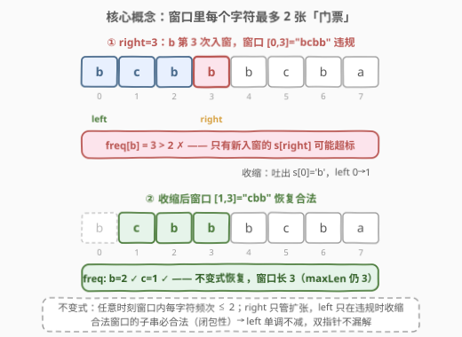
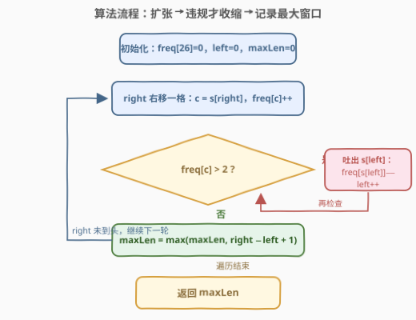
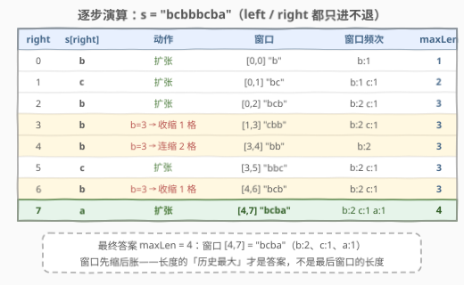

# 每个字符最多出现两次的最长子字符串

- **题目名称**：每个字符最多出现两次的最长子字符串
- **链接**：[3090. 每个字符最多出现两次的最长子字符串](https://leetcode.cn/problems/maximum-length-substring-with-two-occurrences/)
- **难度**：简单
- **标签**：哈希表、字符串、滑动窗口

## 1. 题目概述

给你一个字符串 `s`，请找出满足**每个字符最多出现两次**的最长子字符串，并返回该子字符串的**最大**长度。

**示例 1**：

```text
输入：s = "bcbbbcba"
输出：4
解释：子串 "bcba"（b 出现 2 次、c 和 a 各 1 次）长度为 4，
     是满足每个字符最多出现两次的最长子串。
```

**示例 2**：

```text
输入：s = "aaaa"
输出：2
解释：子串 "aa" 长度为 2，'a' 恰好出现两次。
```

**约束条件**：

- $2 \le s.length \le 100$
- `s` 仅由小写英文字母组成

> 💡 本题是 [3. 无重复字符的最长子串](https://leetcode.cn/problems/longest-substring-without-repeating-characters/) 的直接泛化：把「每个字符**至多出现 1 次**」放宽为「至多出现 **2 次**」，套路完全同源。

---

## 2. 解题思路

### 2.1 暴力思路

枚举每个起点 `i`，向右扩展终点 `j`，用长度 26 的频率数组计数；一旦某个字符频次超过 2 就停止扩展（终点再往右的子串必然也违规）。时间复杂度 $O(n^2)$，$n \le 100$ 时约 $10^4$ 次操作，完全可以通过——官方 hints 也点名了这条路。若每次扩展后整段重新检查，则是 $O(n^3)$。面试中最好还是给出线性做法。

### 2.2 核心观察：滑动窗口 + 频率表



关键直觉是维护一个**每个字符频次都不超过 2 的窗口** `[left, right]`：

- `right` 不断右移，把新字符纳入窗口：`freq[s[right]]++`。
- 窗口合法时（所有字符频次 $\le 2$），用窗口宽度 `right - left + 1` 更新答案。
- 一旦 `freq[s[right]]` 变成 3，说明**只有这个新字符**打破了不变式——让 `left` 右移逐格吐出字符，直到窗口里 `s[right]` 只剩 2 个，不变式恢复。

> 为什么收缩时只检查 `s[right]` 一个字符的频次？因为本轮之前窗口满足「所有字符 $\le 2$」，唯一的变化就是新加入的 `s[right]`；其他字符的频次在收缩中只会**减少**，不可能违规。这是「每个字符至多 K 次」类滑窗的通用性质。

> 💡 正确性依托于**合法性的闭包性质**：合法窗口的任意子串也合法。因此对每个 `right` 存在最小的合法起点 $L(\text{right})$，且它随 `right` 单调不减——双指针维护的正是这个 $L$，不会漏解。

### 2.3 算法流程图



一重循环 + 均摊收缩：每个字符至多进窗一次、出窗一次，两个指针总移动次数不超过 $2n$。

### 2.4 示例演算



上表逐步展示了 `s = "bcbbbcba"` 的完整执行过程：

- `right = 0..2` 窗口一路扩张到 `"bcb"`，`maxLen = 3`。
- `right = 3` 时 `b` 第 3 次入窗（`[0,3] = "bcbb"` 违规），吐出 `s[0]` 后窗口变为 `"cbb"`，长度仍为 3。
- `right = 4` 时又是 `b`，需连吐 `s[1]、s[2]` 两个字符，窗口缩成 `"bb"`。
- `right = 7` 时 `a` 入窗，窗口 `[4,7] = "bcba"`，长度 4，即最终答案。

---

## 3. 参考代码

### C++

```cpp
class Solution {
  public:
    int maximumLengthSubstring(string s) {
        int freq[26] = {0};
        int left = 0, max_len = 0;

        for (int right = 0; right < (int)s.size(); right++) {
            int c = s[right] - 'a';
            freq[c]++;                    // 新字符入窗
            while (freq[c] > 2) {         // 只有 s[right] 可能超标
                freq[s[left] - 'a']--;    // 吐出最左字符
                left++;
            }
            max_len = max(max_len, right - left + 1);
        }

        return max_len;
    }
};
```

### Python

```python
class Solution:
    def maximumLengthSubstring(self, s: str) -> int:
        freq = [0] * 26
        left = 0
        max_len = 0

        for right, ch in enumerate(s):
            c = ord(ch) - ord('a')
            freq[c] += 1
            while freq[c] > 2:                     # 只有 s[right] 可能超标
                freq[ord(s[left]) - ord('a')] -= 1  # 吐出最左字符
                left += 1
            max_len = max(max_len, right - left + 1)

        return max_len
```

> ⚠️ **注意**：收缩循环的条件是 `freq[c] > 2`，其中 `c` 固定为本轮的 `s[right]`。不要写成「每轮扫描整个 `freq` 表找超标字符」——既多余，也破坏了均摊 $O(n)$ 的分析。

---

## 4. 复杂度分析

| 维度 | 复杂度 | 说明 |
|------|--------|------|
| 时间复杂度 | $O(n)$ | `left`、`right` 各至多前进 $n$ 步；每个字符至多入窗、出窗各一次 |
| 空间复杂度 | $O(\|\Sigma\|) = O(26)$ | 频率数组大小只与小写字母集相关，视为 $O(1)$ |

---

## 5. 扩展：泛化为「每个字符至多出现 K 次」

把收缩条件 `freq[c] > 2` 改成 `freq[c] > k`，即得通用模板：

```cpp
int longestAtMostK(const string& s, int k) {
    int freq[26] = {0}, left = 0, best = 0;
    for (int right = 0; right < (int)s.size(); right++) {
        int c = s[right] - 'a';
        freq[c]++;
        while (freq[c] > k) freq[s[left++] - 'a']--;
        best = max(best, right - left + 1);
    }
    return best;
}
```

- `k = 1` 时即第 3 题「无重复字符的最长子串」。
- 想让收缩「直接跳」而非逐格吐出，可用哈希表为每个字符维护窗口内的**出现位置队列**：违规时 `left` 直接跳到该字符在窗口内第 1 次出现位置的下一位。复杂度仍是 $O(n)$，只是常数更小、代码更长，一般没必要。

---

## 6. 面试要点

1. **为什么收缩时只检查 `s[right]` 的频次？**

   - 入窗前窗口满足不变式（所有字符 $\le 2$），本轮唯一的变化是新加入的 `s[right]`；收缩只会让其他字符的频次变小，永远不可能让它们违规。所以判断 `freq[s[right]] > 2` 一个条件就够了。

2. **`left` 逐格收缩和第 3 题「直接跳」有什么区别？**

   - 第 3 题重复字符唯一，`left` 可以直接跳到「上次出现位置 + 1」。本题频次到 3 时，要吐到该字符在窗口内**第 1 次出现**为止，中间其他字符也被顺带吐出（它们的频次只减不增，依然合法）。逐格收缩写法最简单，均摊复杂度不变。

3. **如何证明双指针不会漏掉最优解？**

   - 合法性具有闭包性质：合法窗口的任意子串也合法。对每个 `right` 记最小合法起点为 $L(\text{right})$，则 $L$ 单调不减——`right` 右移后更小的 `left` 只会更不合法。双指针维护的正是 $L(\text{right})$，因而对每个 `right` 都取到了以其为右端点的最长合法子串。

4. **本题与 159「至多包含两个不同字符」的区别？**

   - 159 限制的是字符**种类数** $\le 2$（需统计窗口内不同字符的个数，种类超标才收缩）；本题限制的是**每个字符的频次** $\le 2$（只需盯住新入窗的字符）。两者收缩条件、计数方式都不同，是很好的对照题。

5. **如果字符集是 Unicode（中文、emoji 等）怎么办？**

   - 频率数组换成 `unordered_map` / `dict`，逻辑不变；时间复杂度不变，空间变为 $O(\min(n, |\Sigma|))$。

---

## 7. 同类练习题

- [3. 无重复字符的最长子串](https://leetcode.cn/problems/longest-substring-without-repeating-characters/)：本题 $k=1$ 的特例，同一模板改一个常数即可
- [159. 至多包含两个不同字符的最长子串](https://leetcode.cn/problems/longest-substring-with-at-most-two-distinct-characters/)：「两个**不同**字符」≠「每个字符**两次**」，注意两种约束的收缩条件差异
- [424. 替换后的最长重复字符](https://leetcode.cn/problems/longest-repeating-character-replacement/)：同为「窗口违规才收缩」的滑窗，用窗口内最大频次维护不变式
- [2953. 统计完全子字符串](https://leetcode.cn/problems/count-complete-substrings/)：进阶版——每个字符**恰好**出现 $k$ 次，还需结合相邻字符差约束做滑窗/分治
