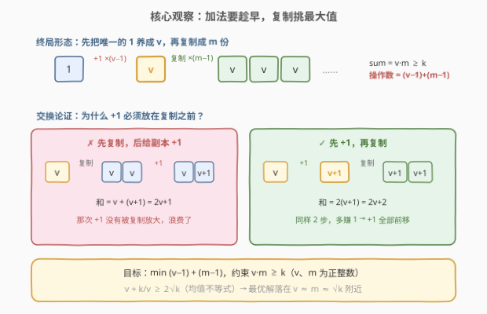
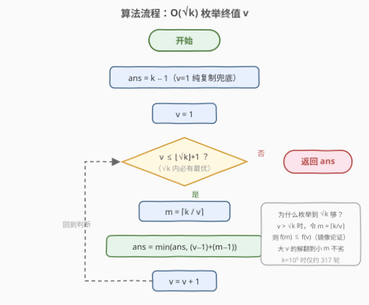

# 执行操作使数据元素之和大于等于K

- **题目名称**：执行操作使数据元素之和大于等于 K
- **链接**：[3091. 执行操作使数据元素之和大于等于 K](https://leetcode.cn/problems/apply-operations-to-make-sum-of-array-greater-than-or-equal-to-k/)
- **难度**：中等
- **标签**：贪心、数学、枚举
- **核心套路**：交换论证定形终局（先加后复制）+ 均值不等式缩枚举范围（$O(\sqrt{k})$）

## 1. 题目概述

给你一个**正整数** $k$。最初，你有一个数组 $\text{nums} = [1]$。可以对数组执行以下**任意**操作**任意**次数（可能为零）：

1. 选择数组中的**任何一个元素**，然后将它的值**增加 1**；
2. **复制**数组中的任何一个元素，然后将它**附加到数组的末尾**。

返回使得最终数组元素之**和**大于或等于 $k$ 所需的**最少**操作次数。

**示例 1**：

```text
输入：k = 11
输出：5
解释：将元素 +1 三次得 nums = [4]；复制元素两次得 nums = [4,4,4]。
      和 = 12 ≥ 11，总操作次数 = 3 + 2 = 5。
```

**示例 2**：

```text
输入：k = 1
输出：0
解释：原始数组的和已经 ≥ 1，不需要操作。
```

**约束条件**：

- $1 \le k \le 10^5$

---

## 2. 解题思路

### 2.1 暴力思路

数组状态是一个任意多重集，两种操作可无限执行，**状态空间无界**，直接 BFS/记忆化搜索无从下手。朴素的改进是**枚举终局形态**：直觉上最优策略是「把唯一的 1 加到某个值 $v$，再复制出 $m$ 份」，于是枚举 $v \in [1, k]$，对每个 $v$ 取最小份数 $m = \lceil k/v \rceil$，代价 $(v-1) + (m-1)$，$O(k)$ 出答案。

但这留下两个问题：**为什么终局一定长这样**（加法与复制的顺序、加法分给谁）？**枚举能否再快**？——分别用交换论证与均值不等式解决。

### 2.2 核心观察：加法要趁早，复制挑最大值



**观察一（$+1$ 必须在复制之前）**：对值 $v$ 的元素，比较同样花 2 步的两种顺序：

- ✗ 先复制再给副本 $+1$：得 $\{v,\ v+1\}$，和为 $2v+1$；
- ✓ 先 $+1$ 再复制：得 $\{v+1,\ v+1\}$，和为 $2v+2$。

先加后复制**多赚 1**——本质是「加法在被复制放大之前生效」。任何「复制之后才加」的操作序列，都可以把这个 $+1$ 沿复制树**上移**到复制之前：操作数不变、和不减。因此 **WLOG 所有加法先做**。

**观察二（加法集中、复制挑最大）**：复制小值被复制大值**支配**（多花 1 步拷出来的数不大于拷最大值）。所有加法前置后，数组里只有一个「养大的」值 $v = 1 + x$（$x$ 为加法次数），复制它即可。于是 $x$ 次加法 + $y$ 次复制的**最大可达和**为 $(1+x)(1+y)$（严格证明见第 5 节）。

**转化为整数优化**：令 $v = 1 + x$、$m = 1 + y$，问题变为

$$\min\ (v - 1) + (m - 1) \quad \text{s.t.} \quad v \cdot m \ge k,\quad v, m \in \mathbb{Z}^+.$$

固定 $v$ 时代价随 $m$ 递增，取最小可行份数 $m = \lceil k / v \rceil$，得单变量函数

$$f(v) = (v - 1) + \left(\lceil k/v \rceil - 1\right).$$

**枚举到 $\sqrt{k}$ 就够**：若 $v > \sqrt{k}$，令 $m = \lceil k/v \rceil \le \lfloor\sqrt{k}\rfloor + 1$，则 $\lceil k/m \rceil \le v$，于是 $f(m) \le f(v)$——大 $v$ 的解**镜像**到小 $m$ 不劣。故只需枚举 $v \in [1, \lfloor\sqrt{k}\rfloor + 1]$，时间 $O(\sqrt{k})$。直观上这正是均值不等式 $v + k/v \ge 2\sqrt{k}$：两边成本此消彼长，最优解落在 $v \approx m \approx \sqrt{k}$ 附近。

> 💡 $k = 1$ 时 $v = m = 1$，$f(1) = 0$，公式**自然覆盖**「不操作」的边界，无需特判。

### 2.3 算法流程图



初始化 `ans = k - 1`（即 $v = 1$ 纯复制的兜底方案），随后 $v$ 从 1 枚举到 $\lfloor\sqrt{k}\rfloor + 1$，每轮计算 $m = \lceil k/v \rceil$ 并更新 `ans = min(ans, (v-1) + (m-1))`。$k \le 10^5$ 时循环至多约 **317** 次。

### 2.4 示例演算


以 $k = 11$ 走一遍：$\lfloor\sqrt{11}\rfloor + 1 = 4$，枚举 $v \in [1, 4]$：

| $v$ | $m = \lceil 11/v \rceil$ | 操作数 $(v-1)+(m-1)$ | 说明 |
|-----|--------------------------|----------------------|------|
| 1 | 11 | 10 | 纯复制，不加值 |
| 2 | 6 | 6 | 加太少，复制吃亏 |
| **3** | **4** | **5** ✓ | $[3,3,3,3]$，和 12 |
| **4** | **3** | **5** ✓ | $[4,4,4]$，即示例 1 的方案 |
| 5 | 3 | 6 | 超出枚举上界（镜像论证无需再看） |

最小值 $\text{ans} = 5$，$v = 3$ 与 $v = 4$ 并列取到。$v$ 再增大时加法成本压过复制收益，$f(v)$ 回升。

---

## 3. 参考代码

### C++

```cpp
class Solution {
  public:
    int minOperations(int k) {
        int ans = k - 1;                       // v = 1：纯复制兜底
        int lim = (int)sqrt((double)k) + 1;    // 枚举上界 ⌊√k⌋+1
        for (int v = 1; v <= lim; ++v) {
            int m = (k + v - 1) / v;           // ⌈k/v⌉ 份
            ans = min(ans, (v - 1) + (m - 1));
        }
        return ans;
    }
};
```

### Python

```python
from math import isqrt

class Solution:
    def minOperations(self, k: int) -> int:
        ans = k - 1                            # v = 1：纯复制兜底
        for v in range(1, isqrt(k) + 2):       # 枚举到 ⌊√k⌋+1
            m = (k + v - 1) // v               # ⌈k/v⌉ 份
            ans = min(ans, (v - 1) + (m - 1))
        return ans
```

> 💡 `(k + v - 1) / v` 是整数写法的 $\lceil k/v \rceil$。循环第一轮 $v = 1$ 就覆盖了初始化的兜底值，`ans` 也可初始化为任意大数。

---

## 4. 复杂度分析

| 维度 | 复杂度 | 说明 |
|------|--------|------|
| 时间复杂度 | $O(\sqrt{k})$ | 枚举 $v \in [1, \lfloor\sqrt{k}\rfloor+1]$，$k = 10^5$ 时约 317 轮 |
| 空间复杂度 | $O(1)$ | 只用常数个变量 |

> 💡 若不放心 $\sqrt{k}$ 截断，直接枚举 $v \in [1, k]$ 的 $O(k)$ 版本同样通过（$k \le 10^5$），两者答案已互相验证一致。

---

## 5. 扩展：最大可达和 $(1+x)(1+y)$ 的归纳证明

设已用 $a$ 次加法、$b$ 次复制，归纳断言：**任意时刻 $\text{sum} \le (1+a)(1+b)$**。

- **基础**：初始 $\text{sum} = 1 = (1+0)(1+0)$ ✓。
- **加法**（$a \to a+1$）：$\text{sum}' \le (1+a)(1+b) + 1 \le (2+a)(1+b)$（因 $b \ge 0$）✓。
- **复制**（$b \to b+1$）：任何元素的值 $\le 1 + a$（它的值 = 初始 1 + 其「血统链」上分到的加法次数 $\le a$），故 $\text{sum}' \le (1+a)(1+b) + (1+a) = (1+a)(2+b)$ ✓。

而「$x$ 次加法全加在 1 上、再复制 $y$ 次」恰好**取到** $(1+x)(1+y)$，说明该上界紧致。于是「$\text{sum} \ge k$」$\iff$ 存在 $v = 1+x,\ m = 1+y$ 使 $v \cdot m \ge k$，2.2 节的整数优化完全等价于原问题。∎

> ⚠️ 常见的直觉错误是「复制比加法划算，尽量多复制」（即 $v$ 取很小）或「一路加到 $k$」（即 $m = 1$）——两者分别对应表中 $v = 1$（代价 $k-1$）与 $v = k$（代价 $k-1$）的最差方案，正确答案在中间 $v \approx \sqrt{k}$ 处。

---

## 6. 面试要点

1. **为什么不能直接 BFS 模拟操作序列？**

   - 状态是任意多重集、操作可无限执行，状态空间无界；$k$ 只约束「和」，不约束单元素值与数组长度，必须先刻画终局形态再计数。

2. **为什么所有 $+1$ 必须放在复制之前？加法为什么要集中在一个元素上？**

   - 交换论证：先复制后给副本 $+1$ 得和 $2v+1$，先 $+1$ 再复制得 $2v+2$，同样 2 步后者严格更优；$+1$ 沿复制树上移不增操作数、不减和。集中加法 + 复制最大值使 $x$ 次加法、$y$ 次复制的和达到上界 $(1+x)(1+y)$（归纳可证）。

3. **枚举上界为什么取 $\lfloor\sqrt{k}\rfloor + 1$ 就够？**

   - 镜像论证：$v > \sqrt{k}$ 时令 $m = \lceil k/v \rceil \le \lfloor\sqrt{k}\rfloor + 1$ 且 $\lceil k/m \rceil \le v$，则 $f(m) \le f(v)$，大 $v$ 的最优解翻到小 $m$ 不劣。配合均值不等式 $v + k/v \ge 2\sqrt{k}$，最优解必在 $\sqrt{k}$ 邻域。

4. **公式里 $m$ 为什么直接取 $\lceil k/v \rceil$？**

   - 固定终值 $v$ 时代价 $(v-1)+(m-1)$ 关于 $m$ 严格递增，而约束只需 $v \cdot m \ge k$，故取最小可行份数即可，无需再枚举 $m$。

5. **本题与「坏的计算器」（991）一族有什么联系？**

   - 同属「**乘法放大要趁早**」家族：991 是 $x \to 2x$ 与 $x \to x-1$ 双向可达性，正难则反逆向贪心；本题是正向定形终局后枚举。2139（翻倍与加一到 target）、1558（全局 +1 与 $\times 2$）都是同款交换论证的变体。

---

## 7. 同类练习题

- [2139. 得到目标值的最少行动次数](https://leetcode.cn/problems/minimum-moves-to-reach-target-score/)：「加 1 与翻倍达到 target，翻倍要趁早」，同款交换论证的正向贪心
- [991. 坏了的计算器](https://leetcode.cn/problems/broken-calculator/)：正难则反，从 target 逆向 $\div 2$ / $-1$ 贪心，与「先加后复制」互为镜像思路
- [1558. 得到目标数组的最少函数调用次数](https://leetcode.cn/problems/minimum-numbers-of-function-calls-to-make-target-array/)：全局 +1 与 $\times 2$ 的最少调用次数 = 各位二进制 1 个数之和 + 最高位 − 1，同属「乘法摊薄加法成本」
- [2571. 使整数为 0 的最少操作次数](https://leetcode.cn/problems/minimum-operations-to-reduce-an-integer-to-0/)：拆 2 的幂贪心，另一道「用最少的放大/缩小操作凑目标值」的数学贪心
