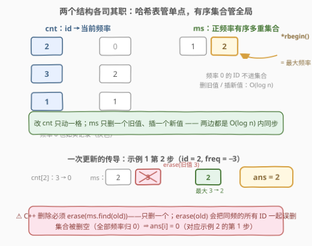
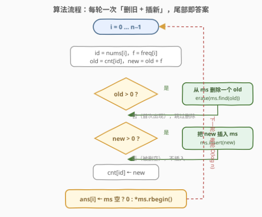
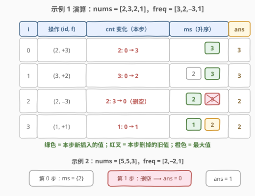

# 最高频率的ID

- **题目名称**：最高频率的 ID
- **链接**：[3092. 最高频率的 ID](https://leetcode.cn/problems/most-frequent-ids/)
- **难度**：中等
- **标签**：数组、哈希表、有序集合、堆（优先队列）

## 1. 题目概述

在一个集合里动态记录 ID 的出现频率。给两个长度都为 $n$ 的整数数组 `nums` 和 `freq`，`nums[i]` 表示一个 ID，`freq[i]` 表示第 $i$ 步操作后这个 ID 在集合中需要**增加或减少**的数目：

- `freq[i]` 为**正**：向集合添加 `freq[i]` 个值为 `nums[i]` 的元素；
- `freq[i]` 为**负**：从集合删除 `-freq[i]` 个值为 `nums[i]` 的元素。

返回长度为 $n$ 的数组 `ans`，其中 `ans[i]` 表示第 $i$ 步操作后出现**频率最高**的 ID 的**数目**；若操作后集合为空，则 `ans[i] = 0`。

**示例 1**：

```text
输入：nums = [2,3,2,1], freq = [3,2,-3,1]
输出：[3,3,2,2]
解释：
第 0 步后：3 个 id=2                      → ans[0] = 3
第 1 步后：3 个 id=2、2 个 id=3            → ans[1] = 3
第 2 步后：2 个 id=3                       → ans[2] = 2
第 3 步后：2 个 id=3、1 个 id=1            → ans[3] = 2
```

**示例 2**：

```text
输入：nums = [5,5,3], freq = [2,-2,1]
输出：[2,0,1]
解释：第 1 步把 id=5 删空，集合为空 → ans[1] = 0。
```

**约束条件**：

- $1 \le \text{nums.length} = \text{freq.length} \le 10^5$
- $1 \le \text{nums[i]} \le 10^5$
- $-10^5 \le \text{freq[i]} \le 10^5$，且 `freq[i] != 0`
- 输入保证任何操作后，集合中的元素出现次数不会为负。

> ⚠️ 读题陷阱：一是答案问的是**最高频率的数目**，不是 ID 本身；二是同一 ID 的频率可以被反复加减，单次累加最大可达 $10^5 \times 10^5 = 10^{10}$，**必须用 64 位整数**；三是"集合为空"要输出 0（示例 2 第 1 步）。

---

## 2. 解题思路

### 2.1 暴力思路：每步全量扫最大

用哈希表 `cnt` 把每个 ID 的当前频率维护起来，每步 $O(1)$ 更新 `cnt[nums[i]] += freq[i]`；然后**扫一遍整个哈希表**取最大值作为 `ans[i]`。

问题在于不同 ID 数最坏 $\sim n = 10^5$ 个，每步取最大值 $O(n)$，总代价 $O(n^2) = 10^{10}$，必然超时。瓶颈很明确：**单点更新很快，全局最大值查询太慢**——需要把"查询最大"也压到对数级。

### 2.2 核心观察：哈希表管单点，有序多重集合管全局



把两个职责拆开，各配一个数据结构：

- **哈希表 `cnt`**：`id → 当前频率`，负责**单点**读写，$O(1)$；
- **有序多重集合 `ms`**：把**所有正频率值**放进一个可重复的有序结构（C++ `multiset`、Python `SortedList`），负责**全局**最大——`*ms.rbegin()` 即最大频率，$O(1)$ 读出。

第 $i$ 步操作只影响**一个** ID，于是 `ms` 的同步代价是常数次：

$$\text{old} = \text{cnt}[id],\quad \text{new} = \text{old} + \text{freq}[i]$$

- `old > 0`：从 `ms` 里**删掉一个** `old`（该 ID 脱离旧频率层）；
- `new > 0`：把 `new` **插入** `ms`（进入新频率层）；
- `cnt[id] = new`；`ans[i] = ms` 为空 ? 0 : `*ms.rbegin()`。

> 💡 **一句话结论**：`ms` 相当于把所有 ID 按**频率值**分层排队，改一个 ID 的频率就是"从旧层摘出、放进新层"，队尾永远站着一个当前最大频率。每轮一删一插各 $O(\log n)$，总代价 $O(n \log n)$。题目 hints 也是这个方向：*Use an ordered set for maintaining the occurrences of each ID.*

两个必踩的坑：

- **C++ 必须写 `ms.erase(ms.find(old))`**——`erase(迭代器)` 只删一个元素；而 `erase(值)` 会把**所有**等于 `old` 的元素一起删掉，多个 ID 同频时直接出错；
- **集合为空 ⇒ 答案 0**——只存正频率，频率被削到 0 的 ID 不进集合，`ms` 空了就返回 0，天然覆盖示例 2。

### 2.3 算法流程：每轮一次「删旧 + 插新」



1. 初始化空哈希表 `cnt`、空多重集合 `ms`；
2. 遍历 $i = 0 \dots n-1$：取 `id = nums[i]`，算 `old = cnt[id]`、`new = old + freq[i]`；
3. `old > 0` 则删 `ms` 中一个 `old`；`new > 0` 则插入 `new`；回写 `cnt[id] = new`；
4. `ans[i] = ms.empty() ? 0 : *ms.rbegin()`，进入下一轮。

### 2.4 示例演算



以 `nums = [2,3,2,1]`、`freq = [3,2,-3,1]` 走一遍（`cnt` 列只标注本步变化的键）：

| 步骤 | 操作 | cnt 变化 | ms（升序） | ans[i] |
|------|------|----------|-----------|--------|
| 0 | (2, +3) | 2: 0→3 | {**3**} | 3 |
| 1 | (3, +2) | 3: 0→2 | {2, **3**} | 3 |
| 2 | (2, −3) | 2: 3→0（删空） | {**2**}（删掉 3） | 2 |
| 3 | (1, +1) | 1: 0→1 | {1, **2**} | 2 |

输出 `[3,3,2,2]`，与示例一致。第 2 步最关键：id=2 的频率 3→0，`ms` 删掉 3 后最大值"退位"给 2——**正是这种"最大值可能下降并落到一个老对手头上"的场景，逼我们必须用有序结构，而不能只维护一个 `curMax` 变量**。

---

## 3. 参考代码

### C++（哈希 + multiset）

```cpp
class Solution {
  public:
    vector<long long> mostFrequentIDs(vector<int>& nums, vector<int>& freq) {
        unordered_map<int, long long> cnt;      // id -> 当前频率
        multiset<long long> ms;                 // 所有正频率的有序多重集合
        vector<long long> ans;
        ans.reserve(nums.size());
        for (int i = 0; i < (int)nums.size(); ++i) {
            int id = nums[i];
            long long oldVal = cnt[id], newVal = oldVal + freq[i];
            if (oldVal > 0) ms.erase(ms.find(oldVal));   // 只删一个，勿写 erase(oldVal)
            if (newVal > 0) ms.insert(newVal);
            cnt[id] = newVal;
            ans.push_back(ms.empty() ? 0 : *ms.rbegin());
        }
        return ans;
    }
};
```

### Python（懒删除大根堆）

Python 没有内置平衡树，手写太重；`heapq` 是更顺手的选择。堆**不支持高效删除任意元素**，那就**不删**——每次修改都把 `(新频率, id)` 压进大根堆（存负数），旧条目原地过期；取答案前把堆顶**对不上当前 `cnt`** 的过期条目弹掉即可，每个条目至多进出一次，均摊仍是 $O(\log n)$。

```python
class Solution:
    def mostFrequentIDs(self, nums: List[int], freq: List[int]) -> List[int]:
        cnt = defaultdict(int)                    # id -> 当前频率
        heap = []                                 # 大根堆（存负值），允许过期条目滞留
        ans = []
        for id_, f in zip(nums, freq):
            cnt[id_] += f
            heapq.heappush(heap, (-cnt[id_], id_))      # 每次修改压入最新快照
            while -heap[0][0] != cnt[heap[0][1]]:       # 堆顶频率对不上 cnt：已过期
                heapq.heappop(heap)
            ans.append(-heap[0][0])                     # 堆必非空（刚压入当前条目）
        return ans
```

> 💡 懒删除的校验条件 `-heap[0][0] != cnt[heap[0][1]]` 意为：堆顶记录的频率已不是该 ID 的最新频率，属于历史快照，弹掉；由于每个条目只被压入、弹出各一次，$n$ 轮总代价 $O(n \log n)$。

---

## 4. 复杂度分析

| 维度 | 复杂度 | 说明 |
|------|--------|------|
| 时间复杂度 | $O(n \log n)$ | multiset 版每步至多一删一插，各 $O(\log n)$；懒删除堆版每条目至多进出堆一次，均摊 $O(\log n)$；取最大 $O(1)$ |
| 空间复杂度 | $O(n)$ | `cnt` 至多 $\min(n, 10^5)$ 个键；`ms` 大小 = 正频率的不同 ID 数；懒删除堆至多积累 $n$ 个条目 |

其中 $n = \text{nums.length} \le 10^5$，$O(n \log n) \approx 1.7 \times 10^6$ 次对数级操作，轻松通过。

---

## 5. 扩展：三种实现的取舍与 SortedList 版

- **C++ `multiset`**：精确删除，最贴合 2.2 的"换层"心智模型，首选；
- **Python `SortedList`**（LeetCode 环境自带 `sortedcontainers`）：与 `multiset` 同构，`remove/add/[-1]` 对应"删旧/插新/取尾"：

```python
from sortedcontainers import SortedList

class Solution:
    def mostFrequentIDs(self, nums: List[int], freq: List[int]) -> List[int]:
        cnt = defaultdict(int)
        sl = SortedList()
        ans = []
        for id_, f in zip(nums, freq):
            old, new = cnt[id_], cnt[id_] + f
            if old: sl.remove(old)      # O(log n)
            if new: sl.add(new)         # O(log n)
            cnt[id_] = new
            ans.append(sl[-1] if sl else 0)
        return ans
```

- **懒删除堆**：当"结构不支持删除"或"删除太贵"时，让旧条目过期而非移除，取值前校验。这是 [2034. 股票价格波动](https://leetcode.cn/problems/stock-price-fluctuation/)（双堆）与 [2353. 设计食物评分系统](https://leetcode.cn/problems/design-a-food-rating-system/)（有序集合 + 惰性更新）的共同心法——**"反复改值 + 反复查极值"的设计题，把顺序维护交给有序结构，把一致性校验留到最后一步**。

三版复杂度同阶 $O(n \log n)$；面试中 C++ 写 `multiset`、Python 写懒删除堆是最稳的两条路。

---

## 6. 面试要点

1. **为什么不能只维护一个 `curMax` 变量？**

   - 减少操作可能让当前最大值下降，且新最大可能是**任何一个仍在场的旧频率**（示例 1 第 2 步：最大从 3 退位给 2）。单变量不知道"次大是谁"，必须用有序结构（平衡树/堆）记住全部频率的顺序。

2. **C++ 里 `erase(old)` 和 `erase(ms.find(old))` 有什么区别？**

   - `multiset::erase(值)` 删除**所有**等于该值的元素——多个 ID 同频时会把别人的频率也删掉；`erase(迭代器)` 只删**一个**。本题天然多 ID 同频，必须用后者。

3. **为什么答案类型是 64 位？**

   - 同一 ID 可被反复累加：$n = 10^5$ 步、每步 $+10^5$，频率上限 $10^{10} > 2^{31}-1 \approx 2.1 \times 10^9$，`int` 会溢出。Java 用 `long[]`，C++ 用 `long long`，Python 天然大整数无感。

4. **懒删除堆为什么是对的？堆会不会被弹空？**

   - 每次修改都压入该 ID 的**最新**频率，所以堆里永远存在每个在场 ID 的一条有效记录（至少最后压入的那条）；弹空不可能——当前步刚压入的条目必然有效。校验 `-heap[0][0] != cnt[heap[0][1]]` 精确识别历史快照，每条目至多进出一次，均摊 $O(\log n)$。

5. **"集合为空输出 0"是怎么被自然覆盖的？**

   - `ms` 只存正频率：频率被削到 0 的 ID 删旧值后不插新值，若所有 ID 都归 0 则 `ms` 为空，`empty() ? 0 : *rbegin()` 直接给出 0（示例 2 第 1 步）。若改存含 0 的频率，`*rbegin()` 同样正确——两种约定均可，但代码要与约定一致。

---

## 7. 同类练习题

- [2353. 设计食物评分系统](https://leetcode.cn/problems/design-a-food-rating-system/)（[题解](../2301-2400/2353_设计食物评分系统.md)）：哈希 + 有序集合维护"改评分后取各类最大"，几乎同套路的设计题版
- [2034. 股票价格波动](https://leetcode.cn/problems/stock-price-fluctuation/)（[题解](../2001-2100/2034_股票价格波动.md)）：哈希定位 + 双堆懒删除，"反复改值 + 查最值"的堆版代表
- [2349. 设计数字容器系统](https://leetcode.cn/problems/design-a-number-container-system/)（[题解](../2301-2400/2349_设计数字容器系统.md)）：改一个位置要同步维护集合，"单点更新传导到有序结构"同款心法
- [895. 最大频率栈](https://leetcode.cn/problems/maximum-frequency-stack/)（[题解](../0801-0900/895_最大频率栈.md)）：频率动态增减的另一种维护方式（按频率分桶），对照平衡树/堆视角
- [3005. 最大频率元素计数](https://leetcode.cn/problems/count-elements-with-maximum-frequency/)（[题解](../3001-3100/3005_最大频率元素计数.md)）：静态版最大频率统计，本题的计数前哨站
