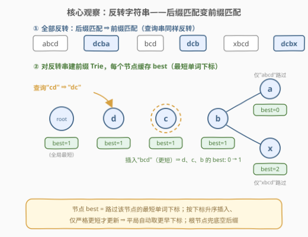
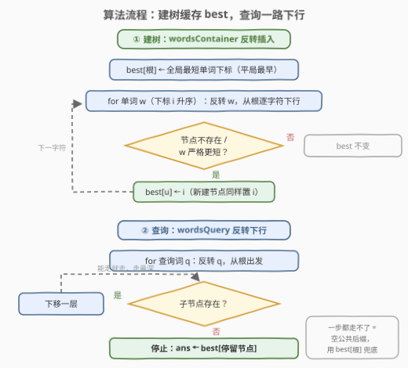
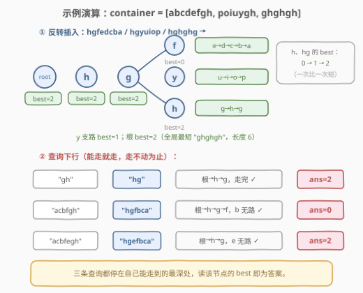

# 最长公共后缀查询

- **题目名称**：最长公共后缀查询
- **链接**：[3093. 最长公共后缀查询](https://leetcode.cn/problems/longest-common-suffix-queries/)
- **难度**：困难
- **标签**：字典树（Trie）、数组、字符串
- **核心套路**：反转化「后缀」为「前缀」+ 前缀 Trie 每节点维护最短单词下标（升序插入、严格更短才更新，平局自动取最早）

## 1. 题目概述

给你两个字符串数组 `wordsContainer` 和 `wordsQuery`。对于每个 `wordsQuery[i]`，需要从 `wordsContainer` 中找到一个与 `wordsQuery[i]` 有**最长公共后缀**的字符串，返回其下标。多条规则依次破平局：

1. **最长公共后缀优先**：与 `wordsQuery[i]` 的公共后缀越长约好；
2. **最短优先**：若多个字符串并列最长公共后缀，取**长度最短**的；
3. **最早优先**：若仍并列（相同最短长度），取在 `wordsContainer` 中**出现更早**的。

返回整数数组 `ans`，其中 `ans[i]` 即上述规则下选中的下标。

**示例 1**：

```text
输入：wordsContainer = ["abcd","bcd","xbcd"], wordsQuery = ["cd","bcd","xyz"]
输出：[1,1,1]
解释：查询 "cd" 与三个串的公共后缀均为 "cd"（最长），三者中 "bcd"（下标 1）最短；
     查询 "xyz" 与谁都无公共后缀（空后缀），此时三者并列，仍取最短的 "bcd"。
```

**示例 2**：

```text
输入：wordsContainer = ["abcdefgh","poiuygh","ghghgh"], wordsQuery = ["gh","acbfgh","acbfegh"]
输出：[2,0,2]
解释：查询 "acbfgh" 只有 "abcdefgh"（下标 0）有长后缀 "fgh"，尽管 "ghghgh" 更短也不行——
     最长后缀优先级高于长度。
```

**约束条件**：

- $1 \le \text{wordsContainer.length},\ \text{wordsQuery.length} \le 10^4$
- $1 \le \text{wordsContainer[i].length},\ \text{wordsQuery[i].length} \le 5 \times 10^3$
- 所有串仅含小写英文字母；两数组各自的**总长度**至多 $5 \times 10^5$

---

## 2. 解题思路

### 2.1 暴力思路

对每个查询串，与每个容器串**从尾往头逐字符比较**求最长公共后缀长度，按「最长 → 最短 → 最早」三键排序取最优。单次比较 $O(\min(l_1, l_2))$，总体 $O(|Q| \cdot |C| \cdot L)$，最坏 $10^4 \times 10^4 \times 5\times10^3$ 完全不可行。瓶颈在于：**每个查询都要与全部容器串重新比较**——需要一种结构把「公共后缀」的匹配结果**预处理复用**。

### 2.2 核心观察：反转 + 前缀 Trie + 节点缓存最优下标



**观察一（反转化后缀为前缀）**：把 `wordsContainer` 和 `wordsQuery` 里的串**全部反转**，「最长公共后缀」就变成「最长公共前缀」。而前缀匹配正是 Trie 的看家本领：查询串沿 Trie 从根下行，**能走多深，最长公共前缀就有多长**——每一步都天然复用了所有容器串的公共前缀信息。

**观察二（把破平局规则缓存到节点上）**：查询停在深度最大的节点 $u$ 时，候选集恰好是「**路过 $u$ 的所有单词**」（它们的前缀、即原串的后缀完全一致）。三级规则可以在建树时**预计算**：

- 每个节点 $u$ 维护 $\text{best}[u]$ = 路过 $u$ 的单词中**最短**者的下标；
- 按下标**从小到大**插入，且**仅当新单词严格更短才覆盖** $\text{best}$ —— 等长时保留先插入者，「平局取最早」自动成立。

于是查询的答案就是 $\text{best}[u]$：停得最深保证「最长后缀优先」，节点上的 best 保证「最短、最早优先」。

> 💡 **为什么最长优先能压过最短？** 停在节点 $u$ 意味着 $u$ 的子节点里没有查询串的下一个字符——**更长的公共后缀不存在**，只能在路过 $u$ 的单词里挑；而浅一层节点的候选集是深一层的**超集**，若浅层最优解更短，它必然也路过深层节点、早已参与过深层 best 的竞争。所以读最深节点的 best 即全局最优。

> ⚠️ **边界：空公共后缀**。查询串反转后首字符就无路可走时停在**根节点**，此时所有单词并列（后缀都是空串），按规则应取全局最短、最早者——恰是 $\text{best}[\text{root}]$（根节点被所有单词"路过"）。示例 1 的 `"xyz"` 正是这种情况，无需任何特判。

### 2.3 算法流程图



**建树阶段**（遍历 `wordsContainer`，下标 $i$ 升序）：反转单词 $w$，从根逐字符下行；遇到不存在的子节点就新建（$\text{best} \leftarrow i$），节点已存在且 $w$ 严格更短则更新 $\text{best} \leftarrow i$。根节点同样参与更新，天然得到全局最短兜底。

**查询阶段**（遍历 `wordsQuery`）：反转查询串 $q$，从根出发**能走就走**，走不动时停在当前节点 $u$，答案即 $\text{best}[u]$。

### 2.4 示例演算



以示例 2 演算（`wordsContainer = ["abcdefgh","poiuygh","ghghgh"]`，反转后为 `hgfedcba / hgyuiop / hghghg`）：

| 插入 | 反转串 | 对 h、hg 节点 best 的影响 |
|------|--------|---------------------------|
| ① `"abcdefgh"`（长 8） | `hgfedcba` | 新建 h、hg 链，best = 0 |
| ② `"poiuygh"`（长 7 < 8） | `hgyuiop` | 7 < 8，best: 0 → 1 |
| ③ `"ghghgh"`（长 6 < 7） | `hghghg` | 6 < 7，best: 1 → 2 |

建成的 Trie 中，根、h、hg 的 best 均为 2（全局最短 `"ghghgh"`），f 支路 best=0、y 支路 best=1、h 支路 best=2。三条查询：

| 查询 | 反转 | 下行路径 | 停留节点 | 答案 |
|------|------|----------|----------|------|
| `"gh"` | `"hg"` | 根→h→g（走完） | hg（best=2） | 2 |
| `"acbfgh"` | `"hgfbca"` | 根→h→g→f，`b` 无路 | f（best=0） | 0 |
| `"acbfegh"` | `"hgefbca"` | 根→h→g，`e` 无路 | hg（best=2） | 2 |

输出 `[2,0,2]` 与示例一致。第二条查询体现了「最长优先压过最短」：`"acbfgh"` 能沿 `f` 多走一步，说明只有 `"abcdefgh"` 有后缀 `"fgh"`，短串 `"ghghgh"` 只能靠边站。

---

## 3. 参考代码

### C++

```cpp
class Solution {
  public:
    vector<int> stringIndices(vector<string>& wordsContainer, vector<string>& wordsQuery) {
        int n = wordsContainer.size();
        vector<array<int, 26>> ch(1);        // ch[u][c] = 子节点编号（-1 表示无）
        ch[0].fill(-1);
        vector<int> best(1, -1);             // best[u] = 路过 u 的最短单词下标

        auto update = [&](int u, int i) {
            if (best[u] < 0 || wordsContainer[i].size() < wordsContainer[best[u]].size())
                best[u] = i;                 // 仅严格更短才覆盖 → 等长保留更早下标
        };

        for (int i = 0; i < n; i++) {
            update(0, i);                    // 根节点：所有单词都“路过”
            int u = 0;
            const string& w = wordsContainer[i];
            for (int j = (int)w.size() - 1; j >= 0; j--) {   // 反转 = 从尾往头走
                int c = w[j] - 'a';
                if (ch[u][c] < 0) {
                    ch[u][c] = ch.size();
                    ch.emplace_back();
                    ch.back().fill(-1);
                    best.push_back(-1);
                }
                u = ch[u][c];
                update(u, i);
            }
        }

        vector<int> ans;
        ans.reserve(wordsQuery.size());
        for (const string& q : wordsQuery) {
            int u = 0;
            for (int j = (int)q.size() - 1; j >= 0 && ch[u][q[j] - 'a'] >= 0; j--)
                u = ch[u][q[j] - 'a'];       // 能走就走，走不动停在原地
            ans.push_back(best[u]);
        }
        return ans;
    }
};
```

### Python

```python
class Solution:
    def stringIndices(self, wordsContainer: List[str], wordsQuery: List[str]) -> List[int]:
        n = len(wordsContainer)
        lens = [len(w) for w in wordsContainer]
        root_best = min(range(n), key=lambda i: lens[i])   # 全局最短（min 平局取最早）
        children = [dict()]        # children[u]: 字符 -> 子节点编号
        best = [root_best]

        for i, w in enumerate(wordsContainer):
            u = 0
            for c in reversed(w):
                nxt = children[u].get(c)
                if nxt is None:
                    nxt = len(children)
                    children.append(dict())
                    best.append(i)                 # 新节点首单词即 i
                elif lens[i] < lens[best[nxt]]:
                    best[nxt] = i                  # 仅严格更短才覆盖
                u = nxt

        ans = []
        for q in wordsQuery:
            u = 0
            for c in reversed(q):                  # 能走就走
                nxt = children[u].get(c)
                if nxt is None:
                    break
                u = nxt
            ans.append(best[u])                    # 空后缀时停在根，读根的 best
        return ans
```

> 💡 反转不必真的 `reverse` 字符串：**从尾往头遍历**即可，省去 $O(L)$ 的额外拷贝（C++ 版即如此）。Python 版用 `reversed(w)` 逆序迭代，同理零拷贝。

---

## 4. 复杂度分析

设 $S = \sum |\text{wordsContainer}[i]|$、$Q = \sum |\text{wordsQuery}[i]|$，两者均 $\le 5 \times 10^5$。

| 维度 | 复杂度 | 说明 |
|------|--------|------|
| 建树时间 | $O(S)$ | 每个字符走一步，节点内转移 $O(1)$（数组直取 / dict 均摊） |
| 查询时间 | $O(Q)$ | 每个字符至多走一步，停下即出答案 |
| 空间（C++ 数组版） | $O(26S)$ | 至多 $S+1$ 个节点，每节点 26 个 int 指针，$5\times10^5$ 节点约 52 MB |
| 空间（Python dict 版） | $O(S)$ | 每节点一个 dict，按需分配，无 26 倍常数 |

> 💡 空间上界是**总字符数**而不是深度的指数：Trie 是共享前缀压缩的，节点数 $\le S+1$。最坏情况（所有串无公共后缀）数组版约 52 MB，在 C++ 内存限制内；若卡内存可换 dict / 哈希子节点。

---

## 5. 扩展：排序插入消去更新分支

`update` 里的「严格更短才覆盖」可以整体消掉：把单词按 $(\text{长度},\ \text{下标})$ 排序后再插入，则**后插入的单词永远不会更短**，已存在的节点 best 永不改变——新节点的 best 就是首次创建它的单词。代价是查询答案需通过排序时的映射换回原下标。两种写法等价，按序插入版代码更短（下标天然有序），排序插入版少了每次插入的长度比较，各有取舍。

同一家族对比：[745. 前缀和后缀搜索](https://leetcode.cn/problems/prefix-and-suffix-search/) 同样在 Trie **节点上缓存最优先验值**，但它要的是「最大下标」（weight），本题要的是「最短单词」——套路完全一致，只是节点缓存的聚合函数不同。掌握「**Trie 节点挂聚合信息，查询在下行终点读取**」这一模式，两题通吃。

---

## 6. 面试要点

1. **为什么反转后用 Trie，而不是哈希或排序？**

   - 最长公共后缀反转后是最长公共前缀，Trie 把所有前缀组织成树，查询沿根下行天然就是增量式前缀匹配，走多深即前缀多长；哈希表只能查精确串，无法回答"最长能匹配到哪"，排序也提供不了前缀共享结构。

2. **每个节点只存一个 best 下标，为什么够？三级破平局规则如何被覆盖？**

   - 停在节点 $u$ 时，比 $u$ 更深的匹配不存在（子节点无路），比 $u$ 浅的候选集是 $u$ 候选集的超集、最优者必路过 $u$，故只需在路过 $u$ 的单词里选：best 缓存"最短"，按下标升序插入 + 仅严格更短才更新缓存"最早"——三级规则全部编码进一个整数。

3. **空公共后缀的边界怎么处理？**

   - 查询反转后首字符就无路可走，停在根节点；根被所有单词路过，$\text{best}[\text{root}]$ 恰是全局最短、最早者，正是规则要求的答案。**无需特判**，这是把根也纳入 update 的原因。

4. **Trie 的空间上界是多少？会不会爆炸？**

   - 节点数 $\le S + 1$（$S$ 为容器串总长），前缀共享反而更省；数组版每节点 26 个指针，$S = 5\times10^5$ 时约 52 MB，可行；更省的方案是 dict 子节点（$O(S)$ 总空间）或双数组 / 压缩 Trie（Radix Tree）。

5. **本题与 745 前缀和后缀搜索的异同？**

   - 同：都在 Trie 节点上缓存聚合值、查询在下行终点读取；异：745 缓存**最大下标**（最后出现的单词优先），本题缓存**最短单词下标**（短者优先、平局最早）。可见节点缓存的聚合函数由题目的优先级规则决定，结构完全复用。

---

## 7. 同类练习题

- [208. 实现 Trie (前缀树)](https://leetcode.cn/problems/implement-trie-prefix-tree/)：Trie 插入/下行查询的模板，本题的地基
- [745. 前缀和后缀搜索](https://leetcode.cn/problems/prefix-and-suffix-search/)：同款「Trie 节点缓存最优先验值」，缓存的是最大下标而非最短单词
- [648. 单词替换](https://leetcode.cn/problems/replace-words/)：沿 Trie 下行找**最短**前缀命中，与本题「最短优先」先验同源
- [14. 最长公共前缀](https://leetcode.cn/problems/longest-common-prefix/)：最长公共前缀裸题，本题反转后的原型问题
- [421. 数组中两个数字的最大异或值](https://leetcode.cn/problems/maximum-xor-of-two-numbers-in-an-array/)：01-Trie 逐位下行匹配，Trie 家族的另一形态
