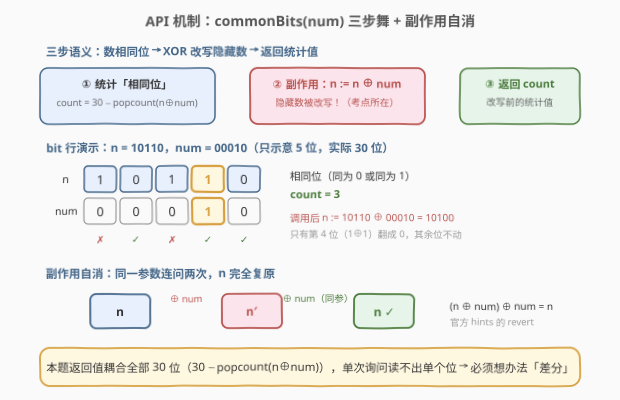
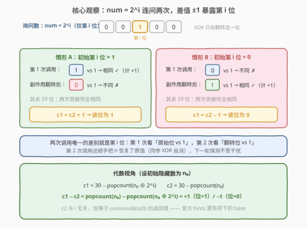
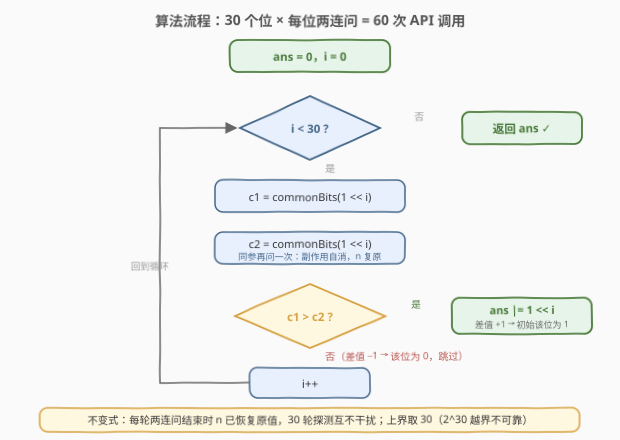
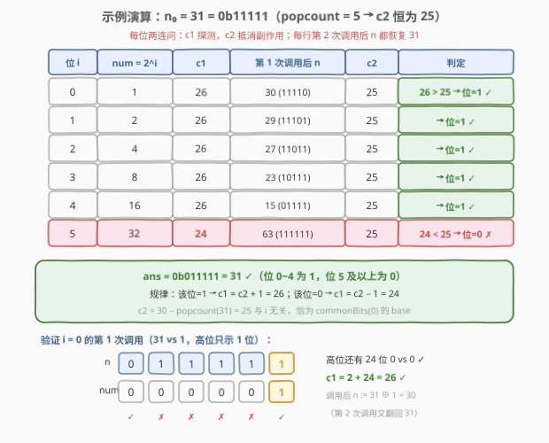

# LeetCode 使用按位查询猜测数字II 题解

## 1. 题目概述

- **标题 / 题号**：使用按位查询猜测数字 II（#3094，medium）
- **链接**：https://leetcode.cn/problems/guess-the-number-using-bitwise-questions-ii/
- **难度**：中等
- **标签**：位运算、交互

> ⚠️ 本题为 LeetCode 付费题，题意描述根据官方示例用例与 hints 重建，可能与官方题面有出入。

**题意**：有一个隐藏数字 $n \in [0, 2^{30} - 1]$，你需要把它找出来。系统提供一个预设 API：

```text
int commonBits(int num)
```

它的行为分三步：

1. 统计 `count`：在二进制表示的**前 30 位**中，`n` 与 `num` 在该位上**取值相同**（同为 0 或同为 1 均算）的位数；
2. 副作用：`n = n XOR num`（隐藏数被改写！）；
3. 返回 `count`。

**挑战**：每次调用都会改变隐藏数 $n$，而你要返回的是**初始值** $n$。

**示例 1**：

```text
输入：n = 31
输出：31
解释：可以证明通过该 API 能够找出 31。
```

**示例 2**：

```text
输入：n = 33
输出：33
解释：可以证明通过该 API 能够找出 33。
```

**约束**：

- $0 \le n \le 2^{30} - 1$
- 询问的 `num` 必须落在 $[0, 2^{30} - 1]$ 内，超出该范围返回值不可靠
- 统计相同位时只看前 30 位

> 💡 与 [3064. 使用按位查询猜测数字 I](https://leetcode.cn/problems/guess-the-number-using-bitwise-questions-i/) 对照着读非常有味道：I 的 API `commonSetBits(num)` 只数「双方都为 1」的位（即 $\operatorname{popcount}(n \,\&\, \text{num})$）且**没有副作用**，逐位单次询问即可；II 的 API 改成统计「取值相同」的位（耦合**全部** 30 位），还附带 **XOR 翻转**副作用——单次询问再也隔离不出某一位，这正是本题的考点。

## 2. 解题思路

### 2.1 暴力思路：照搬第 I 题的逐位单次询问（会失效）

真正的暴力是枚举询问所有 $2^{30}$ 个数，约 $10^9$ 次调用，显然不可行。更自然的朴素做法是**照搬第 I 题**：对每个 $i$ 问一次 $\text{commonBits}(2^i)$，试图从单次返回值读出第 $i$ 位。

这条路**失效**，原因有二：

1. **返回值耦合全部位**。「相同位数」可改写为 $30 - \operatorname{popcount}(n \oplus \text{num})$（相同 = 30 − 不同，不同位数 = 异或后 1 的个数），它依赖 $n$ 的整个 popcount，而不是单个位；
2. **副作用让基准漂移**。每次调用后 $n$ 被翻转，后续询问面对的是「漂移过的」$n$。

以 $n_0 = 31$（$\operatorname{popcount} = 5$）为例，逐个单问 $2^0, 2^1, 2^2, \dots$：

```text
问 1：当前 n = 31，返回 30 − popcount(31⊕1) = 30 − 4 = 26，此后 n = 30
问 2：当前 n = 30，返回 30 − popcount(30⊕2) = 30 − 3 = 27，此后 n = 28
问 4：当前 n = 28，返回 30 − popcount(28⊕4) = 30 − 2 = 28，此后 n = 24
```

返回值 $26, 27, 28, \dots$ 一路漂移，不知道「当前 popcount」就解不出任何一位。

### 2.2 核心观察：XOR 自消 + 同参两连问差分



突破口是两条引理：

**引理 1（副作用自消）**：$(n \oplus \text{num}) \oplus \text{num} = n$。用**同一个参数连问两次**，第二次结束时 $n$ 完全恢复原值——这就是官方 hints 里「Doing XOR again with the same number reverts the effect」。

**引理 2（差分暴露目标位）**：取 $\text{num} = 2^i$（仅第 $i$ 位为 1），连问两次，记返回值为 $c_1, c_2$：

- 第 1 次：$c_1 = 30 - \operatorname{popcount}(n_0 \oplus 2^i)$，调用后 $n = n_0 \oplus 2^i$——**只有第 $i$ 位翻转，其余 29 位原封不动**；
- 第 2 次：$c_2 = 30 - \operatorname{popcount}\big((n_0 \oplus 2^i) \oplus 2^i\big) = 30 - \operatorname{popcount}(n_0)$。

两式相减：

$$
c_1 - c_2 = \operatorname{popcount}(n_0) - \operatorname{popcount}(n_0 \oplus 2^i) =
\begin{cases}
+1, & n_0 \text{ 的第 } i \text{ 位为 } 1 \\
-1, & n_0 \text{ 的第 } i \text{ 位为 } 0
\end{cases}
$$

（异或 $2^i$ 只翻转第 $i$ 位：原来是 1 则 1 的个数减 1，原来是 0 则加 1。）



> 💡 直观理解：两次调用**唯一的差别**就是第 $i$ 位——第 1 次看到的是「原始位 vs 1」，第 2 次看到的是「翻转位 vs 1」，其余 29 位两次贡献完全相同。于是差值恰是 $\pm 1$ 的「指针」，指向该位的原始取值。

> 💡 **与官方 hints 的联系**：$c_2 = 30 - \operatorname{popcount}(n_0)$ 与 $i$ 无关，而它正是 $\text{commonBits}(0)$ 的返回值（官方 hint 让你先存下来的 `base`）。所以「比较 $c_1$ 与 $c_2$」和官方 hints 的「比较 $c_1 > \text{base}$」完全等价。

### 2.3 算法流程图



对 $i = 0, 1, \dots, 29$ 各执行一次「两连问」，共 $30 \times 2 = 60$ 次 API 调用。每次循环结束时 $n$ 都被恢复原值，因此每一位的探测互不干扰。

### 2.4 示例演算



以 $n_0 = 31 = 0b11111$（$\operatorname{popcount} = 5$，故 $c_2$ 恒为 $30 - 5 = 25$）为例：

- $i = 0 \sim 4$：$c_1 = 26 > c_2 = 25$（差值 $+1$）→ 这 5 位都是 1；
- $i = 5$：$c_1 = 24 < c_2 = 25$（差值 $-1$）→ 该位是 0；

拼出 $n_0 = 0b11111 = 31$。注意每行「第 1 次调用后」的 $n$ 变成了各种值，但第 2 次调用后都恢复 31。

## 3. 参考代码

### C++

```cpp
/**
 * Definition of commonBits API.
 * int commonBits(int num);
 */
class Solution {
  public:
    int findNumber() {
        int n = 0;
        for (int i = 0; i < 30; ++i) {
            int c1 = commonBits(1 << i);  // 第 1 次：探测第 i 位
            int c2 = commonBits(1 << i);  // 第 2 次：抵消副作用，恢复 n
            if (c1 > c2) {
                n |= 1 << i;              // 差值 +1 → 初始该位为 1
            }
        }
        return n;
    }
};
```

### Python

```python
# Definition of commonBits API.
# def commonBits(num: int) -> int:

class Solution:
    def findNumber(self) -> int:
        n = 0
        for i in range(30):
            c1 = commonBits(1 << i)   # 第 1 次：探测第 i 位
            c2 = commonBits(1 << i)   # 第 2 次：抵消副作用，恢复 n
            if c1 > c2:
                n |= 1 << i
        return n
```

> ⚠️ **注意**：循环上界是 **30** 而不是常见的 32——题目明确说 `num` 超出 $[0, 2^{30} - 1]$ 后返回值不可靠，$2^{30}$ 本身已越界；而 $n < 2^{30}$ 保证第 30、31 位恒为 0，本就无需探测。

## 4. 复杂度分析

| 维度 | 复杂度 | 说明 |
|------|--------|------|
| 时间复杂度 | $O(\log C)$，$C = 2^{30}$ 为值域 | 30 个位 × 每位 2 次 = **60 次 API 调用**，计算量 $O(30)$ |
| 空间复杂度 | $O(1)$ | 只用常数个变量 |

## 5. 扩展：压到 31 次调用的「popcount 追踪」写法

官方 hints 的路线是「先问 0 存 `base`，再对每位两连问」，共 $1 + 60 = 61$ 次调用（差分写法省掉首问，60 次）。其实还能更省：**单次询问 + 维护 popcount 演化**，只需 $1 + 30 = 31$ 次。

原理：设当前隐藏数为 $m$、$\operatorname{popcount}(m) = s$（可维护）。问 $\text{commonBits}(2^i)$ 得 $c$，则 $d = 30 - c = \operatorname{popcount}(m \oplus 2^i) = s + 1 - 2[m_i = 1]$。由于每个 $2^i$ 只问一次，第 $i$ 位从未被翻转过，$m_i$ 就是初始位：

- $d = s - 1$ → 该位初始为 1，且新 popcount 变为 $d$；
- $d = s + 1$ → 该位初始为 0，新 popcount 同样变为 $d$。

```python
class Solution:
    def findNumber(self) -> int:
        s = 30 - commonBits(0)            # 初始 popcount（问 0 不改变 n）
        n = 0
        for i in range(30):
            d = 30 - commonBits(1 << i)   # popcount(当前 n ⊕ 2^i)
            if d == s - 1:                # 1 的个数变少 → 该位原来是 1
                n |= 1 << i
            s = d                         # 翻转后的 popcount
        return n
```

正确性依托两条不变式：① 每个幂只问一次，故第 $i$ 位在被询问时仍是初始值；② $s$ 始终等于当前隐藏数的 popcount（每次询问后同步更新）。对比之下，两连问差分写法不依赖任何状态追踪，**鲁棒性更好**——面试中先给差分解，再提这个优化，层次感就出来了。

## 6. 面试要点

1. **为什么同一个参数要连问两次？**

   - 第一次是「探测」，第二次是「抵消副作用」：$(n \oplus \text{num}) \oplus \text{num} = n$，同参两连问后隐藏数复原。更妙的是两次返回值的差恰好是 $\pm 1$，直接暴露该位初始取值，一举两得。

2. **为什么照搬第 3064 题的单次询问不行？**

   - 本题返回值是 $30 - \operatorname{popcount}(n \oplus \text{num})$，耦合**全部 30 位**而非单个位；且副作用让 $n$ 在询问之间漂移（示例中返回值 26→27→28 一路变化），单次值既不含独立位信息、也没有稳定基准。3064 的 `commonSetBits` 返回 $\operatorname{popcount}(n \,\&\, 2^i)$ 天然只含第 $i$ 位信息，两者机制完全不同。

3. **$c_2$ 有什么规律？与官方 hints 的 `base` 是什么关系？**

   - $c_2 = 30 - \operatorname{popcount}(n_0)$ 与 $i$ 无关；而 $\text{commonBits}(0) = 30 - \operatorname{popcount}(n_0 \oplus 0)$ 恰是同一个数。所以 $c_1 > c_2$ 与官方 hint 的 $c_1 > \text{base}$ 逐位等价。

4. **循环上界为什么是 30 而不是 32？**

   - 值域是 $[0, 2^{30} - 1]$，询问 $2^{30}$ 已越界，题目明说返回值不可靠；且 $n < 2^{30}$ 意味着第 30、31 位恒为 0，无需探测。写 32 虽然多数判题机也能过，但属于「依赖未定义行为」。

5. **若 API 语义改成「先执行 $n \oplus= \text{num}$，再统计相同位」，解法会怎样？**

   - 两次调用的角色互换：$c_1$ 变成恒定值 $30 - \operatorname{popcount}(n_0)$，$c_2$ 成为探测值，判据翻转为 $c_1 < c_2$。这说明交互题第一步永远是**精确弄清 API 的时序与副作用**，再套模板。

## 同类练习题

| # | 题目 | 与本题的关联 |
|---|------|-------------|
| 3064 | [使用按位查询猜测数字 I](https://leetcode.cn/problems/guess-the-number-using-bitwise-questions-i/) | 本题前传——无副作用的 `commonSetBits`，逐位单次询问即可，对照体会「副作用」带来的考点升级 |
| 374 | [猜数字大小](https://leetcode.cn/problems/guess-number-higher-or-lower/) | 交互题入门，每次调用只拿到「大了/小了」一比特信息，二分压榨调用次数 |
| 278 | [第一个错误的版本](https://leetcode.cn/problems/first-bad-version/) | 交互 + 单调谓词二分，同样是「用最少调用榨取最多信息」的范式 |
| 371 | [两整数之和](https://leetcode.cn/problems/sum-of-two-integers/) | XOR 运算律专练——本题的「副作用自消」本质就是异或结合律 $a \oplus b \oplus b = a$ |
