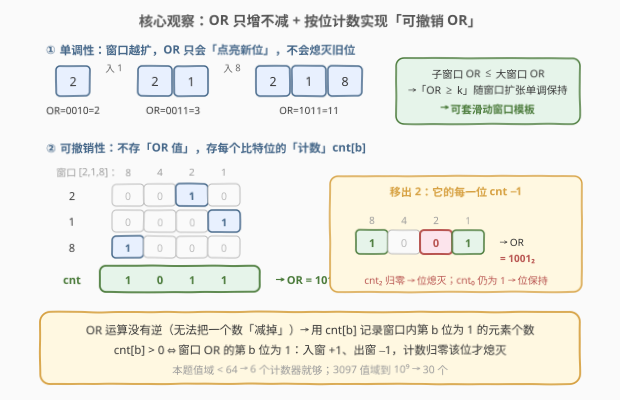
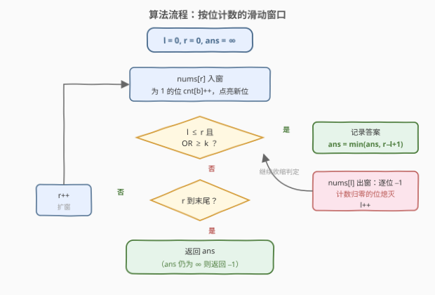

# 或值至少为K的最短子数组I

- **题目名称**：或值至少为 K 的最短子数组 I
- **链接**：[3095. 或值至少为 K 的最短子数组 I](https://leetcode.cn/problems/shortest-subarray-with-or-at-least-k-i/)
- **难度**：简单
- **标签**：位运算、数组、滑动窗口

## 1. 题目概述

给你一个**非负**整数数组 `nums` 和一个整数 `k`。如果 `nums` 的一个子数组中所有元素的按位或运算 `OR` 的值**至少**为 `k`，那么我们称这个子数组是**特别的**。

返回 `nums` 中**最短特别非空子数组**的长度；如果特别子数组不存在，返回 `-1`。

**示例 1**：

```text
输入：nums = [1,2,3], k = 2
输出：1
解释：子数组 [3] 的按位 OR 值为 3 ≥ 2，返回 1。[2] 也是特别子数组。
```

**示例 2**：

```text
输入：nums = [2,1,8], k = 10
输出：3
解释：子数组 [2,1,8] 的按位 OR 值为 11 ≥ 10，返回 3。
```

**示例 3**：

```text
输入：nums = [1,2], k = 0
输出：1
解释：子数组 [1] 的按位 OR 值为 1 ≥ 0，返回 1。
```

**约束条件**：

- $1 \le nums.length \le 50$
- $0 \le nums[i] \le 50$
- $0 \le k < 64$

> 💡 数据小到可爱（$n \le 50$），官方 hints 也点名了暴力解法。但本题有一个「加强版」姊妹题 [3097](https://leetcode.cn/problems/shortest-subarray-with-or-at-least-k-ii/)（$n$ 放大到 $2\times10^5$），届时暴力直接爆炸——所以本题真正值得学的是那套**按位计数的滑动窗口**。

---

## 2. 解题思路

### 2.1 暴力思路

枚举每个起点 $i$，向右扩展终点 $j$，**增量**维护窗口 OR：`or_ |= nums[j]`。由于 OR **只增不减**，一旦 `or_ >= k` 就说明这是起点 $i$ 的最短合法窗口（终点再右移只会更长），记录后立刻 `break`。两层循环 $O(n^2)$，$n \le 50$ 时至多约 2500 步，轻松通过。

> ⚠️ 别写成 $O(n^3)$：每个终点都从起点重新 OR 一遍（`or_ = 0` 后整段重算）虽然也能过，但面试中容易被追问。增量维护是免费的——OR 天生支持「往里加」。

### 2.2 核心观察：OR 单调 + 按位计数可撤销 → 滑动窗口



**观察一（单调性 → 滑窗可用）**：窗口扩大只会**点亮新位**、不会熄灭旧位，所以任意子窗口的 OR 不超过包含它的大窗口：

$$[l', r] \subseteq [l, r]\ (l' \ge l) \implies \mathrm{OR}([l', r]) \le \mathrm{OR}([l, r])$$

于是「OR $\ge k$」是关于**窗口扩张**的单调条件：固定右端点 $r$，合法起点是一段前缀 $\{0,\dots,L_r\}$，以 $r$ 结尾的最短合法窗口就是 $[L_r, r]$。这正是「扩张-收缩」滑窗模板的适用场景（同 [209. 长度最小的子数组](https://leetcode.cn/problems/minimum-size-subarray-sum/)）。

**观察二（可撤销性 → 按位计数）**：滑窗需要「移出左端元素」，但 OR 运算**没有逆运算**——你无法从一个 OR 值里「减掉」一个数。解决办法是不直接存 OR 值，改存**每个比特位的计数**：

$$\text{cnt}[b] = \text{窗口内第 } b \text{ 位为 } 1 \text{ 的元素个数}$$

- 入窗 `x`：对 `x` 的每个为 1 的位 `cnt[b]++`，同时点亮 OR 的第 $b$ 位；
- 出窗 `x`：对 `x` 的每个为 1 的位 `cnt[b]--`，**当且仅当计数归零**时熄灭 OR 的第 $b$ 位。

$$\text{cnt}[b] > 0 \iff \text{窗口 OR 的第 } b \text{ 位为 } 1$$

**左指针为什么不回退也不会漏解**？关键在收缩循环的结构：`l` 的**每一次右移**都发生在「窗口达标 → 已记录答案 → 移出左端」之后。因此任何左端点 $l'$ 一旦被越过，就存在一个**已记录**的合法窗口 $[l', r'']$；而之后任何以 $l'$ 开头的窗口终点更靠右、长度只会更长。错过不亏，`l` 大胆单调右移，每个元素至多进出窗口各一次。

### 2.3 算法流程图



一句话概括：`r` 逐步右移扩张窗口；窗口达标（`l ≤ r 且 OR ≥ k`）就记录长度并移出 `nums[l]` 继续收缩，否则移动 `r`。全程维护 `cnt[0..B-1]`（$B$ 为值域比特数，本题 $B = 6$）。

### 2.4 示例演算

![示例演算：nums=[2,1,8], k=10](../images/p3095_example_walkthrough.svg)

以 `nums = [2,1,8]`，`k = 10 = 1010₂` 走一遍滑窗（位按 8/4/2/1 展示）：

| 步骤 | 操作 | 窗口 | OR（二进制） | OR 值 | 判定 |
|------|------|-------|--------------|-------|------|
| ① | r=0 入 2 | $[2]$ | 0010 | 2 | $2 < 10$，扩窗 |
| ② | r=1 入 1 | $[2,1]$ | 0011 | 3 | $3 < 10$，扩窗 |
| ③ | r=2 入 8 | $[2,1,8]$ | **1**011 | 11 | $11 \ge 10$ ✓ 记录 len=3，收缩 |
| ④ | 出窗 2 | $[1,8]$ | 10**0**1 | 9 | $9 < 10$，停止收缩 |

第 ④ 步是精髓：移出 2 后，它独占的第 1 位（数值 2 那一位）计数归零、熄灭；第 0 位仍有元素 1 撑着，保持点亮。最终 $\text{ans} = 3$。

---

## 3. 参考代码

### C++ · 暴力（$O(n^2)$，本题够用）

```cpp
class Solution {
  public:
    int minimumSubarrayLength(vector<int>& nums, int k) {
        int n = nums.size(), ans = INT_MAX;
        for (int i = 0; i < n; ++i) {
            int or_ = 0;                     // [i, j] 的 OR，随 j 扩大只增不减
            for (int j = i; j < n; ++j) {
                or_ |= nums[j];
                if (or_ >= k) {              // 首次达标即此起点最短，再扩只会更长
                    ans = min(ans, j - i + 1);
                    break;
                }
            }
        }
        return ans == INT_MAX ? -1 : ans;
    }
};
```

### C++ · 滑动窗口（$O(n \cdot B)$，通吃 3097）

```cpp
class Solution {
  public:
    int minimumSubarrayLength(vector<int>& nums, int k) {
        int n = nums.size();
        int cnt[6] = {0};                    // 0 ≤ nums[i] ≤ 50 < 64，6 个比特位
        int or_ = 0, ans = INT_MAX;
        auto add = [&](int x, int d) {       // d=+1 入窗，d=-1 出窗
            for (int b = 0; b < 6; ++b)
                if (x >> b & 1) {
                    cnt[b] += d;
                    if (d > 0) or_ |= 1 << b;               // 入窗：置位
                    else if (cnt[b] == 0) or_ &= ~(1 << b); // 出窗：计数归零才熄灭
                }
        };
        for (int l = 0, r = 0; r < n; ++r) {
            add(nums[r], +1);
            while (l <= r && or_ >= k) {     // 达标：记录后收缩，找以 r 结尾的最短
                ans = min(ans, r - l + 1);
                add(nums[l++], -1);
            }
        }
        return ans == INT_MAX ? -1 : ans;
    }
};
```

### Python · 暴力（$O(n^2)$）

```python
class Solution:
    def minimumSubarrayLength(self, nums: List[int], k: int) -> int:
        n = len(nums)
        ans = n + 1
        for i in range(n):
            or_ = 0                          # [i, j] 的 OR，随 j 扩大只增不减
            for j in range(i, n):
                or_ |= nums[j]
                if or_ >= k:                 # 首次达标即此起点最短
                    ans = min(ans, j - i + 1)
                    break
        return ans if ans <= n else -1
```

### Python · 滑动窗口（$O(n \cdot B)$）

```python
class Solution:
    def minimumSubarrayLength(self, nums: List[int], k: int) -> int:
        n, B = len(nums), 6                  # 0 ≤ nums[i] ≤ 50 < 64
        cnt = [0] * B
        or_ = 0
        ans = n + 1
        l = 0
        for r in range(n):
            for b in range(B):               # nums[r] 入窗
                if nums[r] >> b & 1:
                    cnt[b] += 1
                    or_ |= 1 << b
            while l <= r and or_ >= k:       # 达标：记录后收缩
                ans = min(ans, r - l + 1)
                for b in range(B):           # nums[l] 出窗
                    if nums[l] >> b & 1:
                        cnt[b] -= 1
                        if cnt[b] == 0:
                            or_ &= ~(1 << b)
                l += 1
        return ans if ans <= n else -1
```

> 💡 两个版本的 `ans` 哨兵都取「不可能的长度」（`INT_MAX` / `n + 1`），循环结束仍未更新即无解，返回 `-1`。

---

## 4. 复杂度分析

| 维度 | 暴力枚举 | 滑动窗口 | 说明 |
|------|----------|----------|------|
| 时间复杂度 | $O(n^2)$ | $O(n \cdot B)$ | 滑窗中每个元素至多入窗、出窗各一次，每次操作 $O(B)$ 个比特位；本题 $B = 6$，3097 中 $B = 30$ |
| 空间复杂度 | $O(1)$ | $O(B)$ | 滑窗只多用 $B$ 个计数器 |

> 💡 本题 $n \le 50$：暴力约 $2.5\times10^3$ 步、滑窗约 $3\times10^2$ 步，都能秒过。到了 3097（$n = 2\times10^5$）：暴力 $4\times10^{10}$ 步超时，滑窗 $6\times10^6$ 步轻松通过。

---

## 5. 扩展：把 $n$ 干到 $2\times10^5$ 怎么办（3097）

姊妹题 [3097. 或值至少为 K 的最短子数组 II](https://leetcode.cn/problems/shortest-subarray-with-or-at-least-k-ii/) 把约束改为 $n \le 2\times10^5$、$nums[i] \le 10^9$、$k \le 10^9$，难度升为中等。解法就是上文滑窗原封不动，仅两处适配：

1. **比特位数** $B$ 从 6 改为 30（$10^9 < 2^{30}$）；
2. 其余逻辑（单调收缩、按位计数、记录时机）一字不改。

一个值得对比的族谱：**「最短达标子数组」三兄弟**——

- [209. 长度最小的子数组](https://leetcode.cn/problems/minimum-size-subarray-sum/)：元素全为正 → 窗口和随扩张单调不减 → 同款滑窗；
- [862. 和至少为 K 的最短子数组](https://leetcode.cn/problems/shortest-subarray-with-sum-at-least-k/)：元素**可负** → 和失去单调性 → 滑窗失效，得用前缀和 + 单调双端队列；
- 本题 / 3097：**OR 天生只增不减**，不存在「负数」问题 → 滑窗永远可用，只是要靠按位计数来实现「撤销」。

> ⚠️ 面试常见陷阱：直接把窗口 OR 值参与「减法」——比如 `or_ -= nums[l]`。OR 不是加法，这种写法在小数据上偶尔「蒙对」，实则是彻头彻尾的错误；`or_ & ~nums[l]` 也不对（可能误熄别人点亮的位）。按位计数是唯一正解。

---

## 6. 面试要点

1. **为什么这道题能用滑动窗口？**

   - 因为 OR 关于窗口扩张单调：扩窗只会点亮新位，子窗口 OR ≤ 大窗口 OR。于是固定右端点时合法起点是一段前缀，最短窗口可由「达标后收缩」找到——与 209（正数和）同模板。

2. **OR 无法撤销，左端怎么出窗？**

   - 不存 OR 值本身，存按位计数 `cnt[b]`：`cnt[b] > 0` 当且仅当窗口 OR 的第 $b$ 位为 1。出窗时逐位 −1，**计数归零才熄灭**该位；只要还有别的元素撑着，位就保持点亮。

3. **左指针只前进不回退，为什么不会漏掉更短的答案？**

   - `l` 的每次右移都伴随一次「达标 → 记录 → 移出」。任何被越过的左端点都已留下一个已记录的合法窗口，而之后以它开头的窗口终点更靠右、只会更长。因此错过不亏，整体均摊 $O(n)$ 次指针移动。

4. **`k = 0` 和无解的边界怎么处理？**

   - $k = 0$ 时任何非空窗口的 OR（非负）都 $\ge 0$，单个元素即达标，答案必为 1——滑窗在 `r = 0` 时就会记录长度 1，无需特判。无解则哨兵（`INT_MAX` / `n + 1`）保持不动，最后返回 `-1`。

5. **和 209、862 相比，这一族题的本质区别是什么？**

   - 核心是**所维护量的单调性**：正数和、OR 都随窗口扩张单调不减 → 滑窗；含负数的和不再单调 → 只能前缀和 + 单调队列。判断「能不能滑窗」先看「扩张是否单调、收缩是否可撤销（可增量维护）」。

---

## 7. 同类练习题

- [3097. 或值至少为 K 的最短子数组 II](https://leetcode.cn/problems/shortest-subarray-with-or-at-least-k-ii/)：本题加强版（$n \le 2\times10^5$），同一套按位计数滑窗，$B$ 改 30 即可
- [209. 长度最小的子数组](https://leetcode.cn/problems/minimum-size-subarray-sum/)：正数和版「最短达标窗口」，与本题同款扩张-收缩模板的入门题
- [862. 和至少为 K 的最短子数组](https://leetcode.cn/problems/shortest-subarray-with-sum-at-least-k/)：含负数使和失去单调性，滑窗失效 → 前缀和 + 单调双端队列，体会「单调性决定算法」
- [2411. 按位或最大的最小子数组长度](https://leetcode.cn/problems/smallest-subarrays-with-maximum-bitwise-or/)：同样吃透「OR 只增不减」的单调性，从右往左维护以每个位置开头的 OR 值集合
