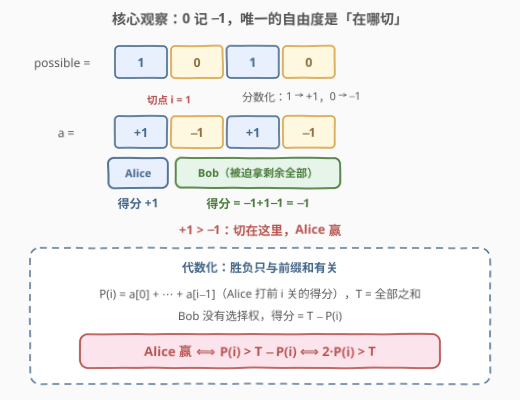
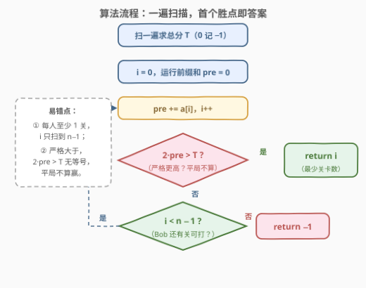
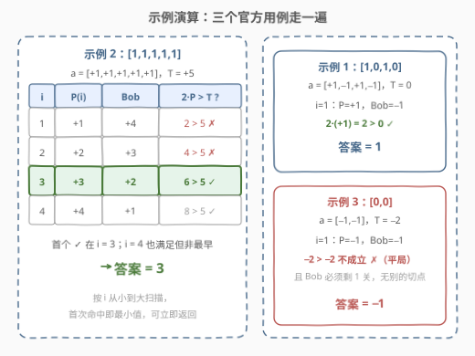

# 得到更多分数的最少关卡数目

- **题目名称**：得到更多分数的最少关卡数目
- **链接**：[3096. 得到更多分数的最少关卡数目](https://leetcode.cn/problems/minimum-levels-to-gain-more-points/)
- **难度**：中等
- **标签**：数组、前缀和

## 1. 题目概述

给定长度为 $n$ 的二进制数组 `possible`，表示游戏里有 $n$ 个关卡：`possible[i] == 1` 时第 $i$ 关是**简单**模式，通过得 $1$ 分；`possible[i] == 0` 时第 $i$ 关是**困难**模式，**不可能通过**，遇到会失去 $1$ 分。

游戏流程：Alice 从第 $0$ 关开始**按顺序**完成一些关卡，然后 Bob 完成**剩下的所有**关卡。假设两名玩家都采取最优策略以最大化自己的得分，求 Alice 要获得比 Bob 更多的分数，**最少**需要完成多少个关卡；无法达成则返回 $-1$。

**注意**：每个玩家至少需要完成 $1$ 个关卡。

**示例 1**：

```text
输入：possible = [1,0,1,0]
输出：1
解释：Alice 只完成关卡 0，得 1 分；Bob 完成剩余三关，得 −1 + 1 − 1 = −1 分，Alice 分数更多。
```

**示例 2**：

```text
输入：possible = [1,1,1,1,1]
输出：3
解释：Alice 完成前 3 关得 3 分，Bob 完成剩余 2 关得 2 分。完成更少关卡时 Alice 的得分都不超过 Bob。
```

**示例 3**：

```text
输入：possible = [0,0]
输出：-1
解释：两名玩家只能各完成 1 个关卡：Alice 完成关卡 0 得 −1 分，Bob 完成关卡 1 得 −1 分，平局，Alice 无法获得更多分数。
```

**约束条件**：

- $2 \le n = \text{possible.length} \le 10^5$
- `possible[i]` 要么是 `0` 要么是 `1`

> 💡 读题关键：「从第 0 关开始**按顺序**完成一些关卡」说明 Alice 打的必然是一个**前缀**（不能跳关），Bob 拿到的必然是**剩余后缀**。整个所谓的「博弈」其实只有一个自由度——**切点在哪**。

---

## 2. 解题思路

### 2.1 暴力思路：枚举切点，逐个重算比分

Alice 的关卡数 $i$ 只能取 $1 \sim n-1$（Bob 至少留 1 关）。最直接的做法：对每个 $i$，把前 $i$ 个关卡按「简单 +1、困难 −1」求和得到 Alice 的得分，再把后缀同样求和得到 Bob 的得分，比较谁大，取第一个 Alice 严格更大的 $i$。

每个切点都要重扫整个数组，总代价 $O(n^2)$；$n = 10^5$ 时约 $10^{10}$ 次基本运算，必然超时。

暴力低效的根源：切点从 $i$ 挪到 $i+1$ 时，明明只有**一个元素**从 Bob 侧挪到了 Alice 侧，却把两边的得分整个重算——这正是**前缀和**要消灭的重复劳动。

### 2.2 核心观察：0 记 −1，胜负只取决于切点



两个关键转换把问题「拍平」：

1. **分数化**：把 $1$ 换成 $+1$、$0$ 换成 $-1$，得到分数数组 $a$。这样一来，「打某段关卡的总得分」就是「该段元素之和」，困难关的扣分被自然吸收进加法结构；
2. **代数化**：记 $P(i) = a[0] + a[1] + \cdots + a[i-1]$ 为 Alice 打前 $i$ 关的得分（前缀和），$T$ 为整个数组的总分。Bob **被迫**拿走剩余全部，得分为 $T - P(i)$。

于是「Alice 赢」有一个封闭形式的判定条件：

$$P(i) > T - P(i) \iff 2 \cdot P(i) > T$$

> ⚠️ 「两名玩家都采取最优策略」是题干放的烟雾弹：Bob 没有任何决策权（剩下的必须全打），Alice 唯一能选的就是停在第几关。两人之间不存在策略交互，这不是博弈论问题，而是一道**前缀和判定**题。

### 2.3 算法流程：一遍扫描，首个胜点即答案



1. 先扫一遍求总分 $T$（`0` 记 $-1$、`1` 记 $+1$）；
2. 维护运行前缀和 `pre`，让 Alice 的关卡数 $i$ 从 $1$ 到 $n-1$ 依次增大；
3. 每挪一步就检查 $2 \cdot \text{pre} > T$，**第一次成立**立刻返回 $i$——按 $i$ 从小到大扫描，首次命中天然就是最小值；
4. 扫完仍无命中，返回 $-1$。

两个易错点：$i$ 最大只到 $n-1$（每人至少 1 关，Bob 必须有关卡可打）；不等号是**严格**大于（平局不算赢，见示例 3）。

### 2.4 示例演算



| 输入 | 分数数组 $a$ | $T$ | 首个满足 $2P(i) > T$ 的切点 | 答案 |
|------|--------------|-----|------------------------------|------|
| `[1,0,1,0]` | `[+1,−1,+1,−1]` | $0$ | $i=1$：$2 \times 1 = 2 > 0$ | `1` |
| `[1,1,1,1,1]` | `[+1,+1,+1,+1,+1]` | $5$ | $i=3$：$2 \times 3 = 6 > 5$ | `3` |
| `[0,0]` | `[−1,−1]` | $-2$ | $i=1$：$-2 > -2$ 不成立 | `-1` |

示例 3 值得多看一眼：唯一的切点 $i=1$ 处双方同为 $-1$ 分，是**平局**；又因为 Bob 必须剩至少 1 关，$i$ 再无别的取值，只能返回 $-1$——「平局不算赢」和「切点边界」两个易错点在这一例里同时踩到。

---

## 3. 参考代码

### C++（运行前缀和，O(1) 空间）

```cpp
class Solution {
  public:
    int minimumLevels(vector<int>& possible) {
        int n = possible.size();
        int total = 0;
        for (int x : possible) total += x == 1 ? 1 : -1;

        int pre = 0;
        for (int i = 0; i < n - 1; i++) {      // Bob 至少留 1 关
            pre += possible[i] == 1 ? 1 : -1;
            if (2 * pre > total) return i + 1; // 严格大于，平局不算
        }
        return -1;
    }
};
```

### Python（同一个套路）

```python
class Solution:
    def minimumLevels(self, possible: List[int]) -> int:
        total = sum(1 if x else -1 for x in possible)
        pre = 0
        for i in range(len(possible) - 1):    # Bob 至少留 1 关
            pre += 1 if possible[i] else -1
            if 2 * pre > total:               # 严格大于，平局不算
                return i + 1
        return -1
```

> 💡 两个实现细节：其一，用 `2 * pre > total` 而非 `pre > total / 2`，全程整数运算，避免总分为奇数时的除法取整与浮点误差；其二，不需要前缀和数组——切点只会向右单调推进，历史前缀和再也不会被查询，一个运行变量足矣。

---

## 4. 复杂度分析

| 维度 | 复杂度 | 说明 |
|------|--------|------|
| 时间复杂度 | $O(n)$ | 求总和一遍 $O(n)$ + 扫描切点一遍 $O(n)$ |
| 空间复杂度 | $O(1)$ | 只维护 `total`、`pre`、`i` 三个变量，无需前缀和数组 |

---

## 5. 扩展：换谓词不换骨架

「在数组上找切点、按前缀/后缀的某个谓词判定」是一整类题的统一骨架，题目之间变的只是**谓词**与**聚合方式**：

| 题目 | 谓词（左侧 vs 右侧） | 聚合 |
|------|----------------------|------|
| 本题 3096 | 前缀**严格大于**后缀 | 取**最早**切点 |
| [2270. 分割数组的方案数](https://leetcode.cn/problems/number-of-ways-to-split-array/) | 前缀**大于等于**后缀 | **计数**所有切点 |
| [724. 寻找数组的中心下标](https://leetcode.cn/problems/find-pivot-index/) | 前缀**等于**后缀 | 取最早切点 |

骨架完全一致：一趟扫描维护左侧和，右侧和用 $T - P(i)$ 反推。计分规则再变也不慌——若困难关改为扣 $k$ 分，把 $-1$ 换成 $-k$，条件 $2P(i) > T$ 原封不动；若改问「Alice 最多能赢几分」，同一趟扫描取 $\max\{2P(i) - T\} / 2$ 即可。

---

## 6. 面试要点

1. **题干说「双方最优策略」，为什么不是博弈论问题？**

   - Bob 没有决策权：Alice 停下后，剩余关卡他必须全部打完；Alice 唯一的自由度是停在第几关。两人之间不存在策略交互（任何一方的决策都不改变另一方的可选集合），所以退化为在 $n-1$ 个切点中找最早满足谓词者，纯前缀和判定。

2. **为什么 0 必须换成 −1，而不是当作 0 分？**

   - 困难关是**扣 1 分**，不是不得分。若误按 0 分算，示例 1 会算出错误答案 3（正确是 1）：错误模型下 Bob 的后缀得分被系统性高估。分数化之后「任意段的得分 = 段内元素之和」，加法结构统一，前缀和才能直接复用。

3. **循环上界为什么是 `n - 1` 而不是 `n`？**

   - 每名玩家至少完成 1 关。Alice 打满 $n$ 关会让 Bob 无关可打，违反题意；所以 Alice 最多打 $n-1$ 关，循环变量 `i` 取 $0 \sim n-2$。

4. **`2 * pre > total` 这个写法有什么讲究？**

   - 它由 $P(i) > T - P(i)$ 移项而来，等价于 $P(i) > T/2$。用整数比较可以避免 $T$ 为奇数时的除法截断与浮点误差。数据范围下 $|pre| \le 10^5$，`int` 远无溢出风险。

5. **为什么第一个命中的 i 就是最小值？**

   - 扫描顺序就是 $i$ 从小到大的顺序，而「Alice 赢」是关于 $i$ 的确定谓词（无后效性），首次命中即最小，无需 DP、单调栈或二分。若改问「最多赢几分」或「有几个切点能赢」，同一趟扫描换个聚合即可——这正是第 5 节的骨架观。

---

## 7. 同类练习题

- [2270. 分割数组的方案数](https://leetcode.cn/problems/number-of-ways-to-split-array/)：同骨架，谓词换成前缀 ≥ 后缀、聚合换成计数，一题看穿「换谓词不换骨架」
- [724. 寻找数组的中心下标](https://leetcode.cn/problems/find-pivot-index/)：切点两侧**相等**版的前缀和入门经典
- [1991. 找到数组的中间位置](https://leetcode.cn/problems/find-the-middle-index-in-array/)：724 的同构换皮，练「左侧和递推 + 右侧和反推」的一次扫描写法
- [1732. 找到最高海拔](https://leetcode.cn/problems/find-the-highest-altitude/)：± 增量的滚动前缀和（海拔模型），体会不需要前缀和数组的写法
- [303. 区域和检索 - 数组不可变](https://leetcode.cn/problems/range-sum-query-immutable/)：前缀和基本功，多次区间和查询的标准预处理
