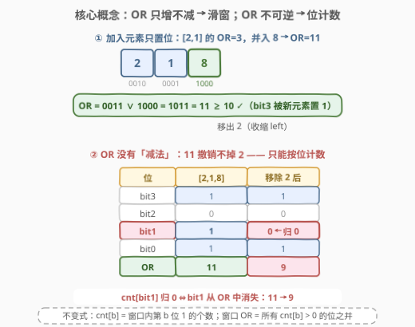
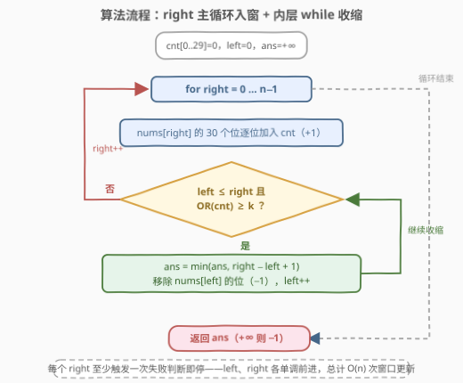

# LeetCode 或值至少为K的最短子数组II 题解

## 1. 题目概述

- **标题 / 题号**：或值至少为K的最短子数组II（#3097，medium）
- **链接**：https://leetcode.cn/problems/shortest-subarray-with-or-at-least-k-ii/
- **难度**：中等
- **标签**：位运算、数组、滑动窗口

**题意**：给你一个**非负**整数数组 `nums` 和一个整数 $k$。

如果 `nums` 的一个**非空**子数组中所有元素的按位或 OR 值**至少**为 $k$，则称该子数组是**特别的**。请返回 `nums` 中**最短特别子数组的长度**；若特别子数组不存在，返回 $-1$。

**示例 1**：

```text
输入：nums = [1,2,3], k = 2
输出：1
解释：子数组 [3] 的 OR 值为 3 ≥ 2，长度最短为 1。
```

**示例 2**：

```text
输入：nums = [2,1,8], k = 10
输出：3
解释：子数组 [2,1,8] 的 OR 值为 11 ≥ 10；任何更短的子数组 OR 都达不到 10。
```

**示例 3**：

```text
输入：nums = [1,2], k = 0
输出：1
解释：任何单个元素的 OR 值都 ≥ 0，最短长度 1。
```

**约束**：

- $1 \le \text{nums.length} \le 2 \times 10^5$
- $0 \le \text{nums}[i] \le 10^9$
- $0 \le k \le 10^9$

> ⚠️ 本题是 3095「或值至少为 K 的最短子数组 I」的大数据版：3095 的 $n \le 30$，$O(n^2)$ 暴力可过；本题 $n$ 达 $2 \times 10^5$，必须线性。另外 $\text{nums}[i], k < 2^{30}$，全程只涉及 30 个二进制位——这个常数会直接写进复杂度。

## 2. 解题思路

### 2.1 暴力思路

枚举每个左端点 $i$，向右延伸并同步维护 OR：$\text{or} \mathrel{|}= \text{nums}[j]$，一旦 $\text{or} \ge k$ 记录长度 $j - i + 1$ 并提前 break（OR 只增不减，再延伸只会更长）。总时间 $O(n^2)$，$n = 2 \times 10^5$ 时约 $4 \times 10^{10}$ 次运算，不可行。

「前缀 OR」也救不了场：与求和、异或不同，**OR 没有逆运算**，子数组 OR $\text{OR}(i..j)$ 无法由前缀 OR $\text{pre}_j$ 与 $\text{pre}_{i-1}$ 推出——这正是本题与 209（长度最小的子数组）的关键差异。

### 2.2 核心观察：OR 单调可滑窗，位计数可撤销



**观察 1（OR 只增不减 → 双指针单调）**：向窗口加入元素只会**置位**、不会清位。于是固定右端点 right，左端点 left 右移时窗口只缩不扩、OR **单调不增**——「窗口特别（OR ≥ k）」的 left 构成一段前缀 $[0, L_{\max}]$；且 right 右移后窗口 OR 只增不减，原本合法的 left 依旧合法，$L_{\max}$ 随 right **单调不减**。两个指针各走至多 $n$ 步，滑窗框架成立。

**观察 2（OR 不可逆 → 按位计数撤销）**：删元素时无法从聚合 OR 值里「减」掉它（$11$ 撤销一个 $2$ 并不能得到 $9$）。把窗口信息拆成 **30 个位计数器**，$\text{cnt}[b]$ = 窗口内第 $b$ 位为 1 的元素个数：

- 加入 $x$：$\text{cnt}[b] \mathrel{+}= (x \gg b) \mathbin{\&} 1$；
- 移除 $x$：$\text{cnt}[b] \mathrel{-}= (x \gg b) \mathbin{\&} 1$；
- 窗口 OR $= \sum_{\text{cnt}[b] > 0} 2^b$——**某位当且仅当计数归 0 时才从 OR 中消失**。

**观察 3（求最短 → 合法时收缩并记录）**：right 每扩张一步后，只要窗口仍特别，就先记录 $\text{right} - \text{left} + 1$ 再收缩。收缩路上经过的每个窗口都特别，**最后一次记录恰好是固定 right 时的最短合法窗口**，不重不漏。

> 💡 对照 209：那边靠「元素为正 → 窗口和单调」且加法可逆（直接维护窗口和）；这边靠「OR 只增不减」的单调性，但 OR 不可逆，只能退一步用位计数重建。**单调性给滑窗合法性，可逆性决定实现方式**。

### 2.3 算法流程图



整体流程：right 主循环逐个入窗（位计数 +1）；内层 while 在「窗口特别」时记录答案并收缩（位计数 −1）；right 走完返回 ans（从未更新则 −1）。

### 2.4 示例演算

![示例演算：nums=[2,1,8], k=10](../images/p3097_example_walkthrough.svg)

以示例 2 `nums = [2,1,8], k = 10` 走一遍（二进制：$2 = 0010_2$，$1 = 0001_2$，$8 = 1000_2$，$k = 1010_2$）：

| right | 窗口 | cnt（bit3, bit2, bit1, bit0） | OR | ≥ 10？ | 动作 |
|-------|--------|-------------------------------|-----|--------|------|
| 0 | [2] | (0, 0, 1, 0) | $0010_2 = 2$ | ✗ | 不收缩 |
| 1 | [2,1] | (0, 0, 1, 1) | $0011_2 = 3$ | ✗ | 不收缩 |
| 2 | [2,1,8] | (1, 0, 1, 1) | $1011_2 = 11$ | ✓ | 记录 len=3；移除 2 → cnt[bit1]=0 |
| 2 | [1,8] | (1, 0, 0, 1) | $1001_2 = 9$ | ✗ | 停止收缩 |

最终答案 $3$ ✓。注意第 4 行：移除 2 后 bit1 计数归 0、该位从 OR 中消失，$11 \to 9$——这正是位计数的「撤销」时刻。

## 3. 参考代码

### C++

```cpp
class Solution {
  public:
    int minimumSubarrayLength(vector<int>& nums, int k) {
        int n = nums.size(), ans = INT_MAX;
        int cnt[30] = {0};                       // cnt[b]：窗口内第 b 位 1 的个数
        auto query = [&]() {                     // 由位计数重建窗口 OR
            int orv = 0;
            for (int b = 0; b < 30; ++b)
                if (cnt[b]) orv |= 1 << b;
            return orv;
        };
        for (int right = 0, left = 0; right < n; ++right) {
            for (int b = 0; b < 30; ++b) cnt[b] += nums[right] >> b & 1;
            while (left <= right && query() >= k) {
                ans = min(ans, right - left + 1);
                for (int b = 0; b < 30; ++b) cnt[b] -= nums[left] >> b & 1;
                ++left;
            }
        }
        return ans == INT_MAX ? -1 : ans;
    }
};
```

### Python

```python
class Solution:
    def minimumSubarrayLength(self, nums: List[int], k: int) -> int:
        ans, left = inf, 0
        cnt = [0] * 30                           # cnt[b]：窗口内第 b 位 1 的个数
        def query():                             # 由位计数重建窗口 OR
            return sum(1 << b for b in range(30) if cnt[b])
        for right, x in enumerate(nums):
            for b in range(30):
                cnt[b] += x >> b & 1
            while left <= right and query() >= k:
                ans = min(ans, right - left + 1)
                for b in range(30):
                    cnt[b] -= nums[left] >> b & 1
                left += 1
        return -1 if ans == inf else ans
```

> 💡 三个实现细节：$\text{nums}[i], k < 2^{30}$，枚举 bit $0 \sim 29$ 即可，`int` 无溢出风险；while 里的 `left <= right` 不仅是防御——$k = 0$ 时空窗口 OR $= 0 \ge 0$ 恒真，靠它保证最多收缩到长度 1（此时答案必为 1）；全数组 OR $< k$ 时 ans 从未更新，统一返回 $-1$，两种边界都无需特判。

## 4. 复杂度分析

| 维度 | 复杂度 | 说明 |
|------|--------|------|
| 时间复杂度 | $O(30 \cdot n)$ | left、right 各单调前进 $n$ 步，每步入窗/出窗/重建 OR 各 $O(30)$；$n = 2 \times 10^5$ 时约 $1.8 \times 10^7$ 次位运算 |
| 空间复杂度 | $O(30)$ | 仅 30 个位计数器（视为 $O(1)$），不随 $n$ 增长 |

> 💡 「30」来自值域 $< 2^{30}$ 的位数上限，是位运算题的典型常数。若值域升到 $10^{18}$，把 30 换成 60 即可，框架不变。

## 5. 扩展：双指针失效的变体与「结尾 OR 值列表」

滑窗能工作，全靠「OR 与 $k$ 的比较结果对 left 单调」。一旦目标变成 3171 那样的 $\min\,|\text{OR} - k|$（最接近），单调性失效，双指针不再适用。通用的替代工具是：

> **以 i 结尾的所有子数组，OR 值至多 30 种。**

从 $\text{nums}[i]$ 出发向左不断 OR，值只置位不清位，每产生一个新值至少多置 1 个位，而位总共 30 个，故不同值至多 31 个。从左到右维护一个「(OR 值， 该值对应的最右左端点)」的严格递增列表（每步整体 $v \mid \text{nums}[i]$ 重写并去重合并），即可对每个 $i$ 在 $O(30)$ 内枚举全部候选——本题取「OR ≥ k 中最短」，3171 取「$|\text{OR} - k|$ 最小」，3022 则是这族 OR 题的按位贪心极端。

## 6. 面试要点

1. **为什么本题可以滑窗？单调性体现在哪？**

   - 固定 right，left 增大时窗口只缩不扩，OR 单调不增 → 合法 left 是前缀 $[0, L_{\max}]$；right 右移时窗口 OR 只增不减 → $L_{\max}$ 单调不减。两条单调性合起来，双指针各走一遍即线性。

2. **为什么不能像 209 那样直接维护窗口聚合值？**

   - 求和可逆：删元素减掉即可；OR 不可逆：没有「反或」运算能从 11 撤销一个 2 得到 9。所以要按位拆成计数器，让「位的消失」以计数归 0 为准。

3. **求最短窗口，为什么在「合法时」记录并收缩，而不是「非法时」扩张？**

   - 收缩路上的每个窗口都合法，最后一次记录就是该 right 的最短合法窗口。求最长（如 3090）才是「违规时收缩、全程记录」——两者是同一模板的对偶用法。

4. **k = 0 和无解分别怎么处理？**

   - $k = 0$：任何元素（含 0）的 OR 都 $\ge 0$，答案必为 1；代码中 `left <= right` 保证收缩停在长度 1，自动正确。无解：全数组 OR $< k$，ans 从未更新，返回 $-1$。均无需特判。

5. **如果值域扩大到 $10^{18}$，或目标改成 OR 最接近 k（3171），方案怎么变？**

   - 值域扩大：30 改 60，复杂度 $O(60n)$，框架不变。目标改「最接近」：比较结果不再对 left 单调，滑窗失效，改用「以 i 结尾的 OR 值至多 30 种」的列表法逐右端点枚举。

## 同类练习题

| # | 题目 | 与本题的关联 |
|---|------|-------------|
| 3095 | [或值至少为 K 的最短子数组 I](https://leetcode.cn/problems/shortest-subarray-with-or-at-least-k-i/) | 同题面小数据版（$n \le 30$），$O(n^2)$ 暴力与本题滑窗都能过，适合先暴力再优化 |
| 209 | [长度最小的子数组](https://leetcode.cn/problems/minimum-size-subarray-sum/)（[题解](../0201-0300/209_长度最小的子数组.md)） | 和阈值版最短子数组，「正数和单调」对应本题「OR 只增不减」，可逆与不可逆的经典对照 |
| 3171 | [找到按位或最接近 K 的子数组](https://leetcode.cn/problems/find-subarray-with-bitwise-or-closest-to-k/) | 同用位计数视角，但目标从「≥k 判定」变为「逼近最值」，滑窗失效需换列表法 |
| 2401 | [最长优雅子数组](https://leetcode.cn/problems/longest-nice-subarray/) | AND 对偶版——窗口按位与为 0 求「最长」，同套位计数滑窗 |
| 3022 | [给定操作次数内使剩余元素的或值最小](https://leetcode.cn/problems/minimize-or-of-remaining-elements-using-operations/)（[题解](3022_给定操作次数内使剩余元素的或值最小.md)） | OR 最优化的按位贪心视角，与本题共享「按位独立」直觉 |
