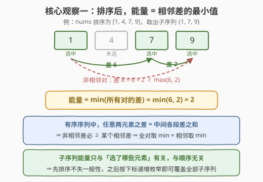
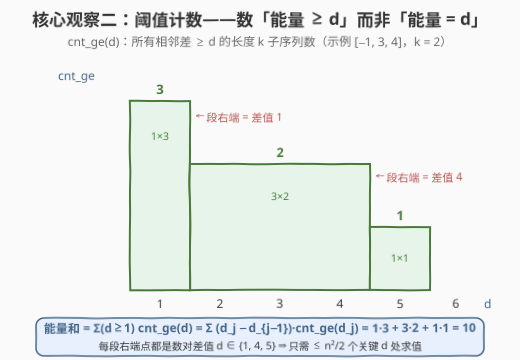
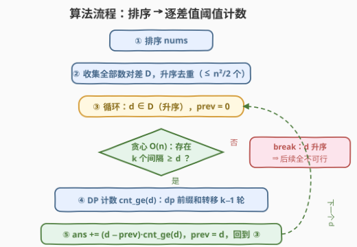

# 求出所有子序列的能量和

- **题目名称**：求出所有子序列的能量和
- **链接**：[3098. 求出所有子序列的能量和](https://leetcode.cn/problems/find-the-sum-of-subsequence-powers/)
- **难度**：困难
- **标签**：数组、动态规划、排序、贡献法

## 1. 题目概述

给你一个长度为 $n$ 的整数数组 `nums` 和一个**正**整数 $k$。

一个子序列的**能量**定义为子序列中**任意**两个元素的差值绝对值的**最小值**。

请你返回 `nums` 中长度**等于** $k$ 的**所有**子序列的**能量和**。由于答案可能很大，将答案对 $10^9 + 7$ **取余**后返回。

> ⚠️ 本题与 [3082. 求出所有子序列的能量和](https://leetcode.cn/problems/find-the-sum-of-the-power-of-all-subsequences/) 中文名相同但题意完全不同：3082 的「能量」是**和等于 $k$ 的子序列计数**（0-1 背包拆贡献），本题的「能量」是**最小差值**（排序 + 阈值计数），解法毫无交集，注意区分。

**示例 1**：

```text
输入：nums = [1,2,3,4], k = 3
输出：4
解释：长度为 3 的子序列共 4 个：[1,2,3]、[1,3,4]、[1,2,4] 和 [2,3,4]。
能量和为 |2-3| + |3-4| + |2-1| + |3-4| = 4。
```

**示例 2**：

```text
输入：nums = [2,2], k = 2
输出：0
解释：唯一的子序列 [2,2] 能量为 |2-2| = 0。
```

**示例 3**：

```text
输入：nums = [4,3,-1], k = 2
输出：10
解释：三个子序列 [4,3]、[4,-1]、[3,-1]，能量和为 1 + 5 + 4 = 10。
```

**约束条件**：

- $2 \le n = \text{nums.length} \le 50$
- $-10^8 \le \text{nums}[i] \le 10^8$
- $2 \le k \le n$

---

## 2. 解题思路

### 2.1 暴力思路

枚举全部 $\binom{n}{k}$ 个长度为 $k$ 的子序列，每个子序列排序后用 $O(k)$ 求 $\binom{k}{2}$ 对元素差的最小值。$n = 50$、$k = 25$ 时 $\binom{50}{25} \approx 1.26 \times 10^{14}$，是天文数字，暴力必死。

突破口有两层：先把「能量」本身化简（核心观察一），再换一个求和的对象（核心观察二）。

### 2.2 核心观察一：排序后，能量 = 相邻差的最小值



第一步变换：**先给 `nums` 排序**。子序列是从数组中挑出的元素集合，而能量只依赖「选了哪些元素」，与挑取顺序无关——所以排序不改变答案，排序后按下标递增枚举即可无遗漏、无重复地覆盖所有子序列。

第二步变换：排序后，设子序列选中的元素为 $x_1 < x_2 < \cdots < x_k$，则

$$
x_b - x_a = \sum_{t=a}^{b-1} (x_{t+1} - x_t) \;\ge\; \max_{a \le t < b} (x_{t+1} - x_t) \;\ge\; \min_{t} (x_{t+1} - x_t)
$$

即**任何一对元素的差都不小于最小相邻差**，而相邻差本身就是「某一对元素的差」。于是

$$
\text{能量} = \min_{\text{任意对}} |x_a - x_b| = \min_{1 \le t < k} (x_{t+1} - x_t)
$$

$\binom{k}{2}$ 对的求最小值被压缩成 $k-1$ 个**相邻对**的求最小值——这为后面「把最小值变成全局约束」埋下伏笔。

### 2.3 核心观察二：阈值计数——数「能量 ≥ d」而非「能量 = d」



直接数「能量恰好等于 $d$ 的子序列个数」是出了名的难缠：最小值恰好命中某个值，没有好转移的子结构。套路是改成**阈值计数**：

> 💡 **关键等价**：$\text{能量} \ge d \iff$ **所有**相邻差 $\ge d$（因为能量就是最小相邻差）。

后者是一个**全局约束下的计数**，可以用 DP 做。再由「至少型 → 求和」的标准转换（阶梯求和 / Abel 变换），对每个能量为整数 $p$ 的子序列，它在 $d = 1, 2, \cdots, p$ 中各被计数一次：

$$
\text{答案} = \sum_{d \ge 1} \text{cnt\_ge}(d), \qquad \text{cnt\_ge}(d) = \#\{\text{相邻差全} \ge d \text{ 的长度 } k \text{ 子序列}\}
$$

$\text{cnt\_ge}(d)$ 是关于 $d$ 的阶梯函数，**只在数对差值处变化**——差值至多 $\binom{n}{2} < n^2/2$ 个。把所有正差值升序去重为 $d_1 < d_2 < \cdots < d_m$（记 $d_0 = 0$），阶梯求和压缩为：

$$
\text{答案} = \sum_{j=1}^{m} (d_j - d_{j-1}) \cdot \text{cnt\_ge}(d_j)
$$

系数 $(d_j - d_{j-1})$ 正是「$\text{cnt\_ge}$ 保持不变的那段整数 $d$ 的长度」。用示例 3 直观验证：$D = \{1, 4, 5\}$，$\text{cnt\_ge}$ 依次为 $3, 2, 1$，答案 $= 1 \cdot 3 + 3 \cdot 2 + 1 \cdot 1 = 10$ ✓。

### 2.4 算法流程：cnt_ge(d) 的前缀和 DP



对固定的阈值 $d$，$\text{cnt\_ge}(d)$ 用一个「以某个下标结尾」的计数 DP 求：

$$
dp[t][j] = \text{已选 } t \text{ 个元素、最后一个是 } nums[j] \text{、相邻差全} \ge d \text{ 的方案数}
$$

初始 $dp[1][j] = 1$；转移时，前驱 $i$ 需满足 $nums[j] - nums[i] \ge d$。**排序后这个条件恰好是前缀**（$nums[i] \le nums[j] - d$ 的下标构成连续区间），于是

$$
dp[t][j] = \sum_{i \le p(j)} dp[t-1][i] = \text{pre}[p(j)+1], \qquad p(j) = \min\big(\text{值} \le nums[j]-d \text{ 的最大下标},\; j-1\big)
$$

对每层 $t$ 先求前缀和 $\text{pre}$，转移降为 $O(1)$，单个 $d$ 的 DP 为 $O(nk)$。流程汇总：

1. 排序 `nums`，收集所有正数对差，升序去重得 $D$（$\le n^2/2$ 个）；
2. 逐个 $d \in D$ 升序处理：先 $O(n)$ **贪心**判定「能否选出 $k$ 个间隔全 $\ge d$ 的元素」，不可行则 `break`（$d$ 越大越难，后面全不可行）；
3. 可行则跑上述 DP 得 $\text{cnt\_ge}(d)$，累加 $(d - \text{prev}) \cdot \text{cnt\_ge}(d)$，更新 $\text{prev} = d$。

> 💡 **为什么贪心判定能 break**：从最小元素出发，每次贪心取「与上一个已选元素距离 $\ge d$ 的最小元素」，交换论证可知若贪心凑不够 $k$ 个，任何方案也凑不够；而 $\text{cnt\_ge}(d)$ 关于 $d$ 单调不增，一旦为 0，更大的 $d$ 全为 0。
>
> ⚠️ **不能**用「DP 计数结果模 $10^9+7$ 后为 0」来判 break：真实计数可能是模数的倍数，模后为 0 不代表不存在。贪心判定与计数无关，天然无此坑。

### 2.5 示例演算

![示例演算：nums=[4,3,-1], k=2 的 DP 与求和过程](../images/p3098_example_walkthrough.svg)

以示例 3 `nums = [4,3,-1]`，$k = 2$ 演算。排序后 $[-1, 3, 4]$，正差值 $D = \{1, 4, 5\}$。$k=2$ 时 DP 只有一轮转移，$dp^1 = [1,1,1]$，$dp^2[j] = \text{pre}[p(j)+1]$：

| $d$ | $dp^2$ | $\text{cnt\_ge}(d)$ | $(d - \text{prev}) \cdot \text{cnt}$ |
|-----|--------|--------------------|--------------------------------------|
| 1 | $[0, 1, 2]$ | 3 | $(1-0) \times 3 = 3$ |
| 4 | $[0, 1, 1]$ | 2 | $(4-1) \times 2 = 6$ |
| 5 | $[0, 0, 1]$ | 1 | $(5-4) \times 1 = 1$ |

三个子序列 $(−1,3)$、$(−1,4)$、$(3,4)$ 的能量分别为 $4, 5, 1$——$d=1$ 时三个全计入，$d=4$ 时只剩前两个，$d=5$ 时只剩 $(−1,4)$，正对应 $\text{cnt\_ge}$ 的 $3, 2, 1$。最终 $\text{ans} = 3 + 6 + 1 = 10$ ✓，与按定义逐个计算 $1 + 5 + 4 = 10$ 完全一致。

---

## 3. 参考代码

### C++

```cpp
class Solution {
  public:
    int sumOfPowers(vector<int>& nums, int k) {
        constexpr long long MOD = 1'000'000'007;
        int n = nums.size();
        sort(nums.begin(), nums.end());

        // 收集所有数对差值，升序去重（<= n^2/2 个）
        vector<int> diffs;
        for (int i = 0; i < n; i++)
            for (int j = i + 1; j < n; j++)
                diffs.push_back(nums[j] - nums[i]);
        sort(diffs.begin(), diffs.end());
        diffs.erase(unique(diffs.begin(), diffs.end()), diffs.end());

        long long ans = 0, prev = 0;
        for (int d : diffs) {
            if (d <= 0) continue;                 // d = 0 的贡献恒为 0，直接跳过
            // O(n) 贪心判定：能否选出 k 个间隔全 >= d 的元素
            int cnt = 1, last = nums[0];
            for (int i = 1; i < n && cnt < k; i++)
                if (nums[i] - last >= d) { last = nums[i]; cnt++; }
            if (cnt < k) break;                   // d 升序，后续阈值全不可行

            // O(nk) DP：cnt_ge(d) = 相邻差全 >= d 的长度 k 子序列数
            vector<long long> dp(n, 1);           // 长度 1：每个元素都能开头
            for (int t = 2; t <= k; t++) {
                vector<long long> pre(n + 1, 0);
                for (int i = 0; i < n; i++) pre[i + 1] = (pre[i] + dp[i]) % MOD;
                vector<long long> ndp(n, 0);
                for (int j = 0; j < n; j++) {
                    // 值 <= nums[j]-d 的元素个数，clamp 到 j（防 d=0 时自选/逆选）
                    int m = int(upper_bound(nums.begin(), nums.end(), nums[j] - d) - nums.begin());
                    m = min(m, j);
                    if (m > 0) ndp[j] = pre[m];
                }
                dp = move(ndp);
            }
            long long c = 0;
            for (long long v : dp) c = (c + v) % MOD;
            ans = (ans + (d - prev) * c) % MOD;   // d-prev < 2e8，乘积 < 2e17，int64 安全
            prev = d;
        }
        return int(ans);
    }
};
```

### Python

```python
from bisect import bisect_right

class Solution:
    def sumOfPowers(self, nums: List[int], k: int) -> int:
        MOD = 10**9 + 7
        nums.sort()
        n = len(nums)
        diffs = sorted({nums[j] - nums[i] for i in range(n) for j in range(i + 1, n)})

        ans, prev = 0, 0
        for d in diffs:
            if d <= 0:                      # d = 0 的贡献恒为 0，跳过
                continue
            # O(n) 贪心判定：能否选出 k 个间隔全 >= d 的元素
            cnt, last = 1, nums[0]
            for x in nums:
                if x - last >= d:
                    last, cnt = x, cnt + 1
                    if cnt == k:
                        break
            if cnt < k:                     # d 升序，后续阈值全不可行
                break

            # O(nk) DP：cnt_ge(d) = 相邻差全 >= d 的长度 k 子序列数
            dp = [1] * n                    # 长度 1：每个元素都能开头
            for _ in range(k - 1):
                pre = [0] * (n + 1)
                for i in range(n):
                    pre[i + 1] = (pre[i] + dp[i]) % MOD
                # 值 <= nums[j]-d 的元素个数，clamp 到 j（防 d=0 时自选/逆选）
                dp = [pre[min(bisect_right(nums, nums[j] - d), j)] for j in range(n)]
            ans = (ans + (d - prev) * sum(dp)) % MOD
            prev = d
        return ans
```

---

## 4. 复杂度分析

| 维度 | 复杂度 | 说明 |
|------|--------|------|
| 时间复杂度 | $O(n^2 \cdot nk) = O(n^3 k)$ | 至多 $n^2/2$ 个阈值 $d$，每个 $O(n)$ 贪心 + $O(nk)$ DP；$n = k = 50$ 时约 $3 \times 10^6$ 次操作 |
| 空间复杂度 | $O(n)$ | 滚动 dp 数组与前缀和数组；差值集合 $O(n^2)$ 为可选的额外开销 |

> 💡 实际远快于上界：贪心剪枝会提前 `break`（$d > \frac{\max - \min}{k-1}$ 时必然无解），多数输入只跑很小一部分阈值。

---

## 5. 扩展：恰型-至少型转换的细节与变体

**① Abel 变换的另一种看法。** $\sum_j (d_j - d_{j-1}) \cdot \text{cnt\_ge}(d_j)$ 也可以从「恰好型」差分推出：设 $c(d)$ 为能量恰为 $d$ 的子序列数，则 $\text{cnt\_ge}(d_j) = \sum_{i \ge j} c(d_i)$，代入分部求和即得。两种推导殊途同归——「至少型好算、恰型难算」时，先算至少型再差分/积分是通用武器。

**② 不排序行不行？** 可以对每个子序列单独排序后应用「能量 = 相邻差最小」，但那样阈值条件不再是前缀，DP 退化为 $O(n^2)$ 状态（hint 3 的 $dp[\text{len}][i][j]$ 形态），总复杂度 $O(n^4 k)$。全局预排序让「值约束」变成「下标前缀约束」，是本题从 $O(n^4 k)$ 降到 $O(n^3 k)$ 的关键一步。

**③ 阈值集合能否更小？** 只需「可能成为某个子序列最小相邻差」的 $d$，即差值全集即可——已无法再省：每个差值都可能恰好是某个子序列的最小相邻差（例如 $k=2$ 时任意数对都是一个子序列）。倒是可以把每个 $d$ 的 $O(\log n)$ 二分换成双指针（$nums[j] - d$ 随 $j$ 单调不减），小幅优化常数。

---

## 6. 面试要点

1. **为什么排序不改变答案？**

   - 子序列的能量只由「选中的元素集合」决定，与元素在原数组中的位置、顺序无关；排序只是给同一批集合换了一种规范的枚举顺序（按下标递增），每个长度 $k$ 的子序列仍恰好被枚举一次。

2. **为什么能量等于最小相邻差？**

   - 排序后子序列元素 $x_1 < \cdots < x_k$，任一对差 $x_b - x_a$ 是中间各相邻差之和，必不小于其中最大的一段，更不小于最小的一段；而相邻差本身也是一对元素的差。故全对取 min 等于相邻取 min。

3. **为什么要数「能量 ≥ d」而不是「能量 = d」？**

   - 「所有相邻差 ≥ d」是全局单调约束，有可转移的子结构（末尾元素 + 阈值即可判定合法性）；「恰好等于 d」要求最小值精确命中，最小值无后效性可循。这是「最小值统计」类问题的标准转化：至多 / 至少先行，再差分还原。

4. **$(d_j - d_{j-1})$ 这个系数是怎么来的？**

   - 能量是整数，能量为 $p$ 的子序列在 $d = 1, \cdots, p$ 的阈值计数中各出现一次，故答案 $= \sum_{d \ge 1} \text{cnt\_ge}(d)$；$\text{cnt\_ge}$ 是阶梯函数，仅在数对差值处变化，把逐整数求和按台阶分段压缩，段长正是相邻两个差值的间隔。

5. **实现上有哪些坑？**

   - ① $d = 0$（重复元素）时前驱下标须 clamp 到 $j-1$，否则会把「自己接自己」等非法转移算进去；好在 $d=0$ 的贡献恒为 0，可直接跳过。② 不能用「模后计数为 0」判断不存在（真实计数可能是 $10^9+7$ 的倍数），要用与计数无关的 $O(n)$ 贪心存在性判定来触发 break。③ C++ 中 $(d - \text{prev}) \cdot c$ 最大约 $2 \times 10^{17}$，用 `long long` 中转即可，切勿让 `int` 参与乘法。

---

## 7. 同类练习题

- [891. 子序列宽度之和](https://leetcode.cn/problems/sum-of-subsequence-widths/)：同为「排序 + 拆贡献」消掉 $2^n$ 枚举，把 $\sum (\max - \min)$ 化为每个元素作为最大/最小的贡献之和
- [719. 找出第 K 小的数对距离](https://leetcode.cn/problems/find-k-th-smallest-pair-distance/)：排序 + 差值阈值计数判定的近亲，「差值 $\le d$ 的数对个数」单调，配二分答案
- [828. 统计子串中的唯一字符](https://leetcode.cn/problems/count-unique-characters-of-all-substrings-of-a-given-string/)：贡献法经典，对每个字符数「它作为唯一字符出现的子串数」，与本题同属「换求和对象」范式
- [3153. 所有数对中数位差之和](https://leetcode.cn/problems/sum-of-digit-differences-of-all-pairs/)：按位拆贡献避免两两枚举，体会「拆维度 + 拆贡献」的组合拳
