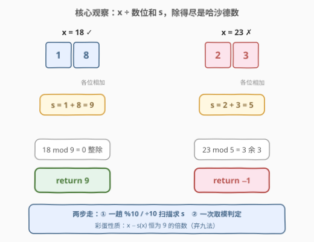
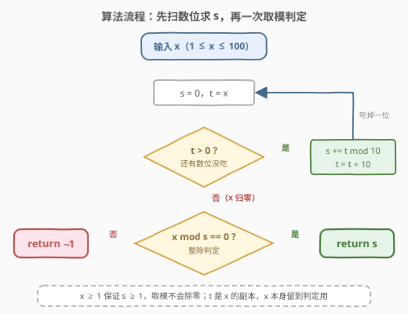
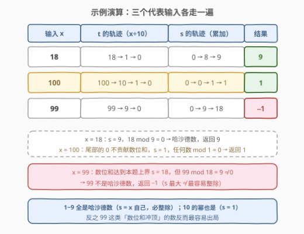

# LeetCode 哈沙德数 题解

## 1. 题目概述

- **标题 / 题号**：哈沙德数（#3099，easy）
- **链接**：https://leetcode.cn/problems/harshad-number/
- **难度**：简单
- **标签**：数学

**题意**：如果一个整数能够被其**各个数位上的数字之和**整除，则称之为**哈沙德数**（Harshad number）。给你一个整数 `x`。如果 `x` 是哈沙德数，则返回 `x` 各个数位上的数字之和，否则返回 `-1`。

**示例 1**：

```text
输入：x = 18
输出：9
解释：x 各个数位上的数字之和为 9。18 能被 9 整除。因此 18 是哈沙德数，答案是 9。
```

**示例 2**：

```text
输入：x = 23
输出：-1
解释：x 各个数位上的数字之和为 5。23 不能被 5 整除。因此 23 不是哈沙德数，答案是 -1。
```

**约束**：

- $1 \le x \le 100$

> 💡 读题关键：这题就两件事——**求出数位和 $s$**，**判定 $x \bmod s$ 是否为 0**。它是一道披着「数论定义」外衣的数位扫描入门题，核心工作量在第一步。

## 2. 解题思路

### 2.1 暴力思路：转字符串，逐字符求和

最直接的做法：把 `x` 转成字符串，遍历每个字符转 int 累加得到 $s$，再判 `x % s == 0`。Python 里一行就能写完：

```python
s = sum(map(int, str(x)))
return s if x % s == 0 else -1
```

这当然正确。但对每个数做了一次「数值 → 字符串」的进制转换，还分配了临时串。「逐位取数」这件事本身有纯算术的做法，连字符串都不用碰——这也是数位 DP、整数反转等一大家子题目的公共骨架。

### 2.2 核心观察：%10 取位，÷10 进位



一趟 `% 10` / `÷ 10` 循环就能剥出所有数位：

- `t % 10` —— 取出**当前最低位**；
- `t //= 10` —— **吃掉**这一位，让下一位降为最低位；
- 累加进 `s`，直到 `t` 归零。

**循环不变量**：每执行一轮，`s` 等于已被吃掉的那些数位之和，`t` 是剩余高位构成的数。`t = 0` 时全部数位恰好处理完，$s = s(x)$。

> 💡 顺序无关性：加法可交换，从低位往高位吃与按任意顺序累加结果相同——这正是 3079 题「一趟扫描攒统计量」的同一招，只是聚合函数从 `max` 换成了 `sum`。

拿到 $s$ 后做一次整除判定：`x % s == 0` 则返回 `s`，否则返回 `-1`。注意**取模用原数 `x`**，扫描只消耗工作副本 `t`，两个角色别混用一个变量。

一个有趣的副产物：由**弃九法**，$x \equiv s(x) \pmod 9$，即 $x - s(x)$ 恒为 9 的倍数。所以哈沙德数若满足 $s \mid x$，则 $s \mid (x - s)$，即 $s \mid 9k$（$k = \frac{x-s}{9}$）——这解释了很多整除结构，见第 5 节。

### 2.3 算法流程：先扫描求和，再一次取模



1. `s = 0`，`t = x`；
2. `while t > 0`：`s += t % 10`；`t //= 10`；
3. 若 `x % s == 0` 返回 `s`，否则返回 `-1`。

> ⚠️ 约束保证 $x \ge 1$，循环至少执行一次且 $s \ge 1$，取模不会除零。若题目放宽到允许 $x = 0$（数位和为 0），需先特判。

### 2.4 示例演算



| 输入 $x$ | $t$ 的轨迹 | $s$ 的轨迹 | 判定 | 返回 |
|----------|-----------|-----------|------|------|
| 18 | 18 → 1 → 0 | 0 → 8 → 9 | $18 \bmod 9 = 0$ | **9** |
| 100 | 100 → 10 → 1 → 0 | 0 → 0 → 1 → 1 | $100 \bmod 1 = 0$ | **1** |
| 99 | 99 → 9 → 0 | 0 → 9 → 18 | $99 \bmod 18 = 9$ | **-1** |

三个输入各代表一类：18 是普通命中；100 演示**尾零不贡献数位和**（$s = 1$，任何数模 1 都是 0，所以 10 的幂全是哈沙德数）；99 的数位和冲到本题上界 18，反而整除失败——「数位和大」与「是哈沙德数」没有半点因果关系。

## 3. 参考代码

### C++（算术数位扫描）

```cpp
class Solution {
  public:
    int sumOfTheDigitsOfHarshadNumber(int x) {
        int s = 0;
        for (int t = x; t > 0; t /= 10) {
            s += t % 10;   // 剥出当前最低位累加
        }
        return x % s == 0 ? s : -1;
    }
};
```

### Python（同款算术版）

```python
class Solution:
    def sumOfTheDigitsOfHarshadNumber(self, x: int) -> int:
        s, t = 0, x
        while t:
            s += t % 10
            t //= 10
        return s if x % s == 0 else -1
```

> 💡 Python 字符串一行流：`return s if x % (s := sum(map(int, str(x)))) == 0 else -1`。两个版本都对，取舍讨论见第 6 节。

## 4. 复杂度分析

| 维度 | 复杂度 | 说明 |
|------|--------|------|
| 时间复杂度 | $O(\log_{10} x)$，本题 $\le 3$ 轮 | 循环次数 = 数位个数；$x \le 100$ → 至多 3 次 |
| 空间复杂度 | $O(1)$ | 仅 `s` / `t` 两个变量；字符串版为 $O(D)$ 临时串（$D$ 为位数） |

> 💡 本题 $s \le 18$（$x = 99$ 取到），`int` 毫无压力。即便放宽到 $x \le 10^{18}$，$s \le 9 \times 18 = 162$，依然一个 `int` 装得下——数位和的增长是对数级的，天生不会溢出。

## 5. 扩展：哈沙德数的冷知识与打表

**命名与冷知识**：Harshad 梵文意为「带来喜悦」，由 D. R. Kaprekar（卡普雷卡尔数那位）研究，后因 Ivan Niven 在 1997 年一个数学会议上讨论而被称为 **Niven 数**。两个经典结论：

- $1 \sim 9$ 全是哈沙德数（$s = x$，自己整除自己）；10 的幂（10、100…）也都是（$s = 1$）——尾零不贡献数位和。
- **$x \equiv s(x) \pmod 9$（弃九法）**：$x - s(x)$ 恒为 9 的倍数，这给了整除判定一个额外的数论视角。
- Grundman（1994）证明：**任意 21 个连续正整数中至少有一个不是哈沙德数**，即连续哈沙德数串最长 20 个——存在性密度不足 1 的直观证据。

**约束极小时的打表选项**：$x \le 100$，完全可以离线算好 `ans[1..100]` 数组，查询 $O(1)$。面试里这不算好答案（考的就是现场扫描），但在「海量查询同一函数」的场景下，预打表是正当手段。

**变体走法**：若题面改成「返回**严格大于** $x$ 的最小哈沙德数」，只需把本题封装成 `is_harshad(x)`，从 $x+1$ 起向上枚举——由上面的密度结论，不会走太远。若改成「判断 $x$ 是否为**素数**哈沙德数（Moran 数）」，在整除判定外加一次素性测试即可。

## 6. 面试要点

1. **为什么用 `t % 10` / `t //= 10` 而不是转字符串？**

   - 都正确。算术版免进制转换、$O(1)$ 空间、语言无关，且是整数反转 / 数位 DP 等题的通用骨架；字符串版在 Python 里更短。面试加分点在于点出「数位枚举」这一抽象，而非具体写法。

2. **循环不变量怎么表述？**

   - 每轮结束后：`s` = 已剥离数位之和，`t` = 剩余高位构成的数。`t = 0` 时所有数位恰好处理完，无遗漏无重复。

3. **`x % s` 会不会除零？**

   - 本题不会：$x \ge 1$ 保证至少进入循环一次，$s \ge 1$。但若约束放宽允许 $x = 0$，$s = 0$ 会除零——边界意识值得口头带一句。

4. **`x ≡ s(x) (mod 9)` 在这题里有什么用？**

   - 它说明 $x - s(x)$ 是 9 的倍数。若 $s \mid x$，结合 $s \mid x - s$ 可推出结构限制，可用来快速排除/构造例子；对本题而言不是必需品，但展示了「整除判定」与同余工具的联系（呼应 258 数根）。

5. **扫描时为什么保留 `x` 另用副本 `t`？**

   - 扫描会摧毁 `t`（归零），而最终整除判定 `x % s == 0` 需要原始值。若共用一个变量，扫完就只剩 0，判定变成 `0 % s`，直接出 bug。

## 同类练习题

| # | 题目 | 与本题的关联 |
|---|------|-------------|
| 258 | [各位相加](https://leetcode.cn/problems/add-digits/) | 反复折叠数位和直到一位数（数根），本题数位扫描的直接下游（本仓库已有题解） |
| 1281 | [整数的各位积和之差](https://leetcode.cn/problems/subtract-the-product-and-sum-of-digits-of-an-integer/) | 一趟扫描同时聚合「积」与「和」，聚合函数换装练习（本仓库已有题解） |
| 2269 | [找到一个数字的 K 美丽值](https://leetcode.cn/problems/find-the-k-beauty-of-a-number/) | 数位 × 整除判定的组合——按数位切窗口判断能否整除原数（本仓库已有题解） |
| 507 | [完美数](https://leetcode.cn/problems/perfect-number/) | 「数等于自身某函数」的姐妹定义（真约数之和），同款判定式思维（本仓库已有题解） |
| 3079 | [求出加密整数的和](https://leetcode.cn/problems/find-the-sum-of-encrypted-integers/) | 同款 `%10`/`÷10` 一趟扫描攒统计量，把 `sum` 换成 `max` 而已（本仓库已有题解） |
