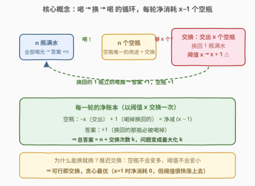
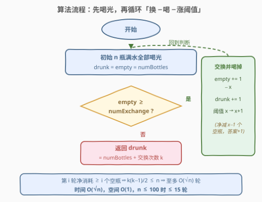
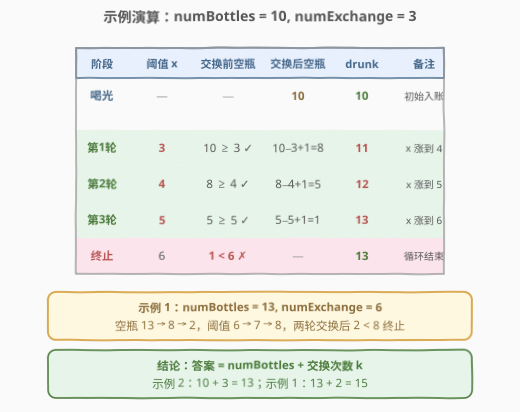

# LeetCode 换水问题 II 题解

## 1. 题目概述

- **标题 / 题号**：换水问题 II（#3100，medium）
- **链接**：https://leetcode.cn/problems/water-bottles-ii/
- **难度**：中等
- **标签**：数学、模拟

**题意**：给你两个整数 `numBottles` 和 `numExchange`。`numBottles` 代表你最初拥有的**满水瓶**数量。在任意时刻，你可以执行以下两种操作之一：

1. **喝掉任意数量的满水瓶**，使它们变成空水瓶；
2. **用 `numExchange` 个空水瓶交换 1 个满水瓶**，交换完成后 `numExchange` 的值**增加 1**。

注意：**不能用同一个 `numExchange` 值交换多批空水瓶**。例如 `numBottles == 3` 且 `numExchange == 1` 时，不能把 3 个空瓶分三批、每批 1 个地换成 3 瓶满水——换完第一批，阈值就涨到 2 了。

返回你**最多**可以喝到多少瓶水。

**示例 1**：

```text
输入：numBottles = 13, numExchange = 6
输出：15
解释：先喝掉 13 瓶（累计 13，空瓶 13）；
      用 6 个空瓶换 1 瓶并喝掉（累计 14，空瓶 8，阈值涨到 7）；
      用 7 个空瓶换 1 瓶并喝掉（累计 15，空瓶 2，阈值涨到 8）；
      空瓶 2 < 8，交换终止，共喝 15 瓶。
```

**示例 2**：

```text
输入：numBottles = 10, numExchange = 3
输出：13
解释：喝掉 10 瓶后，依次以阈值 3、4、5 各换一瓶并喝掉，
      空瓶 10 → 8 → 5 → 1，阈值 3 → 4 → 5 → 6，
      最后空瓶 1 < 6，共喝 10 + 3 = 13 瓶。
```

**约束**：

- $1 \le \text{numBottles} \le 100$
- $1 \le \text{numExchange} \le 100$

> ⚠️ 读题陷阱：**阈值每次交换后必涨 1**。「攒一批空瓶再一起换」是不存在的选项——同一阈值只能用一次，这正是不等价于 1518 换水问题 I（固定兑换率）的地方。

## 2. 解题思路

### 2.1 暴力思路

按题意逐步模拟：维护三个状态（满水瓶数、空水瓶数、当前阈值 `numExchange`）。喝掉任意数量的满水瓶都是允许的，而**喝掉的每一瓶都直接计入答案**，所以最朴素的策略就是「有满水就喝、空瓶够就换」：

- 第一步：把手里的满水瓶**全部喝光**，答案加上 `numBottles`，同时空瓶数也变成 `numBottles`；
- 之后循环：只要空瓶数 $\ge$ 当前阈值，就交换一瓶、立刻喝掉、阈值 +1。

由于 $n \le 100$，循环轮数极小（后文证明至多 $O(\sqrt{n})$ 轮），朴素模拟本身就是这道题的标准解。真正需要想清楚的只有一件事：**这样贪心为什么最优**。

### 2.2 核心观察：贪心「能换就换，换完就喝」



三个关键事实：

1. **所有满水瓶最终都会被喝掉**。喝一瓶满水不仅让答案 +1，还会产出一个空瓶——喝没有任何代价，不喝没有任何收益。于是初始 $n$ 瓶全部入账，答案的下界是 $n$。

2. **答案 $= n + k$，其中 $k$ 是交换次数**。每交换一次，世界上就多出一瓶满水，而满水瓶终将被喝掉。于是问题从「喝多少」转化为「**最多能换多少次**」——一个纯粹的计数问题。

3. **能换就换不会吃亏**。空瓶**唯一的用途**就是交换；而阈值只在交换之后才上涨，推迟交换既不会增加空瓶、也不会降低阈值。因此「当前空瓶够，就立刻换」的贪心 dominates 一切其他策略。

> 💡 每轮交换的**净消耗**很好算：交出 $x$ 个空瓶、换回 1 瓶满水并立刻喝掉（回收 1 个空瓶），空瓶净减 $x-1$；同时阈值 $x \to x+1$。当 $x = 1$ 时净消耗为 0，但阈值随即涨到 2，下一轮就开始净消耗——**不会死循环**。

### 2.3 算法流程图



流程一句话：初始化 `drunk = empty = numBottles`（一口气喝光）→ 判断 `empty >= numExchange`：成立则 `empty += 1 - numExchange`（交出 $x$ 个空瓶、喝掉换回的 1 瓶）、`drunk += 1`、`numExchange += 1`，回到判断；不成立则返回 `drunk`。全程只有三个变量，无数组、无 DP。

### 2.4 示例演算



以示例 2（`numBottles = 10, numExchange = 3`）走一遍：喝光后 `drunk = empty = 10`。第 1 轮阈值 3：换 1 瓶喝掉，空瓶 $10-3+1=8$，答案 11，阈值涨到 4；第 2 轮阈值 4：空瓶 $8-4+1=5$，答案 12，阈值 5；第 3 轮阈值 5：空瓶 $5-5+1=1$，答案 13，阈值 6；空瓶 $1 < 6$，循环终止。答案 $10 + 3 = \textbf{13}$。示例 1（13, 6）同理：空瓶 $13 \to 8 \to 2$，两轮交换后 $2 < 8$，答案 $13+2=\textbf{15}$。

## 3. 参考代码

### C++（贪心模拟）

```cpp
class Solution {
  public:
    int maxBottlesDrunk(int numBottles, int numExchange) {
        int drunk = numBottles, empty = numBottles;  // 一口气喝光
        while (empty >= numExchange) {
            empty += 1 - numExchange;  // 交出 numExchange 个空瓶，喝掉换回的 1 瓶
            ++drunk;                   // 换回的立刻入账
            ++numExchange;             // 兑换阈值上涨
        }
        return drunk;
    }
};
```

### Python（贪心模拟）

```python
class Solution:
    def maxBottlesDrunk(self, numBottles: int, numExchange: int) -> int:
        drunk = empty = numBottles  # 一口气喝光
        while empty >= numExchange:
            empty += 1 - numExchange  # 净消耗 numExchange - 1 个空瓶
            drunk += 1
            numExchange += 1          # 阈值上涨
        return drunk
```

> 💡 `empty += 1 - numExchange` 把「交出 $x$ 个空瓶」与「喝掉换回的 1 瓶、空瓶 +1」合并成一次净变化；写成 `empty -= numExchange - 1` 也完全等价。

## 4. 复杂度分析

| 维度 | 复杂度 | 说明 |
|------|--------|------|
| 时间复杂度 | $O(\sqrt{\text{numBottles}})$ | 第 $i$ 轮（从 0 数）净消耗 $x+i-1 \ge i$ 个空瓶，故 $k$ 轮共消耗 $\ge k(k-1)/2$ 个，由 $k(k-1)/2 \le n$ 得 $k = O(\sqrt n)$；$n \le 100$ 时至多约 14 轮 |
| 空间复杂度 | $O(1)$ | 只维护 `drunk` / `empty` / `numExchange` 三个计数变量 |

## 5. 扩展：$O(1)$ 数学解

既然答案是 $n + k$，只要求最大交换次数 $k$ 即可，不必真的逐轮模拟。

**推导**：第 $i$ 轮（$i = 0, 1, \dots, k-1$）能交换的条件是交换前空瓶数 $\ge x + i$。由于每轮净消耗 $x+i-1 \ge 0$，空瓶数单调不增、阈值单调递增，所以**最紧的条件是最后一轮**。展开第 $k-1$ 轮的可行条件：

$$n \;\ge\; kx + \frac{(k-1)(k-2)}{2}$$

即求最大 $k$ 满足 $k^2 + (2x-3)k + (2-2n) \le 0$，由求根公式取正根下取整：

```python
import math

class Solution:
    def maxBottlesDrunk(self, numBottles: int, numExchange: int) -> int:
        b = 2 * numExchange - 3
        d = math.isqrt(b * b + 8 * (numBottles - 1))  # 判别式，isqrt 精确无浮点误差
        k = (d - b) // 2
        return numBottles + k
```

用 `math.isqrt` 做整数开方，彻底避开浮点精度陷阱。两组示例代入：$(10,3)$ 得 $k=3$、答案 13；$(13,6)$ 得 $k=2$、答案 15，均与模拟一致。面试中先写模拟版讲清贪心正确性，再补这一版作为加分项即可。

## 6. 面试要点

1. **为什么「能换就换、换完就喝」是最优的？**

   - 空瓶唯一的变现渠道就是交换；而阈值只在交换后才上涨，推迟交换不会带来任何收益（空瓶不会变多、阈值不会变小）。既然每一轮「换」都严格增加最终答案（多一瓶满水必被喝掉），可行即执行就是支配策略。

2. **为什么答案 $= \text{numBottles} + k$？**

   - 满水瓶不喝毫无价值，所以初始 $n$ 瓶与每次换来的每一瓶最终全部被喝掉。喝的总数 $=$ 初始瓶数 $+$ 交换产出数 $= n + k$，问题于是化归为最大化交换次数 $k$。

3. **`numExchange = 1` 时净消耗为 0，为什么不会死循环？**

   - 第一轮空瓶净变化为 0，但阈值立刻涨到 2，下一轮净消耗 1。阈值每轮严格 +1，净消耗很快转正，空瓶终将被耗尽，循环至多 $O(\sqrt n)$ 轮。

4. **与 1518 换水问题 I 的本质区别是什么？**

   - I 的兑换率固定为 $x$，可以直接用除法 / 循环整除 $O(1)$ 或 $O(\log n)$ 求解；II 的兑换率每换一次 +1，等比折损变成递增数列求和，通用做法退化为逐轮模拟或解一元二次不等式。

5. **不用模拟能否直接求 $k$？**

   - 可以。由「最后一轮可行」得 $n \ge kx + (k-1)(k-2)/2$，即 $k^2 + (2x-3)k + (2-2n) \le 0$，求根公式 + 整数开方（`isqrt`）即可 $O(1)$ 出解，注意用整数运算避免浮点误差。

## 同类练习题

| # | 题目 | 与本题的关联 |
|---|------|-------------|
| 1518 | [换水问题](https://leetcode.cn/problems/water-bottles/) | 本题的 I 代，兑换率固定不变，练习除法直接求解与本题的对比 |
| 1688 | [比赛中的配对次数](https://leetcode.cn/problems/count-of-matches-in-tournament/) | 同为「总量守恒 + 逐轮模拟」的计数问题，还能 O(1) 直接由 n−1 得解 |
| 2139 | [得到目标值的最少行动次数](https://leetcode.cn/problems/minimum-moves-to-reach-target-score/) | 贪心 + 倍增操作次数受限，同样考察「操作顺序影响成本」的贪心论证 |
| 2894 | [分类求和并作差](https://leetcode.cn/problems/divisible-and-non-divisible-sums-difference/) | 数学公式直接求解的小练习，体会「模拟可做、公式更快」的取舍 |
