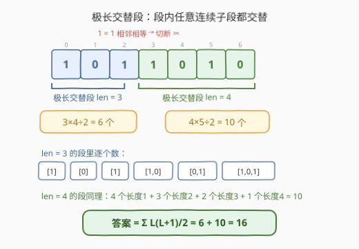
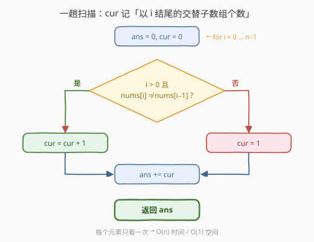
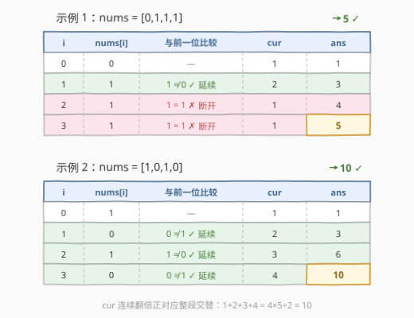

# LeetCode 交替子数组计数 题解

## 1. 题目概述

- **标题 / 题号**：交替子数组计数（#3101，medium）
- **链接**：https://leetcode.cn/problems/count-alternating-subarrays/
- **难度**：中等
- **标签**：数组、数学、动态规划

**题意**：给你一个二进制数组 `nums`。如果一个**子数组**中**不存在**两个**相邻**元素的值**相同**的情况，就称其为**交替子数组**。返回 `nums` 中交替子数组的**数量**。

**示例 1**：

```text
输入：nums = [0,1,1,1]
输出：5
解释：交替子数组有 [0]、[1]、[1]、[1] 以及 [0,1]，共 5 个。
```

**示例 2**：

```text
输入：nums = [1,0,1,0]
输出：10
解释：数组的每个子数组都是交替子数组，长度为 4 的数组共有 4×5÷2 = 10 个子数组。
```

**约束**：

- $1 \le nums.length \le 10^5$
- `nums[i]` 不是 `0` 就是 `1`

> ⚠️ **答案规模预警**：整条数组全交替时答案为 $\frac{n(n+1)}{2}$，$n = 10^5$ 时约 $5 \times 10^9$，**已经超出 32 位 int 上界**（约 $2.1 \times 10^9$）。C++/Java 必须用 `long long` / `long`，Python 无需处理。

## 2. 解题思路

### 2.1 暴力思路

枚举全部 $O(n^2)$ 个子数组，右端扩展时增量检查一次相邻相等即可判定合法，总代价 $O(n^2)$。$n = 10^5$ 时约 $10^{10}$ 次操作，必然超时——必须想到线性做法。

### 2.2 核心观察：以 i 结尾计数 + 极长交替段



定义 $dp[i]$ = **以 `i` 结尾**的交替子数组个数，则：

$$
dp[i] = \begin{cases} dp[i-1] + 1, & nums[i] \ne nums[i-1] \\ 1, & nums[i] = nums[i-1] \text{ 或 } i = 0 \end{cases}
$$

- **不相等**：所有以 `i-1` 结尾的交替子数组都还能延长一格接上 `nums[i]`（个数即 $dp[i-1]$），再加上单独一个 $[nums[i]]$，共 $dp[i-1]+1$ 个；
- **相等**：延长全部失效，只剩 $[nums[i]]$ 自己，即 $1$ 个。

答案 $= \sum_i dp[i]$。由于 $dp[i]$ 只依赖 $dp[i-1]$，用一个滚动变量 `cur` 即可，空间 $O(1)$。

**等价的「切段」视角**：在每处 $nums[i] = nums[i-1]$（相邻相等）的位置切一刀，数组被分成若干**极长交替段**——段内任意连续子段都交替，跨段的子段必含一处相等。长度为 $L$ 的段贡献

$$
\frac{L(L+1)}{2}
$$

个子数组（1 个长 $L$ + 2 个长 $L-1$ + … + $L$ 个长 1）。两种视角殊途同归：`cur` 连续递增的每一段正是某个极长交替段，段末累加的和恰为 $\frac{L(L+1)}{2}$。

### 2.3 算法流程图



一趟扫描：每步按「与前一位是否相等」决定 `cur` 延续还是归 1，随后累加进 `ans`。

### 2.4 示例演算



上表逐步展示两个官方示例的执行过程：

- `[0,1,1,1]`：`cur` 依次为 `1,2,1,1`，累加得 $1+2+1+1 = 5$；
- `[1,0,1,0]`：`cur` 依次为 `1,2,3,4`，累加得 $1+2+3+4 = \frac{4 \times 5}{2} = 10$。

## 3. 参考代码

### C++

```cpp
class Solution {
  public:
    long long countAlternatingSubarrays(vector<int>& nums) {
        long long ans = 0, cur = 0;
        int n = nums.size();
        for (int i = 0; i < n; i++) {
            cur = (i > 0 && nums[i] != nums[i - 1]) ? cur + 1 : 1;
            ans += cur;
        }
        return ans;
    }
};
```

### Python

```python
class Solution:
    def countAlternatingSubarrays(self, nums: List[int]) -> int:
        ans = cur = 0
        for i, x in enumerate(nums):
            cur = cur + 1 if i > 0 and x != nums[i - 1] else 1
            ans += cur
        return ans
```

> ⚠️ C++ 中 `ans += cur` 若写成 `int` 会静默溢出（UB），返回类型 `long long` 是题目签名的一部分，中间变量也要同步用 `long long`。

## 4. 复杂度分析

| 维度 | 复杂度 | 说明 |
|------|--------|------|
| 时间复杂度 | $O(n)$ | 每个下标只访问一次，转移与累加均为 $O(1)$ |
| 空间复杂度 | $O(1)$ | 只用 `ans`、`cur` 两个滚动变量 |

## 5. 扩展：按极长交替段切分的等价写法

直接实现 2.2 的切段视角——找出每个极长交替段 $[i, j]$，按公式累加：

```cpp
class Solution {
  public:
    long long countAlternatingSubarrays(vector<int>& nums) {
        long long ans = 0;
        int n = nums.size(), i = 0;
        while (i < n) {
            int j = i;                          // j 滚到段内最后一个下标
            while (j + 1 < n && nums[j + 1] != nums[j]) j++;
            long long L = j - i + 1;
            ans += L * (L + 1) / 2;
            i = j + 1;                          // 跳到下一段（断裂处之后）
        }
        return ans;
    }
};
```

两版复杂度相同（$O(n)/O(1)$）。滚动 `cur` 版不需要显式找段边界，边界情况更少，是更推荐的首选写法；切段版的好处是**公式化**，便于推广到「段贡献带权」之类的变体。

## 6. 面试要点

1. **`dp[i] = dp[i-1] + 1` 的推导？**

   以 `i` 结尾的交替子数组分两类：长度为 1 的 $[nums[i]]$（恒合法）；长度 ≥ 2 的（要求 $nums[i] \ne nums[i-1]$），其去掉末位后恰为某个以 `i-1` 结尾的交替子数组，反之每个以 `i-1` 结尾的交替子数组延长一格仍合法——**一一对应**，故为 $dp[i-1]$ 个，合计 $dp[i-1]+1$。

2. **为什么答案必须用 64 位整数？**

   全交替时 $\sum dp[i] = \frac{n(n+1)}{2}$，$n = 10^5$ 时约 $5 \times 10^9$，超过 `INT_MAX`（约 $2.1 \times 10^9$）。这几乎是本题唯一给的「坑」。

3. **与 978「最长湍流子数组」的关系？**

   同为「相邻比较结果交替」的极长段结构：978 统计段的最大长度（比较符号一升一降地交替），本题统计所有段的子段总数且只看「不相等」。把 978 的「求最长」改「计数」，套路就从维护 `max` 变成了累加 `cur`。

4. **与 413「等差数列划分」的 dp 有何异同？**

   都是「**以 i 结尾的合法子数组个数**」计数型 dp，转移都取决于合法性是否能从 `i-1` 延伸到 `i`。差别在 413 要求子数组长度 ≥ 3，需要用段长减 2 处理；本题单元素即合法，转移更干净。

5. **如果数组元素不是 0/1 而是任意整数呢？**

   判定只依赖「相邻是否相等」，与取值无关，代码一行不用改。`cur` 的含义、切段视角、复杂度全部保持不变。

## 同类练习题

| # | 题目 | 与本题的关联 |
|---|------|-------------|
| 978 | [最长湍流子数组](https://leetcode.cn/problems/longest-turbulent-subarray/) | 相邻比较符号交替的极长段，求最长而非计数，同一结构的姐妹题 |
| 413 | [等差数列划分](https://leetcode.cn/problems/arithmetic-slices/) | 同款「以 i 结尾计数」型 dp，多了「长度 ≥ 3」的边界处理 |
| 1446 | [连续字符](https://leetcode.cn/problems/consecutive-characters/) | 极长 run 结构入门题，把「相等段」换成「不等段」就是本题 |
| 2765 | [最长交替子数组](https://leetcode.cn/problems/longest-alternating-subarray/) | 名字几乎相同但「交替」定义不同（相邻差按 +1/−1 交替），对照防混淆 |
