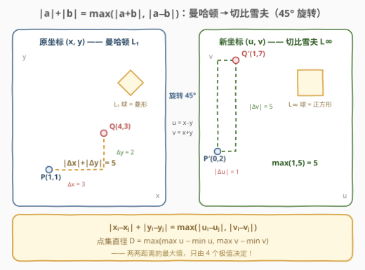
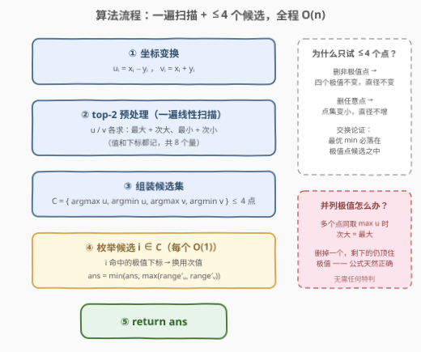
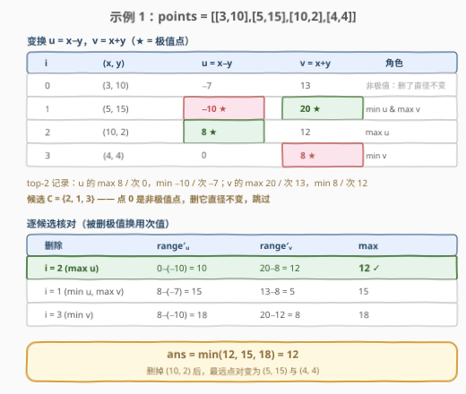

# LeetCode 最小化曼哈顿距离 题解

## 1. 题目概述

- **标题 / 题号**：最小化曼哈顿距离（#3102，hard）
- **链接**：https://leetcode.cn/problems/minimize-manhattan-distances/
- **难度**：困难
- **标签**：几何、数组、数学、有序集合、排序

**题意**：给你一个下标从 **0** 开始的数组 `points`，它表示二维平面上一些点的整数坐标，其中 `points[i] = [x_i, y_i]`。

两点之间的距离定义为它们的**曼哈顿距离**：$|x_i - x_j| + |y_i - y_j|$。

请你**恰好移除一个点**，返回移除后任意两点之间的**最大**距离可能的**最小**值。

**示例 1**：

```text
输入：points = [[3,10],[5,15],[10,2],[4,4]]
输出：12
解释：移除每个点后的最大距离如下所示：
- 移除第 0 个点后，最大距离在点 (5, 15) 和 (10, 2) 之间，为 |5 - 10| + |15 - 2| = 18 。
- 移除第 1 个点后，最大距离在点 (3, 10) 和 (10, 2) 之间，为 |3 - 10| + |10 - 2| = 15 。
- 移除第 2 个点后，最大距离在点 (5, 15) 和 (4, 4) 之间，为 |5 - 4| + |15 - 4| = 12 。
- 移除第 3 个点后，最大距离在点 (5, 15) 和 (10, 2) 之间的，为 |5 - 10| + |15 - 2| = 18 。
在恰好移除一个点后，任意两点之间的最大距离可能的最小值是 12 。
```

**示例 2**：

```text
输入：points = [[1,1],[1,1],[1,1]]
输出：0
解释：移除任一点后，任意两点之间的最大距离都是 0 。
```

**约束**：

- $3 \le points.length \le 10^5$
- $points[i].length == 2$
- $1 \le points[i][0], points[i][1] \le 10^8$

> 💡 读题先抓形态：$n$ 到 $10^5$，两两枚举距离的 $O(n^2)$ 必然超时。题目本质是：对 $n$ 种「删一个点」的方案分别求**点集的最大曼哈顿距离**（点集直径），再取最小值——突破口是把「点集直径」写成一个只依赖**四个极值**的式子，让删除的影响局部化。

## 2. 解题思路

### 2.1 暴力思路：枚举删点 + 重算直径

对每个 $i$：删掉 `points[i]`，两两枚举剩余点的曼哈顿距离取最大 → $O(n^3)$；即使把单次求直径优化到 $O(n)$（见下），$n$ 种删法也要 $O(n^2) = 10^{10}$，照样爆炸。

卡壳的根源在于「重算」：每次删除后我们都从头扫一遍。要想增量维护，得先回答——**点集的最大曼哈顿距离到底由哪几个点决定？**

### 2.2 核心观察：45° 旋转变换 + 只删极值点



**观察一：$|a| + |b| = \max(|a+b|,\ |a-b|)$——曼哈顿距离可以「去绝对值」。**

按 $a, b$ 同号 / 异号分类讨论即可验证；它等价于把 $|a|+|b$ 展开成四个符号组合 $\max(a+b,\ a-b,\ -a+b,\ -a-b)$。套到两个点上，令 $u = x - y$、$v = x + y$：

$$|x_i - x_j| + |y_i - y_j| = \max\big(|u_i - u_j|,\ |v_i - v_j|\big)$$

几何直觉：$(x, y) \to (x-y,\ x+y)$ 是把坐标轴**旋转 45°** 再放缩 $\sqrt{2}$，曼哈顿距离（$L_1$）摇身变成**切比雪夫距离**（$L_\infty$）——菱形的 $L_1$ 球转过来恰好是正方形的 $L_\infty$ 球。

于是整个点集的最大曼哈顿距离**只依赖 4 个数**：

$$D = \max\big(\max u - \min u,\ \max v - \min v\big)$$

**观察二：最优删除点必在 4 个极值点之中。**

- 删掉一个**非极值点**：$\max u,\ \min u,\ \max v,\ \min v$ 四个值都有别的点保持着，$D$ 原封不动；
- 删掉**任意一点**：点集变小，两两距离的最大值**单调不增**，即新直径 $D' \le D$。

两条合起来是标准的交换论证：设最优方案删的是非极值点 $i^*$，则 $D(S \setminus \{i^*\}) = D(S)$；而任取一个极值点 $j$ 都有 $D(S \setminus \{j\}) \le D(S)$——删极值点不会更差。因此候选集只需：

$$C = \{\arg\max u,\ \arg\min u,\ \arg\max v,\ \arg\min v\} \quad (\le 4\ \text{个点})$$

**top-2 技巧**：删掉一个极值点后，新的极值落在「次大 / 次小」上。预处理每维的最大、次大（最小、次小）**及对应下标**，删候选 $i$ 后的极差即可 $O(1)$ 求出：命中的极值下标换用次值，其余不动。并列极值天然正确——两个点并列最大时，次大 = 最大，删掉其中一个，另一个仍把极值顶住。

> ⚠️ 常见疑问：能不能只删「当前最远点对」的一个端点？不稳妥——当两维极差相等（两维并列主导直径）、或一个点同时占据两维极值时，需要 4 个候选都试才能取到最小。反正 4 次 $O(1)$ 计算，没必要省。

### 2.3 算法流程图



**完整步骤**：

1. **变换**：$u_i = x_i - y_i$，$v_i = x_i + y_i$；
2. **预处理**：一遍扫描求出 $u$ 的 top-2 最大 / 最小（值 + 下标），$v$ 同理，共 8 个量；
3. **候选集**：$C = \{i_{\max u},\ i_{\min u},\ i_{\max v},\ i_{\min v}\}$（至多 4 个不同下标）；
4. **枚举**：对每个 $i \in C$，被删下标命中的极值换用次值，计算 $\max(\text{range}'_u,\ \text{range}'_v)$；
5. **返回**这些值的 min。

### 2.4 示例演算



**示例 1**：`points = [[3,10],[5,15],[10,2],[4,4]]`

| $i$ | $(x, y)$ | $u = x - y$ | $v = x + y$ |
|-----|----------|-------------|-------------|
| 0 | (3, 10) | −7 | 13 |
| 1 | (5, 15) | **−10** ← min u | **20** ← max v |
| 2 | (10, 2) | **8** ← max u | 12 |
| 3 | (4, 4) | 0 | **8** ← min v |

极值记录：$u$ 的最大 8（次大 0）、最小 −10（次小 −7）；$v$ 的最大 20（次大 13）、最小 8（次小 12）。候选 $C = \{2, 1, 3\}$（点 0 非极值点，删它直径不变）。

| 删除 | $\text{range}'_u$ | $\text{range}'_v$ | $\max$ |
|------|------------------|------------------|--------|
| $i=2$（max u） | $0 - (-10) = 10$ | $20 - 8 = 12$ | **12** ✓ |
| $i=1$（min u、max v） | $8 - (-7) = 15$ | $13 - 8 = 5$ | 15 |
| $i=3$（min v） | $8 - (-10) = 18$ | $20 - 12 = 8$ | 18 |

答案 $= \min(12, 15, 18) = \boxed{12}$——删点 $(10,2)$ 后，最远点对变成 $(5,15)$ 与 $(4,4)$，与官方解释一致。

## 3. 参考代码

### C++

```cpp
class Solution {
  public:
    int minimumDistance(vector<vector<int>>& points) {
        int n = points.size();
        vector<int> u(n), v(n);
        for (int i = 0; i < n; ++i) {
            u[i] = points[i][0] - points[i][1];
            v[i] = points[i][0] + points[i][1];
        }
        // top2Max / top2Min：返回 {最值, 最值下标, 次值}（n >= 3 保证次值存在）
        auto top2Max = [&](const vector<int>& a) {
            int m1 = INT_MIN, m2 = INT_MIN, i1 = -1;
            for (int i = 0; i < n; ++i) {
                if (a[i] > m1) { m2 = m1; m1 = a[i]; i1 = i; }
                else if (a[i] > m2) m2 = a[i];   // 并列最值落在这里：m2 == m1
            }
            return make_tuple(m1, i1, m2);
        };
        auto top2Min = [&](const vector<int>& a) {
            int m1 = INT_MAX, m2 = INT_MAX, i1 = -1;
            for (int i = 0; i < n; ++i) {
                if (a[i] < m1) { m2 = m1; m1 = a[i]; i1 = i; }
                else if (a[i] < m2) m2 = a[i];
            }
            return make_tuple(m1, i1, m2);
        };
        auto [mxU, iMxU, mxU2] = top2Max(u);
        auto [mnU, iMnU, mnU2] = top2Min(u);
        auto [mxV, iMxV, mxV2] = top2Max(v);
        auto [mnV, iMnV, mnV2] = top2Min(v);

        int ans = INT_MAX;
        for (int i : {iMxU, iMnU, iMxV, iMnV}) {   // <= 4 个候选
            int hiU = (i == iMxU ? mxU2 : mxU);     // 命中极值下标 → 换用次值
            int loU = (i == iMnU ? mnU2 : mnU);
            int hiV = (i == iMxV ? mxV2 : mxV);
            int loV = (i == iMnV ? mnV2 : mnV);
            ans = min(ans, max(hiU - loU, hiV - loV));
        }
        return ans;
    }
};
```

### Python

```python
class Solution:
    def minimumDistance(self, points: List[List[int]]) -> int:
        n = len(points)
        u = [x - y for x, y in points]
        v = [x + y for x, y in points]

        def top2max(a):
            m1 = m2 = -inf
            i1 = -1
            for i, x in enumerate(a):
                if x > m1:
                    m1, m2, i1 = x, m1, i
                elif x > m2:          # 并列最值：m2 == m1
                    m2 = x
            return m1, i1, m2

        def top2min(a):
            m1 = m2 = inf
            i1 = -1
            for i, x in enumerate(a):
                if x < m1:
                    m1, m2, i1 = x, m1, i
                elif x < m2:
                    m2 = x
            return m1, i1, m2

        mxU, iMxU, mxU2 = top2max(u)
        mnU, iMnU, mnU2 = top2min(u)
        mxV, iMxV, mxV2 = top2max(v)
        mnV, iMnV, mnV2 = top2min(v)

        ans = inf
        for i in {iMxU, iMnU, iMxV, iMnV}:          # <= 4 个候选
            hi_u = mxU2 if i == iMxU else mxU        # 命中极值下标 → 换用次值
            lo_u = mnU2 if i == iMnU else mnU
            hi_v = mxV2 if i == iMxV else mxV
            lo_v = mnV2 if i == iMnV else mnV
            ans = min(ans, max(hi_u - lo_u, hi_v - lo_v))
        return ans
```

> 💡 语言细节：C++ 用 `make_tuple` + 结构化绑定一次返回三个量；Python 候选集用 `{...}` set 去重（同一个点可能同时占据两维极值，如示例中的点 1）。坐标 $\le 10^8$，$u, v \in [-10^8+1,\ 2 \times 10^8]$，极差 $\le 2 \times 10^8 - 2 < 2^{31} - 1$，C++ 的 `int` 恰好安全。

## 4. 复杂度分析

| 维度 | 复杂度 | 说明 |
|------|--------|------|
| 时间复杂度 | $O(n)$ | 变换 $O(n)$ + 两遍 top-2 线性扫描 $O(n)$ + 至多 4 个候选、每个 $O(1)$ 计算 |
| 空间复杂度 | $O(n)$ | 存储 $u, v$ 两个数组；改为边读边维护 top-2 可降到 $O(1)$ 额外空间 |

## 5. 扩展：有序集合通解与高维推广

**有序集合（multiset）通解，$O(n \log n)$**：官方标签里的 Ordered Set 指这条保底路线——把所有 $u$ 放进一个 multiset、所有 $v$ 放进另一个；**枚举删每一个点** $i$（不依赖「只删极值点」的证明）：先 `erase` 掉 $u_i$ 与 $v_i$，两维极差各取 `*rbegin() - *begin()`，取 max 记入答案，再插回去。正确性无脑可靠，代价是每次操作 $O(\log n)$。面试时先给 $O(n)$ 极值解法，再提这条「不想证明也能写对」的兜底，层次感立刻出来。

**高维推广**：$d$ 维曼哈顿距离 $= \max\limits_{\text{2}^{d-1}\ \text{种符号}} \left| \sum\limits_{k} \pm x_k \right|$。三维即 1131 题：只需枚举 4 种符号组合、每种组合求极差取 max。本题的 $u = x - y$、$v = x + y$ 正是二维时的 2 种组合。

**双向变换备忘**：曼哈顿 → 切比雪夫用 $(x, y) \to (x+y,\ x-y)$；反向则 $(u, v) \to \left(\frac{u+v}{2},\ \frac{u-v}{2}\right)$（需要除以 2，整数坐标时注意奇偶）。很多几何题在这两个度量间来回横跳，本质都是 $L_1$ 球（菱形）与 $L_\infty$ 球（正方形）互为 45° 旋转。

## 6. 面试要点

1. **恒等式 $|a| + |b| = \max(|a+b|,\ |a-b|)$ 怎么证明？**

   - 按 $a, b$ 符号分四种情况逐一验证；或写成 $\max(a+b,\ a-b,\ -a+b,\ -a-b)$——四项中必有一项同时「带上 $a, b$ 的主符号」，其值恰为 $|a|+|b|$，且任一项都不超过它

2. **为什么只需考虑删除 4 个极值点？**

   - 删非极值点：四个极值由其余点保持，直径不变；删任意点：点集变小，直径单调不增。交换论证：若最优删的是非极值点，其结果 $= D(S)$，而删任一极值点结果 $\le D(S)$，故极值点不会更差，$\min$ 必在 $\le 4$ 个候选中取到

3. **极值有并列（多个点同取 $\max u$）时会不会算错？**

   - 不会。top-2 的 `else if` 分支会把并列值收进次值（次值 = 最值）；删掉一个并列极值点，公式换用次值后极值不变，正是正确结果——无需任何特判

4. **坐标大到 $10^8$，C++ 会溢出吗？**

   - $u = x - y \in [-10^8+1,\ 10^8-1]$，$v = x + y \in [2,\ 2 \times 10^8]$，极差上界 $2 \times 10^8 - 2 < 2^{31} - 1$，`int` 安全；但若坐标上界涨到 $2 \times 10^9$ 量级就得换 `long long`——面试时主动报出这个边界分析是加分项

5. **变体：改成「恰好移除 $k$ 个点」怎么做？**

   - 极值会下落到第 $k+1$ 层：预处理每维 top-$(k+1)$ 大 / 小，候选集扩为这些层的所有点（至多 $4k$ 个），枚举候选子集删除后用第 $k+1$ 层极值计算；或直接用第 5 节的 multiset 逐个删除。$k$ 很大时极值层退化成全体点，退回 $O(n \log n)$ 通解更省心

> 💡 **一句话总结**：$u = x-y$、$v = x+y$ 把曼哈顿转成切比雪夫，点集直径只剩四个极值；删非极值点直径不动、删极值点直径不增，所以最优删除藏在 $\le 4$ 个极值点里——top-2 预处理让每个候选 $O(1)$ 验证，全程线性。

## 同类练习题

| # | 题目 | 与本题的关联 |
|---|------|-------------|
| 1131 | [绝对值表达式的最大值](https://leetcode.cn/problems/maximum-of-absolute-value-expression/)（[题解](../1101-1200/1131_绝对值表达式的最大值.md)） | 三维曼哈顿最大距离 = 4 种符号组合维度极差取 max，本题变换的高维推广 |
| 1779 | [找到最近的有相同X或Y坐标的点](https://leetcode.cn/problems/find-nearest-point-that-has-the-same-x-or-y-coordinate/)（[题解](../1701-1800/1779_找到最近的有相同X或Y坐标的点.md)） | 曼哈顿距离计算与「坐标轴对齐」意识的入门热身 |
| 3025 | [人员站位的方案数I](https://leetcode.cn/problems/find-the-number-of-ways-to-place-people-i/)（[题解](../3001-3100/3025_人员站位的方案数I.md)） | 按 $x$ 排序后用前缀 max/min 维护 $y$ 极值，坐标系下「极值决定一切」的同款套路 |
| 296 | [最佳的碰头地点](https://leetcode.cn/problems/best-meeting-point/)（付费题） | 最小化所有人曼哈顿距离之和的最优点 = 各维中位数，$L_1$ 度量的另一经典结论 |
