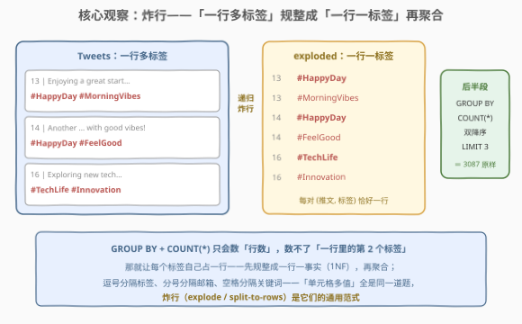
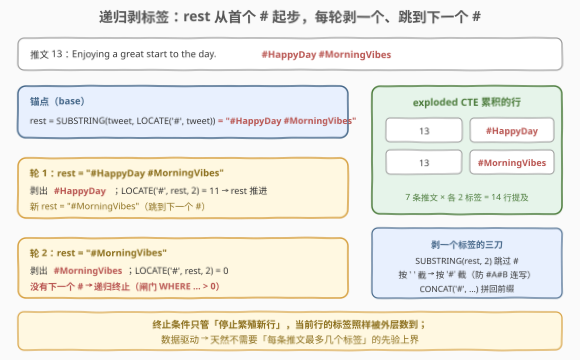
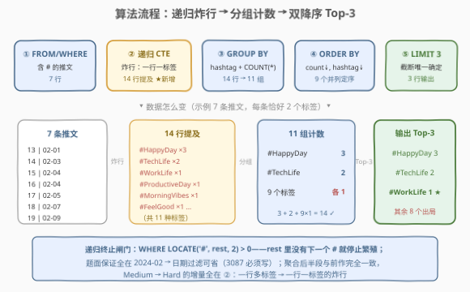
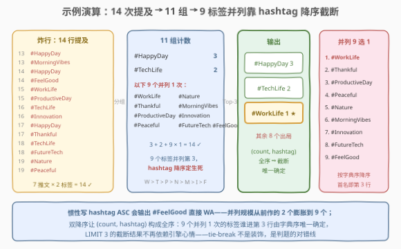

# LeetCode 查找热门话题标签II 题解

## 1. 题目概述

- **标题 / 题号**：查找热门话题标签II（#3103，hard）
- **链接**：https://leetcode.cn/problems/find-trending-hashtags-ii/
- **难度**：困难
- **标签**：数据库、SQL、字符串处理、递归 CTE、`REGEXP_SUBSTR`、`GROUP BY` 聚合、Top-K 排序、LeetCode 锁题

> ⚠️ 本题为 LeetCode 付费题（锁题），题意描述根据官方示例用例与外部资料重建，可能与官方题面有出入。（题面已与社区镜像 doocs/leetcode 的官方中文翻译交叉核对，示例输入输出与 GraphQL 接口返回一致，出入风险较低。）

**表结构**：`Tweets`

| 列名 | 类型 |
|------|------|
| user_id | int |
| tweet_id | int |
| tweet_date | date |
| tweet | varchar |

- `tweet_id` 是这张表的主键（值互不相同）。
- 每行是一条推文：发帖用户 `user_id`、发帖日期 `tweet_date`、正文 `tweet`。
- **题目保证所有 `tweet_date` 都是 2024 年 2 月的合法日期**。
- 一条推文**可能含有多个话题标签**（hashtag）——正文中零个或多个以 `#` 开头的词（如 `#HappyDay #MorningVibes`）。

**背景**：续作登场。[3087. 查找热门话题标签](../3001-3100/3087_查找热门话题标签.md) 保证「每条推文恰含一个标签」，本题解除了这条保证——一行正文里散落着任意多个 `#标签`，热度统计必须**一个不漏**地数到。

**目标**：写一条 SQL 查询，找出 **2024 年 2 月**期间最热门（被提及次数最多）的 **top 3** 话题标签。

**输出格式**：`hashtag`、`count` 两列，按 `count` **降序**、`hashtag` **降序**排列，只取前 3 行。

**示例 1**：

```text
输入：Tweets 表
+---------+----------+------------------------------------------------------------+------------+
| user_id | tweet_id | tweet                                                      | tweet_date |
+---------+----------+------------------------------------------------------------+------------+
| 135     | 13       | Enjoying a great start to the day. #HappyDay #MorningVibes | 2024-02-01 |
| 136     | 14       | Another #HappyDay with good vibes! #FeelGood               | 2024-02-03 |
| 137     | 15       | Productivity peaks! #WorkLife #ProductiveDay               | 2024-02-04 |
| 138     | 16       | Exploring new tech frontiers. #TechLife #Innovation        | 2024-02-04 |
| 139     | 17       | Gratitude for today's moments. #HappyDay #Thankful         | 2024-02-05 |
| 140     | 18       | Innovation drives us. #TechLife #FutureTech                | 2024-02-07 |
| 141     | 19       | Connecting with nature's serenity. #Nature #Peaceful       | 2024-02-09 |
+---------+----------+------------------------------------------------------------+------------+

输出：
+-----------+-------+
| hashtag   | count |
+-----------+-------+
| #HappyDay | 3     |
| #TechLife | 2     |
| #WorkLife | 1     |
+-----------+-------+

解释：
#HappyDay 出现在推文 13、14、17 中，共提及 3 次；
#TechLife 出现在推文 16、18 中，共提及 2 次；
#WorkLife 只出现在推文 15 中，共提及 1 次。
另有 8 个标签同样只出现 1 次，但排序要求 hashtag 也降序——
字典序 #WorkLife 是所有 1 次标签中最大的（W > T > P > N > M > I > F），第 3 行归 #WorkLife。
```

**约束条件**（重建推测）：

- 所有 `tweet_date` 均为 2024 年 2 月的合法日期（题面明示保证）；
- `tweet` 中每个 `#` 后跟字母数字下划线构成的标签词，标签之间以空格分隔（判题数据规整）；
- 判题数据量小，不同标签数有限。

> 💡 **审题关键**：① 与前作最大的不同——**一条推文多个标签**，每个标签各计一次提及，7 条推文共 $2 \times 7 = 14$ 次提及；② **输出列名是 `count`**，不是 3087 的 `hashtag_count`——系列题抄格式是高频翻车点；③ 题面**明示保证**所有日期都在 2024 年 2 月，`WHERE` 日期过滤这题是白送的（写了也无妨，不写不扣分）；④ 排序仍是 `(count, hashtag)` **双降序** + `LIMIT 3`——9 个标签并列 1 次，全靠 hashtag 降序截断才唯一确定；⑤ 难度从前作的中等升到困难，增量全在**提取**：把「一行多标签」炸成「一行一标签」。

## 2. 解题思路

### 2.1 暴力思路：3087 的两刀直接照搬 / 应用层统计

最诱人的偷懒：把 [3087](../3001-3100/3087_查找热门话题标签.md) 的嵌套 `SUBSTRING_INDEX` 原封不动搬过来分组计数。**这是本题最大的陷阱**：

```sql
-- 3087 的提取：SUBSTRING_INDEX(tweet, '#', -1) 取「最后一个 # 右侧」
SELECT CONCAT('#', SUBSTRING_INDEX(SUBSTRING_INDEX(tweet, '#', -1), ' ', 1)) AS hashtag, ...
```

对推文 13 `'… #HappyDay #MorningVibes'`，内层 `-1` 一刀直接跳到**最后一个** `#`——`#HappyDay` 被整个跳过，只数到 `#MorningVibes`。示例里每条推文的第一个标签全部蒸发：7 条双标签推文只数到 7 次提及，`#HappyDay` 的 3 次与 `#TechLife` 的 2 次**一次不剩**——两个真热搜直接跌出 Top-3，照搬解法会输出 `#Thankful / #ProductiveDay / #Peaceful` 的离谱榜单。**前作的正确解法在前作的数据假设被解除后系统性漏数**。一句话：3087 的两刀是「每条推文恰一个标签」这条白送保证的配套零件，保证没了，零件就得换。

「工程暴力」仍是老配方：`SELECT * FROM Tweets` 拉全表回应用层，程序里正则提取 + 哈希计数 + 排序取前三——分组聚合这门 SQL 的看家本领被整体外包，且正则拆字符串的活儿每个下游消费者都得重写一遍。

> ⚠️ 暴力思路的根本问题：**「一个单元格里有多个事实」和「聚合只认一行一值」的结构性矛盾**没有解决。要么漏数（照搬 3087），要么把矛盾推给应用层（拉全表）。SQL 自己的解法是把数据先**规整**成聚合器认识的形状——一行一个事实。

### 2.2 核心观察：炸行——「一行多标签」→「一行一标签」



**`GROUP BY + COUNT(*)` 只会数「行数」**——它数不了「一行里的第 2 个标签」。那就让每个标签自己占一行：把推文 13 的 `#HappyDay #MorningVibes` **炸成两行**，推文 15 的 `#WorkLife #ProductiveDay` 也炸成两行……炸完之后，后半段与 3087 一字不差——`GROUP BY hashtag` 分组、`COUNT(*)` 计数、双降序、`LIMIT 3`。

「怎么炸」是本题唯一的算法增量，两条主流路线：

- **递归 CTE 逐个剥**（解法 A）：维护一个游标串 `rest`——从**第一个 `#`** 起步的剩余正文；每轮**剥出 `rest` 开头的标签**，再把 `rest` 推进到**下一个 `#`**；`rest` 里没有下一个 `#` 时递归终止。数据驱动，天然不需要预设「每条推文最多几个标签」；
- **数字表按序号取**（解法 B）：`REGEXP_SUBSTR(tweet, pat, 1, k)` 的第 4 参数直接取**第 $k$ 个**匹配，$k$ 从数字表交叉连接过来，连到该推文的 `#` 个数为止。



以推文 13 为例走一遍解法 A 的剥法：

| 轮次 | rest（从 # 起步的剩余串） | 剥出的标签 | 下一个 rest |
|------|---------------------------|-----------|-------------|
| 锚点 | `#HappyDay #MorningVibes` | — | — |
| 1 | `#HappyDay #MorningVibes` | `#HappyDay` | `SUBSTRING(rest, LOCATE('#', rest, 2))` = `#MorningVibes` |
| 2 | `#MorningVibes` | `#MorningVibes` | `LOCATE('#', rest, 2) = 0` → 递归终止 |

剥标签的动作本身是 3087 两刀的「局部版」：`SUBSTRING(rest, 2)` 跳过开头的 `#`，`SUBSTRING_INDEX(…, ' ', 1)` 在第一个空格截断，`SUBSTRING_INDEX(…, '#', 1)` 防两个标签连写（`#A#B` 无空格分隔），最后 `CONCAT('#', …)` 把前缀拼回。**两刀还在，只是从「切整条推文」降级为「切 rest 这一小段」**——由「取最后一个 `#`」改为「从当前 `#` 往后切」，正是多标签下不漏数的关键。

> 💡 **范式命名**：这就是 SQL 处理「单元格内多值」（multi-value cell）的通用范式——**炸行**（explode / split-to-rows）：先规整成一行一事实（第一范式 1NF），再聚合。逗号分隔的标签列表、分号分隔的邮箱、空格分隔的关键词，全是同一道题。

### 2.3 算法流程图



**逻辑执行步骤**（解法 A）：

| 步骤 | SQL 片段 | 作用 | 示例数据流 |
|------|----------|------|-----------|
| ① | `FROM Tweets WHERE tweet LIKE '%#%'` | 读取含标签的推文 | 7 行 |
| ② | 递归 CTE 锚点：`SUBSTRING(tweet, LOCATE('#', tweet))` | rest 从首个 `#` 起步 | 7 行 |
| ③ | 递归成员：剥标签 + `rest` 跳到下一个 `#` | 每个标签一行 | 7 行 → **14 行提及** |
| ④ | `GROUP BY hashtag` + `COUNT(*)` | 按标签分组计数 | 14 行 → **11 组** |
| ⑤ | `ORDER BY count DESC, hashtag DESC LIMIT 3` | 双降序取前三 | 3 行输出 |

> 💡 递归 CTE 的执行模型：先算**锚点成员**（非递归部分）得到初始行集，再反复把**递归成员**作用于「上一轮新增的行」，把产出的新行并入，直到某轮不再产出新行为止——`WHERE LOCATE('#', rest, 2) > 0` 就是那道闸门。另外 MySQL 的递归 CTE **只允许 `UNION ALL`**（不允许 `UNION` 的去重语义，以此防止循环展开），照标准模板写即可。

### 2.4 示例演算



**逐推文炸行**（每条推文恰好 2 个标签，$2 \times 7 = 14$ 行提及）：

| tweet_id | 炸出的标签 | tweet_id | 炸出的标签 |
|----------|-----------|----------|-----------|
| 13 | #HappyDay、#MorningVibes | 17 | #HappyDay、#Thankful |
| 14 | #HappyDay、#FeelGood | 18 | #TechLife、#FutureTech |
| 15 | #WorkLife、#ProductiveDay | 19 | #Nature、#Peaceful |
| 16 | #TechLife、#Innovation | | |

**分组计数**：`#HappyDay` 3 次（13/14/17）、`#TechLife` 2 次（16/18），其余 **9 个标签各 1 次**——共 11 组，$3+2+9 \times 1 = 14$ ✓。

**排序截断**（`ORDER BY count DESC, hashtag DESC LIMIT 3`）：

| 排位 | hashtag | count | 说明 |
|------|---------|-------|------|
| 1 | #HappyDay | 3 | 次数断层第一 |
| 2 | #TechLife | 2 | 次数第二 |
| 3 | **#WorkLife** | 1 | **9 个标签并列 1 次，hashtag 降序 W 最大，挤掉其余 8 个** |

> ⚠️ **本题并列规模远超前作**：3087 只有 2 个标签并列争第 3，本题有 **9 个**标签并列 1 次——`hashtag DESC` 这条 tie-break 从「阴坑」升级为「主考点」。9 个候选按字典序降序排：`#WorkLife > #Thankful > #ProductiveDay > #Peaceful > #Nature > #MorningVibes > #Innovation > #FutureTech > #FeelGood`（首字母 W > T > P > N > M > I > F，同首字母再看次字符），第 3 行**唯一确定**归 `#WorkLife`。惯性写 `hashtag ASC` 会输出 `#FeelGood` 直接 WA。

## 3. 参考代码

### SQL（解法 A：递归 CTE 逐个剥标签，推荐）

```sql
# Write your MySQL query statement below
WITH RECURSIVE exploded AS (
    -- 锚点：rest = 从第一个 # 起步的剩余正文
    SELECT tweet_id,
           SUBSTRING(tweet, LOCATE('#', tweet)) AS rest
    FROM Tweets
    WHERE tweet LIKE '%#%'
    UNION ALL
    -- 递归成员：剥掉当前标签，rest 推进到下一个 #
    SELECT tweet_id,
           SUBSTRING(rest, LOCATE('#', rest, 2))
    FROM exploded
    WHERE LOCATE('#', rest, 2) > 0
)
SELECT CONCAT('#',
              SUBSTRING_INDEX(SUBSTRING_INDEX(SUBSTRING(rest, 2), ' ', 1), '#', 1)) AS hashtag,
       COUNT(*) AS `count`
FROM exploded
GROUP BY hashtag
ORDER BY `count` DESC, hashtag DESC
LIMIT 3;
```

> 💡 **写法要点**：
> - **锚点的 `WHERE tweet LIKE '%#%'` 不可省**：若推文不含 `#`，`LOCATE` 返回 0，`SUBSTRING(tweet, 0)` 得空串，剥标签会产出假的 `'#'` 组。题面说「可能含有多个标签」，没保证「至少一个」，这道防御必须上（推文含 0 个标签时直接不进锚点，炸出 0 行）；
> - **递归成员的 `WHERE LOCATE('#', rest, 2) > 0` 是终止闸门**：`LOCATE` 三参形式从位置 2 起找，跳过 `rest` 开头这个 `#`、定位**下一个** `#`；找不到返回 0，该行不再繁殖。注意它过滤的是「产生新行的资格」，当前行的标签照样被外层 `SELECT` 数到——终止条件与输出无关，只管停止；
> - **剥标签三刀**：`SUBSTRING(rest, 2)` 跳过开头 `#` → `SUBSTRING_INDEX(…, ' ', 1)` 在首个空格截断（标签后面可能还有正文）→ `SUBSTRING_INDEX(…, '#', 1)` 防连写 `#A#B`；`CONCAT('#', …)` 拼回前缀。对 `'#HappyDay #MorningVibes'`：`HappyDay #MorningVibes` → `HappyDay` → `#HappyDay`；
> - **列名 `count` 加反引号**：`COUNT` 是 MySQL 非保留关键字，裸写通常能过，但 `ORDER BY` 里写 `` `count` `` 消歧义最稳（见 6.4）。判题校验列名，**输出列必须叫 `count`**——不是 3087 的 `hashtag_count`；
> - **日期过滤去哪了**：题面明示「所有 `tweet_date` 都是 2024 年 2 月的合法日期」，`WHERE` 日期条件在本题是白送的，不写不扣分；不放心可补 `AND tweet_date >= '2024-02-01' AND tweet_date < '2024-03-01'`（半开区间写法，理由见 3087 的 5.1 节）。

### SQL（解法 B：数字表 + `REGEXP_SUBSTR` 第 k 次出现）

```sql
# Write your MySQL query statement below
WITH RECURSIVE nums AS (          -- 数字表：k = 1..100
    SELECT 1 AS k
    UNION ALL
    SELECT k + 1 FROM nums WHERE k < 100
)
SELECT REGEXP_SUBSTR(t.tweet, '#[A-Za-z0-9_]+', 1, n.k) AS hashtag,
       COUNT(*) AS `count`
FROM Tweets t
JOIN nums n
  ON n.k <= LENGTH(t.tweet) - LENGTH(REPLACE(t.tweet, '#', ''))
GROUP BY hashtag
ORDER BY `count` DESC, hashtag DESC
LIMIT 3;
```

> 💡 **解法 B 的取舍**：
> - **`REGEXP_SUBSTR` 第 4 参数是「第几个匹配」**：`(str, pat, pos, occurrence)`——`pos=1` 从头扫，`occurrence=k` 取第 $k$ 个 `#标签`。数字表 `nums` 提供所有 $k$，`JOIN` 条件 `k ≤ #个数` 砍掉超界序号；
> - **`#` 个数 = 标签个数**：`LENGTH(tweet) − LENGTH(REPLACE(tweet, '#', ''))` 数出 `#` 字符数，前提是每个 `#` 都开启一个标签（判题数据规整，此假设成立）。不含 `#` 的推文差值为 0，`k ≤ 0` 无解，**天然被 JOIN 过滤**——不需要解法 A 那道 `LIKE` 防御；
> - **上界 100 是先验假设**：一条推文最多 100 个标签。解法 B 必须预设上界——设小了漏标签，设大了白连接；解法 A 由数据驱动（还有 `#` 就再剥一轮），**不需要任何先验上界**，这是 A 更稳的根本原因；
> - **正则用字符类 `#[A-Za-z0-9_]+` 而非 `#\\w+`**：MySQL 字符串字面量里反斜杠要转义（`'\\w'` 才传给正则引擎 `\w`），字符类写法彻底绕开转义心智负担；
> - **标点尾巴更干净**：`#HappyDay!` 会剥成 `#HappyDay`（`!` 不在字符类里），比解法 A 的三刀更防脏数据；需要 MySQL 8.0+（判题环境满足）。

### Python（pandas）

```python
import pandas as pd


def find_trending_hashtags(tweets: pd.DataFrame) -> pd.DataFrame:
    # 官方保证 tweet_date 全在 2024-02，无需日期过滤
    tags = tweets["tweet"].str.findall(r"#\w+").explode()      # 炸行：一行一标签
    counts = (
        tags.value_counts()                                    # GROUP BY + COUNT(*)
        .rename_axis("hashtag")
        .reset_index(name="count")
        .sort_values(["count", "hashtag"], ascending=[False, False])
    )
    return counts.head(3).reset_index(drop=True)
```

> 💡 **pandas 对照**（付费题无官方函数签名，函数名沿与前作一致的约定）：
> - `str.findall(r"#\w+")` 每行返回标签**列表**，`.explode()` 把列表元素摊成多行——正是 SQL 侧「递归炸行」的一步到位版：炸行不是 SQL 独有的苦役，pandas 一等公民；
> - `explode()` 对空列表产出 `NaN`，`value_counts()` 默认丢弃 `NaN`——含 0 个标签的推文自动出局，对应解法 A 的 `LIKE '%#%'` 防御；
> - `value_counts()` 虽自带按频次降序，但并列时顺序不保证（依赖内部哈希），**必须再显式 `sort_values(["count", "hashtag"])`** 落实双降序 tie-break——9 个并列 1 次的标签谁进第 3 行，就看这一句；
> - `head(3)` 即 `LIMIT 3`。若不信任题面的日期保证，开头补一行 `tweets = tweets[tweets["tweet_date"].dt.strftime("%Y%m") == "202402"]`。

## 4. 复杂度分析

设 $n$ 为推文行数，$L$ 为推文平均长度，$T$ 为炸行后的总提及数（$\sum$ 每条推文标签数，示例中 $T = 14$），$d$ 为不同标签数（$d \le T$）。

| 维度 | 复杂度 | 说明 |
|------|--------|------|
| **时间复杂度** | $O(T \cdot L + d \log d)$ | 解法 A 每轮 `LOCATE`/`SUBSTRING` 扫描剩余串，单条推文 $k$ 个标签共 $O(k \cdot L)$，全体合计 $O(T \cdot L)$ 上界（实际远小——rest 越剥越短）；解法 B 每个 $k$ 全串重扫，同为 $O(T \cdot L)$；分组 $O(T)$，对 $d$ 组排序 $O(d \log d)$ |
| **空间复杂度** | $O(T)$ | 炸行物化的中间行数（解法 A 递归 CTE / 解法 B JOIN 结果同阶），聚合后降为 $O(d)$ |

> - 解法 A 单条推文的剥取是**平方级**（$k$ 轮 × 每轮扫 $O(L)$），但 $k$、$L$ 都被推文长度天然封顶，判题规模无感；追求理论最优可改「一次正则全局提取」语义（解法 B 的 `occurrence` 本质仍是全串重扫，ICU 引擎无增量匹配）；
> - `LIMIT 3` 理论上用 top-K 可压到 $O(d \log 3) \approx O(d)$（窗口函数 `ROW_NUMBER()` 写法见 3087 的 5.2 节），判题规模下 `ORDER BY + LIMIT` 与之无异。

## 5. 扩展

### 5.1 第三条路：`JSON_TABLE` 炸行

MySQL 8.0 的 `JSON_TABLE` 能把 JSON 数组直接展开成行——先把推文里的标签串改造成 `["A","B"]` 形态，再喂给它：

```sql
SELECT jt.hashtag, COUNT(*) AS `count`
FROM Tweets t,
JSON_TABLE(
    CONCAT('["', REPLACE(
        TRIM(TRAILING ',' FROM
            REGEXP_REPLACE(                                              -- 去掉首个 # 之前的正文
                REGEXP_REPLACE(t.tweet, '(#[A-Za-z0-9_]+)[^#]*', '$1,'),  -- 每个标签吃掉身后的非#尾巴 → 标签,
                '^[^#]*', '')),
        ',', '","'), '"]'),
    '$[*]' COLUMNS (hashtag VARCHAR(64) PATH '$')
) jt
WHERE t.tweet LIKE '%#%'          -- 无标签推文会拼出 [""]，必须挡掉
GROUP BY jt.hashtag
ORDER BY `count` DESC, hashtag DESC
LIMIT 3;
```

两次 `REGEXP_REPLACE` 把 `Another #HappyDay with good vibes! #FeelGood` 逐步改造成 `#HappyDay","#FeelGood`（第一刀让每个标签吃掉身后的非 `#` 尾巴、第二刀砍掉首个标签前的正文），`CONCAT` 封上 `["…"]`，`JSON_TABLE` 按 `$[*]` 逐元素吐行——`#` 在捕获组里保留，吐出的直接就是带前缀的标签。**能跑，但字符串拼 JSON 的心智负担明显高于前两种解法**——面试口头提一句「JSON_TABLE 也能炸行」即可，落笔仍选递归 CTE 或数字表。若源头本来就是 JSON 列（如 `tags` 存 `["a","b"]`），`JSON_TABLE` 则是**首选**而非炫技。

### 5.2 计数语义：提及次数 vs 提及推文数

本题计数用 `COUNT(*)`——炸行后**每个 (推文, 标签) 对计 1**，即官方解释里的「总共提及 N 次」。若一条推文重复写了同一个标签（`#A … #A`），`COUNT(*)` 计 2；而「趋势榜」语义更常见的口径是**提及该标签的推文数**，此时应改：

```sql
SELECT hashtag, COUNT(DISTINCT tweet_id) AS `count`
FROM exploded
GROUP BY hashtag;
```

两种口径在示例数据（同一推文内标签互异）下结果相同，判题数据也未区分。**面试被追问时能说清「数对还是数行」这层区别**，比背出答案更加分——这是所有「炸行再聚合」题共有的语义抉择点。

### 5.3 前后作对照：3087 → 3103 升级了什么

| 维度 | 3087（中等） | 3103（困难） |
|------|--------------|--------------|
| 标签假设 | 每条推文**恰一个**标签 | **零个或多个**标签 |
| 提取手法 | 嵌套 `SUBSTRING_INDEX` 两刀（一次成型） | 递归 CTE / 数字表 + `REGEXP_SUBSTR`（**炸行**） |
| 日期处理 | 需 `WHERE` 圈住 2024-02 | 题面**保证**全在 2024-02，可省 |
| 输出列名 | `hashtag_count` | **`count`**（抄前作格式即 WA） |
| 并列 tie-break | 2 个标签并列争第 3 | **9 个**并列争第 3，`hashtag DESC` 成主考点 |
| 聚合后半段 | `GROUP BY` + 双降序 + `LIMIT 3` | **完全相同** |

一脉相承的骨架是「提取 → 分组计数 → Top-K」；升级的只有「提取」这一环——**数据假设每放松一步，提取的工程量就上一个数量级**，这正是它从 Medium 爬到 Hard 的全部原因。

## 6. 面试要点

1. **把 3087 的嵌套 `SUBSTRING_INDEX` 直接搬过来会怎样？**

   > 会**系统性漏数**。`SUBSTRING_INDEX(tweet, '#', -1)` 只取最后一个 `#` 右侧的内容——多标签推文 13 `'#HappyDay #MorningVibes'` 只能数到 `#MorningVibes`，`#HappyDay` 的提及全部蒸发。前作的解法依赖「每条推文恰一个标签」这条白送保证，保证解除后必须换成「枚举全部标签」的炸行方案。

2. **递归 CTE 的锚点、递归成员、终止条件分别怎么写？**

   > 锚点：`rest = SUBSTRING(tweet, LOCATE('#', tweet))`——从**第一个** `#` 起步（配合 `WHERE tweet LIKE '%#%'` 防无标签推文产出假 `'#'` 组）；递归成员：`rest = SUBSTRING(rest, LOCATE('#', rest, 2))`——三参 `LOCATE` 从位置 2 起找，正好跳过开头这个 `#` 定位下一个；终止：`WHERE LOCATE('#', rest, 2) > 0`——rest 里没有下一个 `#` 就不再繁殖新行。每个 (推文, 标签) 对恰好产出一行。

3. **剥标签的「三刀」各在切什么？为什么比 3087 多一刀？**

   > `SUBSTRING(rest, 2)` 跳过开头的 `#`；`SUBSTRING_INDEX(…, ' ', 1)` 在首个空格截断（标签后可能还有正文）；`SUBSTRING_INDEX(…, '#', 1)` 在下一个 `#` 截断（防 `#A#B` 连写无空格）；最后 `CONCAT('#', …)` 拼回前缀。多出的「按 `#` 截断」一刀是多标签场景新增的边界——3087 里单标签推文不存在「下一个标签」。

4. **输出列名 `count` 有什么坑？**

   > 判题**校验列名**：本题要求 `count`，3087 是 `hashtag_count`——系列题连着刷最容易惯性抄错。`COUNT` 在 MySQL 属非保留关键字，裸用一般合法，但在 `ORDER BY` / `GROUP BY` 里与函数名撞脸，加反引号 `` `count` `` 消歧义最稳。跨库（如 PostgreSQL）`count` 同为非保留字，反引号换双引号。

5. **解法 B 为什么需要上界，解法 A 为什么不需要？**

   > `REGEXP_SUBSTR(tweet, pat, 1, k)` 要靠数字表枚举出现序号 $k$，数字表必须有终点——上界设小漏标签、设大浪费连接，是**先验假设**；递归 CTE 由数据驱动，`rest` 里还有 `#` 就再剥一轮，标签数天然等于递归轮数，**无需任何先验知识**。「要不要预设上界」是这两条炸行路线的本质分野，也是 A 被推荐的根本原因。

> 💡 **一句话总结**：3103 = 3087 的分组计数骨架 + 炸行。递归 CTE 维护游标串 `rest`（首个 `#` 起步 → 剥标签 → 跳到下一个 `#` → 无 `#` 可跳即终止），把一行多标签炸成一行一标签，`GROUP BY + COUNT(*)` 计数、`(count, hashtag)` 双降序、`LIMIT 3` 收尾。三大坑：照搬 3087 两刀漏数、输出列名要 `count`、9 个标签并列靠 hashtag 降序截断。

## 同类练习题

| # | 题目 | 与本题的关联 |
|---|------|-------------|
| 3087 | [查找热门话题标签](https://leetcode.cn/problems/find-trending-hashtags/)（[题解](../3001-3100/3087_查找热门话题标签.md)） | 前作——单标签提取 + 同一套分组计数/双降序骨架，对照体会「数据假设解除 → 提取升级」的演进 |
| 1484 | [按日期分组销售产品](https://leetcode.cn/problems/group-sold-products-by-the-date/)（[题解](../1401-1500/1484_按日期分组销售产品.md)） | 同一「多值单元格」问题的**反方向**——`GROUP_CONCAT` 把多行合回一个逗号分隔单元格，与炸行互为对偶操作 |
| 1270 | [向公司 CEO 汇报工作的所有人](https://leetcode.cn/problems/all-people-report-to-the-given-manager/)（[题解](../1201-1300/1270_向公司CEO汇报工作的所有人.md)） | 递归 CTE 专项——组织树逐层向上追溯汇报链，与本题「同构数据反复自连接推进」同一范式 |
| 1517 | [查找拥有有效邮箱的用户](https://leetcode.cn/problems/find-users-with-valid-e-mails/)（[题解](../1501-1600/1517_查找拥有有效邮箱的用户.md)） | `REGEXP` 字符串家族——从「提取全部」到「校验单个」，与解法 B 的正则用法互补 |
| 586 | [订单最多的客户](https://leetcode.cn/problems/customer-placing-the-largest-number-of-orders/)（[题解](../0501-0600/586_订单最多的客户.md)） | `GROUP BY + COUNT + ORDER BY DESC + LIMIT 1`——本题 Top-K 聚合骨架的极简版，体会 `(count, key)` 全序 tie-break 的意义 |
