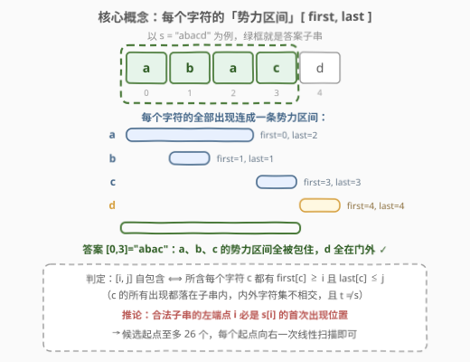
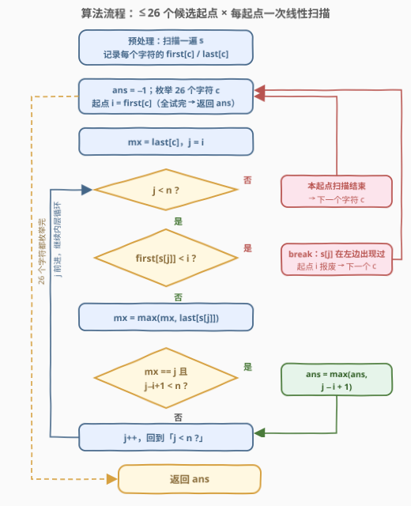
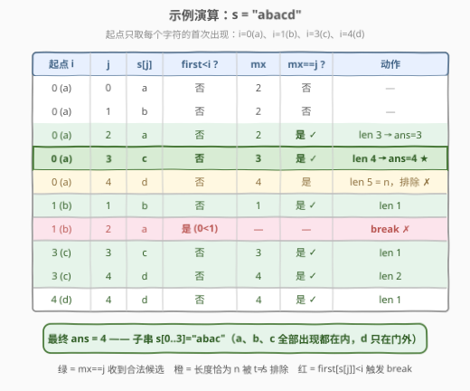

# LeetCode 查找最长的自包含子串 题解

## 1. 题目概述

- **标题 / 题号**：查找最长的自包含子串（#3104，hard）
- **链接**：https://leetcode.cn/problems/find-longest-self-contained-substring/
- **难度**：困难
- **标签**：哈希表、字符串、排序

> ⚠️ 本题为 LeetCode 付费题，题意描述根据官方示例用例与 hints 重建，可能与官方题面有出入。

**题意**：给定字符串 `s`，找出 `s` 的**最长自包含子串**的长度。

如果 `s` 的一个子串 `t` 满足 `t != s`，且 `t` 中的**每一个字符**都在 `s` 的剩余部分（`s` 去掉 `t` 之后的部分）中**不存在**，则称 `t` 是**自包含**的。若存在这样的子串，返回其最大长度；否则返回 `-1`。

**示例 1**：

```text
输入：s = "abba"
输出：2
解释：子串 "bb" 之外没有别的 'b'（两个 'b' 都在子串内），故 "bb" 自包含。
```

**示例 2**：

```text
输入：s = "abab"
输出：-1
解释：子串只要含 'a' 就得同时含下标 0、2 两处 'a'，被迫含上 'b'，
     又得含下标 1、3 两处 'b'——只能是整串，而 t != s，故无解。
```

**示例 3**：

```text
输入：s = "abacd"
输出：4
解释：子串 "abac" 之外只剩一个 'd'，'d' 不在子串内；'a'、'b'、'c'
     的所有出现都被子串包住，故自包含。
```

**约束**：

- $2 \le s.length \le 5 \times 10^4$
- `s` 仅由小写英文字母组成

> 💡 「自包含」等价于：**子串内出现的字符集合与子串外出现的字符集合不相交**。这与 [763. 划分字母区间](https://leetcode.cn/problems/partition-labels/) 中「每个字母只出现在一个片段里」是同一个字符区间视角，但本题只求一个最长的合法片段，且允许答案两侧还留着别的字符。

## 2. 解题思路

### 2.1 暴力思路

枚举所有 $O(n^2)$ 个子串 `[i, j]`，判定其合法性：预处理每个字符的前缀计数 `pre[c][k]`，则子串合法当且仅当对每个字符 `c`，它在 `[i, j]` 内的出现次数要么为 `0`（全在子串外），要么等于 `total[c]`（全在子串内）：

$$\text{pre}[c][j+1] - \text{pre}[c][i] \in \{0,\ \text{total}[c]\}$$

判定花 $O(26)$，总计 $O(26\,n^2)$；$n = 5 \times 10^4$ 时约 $6.5 \times 10^{10}$ 次操作，必然超时。

### 2.2 核心观察：字符「势力区间」 + 至多 26 个候选起点



把每个字符 `c` 的**首次出现** `first[c]` 与**末次出现** `last[c]` 连成一条「势力区间」$[\text{first}[c], \text{last}[c]]$，可以得到三个关键观察：

**观察 1（判定转化）**：子串 `[i, j]` 自包含 $\iff$ 它包含的每个字符 `c` 都满足 $\text{first}[c] \ge i$ 且 $\text{last}[c] \le j$，即 `c` 的势力区间**完整落入** `[i, j]`。

**观察 2（左端点收紧）**：若 `[i, j]` 自包含，取 `c = s[i]`——`c` 的所有出现都必须落在 `[i, j]` 内，而 `i` 本身就是一次出现，故 $\text{first}[s[i]] = i$。**合法子串的左端点必是某个字符的首次出现位置**！不同字符的首次出现位置至多 26 个，候选起点从 $n$ 个骤降到 $\le 26$ 个。

**观察 3（右端点顺势扩展）**：固定起点 `i = first[c]` 后，让 `j` 从 `i` 向右扫，维护 `mx` = 目前扫过的字符中 `last` 的最大值：

- 一旦遇到 $\text{first}[s[j]] < i$，直接 `break`：`s[j]` 在 `i` 之前出现过、又在窗口内出现，同起点更长的子串必然仍含位置 `j`，同样非法；
- 由于恒有 `mx ≥ last[s[j]] ≥ j`，故 **`mx == j` 当且仅当窗口内所有字符的 `last` 都 ≤ j**——此时 `[i, j]` 把所含每个字符的全部出现都包住了（`first ≥ i` 由 break 条件保证），是一个合法候选，前提是长度 `j − i + 1 < n`（排除整串）。

> 💡 为什么 `mx == j` 不重不漏？若 `[i, j]` 合法，扫描途中不会 break（所含字符的 `first` 都 ≥ i），且所含字符的 `last` 都 ≤ j 而 `last[s[j]] ≥ j`，两者夹出 `mx == j`，恰好被记录；反过来 `mx == j` 时窗口内字符的势力区间全部完整落入，合法性成立——判定是**充要**的。

### 2.3 算法流程图



外层枚举 26 个字符的首次出现作为起点，内层对每个起点做一次线性扫描：`first` 卡左边界（break），`mx` 贴右边界（`== j` 判定）。

### 2.4 示例演算



以 `s = "abacd"` 为例，四个候选起点的扫描结果如上图：

- **起点 i=0（'a' 首现）**：`mx` 随 `j` 推进依次为 2、2、2、3、4；`j=2` 时 `mx==j` 收到长度 3，`j=3` 时收到长度 4，`j=4` 时长度 5 恰为 `n` 被排除——贡献答案 **4**（`"abac"`）。
- **起点 i=1（'b' 首现）**：`j=1` 收到长度 1；`j=2` 时 `'a'` 的 `first=0 < 1`，break。
- **起点 i=3、i=4（'c'、'd' 首现）**：分别收到长度 1、2 与长度 1。

最终答案 `ans = 4`。再看 `s = "abab"`：起点 0 直到 `j=3` 才有 `mx==j`，但长度恰为 `n` 被排除；起点 1 扫到 `j=2` 就因 `'a'` 触发 break——所有起点颗粒无收，返回 `-1`。

## 3. 参考代码

### C++

```cpp
class Solution {
  public:
    int maxSubstringLength(string s) {
        int n = s.size();
        vector<int> first(26, -1), last(26, -1);
        for (int i = 0; i < n; i++) {
            int c = s[i] - 'a';
            if (first[c] == -1) first[c] = i;   // 首次出现
            last[c] = i;                        // 持续刷成末次出现
        }

        int ans = -1;
        for (int c = 0; c < 26; c++) {          // 枚举 ≤26 个候选起点
            int i = first[c];
            if (i == -1) continue;              // 字符 c 未出现
            int mx = last[c];                   // 窗口内字符 last 的最大值
            for (int j = i; j < n; j++) {
                int d = s[j] - 'a';
                if (first[d] < i) break;        // s[j] 在 i 左边出现过，此起点报废
                mx = max(mx, last[d]);
                if (mx == j && j - i + 1 < n)   // 所含字符全部包住，且非整串
                    ans = max(ans, j - i + 1);
            }
        }
        return ans;
    }
};
```

### Python

```python
class Solution:
    def maxSubstringLength(self, s: str) -> int:
        n = len(s)
        first, last = {}, {}
        for i, ch in enumerate(s):
            if ch not in first:
                first[ch] = i
            last[ch] = i

        ans = -1
        for ch, i in first.items():             # 枚举 ≤26 个候选起点
            mx = last[ch]                       # 窗口内字符 last 的最大值
            for j in range(i, n):
                if first[s[j]] < i:             # s[j] 在 i 左边出现过
                    break
                mx = max(mx, last[s[j]])
                if mx == j and j - i + 1 < n:   # 所含字符全部包住，且非整串
                    ans = max(ans, j - i + 1)
        return ans
```

> ⚠️ **注意**：`mx == j` 必须连同 `j - i + 1 < n` 一起判定——整串 `[0, n-1]` 恒满足 `mx == n-1`，但 `t = s` 不算自包含。漏掉这个条件，`"abab"` 会错误地返回 4。

## 4. 复杂度分析

| 维度 | 复杂度 | 说明 |
|------|--------|------|
| 时间复杂度 | $O(\|\Sigma\| \cdot n) = O(26n)$ | 外层枚举至多 26 个字符的首次出现位置；每个起点内层至多扫 $O(n)$ |
| 空间复杂度 | $O(\|\Sigma\|) = O(26)$ | 仅 `first` / `last` 两个长度 26 的数组，视为 $O(1)$ |

## 5. 扩展：官方 hints 的收缩做法 & 与 763 的区别

**官方 hints 的另一条路线**：固定**任意**起点 `start`，`end` 从 `n-1` 出发做递归收缩 `shrink(start, end)`——若 `[start, end]` 非法，说明某字符 `c` 内外都出现，把 `end` 直接缩到「`c` 在窗口内最后一次出现」之前，将 `c` 彻底踢出窗口。每一步至少**永久淘汰一个字符**，每个起点至多收缩 26 次，配合前缀和判合法，总复杂度 $O(26 \cdot 26 \cdot n)$。本文的「首现起点枚举」先把起点砍到 26 个，复杂度更优、代码也更短。

**与 763 划分字母区间的区别**：763 把 `first/last` 区间做一次合并，得到覆盖全串的若干「块」。本题**不能**只取最长块——以 `"abacd"` 为例，区间合并得到 `[0,2]`（a∪b）、`[3,3]`（c）、`[4,4]`（d）三块，最长块只有 3；但答案 `"abac"` **横跨前两块**，长度 4。原因是本题只要求「窗口内字符全被包住、窗口外字符不出现」，并不要求切分覆盖全串。两题共享同一套「势力区间」直觉，但结论不能照搬。

## 6. 面试要点

1. **为什么合法子串的左端点必是某字符的首次出现位置？**

   - 设 `[i, j]` 自包含，`c = s[i]` 的所有出现都必须落在 `[i, j]` 内，而 `i` 本身就是一次出现，故 `first[c] = i`。候选起点因此至多 26 个，这是把复杂度从 $O(n^2)$ 降到 $O(26n)$ 的核心一步。

2. **`mx == j` 为什么是合法的充要判定？**

   - 恒有 `mx ≥ last[s[j]] ≥ j`：`mx == j` 说明窗口内所有字符的 `last ≤ j`；加上途中未 break 保证所有字符 `first ≥ i`——势力区间完整落入。反之若 `[i, j]` 合法，扫到 `j` 时必有 `mx == j`，不会漏判。

3. **遇到 `first[s[j]] < i` 为什么敢直接 break？**

   - 该字符在 `i` 之前与窗口内各出现至少一次，「内外都出现」；同起点右端点 ≥ j 的子串必然仍含位置 `j`，同样非法。而右端点 < j 的候选在更早的步进中已被考察过，break 不丢解。

4. **本题和 763 划分字母区间能否互相套用？**

   - 共享「势力区间」直觉，但 763 的合并块必须覆盖全串；本题答案可以横跨多个块（如 `"abacd"` 的 `"abac"` 横跨 `[0,2]` 与 `[3,3]` 两块），只做一次区间合并会漏解。

5. **字符集变大（大小写 + 数字，$|\Sigma| = 62$）复杂度如何变化？**

   - 时间变为 $O(|\Sigma| \cdot n)$，起点枚举换成哈希表即可；本题 $|\Sigma| = 26$、$n = 5 \times 10^4$ 时约 $1.3 \times 10^6$ 次基本操作，非常宽裕。

## 同类练习题

| # | 题目 | 与本题的关联 |
|---|------|-------------|
| 763 | [划分字母区间](https://leetcode.cn/problems/partition-labels/) | 同一套 first/last「势力区间」，但要求切成覆盖全串的若干段，是本题的全串版 |
| 828 | [统计子串的唯一字符](https://leetcode.cn/problems/count-unique-characters-of-all-substrings-of-a-given-string/) | 按字符出现位置算「对子串的贡献」，换个视角玩字符区间 |
| 2262 | [字符串的总引力](https://leetcode.cn/problems/total-appeal-of-a-string/) | 828 的泛化版，同样按「上一次出现位置」思考子串集合 |
| 1763 | [最长的美好子字符串](https://leetcode.cn/problems/longest-nice-substring/) | 同为「对子串字符集提约束」的判定型问题，可用枚举 + 位运算压缩 |
