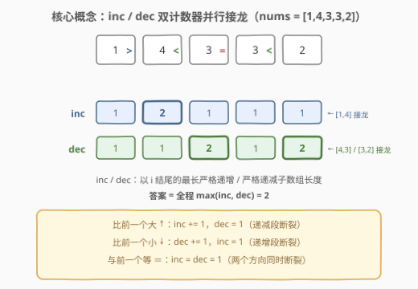
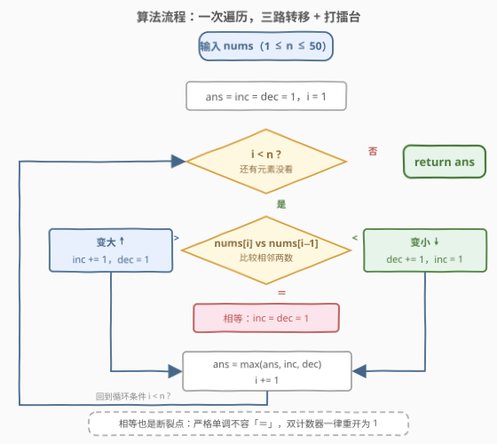
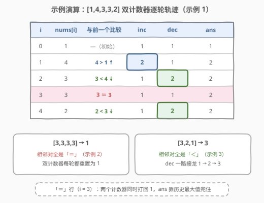

# LeetCode 最长的严格递增或严格递减子数组 题解

## 1. 题目概述

- **标题 / 题号**：最长的严格递增或严格递减子数组（#3105，easy）
- **链接**：https://leetcode.cn/problems/longest-strictly-increasing-or-strictly-decreasing-subarray/
- **难度**：简单
- **标签**：数组

**题意**：给你一个整数数组 `nums`。返回数组 `nums` 中**严格递增**或**严格递减**的**最长非空子数组**的长度。

子数组是数组中一段**连续**的元素序列。

**示例 1**：

```text
输入：nums = [1,4,3,3,2]
输出：2
解释：严格递增子数组有 [1]、[2]、[3]、[3]、[4] 以及 [1,4]；严格递减子数组有 [1]、[2]、[3]、[3]、[4]、[3,2] 以及 [4,3]。因此返回 2。
```

**示例 2**：

```text
输入：nums = [3,3,3,3]
输出：1
解释：所有相邻对都相等，长度大于 1 的子数组既不严格递增也不严格递减。
```

**示例 3**：

```text
输入：nums = [3,2,1]
输出：3
解释：整个数组 [3,2,1] 本身就是严格递减子数组。
```

**约束**：

- $1 \le \text{nums.length} \le 50$
- $1 \le \text{nums}[i] \le 50$

> 💡 读题关键：求的是**子数组**（连续）而非子序列——这让「以 i 结尾」的答案只依赖前一位；「**严格**」二字意味着**相等也算断裂**，`[3,3]` 既不递增也不递减，示例 2 的全等数组就是专门为这个坑设计的。

## 2. 解题思路

### 2.1 暴力思路：枚举子数组，逐个验证

枚举全部 $O(n^2)$ 个子数组，每个花 $O(n)$ 检查是否严格单调，总代价 $O(n^3)$。稍加改进——固定左端点向右延伸，方向一断就停——可以降到 $O(n^2)$。

$n \le 50$ 时暴力完全够过，但它浪费了本题最重要的结构：**单调性只会在相邻两个元素比较时断裂**，验证长段时做了大量重复的相邻比较。把「以每个位置结尾的最长合法段」直接滚动起来，就是一次遍历的 $O(n)$ 解法。

### 2.2 核心观察：双计数器一次遍历（inc / dec）



定义两个滚动变量：

- `inc`：**以 i 结尾**的最长**严格递增**子数组长度；
- `dec`：**以 i 结尾**的最长**严格递减**子数组长度。

只看相邻两个元素 `nums[i]` 与 `nums[i-1]` 的大小关系，转移恰好三种：

| 比较 | 转移 | 直觉 |
|------|------|------|
| `nums[i] > nums[i-1]` | `inc += 1`，`dec = 1` | 递增段接龙；递减段在此断裂，退化为单元素 |
| `nums[i] < nums[i-1]` | `dec += 1`，`inc = 1` | 递减段接龙；递增段断裂 |
| `nums[i] == nums[i-1]` | `inc = dec = 1` | **严格**单调不容相等，两个方向同时断裂 |

**循环不变量**：处理完下标 `i` 后，`inc` / `dec` 恰好等于以 `i` 结尾的最长严格递增 / 递减子数组长度。最终答案就是全程 $\max(\text{inc}, \text{dec})$ 的最大值。

> 💡 与 53 最大子数组和同款哲学：「以 i 结尾」的局部最优只依赖「以 i−1 结尾」的局部最优，于是 DP 表被压成两个滚动变量，空间 $O(1)$。那边把「和」接龙，这边把「长度」接龙，聚合函数从 `sum` 换成 `+1` 而已。

为什么**相等必须双重置**？`[3,3]` 往任一方向延一步都是 `=`，既不满足 `>` 也不满足 `<`，两个方向的单调性**同时**被破坏。只重置一个计数器，就会在全等数组上输出 2 这样的错误答案。

### 2.3 算法流程：一次遍历 + 三路分支



1. `ans = inc = dec = 1`（单元素自身就是长度 1 的合法段，同时兜底 `n = 1`）；
2. `i` 从 1 到 n−1：按上表三路转移 `inc` / `dec`；
3. 每轮 `ans = max(ans, inc, dec)` 打擂台；
4. 遍历结束返回 `ans`。

### 2.4 示例演算



以 `[1,4,3,3,2]` 为例：

| i | nums[i] | 与前一位比较 | inc | dec | ans |
|---|---------|--------------|-----|-----|-----|
| 0 | 1 | —（初始） | 1 | 1 | 1 |
| 1 | 4 | 4 > 1 ↑ | **2** | 1 | 2 |
| 2 | 3 | 3 < 4 ↓ | 1 | **2** | 2 |
| 3 | 3 | 3 ＝ 3 | 1 | 1 | 2 |
| 4 | 2 | 2 < 3 ↓ | 1 | **2** | 2 |

四步三起三落：`>` 让 inc 冲到 2；`<` 让 dec 接棒到 2；`＝` 把两个计数器同时打回 1；最后一个 `<` 又把 dec 拉回 2。全程最大值停在 **2**。示例 3 `[3,2,1]` 则是连续两个 `<`，dec 一路 `1→2→3` 无断裂，答案 **3**——`ans` 靠打擂台记下历史峰值，中间的断裂不会抹掉已经拿到的最优。

## 3. 参考代码

### C++（双计数器一次遍历）

```cpp
class Solution {
  public:
    int longestMonotonicSubarray(vector<int>& nums) {
        int n = nums.size();
        int ans = 1, inc = 1, dec = 1;
        for (int i = 1; i < n; ++i) {
            if (nums[i] > nums[i - 1]) {
                ++inc;
                dec = 1;
            } else if (nums[i] < nums[i - 1]) {
                ++dec;
                inc = 1;
            } else {
                inc = dec = 1;   // 严格单调不容相等，双双重开
            }
            ans = max(ans, max(inc, dec));
        }
        return ans;
    }
};
```

### Python（同款双计数器）

```python
class Solution:
    def longestMonotonicSubarray(self, nums: List[int]) -> int:
        ans = inc = dec = 1
        for a, b in zip(nums, nums[1:]):   # a = nums[i-1], b = nums[i]
            if a < b:
                inc, dec = inc + 1, 1
            elif a > b:
                dec, inc = dec + 1, 1
            else:
                inc = dec = 1
            ans = max(ans, inc, dec)
        return ans
```

> 💡 Python 3.10+ 可用 `itertools.pairwise(nums)` 替代 `zip(nums, nums[1:])`，省一个切片拷贝；`n = 1` 时循环体不执行，初值 1 恰好兜底。

## 4. 复杂度分析

| 维度 | 复杂度 | 说明 |
|------|--------|------|
| 时间复杂度 | $O(n)$ | 每个元素只与前一位比较一次；三路转移与打擂台均为 $O(1)$ |
| 空间复杂度 | $O(1)$ | 仅 `ans` / `inc` / `dec` 三个滚动变量（DP 表压缩的成果） |

> 💡 暴力 $O(n^2)$ 在 $n \le 50$ 下最多约 2500 次相邻比较，也能过；但 $O(n)$ / $O(1)$ 的滚动版不依赖数据范围，是这族题的标准答案。

## 5. 扩展：换一条接龙规则就是 978 湍流子数组

把「**同方向**接龙」改成「**交替方向**接龙」，就得到 978 最长湍流子数组（中等）：要求相邻比较符号严格交替 `>` `<` `>` `<` …（波浪形）。转移规则只需把接龙的方向「交叉」一下：

- `nums[i] > nums[i-1]`：`inc = dec + 1`（**递增段接在上一个递减段后面**），`dec = 1`；
- `nums[i] < nums[i-1]`：`dec = inc + 1`，`inc = 1`；
- 相等：`inc = dec = 1`。

3105 是「同向续、异向断」，978 是「异向续、同向断」——同一副 inc/dec 骨架，换一条转移边就是一道新题。再往前一步，845 数组中的最长山脉要求「先增后减」，则是 inc 段与 dec 段的**拼接**。这一族题的通解都是：**只看相邻符号，定义好「以 i 结尾」的状态，一次遍历滚动更新**。

## 6. 面试要点

1. **为什么相等时两个计数器都要重置为 1？**

   - 「严格」要求相邻元素满足 `>` 或 `<`；`[3,3]` 两个方向都不满足，递增、递减段**同时**断裂。只重置一个会在全等数组（示例 2）上输出错误答案。

2. **为什么初始化 ans = 1 而不是 0？**

   - 非空子数组下，单个元素自身就是长度 1 的严格递增（也是严格递减）子数组；`n = 1` 时循环体不执行，答案恰好由初值兜底。

3. **只维护一个计数器加方向标记能做吗？**

   - 能：记当前方向 `dir` 与长度 `cur`，方向一致则 `cur += 1`，不一致（含相等）则 `cur = 2` 并更新方向。但双计数器把两个方向对称摊开，转移表更直观，且能原样泛化到 978（湍流）这类「两个方向的状态互相喂」的变体——单计数器版本在那类题上会立刻失效。

4. **这题和 674 最长连续递增序列是什么关系？**

   - 674 是单方向版：只需一个 `inc` 计数器。3105 = 674 的递增版 ∪ 递减版取 max，两份状态在同一次遍历里并行维护，一次比较同时服务两个方向。

5. **如果改成「非严格」（允许相等）怎么做？**

   - 转移表骨架不变，只改比较符：`>` 与 `<` 分支照旧；**相等分支变成 `inc += 1` 且 `dec += 1`**——非递减、非递增两个方向都容许相等，两个计数器各自继续接龙。改题面不改骨架，正是滚动 DP 的弹性所在。

## 同类练习题

| # | 题目 | 与本题的关联 |
|---|------|-------------|
| 674 | [最长连续递增序列](https://leetcode.cn/problems/longest-continuous-increasing-subsequence/) | 单方向版，只需一个 inc 计数器（本仓库已有题解） |
| 978 | [最长湍流子数组](https://leetcode.cn/problems/longest-turbulent-subarray/) | 交替方向接龙版，inc/dec 互相喂长度（本仓库已有题解） |
| 845 | [数组中的最长山脉](https://leetcode.cn/problems/longest-mountain-in-array/) | 先增后减的拼接版，inc 段 + dec 段组合（本仓库已有题解） |
| 53 | [最大子数组和](https://leetcode.cn/problems/maximum-subarray/) | 「以 i 结尾」滚动 DP 的母题，聚合函数换成求和（本仓库已有题解） |
| 152 | [乘积最大子数组](https://leetcode.cn/problems/maximum-product-subarray/) | 同样并行维护「两个方向的滚动状态」（max/min），思路同构（本仓库已有题解） |
