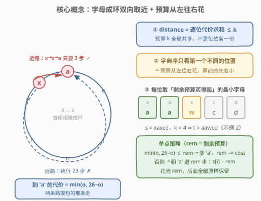
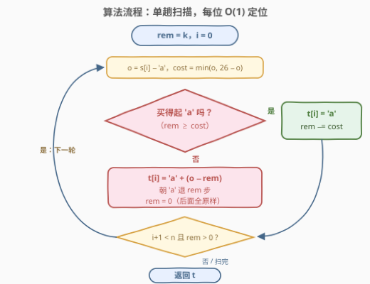
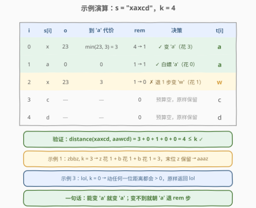

# LeetCode 满足距离约束且字典序最小的字符串 题解

## 1. 题目概述

- **标题 / 题号**：满足距离约束且字典序最小的字符串（#3106，medium）
- **链接**：https://leetcode.cn/problems/lexicographically-smallest-string-after-operations-with-constraint/
- **难度**：中等
- **标签**：贪心、字符串

**题意**：给你一个字符串 `s` 和一个整数 `k`。

定义函数 `distance(s1, s2)` 衡量两个等长字符串的距离：字符 `'a'` 到 `'z'` 按**循环顺序**排列，对每个位置 `i` 计算「`s1[i]` 和 `s2[i]` 之间的**最小距离**」，再对全部位置求**和**。

例如 `distance("ab", "cd") == 4`（a→c 走 2 步、b→d 走 2 步），`distance("a", "z") == 1`（a 和 z 在环上相邻！）。

你可以对 `s` 执行**任意次**操作，每次把 `s` 中的一个字母改成任意其他小写字母。返回执行操作后能得到、且满足 `distance(s, t) <= k` 的**字典序最小**的字符串 `t`。

**示例 1**：

```text
输入：s = "zbbz", k = 3
输出："aaaz"
解释：z 花 1 步变 a（跨 z→a 接缝），两个 b 各花 1 步变 a，
      恰好用满预算 3，末位 z 只能保留。
```

**示例 2**：

```text
输入：s = "xaxcd", k = 4
输出："aawcd"
解释：x 花 3 步变 a（逆时针走近路）；第二位本来就是 a；
      剩 1 步预算不够 x→a（要 3），只能退 1 步变 w；
      后两位预算已空，原样保留。
```

**示例 3**：

```text
输入：s = "lol", k = 0
输出："lol"
解释：k = 0，改任何字符都会使距离大于 0。
```

**约束**：

- $1 \le \text{s.length} \le 100$
- $0 \le k \le 2000$
- `s` 只包含小写英文字母。

> ⚠️ 读题陷阱：字母表是**环形**的——`'a'` 与 `'z'` 相邻，`z → a` 只花 1 步，绝不能按普通 ASCII 差值算；其次 `distance` 对**整个串**求和，预算 $k$ 是**全局共享**的一份，不是每位各给 $k$。

## 2. 解题思路

### 2.1 暴力思路

最朴素的暴力是枚举每个位置改成哪个字母的全部组合——$26^n$ 种方案逐一验证 $distance \le k$ 再取字典序最小，指数级直接爆炸。

观察到位与位之间其实只通过「共享预算」耦合：`distance` 按位求和，各位改动互不影响。于是自然的改进是**从左到右逐位确定**：每个位置从 `'a'` 到 `'z'` 依次尝试，选中第一个「代价不超过剩余预算」的字母——这正是官方提示的做法，$O(26n)$ 对 $n \le 100$ 绰绰有余。而每个位置的最优字母其实可以 **$O(1)$ 直接算出来**，见 2.2。

### 2.2 核心观察：环上距离 + 逐位贪心



三个关键事实：

1. **环上距离，双向取近**。把 `'a'…'z'` 看成首尾相接的 26 格圆环，记 $o$ 为当前字母的序号（'a' 记 0、'z' 记 25），则它变成 `'a'` 的代价为

$$cost = \min(o,\ 26 - o)$$

   顺时针、逆时针两条路取短：`'x'`（$o=23$）变 `'a'` 逆时针跨接缝只要 **3** 步而非 23 步；`'z'` 变 `'a'` 更是只花 **1**。

2. **字典序：靠前的位置绝对优先**。两个串比字典序，只看**第一个不同的位置**——谁在那里更小谁整体就更小，后面取什么都无法翻盘。所以预算这份「共享资源」必须**从左往右花**：每个位置在「剩余预算 `rem` 买得起」的前提下取**能买到的最小字母**。任何「前面留大一点、省预算给后面」的方案，字典序必然更差。

3. **每个位置 $O(1)$ 定位**。设当前位置序号为 $o$、剩余预算为 $rem$：

   - 若 $cost = \min(o, 26-o) \le rem$：直接拉到 `'a'`，$rem \mathrel{-}= cost$；
   - 否则 `'a'` **买不起**：$rem < \min(o, 26-o)$ 意味着 $rem < o$ 且 $rem < 26 - o$，即 $o - rem > 0$、$o + rem < 26$——无论往哪边走都**跨不过 z/a 接缝**。此时可达字母恰好是环上区间 $[\,o - rem,\ o + rem\,]$，最小者就是朝 `'a'` 方向退 $rem$ 步的 $o - rem$，且这一步**恰好花光** $rem$，后续位置只能原样保留。

> 💡 一句话：**能变 'a' 就变 'a'；变不到，就朝 'a' 方向用光剩余预算**。每个位置的最小可达字母及其代价都是唯一确定的（取 'a' 花固定 $cost$，取 $o-rem$ 恰好花光 $rem$），不存在「同字母多方案怎么选」的问题，贪心因此顺畅落地。

### 2.3 算法流程图



流程一句话：初始化 `rem = k` → 从左到右扫描每个位置，计算 `o = s[i] - 'a'` 与 `cost = min(o, 26 - o)` → `rem ≥ cost` 则该位变 `'a'` 并扣预算；否则该位变 `'a' + (o - rem)` 并把 `rem` 清零 → 预算归零或扫描结束后返回。全程一次线性扫描，无 DP、无额外数据结构。

### 2.4 示例演算



以示例 2（`s = "xaxcd"`，`k = 4`）走一遍：

- `i=0`：'x'，$o=23$，$cost=\min(23,3)=3 \le 4$ → 变 'a'，$rem = 4-3 = 1$；
- `i=1`：'a'，$o=0$，$cost=0$ → 白嫖 'a'，`rem` 不变；
- `i=2`：'x'，$cost=3 > 1$ → 买不起 'a'，朝 'a' 退 1 步：`'a' + (23-1)` = 'w'，`rem = 0`；
- `i=3,4`：预算已空，'c'、'd' 原样保留。

结果 `"aawcd"`，验证 $distance = 3 + 0 + 1 = 4 \le k$ ✓。示例 1（`zbbz`, k=3）：z 花 1、b 花 1、b 花 1，恰好用满预算得 `"aaaz"`；示例 3（k=0）：一位都动不了，原样返回 `"lol"`。

## 3. 参考代码

### C++（逐位贪心，$O(n)$）

```cpp
class Solution {
  public:
    string getSmallestString(string s, int k) {
        for (int i = 0; i < (int)s.size() && k > 0; ++i) {
            int o = s[i] - 'a';            // 当前字母的环上序号
            int cost = min(o, 26 - o);     // 到 'a' 的最短代价（双向取近）
            if (k >= cost) {               // 买得起：直接拉到 'a'
                s[i] = 'a';
                k -= cost;
            } else {                       // 买不起：朝 'a' 退 k 步
                s[i] = 'a' + (o - k);
                k = 0;
            }
        }
        return s;
    }
};
```

### Python（逐位贪心，$O(n)$）

```python
class Solution:
    def getSmallestString(self, s: str, k: int) -> str:
        t = list(s)
        for i, ch in enumerate(t):
            if k == 0:
                break
            o = ord(ch) - ord('a')      # 环上序号
            cost = min(o, 26 - o)       # 到 'a' 的最短代价
            if k >= cost:
                t[i] = 'a'
                k -= cost
            else:                       # 朝 'a' 退 k 步，花光预算
                t[i] = chr(ord('a') + o - k)
                k = 0
        return ''.join(t)
```

> 💡 `k == 0` 时提前退出（C++ 版直接写进循环条件），后面字符原样保留——示例 3 的 k=0 也被自然覆盖；遇到本来就是 'a' 的位置代价为 0，等于白嫖。

## 4. 复杂度分析

| 维度 | 复杂度 | 说明 |
|------|--------|------|
| 时间复杂度 | $O(n)$ | 每个位置一次 $\min$ + 一次比较即 $O(1)$ 定位，单趟线性扫描 |
| 空间复杂度 | $O(1)$ | C++ 原地修改；Python 需转 `list` 再 `join`（输出本身占 $O(n)$） |

## 5. 扩展：按提示逐个试字母的 $O(26n)$ 写法

官方提示的直白写法——每个位置从 `'a'` 到 `'z'` **逐个试**，选中第一个买得起的字母：

```python
class Solution:
    def getSmallestString(self, s: str, k: int) -> str:
        t = list(s)
        for i, ch in enumerate(t):
            o = ord(ch) - ord('a')
            for c in range(26):                    # 'a' → 'z' 逐个试
                d = abs(o - c)
                if min(d, 26 - d) <= k:            # 第一个买得起的
                    t[i] = chr(ord('a') + c)
                    k -= min(d, 26 - d)
                    break
        return ''.join(t)
```

复杂度 $O(26n)$，对 $n \le 100$ 毫无压力，且与数学版**结果完全一致**：从 `'a'` 起第一个满足 $\min(|o-c|,\ 26-|o-c|) \le rem$ 的 $c$，要么是 0（买得起 'a'），要么恰是 $o - rem$（'a' 买不起时区间下端最先命中）。面试中先写这版讲清贪心正确性，再推出 $O(n)$ 公式版作为加分项。

另一个方向的对偶变体：若题目改成「字典序**最大**且 $distance \le k$」，只需每位尽量取 'z'——用 $\max(o, 26-o)$ 判断能否到 'z'，买不起就朝 'z' 方向退 $rem$ 步，骨架完全不变。

## 6. 面试要点

1. **为什么从左到右、靠前优先的贪心是最优的？**

   - 字典序比较只由第一个不同的位置决定：若方案 A、B 首次在位置 $j$ 分岔且 $A_j < B_j$，则无论后面如何 A 都更小。因此「靠前位置尽可能小」具有绝对优先级——预算花在前面永不亏本；而每个位置的最小可达字母与代价唯一确定，逐位执行即为全局最优。

2. **'a' 买不起时，为什么最优是 $o - rem$ 而且恰好花光预算？**

   - $rem < \min(o, 26-o)$ 说明两条到 'a' 的路都走不完，可达弧不跨 z/a 接缝，恰好是 $[o-rem,\ o+rem]$ 一段，最小字母即 $o-rem$；从 $o$ 走到 $o-rem$ 的距离恰为 $rem$，故预算全部花光、后面原样保留。

3. **'z' 变 'a' 为什么只花 1？**

   - 字母表按**循环顺序**排列，'z' 与 'a' 在环上相邻（`distance("a","z")==1` 即由此而来）。凡涉及环上距离一律写 $\min(o, 26-o)$ 双向取近，不要按 ASCII 差值硬算。

4. **会不会「前面花多了」导致整体不优？**

   - 不会。一是字典序支配性（见问题 1）；二是单点不存在「花多花少」的选择——变 'a' 花的 $cost$ 固定，退而求其次的花费恰为剩余全部 $rem$，贪心每一步都唯一确定。

5. **如果字母表不是环形（不许跨 z→a 接缝），算法怎么改？**

   - 到 'a' 的代价退化为单方向的 $o$，买不起时仍朝 'a' 退 $rem$ 步得 $o - rem$——主循环结构不变，只是把 $\min(o, 26-o)$ 换成 $o$。「环」只改变了代价函数，逐位贪心的骨架不变，与 1663 的预算摊派同构。

## 同类练习题

| # | 题目 | 与本题的关联 |
|---|------|-------------|
| 1663 | [具有给定数值的最小字符串](https://leetcode.cn/problems/smallest-string-with-a-given-numeric-value/) | 总预算（数值和）约束下逐位构造字典序最小串，与本题「预算摊派 + 逐位贪心」同构 |
| 402 | [移掉 K 位数字](https://leetcode.cn/problems/remove-k-digits/) | 把 k 次删除当预算，贪心 + 单调栈求字典序最小，同样靠「靠前位置支配」论证 |
| 2182 | [构造限制重复的字符串](https://leetcode.cn/problems/construct-string-with-repeat-limit/) | 限制条件下贪心构造字典序**最大**串，方向相反、套路相同 |
| 316 | [去除重复字母](https://leetcode.cn/problems/remove-duplicate-letters/) | 贪心 + 单调栈在约束下求字典序最小，进阶练习「可撤销的贪心」 |
