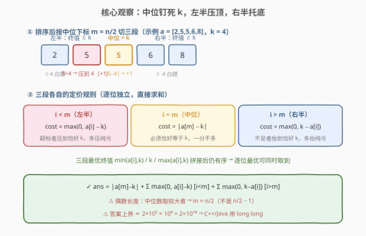
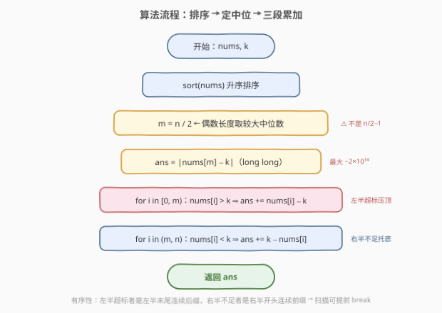
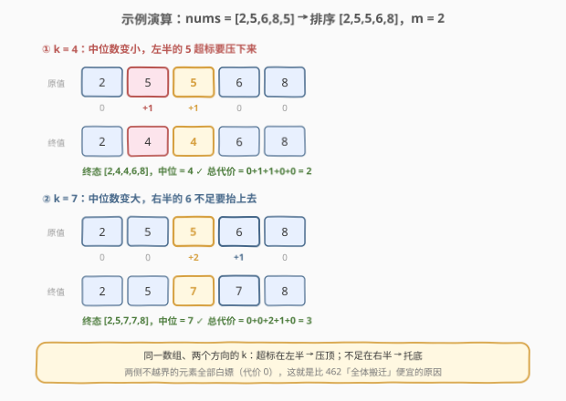

# 使数组中位数等于 K 的最少操作数

- **题目名称**：使数组中位数等于 K 的最少操作数
- **链接**：[3107. 使数组中位数等于 K 的最少操作数](https://leetcode.cn/problems/minimum-operations-to-make-median-of-array-equal-to-k/)
- **难度**：中等
- **标签**：贪心、数组、排序
- **核心套路**：排序定中位下标 + 三段独立定价（左半压顶 / 中位钉死 / 右半托底）

## 1. 题目概述

给你一个整数数组 $\text{nums}$ 和一个**非负**整数 $k$。一次操作中，你可以选择任一元素**加 $1$** 或者**减 $1$**。

请你返回将 $\text{nums}$ **中位数**变为 $k$ 所需要的**最少**操作次数。

一个数组的**中位数**指的是数组按**非递减顺序**排序后最中间的元素。如果数组长度为**偶数**，我们选择中间两个数的**较大值**为中位数。

**示例 1**：

```text
输入：nums = [2,5,6,8,5], k = 4
输出：2
解释：将 nums[1] 和 nums[4] 减 1 得到 [2, 4, 6, 8, 4]，此时中位数为 4。
```

**示例 2**：

```text
输入：nums = [2,5,6,8,5], k = 7
输出：3
解释：将 nums[1] 增加 1 两次、nums[2] 增加 1 一次，得到 [2, 7, 7, 8, 5]，中位数为 7。
```

**示例 3**：

```text
输入：nums = [1,2,3,4,5,6], k = 4
输出：0
解释：数组中位数（偶数长度取中间两数的较大值，即 4）已经等于 k。
```

**约束条件**：

- $1 \le \text{nums.length} \le 2 \times 10^5$
- $1 \le \text{nums}[i] \le 10^9$
- $1 \le k \le 10^9$

---

## 2. 解题思路

### 2.1 暴力思路

「把某个元素 $\pm 1$」的操作只改变值、不改变数组长度，状态空间是所有长度为 $n$ 的整数数组，**无界**，直接 BFS 无从下手。朴素的贪心想法是：**排序后把中位下标 $m$ 上的元素改成 $k$ 就完事**，只花 $\lvert a[m] - k \rvert$ 次。但它在示例 1 上立刻翻车：

> 排序得 $[2,5,5,6,8]$，$m = 2$。把 $a[2] = 5$ 改成 $4$ 后，数组重排为 $[2,4,5,6,8]$，中位数是 **5** 而不是 4——左边的 $a[1] = 5 > 4$ 把它「顶」出了中位。示例 2 对称翻车：右边的 $a[3] = 6 < 7$ 会把中位「压」下去。

问题出在：**中位数是全序约束，不只是单个位置的约束**。排序后第 $m$ 位等于 $k$，等价于完整要求：**左半所有位置 $\le k$、中位恰好 $= k$、右半所有位置 $\ge k$**。这才是终局的正确刻画。

### 2.2 核心观察：排序后三段互不干扰，各取各的最便宜终值



把数组升序排序为 $a$，记 $m = \lfloor n/2 \rfloor$（⚠️ 偶数长度题目规定取**较大**中位数，下标恰为 $n/2$）。终局数组排序后必须满足 $b[i] \le k\ (i < m)$、$b[m] = k$、$b[i] \ge k\ (i > m)$。而把 $x$ 变成 $y$ 的代价恰为 $\lvert x - y \rvert$，于是可以**逐位独立定价**：

| 位置 | 终值约束 | 最便宜终值 | 代价 |
|------|----------|-----------|------|
| $i < m$（左半） | $\le k$ | $\min(a[i],\ k)$ | $\max(0,\ a[i] - k)$ |
| $i = m$（中位） | $= k$ | $k$ | $\lvert a[m] - k \rvert$ |
| $i > m$（右半） | $\ge k$ | $\max(a[i],\ k)$ | $\max(0,\ k - a[i])$ |

三段的最优终值拼起来**仍然有序**（左半 $\le k$ = 中位 $\le$ 右半），逐位最优可以**同时取到**，所以答案就是三段代价直接求和：

$$\text{ans} = \lvert a[m] - k \rvert + \sum_{i < m} \max(0,\ a[i] - k) + \sum_{i > m} \max(0,\ k - a[i])$$

> 💡 直观理解：左半**超标**的元素（$> k$）必须压下来——压到**恰好 $k$** 即满足约束，多压一格纯亏；右半**不足**的元素（$< k$）对称地抬到恰好 $k$；中位本身一分不多一分不少地钉在 $k$。三类调整互不抢位置，代价天然可加。

### 2.3 算法流程图



排序 $O(n \log n)$，随后一趟扫描累加三段代价。由于数组有序，左半超标者是左半段末尾的**连续后缀**、右半不足者是右半段开头的**连续前缀**，循环可提前 `break`（纯微优化，$O(n)$ 全扫也绰绰有余）。

### 2.4 示例演算



同一个数组 $\text{nums} = [2,5,6,8,5]$，排序后 $a = [2,5,5,6,8]$，$m = 2$，看 $k$ 的两个方向：

**$k = 4$（中位数变小）**：左半的 $a[1] = 5$ 超标要压下来；中位 $a[2] = 5$ 要降到 4。

| 位置 | 0 | 1 | 2（中位） | 3 | 4 |
|------|---|---|-----------|---|---|
| 原值 | 2 | 5 | 5 | 6 | 8 |
| 终值 | 2 | **4** | **4** | 6 | 8 |
| 代价 | 0 | 1 | 1 | 0 | 0 |

总代价 $2$，终态 $[2,4,4,6,8]$ 的中位数 $= 4$ ✓（与官方解释「两个 5 各减 1」一致）

**$k = 7$（中位数变大）**：中位 $a[2] = 5$ 要升到 7；右半的 $a[3] = 6$ 不足要抬上去。

| 位置 | 0 | 1 | 2（中位） | 3 | 4 |
|------|---|---|-----------|---|---|
| 原值 | 2 | 5 | 5 | 6 | 8 |
| 终值 | 2 | 5 | **7** | **7** | 8 |
| 代价 | 0 | 0 | 2 | 1 | 0 |

总代价 $3$，终态 $[2,5,7,7,8]$ 的中位数 $= 7$ ✓（与官方解释「一个 5 加 2、一个 6 加 1」一致）

---

## 3. 参考代码

### C++

```cpp
class Solution {
  public:
    long long minOperationsToMakeMedianK(vector<int>& nums, int k) {
        sort(nums.begin(), nums.end());
        int n = nums.size(), m = n / 2;                  // 偶数长度取较大中位数
        long long ans = llabs((long long)nums[m] - k);   // 中位钉死 k
        for (int i = 0; i < m; ++i)
            if (nums[i] > k) ans += (long long)nums[i] - k;  // 左半超标压回 k
        for (int i = m + 1; i < n; ++i)
            if (nums[i] < k) ans += (long long)k - nums[i];  // 右半不足抬到 k
        return ans;
    }
};
```

### Python

```python
class Solution:
    def minOperationsToMakeMedianK(self, nums: List[int], k: int) -> int:
        nums.sort()
        m = len(nums) // 2                                 # 偶数长度取较大中位数
        ans = abs(nums[m] - k)                             # 中位钉死 k
        ans += sum(x - k for x in nums[:m] if x > k)       # 左半超标压回 k
        ans += sum(k - x for x in nums[m + 1:] if x < k)   # 右半不足抬到 k
        return ans
```

> ⚠️ 答案上界约为 $2 \times 10^5 \times 10^9 = 2 \times 10^{14}$，超出 32 位整型范围：C++/Java 必须用 `long long`/`long`；单次差值 `nums[i] - k` 不超 $10^9$ 不溢 `int`，但**累加器**必须 64 位。Python 天然大数无此顾虑。

---

## 4. 复杂度分析

| 维度 | 复杂度 | 说明 |
|------|--------|------|
| 时间复杂度 | $O(n \log n)$ | 排序主导；两趟扫描合计 $O(n)$ |
| 空间复杂度 | $O(1)$ | 原地排序，只用常数个变量（不计语言的排序栈开销） |

---

## 5. 扩展：正确性证明与两个变体

**为什么逐位求和就是全局最优？（两步论证）**

1. **排序匹配最优**：总代价是「原多重集 → 终多重集」的最小逐元素匹配代价 $\sum \lvert x - y \rvert$。交换论证：若 $a_i \le a_j$ 却把 $a_i$ 配给更大的终值、$a_j$ 配给更小的（交叉匹配），交换两者配对不增总代价——故**排序后的原数组与排序后的终数组逐位配对即最优**，问题归结为在合法的有序终数组 $b$ 上最小化 $\sum_i \lvert a[i] - b[i] \rvert$。
2. **逐位下界 + 构造达到**：合法 $b$ 要求 $b[i] \le k\ (i < m)$、$b[m] = k$、$b[i] \ge k\ (i > m)$，故每位代价分别 $\ge \max(0, a[i] - k)$、$\ge \lvert a[m] - k \rvert$、$\ge \max(0, k - a[i])$；而取 $b[i] = \min(a[i],k)\, /\, k\, /\, \max(a[i],k)$ 时三个下界**同时取到**且 $b$ 有序合法。下界与构造吻合，公式即为答案。∎

**变体一（偶数长度取较小中位数）**：若题目改成取中间两数的**较小值**（$m = n/2 - 1$），公式形式不变，只换 $m$。例如 $a = [1, 10]$、$k = 1$：取较大中位数（$m = 1$）答案为 $9$，取较小（$m = 0$）答案为 $0$——两个口径答案可以差很远，读题务必看清。

**变体二（不完整排序行不行）**：可以做到平均 $O(n)$——用 `nth_element`（快速选择）一轮划分后，第 $m$ 小元素就位、左半段恰是 $m$ 个最小元素（无序），随后照样统计「左半 $> k$ 者」「右半 $< k$ 者」即可，无需完整排序。复杂度从 $O(n \log n)$ 降到平均 $O(n)$，属于常数级收益，面试提一句即可。

---

## 6. 面试要点

1. **为什么只把中位下标的元素改成 k 不对？**

   - 中位数是全序约束：改完重排后中位可能「换人」。示例 1 中把 $a[2] = 5$ 改成 4 后，左边的 $5$ 顶上来，中位数仍是 5。完整刻画是：左半 $\le k$、中位 $= k$、右半 $\ge k$，三者缺一不可。

2. **偶数长度的中位数取哪个？公式里 $m$ 是多少？**

   - 本题规定取中间两数的**较大值**，故 $m = n/2$（0-indexed）。若取较小值则 $m = n/2 - 1$，两个口径答案可能天差地别（如 $[1,10],\ k=1$ 时分别为 $9$ 与 $0$）。

3. **左半超标元素为什么压到恰好 k，而不是更低？右半对称呢？**

   - 约束只要求左半 $\le k$：已达标的花 0；超标的每压 1 花费 1，压到 $k$ 即满足约束，再往下是纯浪费。右半对称：不足的抬到恰好 $k$。

4. **逐位最优为什么可以同时取到、直接相加？**

   - 三段最优终值 $\min(a[i],k)\, /\, k\, /\, \max(a[i],k)$ 拼接后仍是非递减的（左半 $\le k$ = 中位 $\le$ 右半），是一个合法终态；配合排序匹配最优性（交换论证），逐位下界同时紧致。

5. **实现上有什么坑？**

   - 溢出：$n \le 2 \times 10^5$、值域 $10^9$，答案可达 $\sim 2 \times 10^{14}$，C++/Java 必须 64 位整型；单次 `nums[i] - k` 不溢 `int`，但累加器必须 `long long`。

6. **和 462（使数组元素相等 II）是什么关系？**

   - 462 是「**全体**元素移到同一个中位数」，代价 $\sum \lvert a[i] - \text{med} \rvert$，偶数长度时任取中间区间内一点都最优；本题把约束放宽为「只有中位钉死、两侧只需不越界」，于是两侧各有一批「白嫖」的元素，代价大幅下降。

---

## 7. 同类练习题

- [462. 最少操作次数使数组元素相等 II](https://leetcode.cn/problems/minimum-moves-to-equal-array-elements-ii/)：全体元素移到中位数的最少 ±1 次数，本题「只钉中位、两侧放行」的收紧版亲戚
- [2448. 使数组相等的最小开销](https://leetcode.cn/problems/minimum-cost-to-make-array-equal/)：每个元素移动单价不同（带权中位数），同族「移到哪最便宜」问题
- [2602. 使数组元素全部相等的最少操作次数](https://leetcode.cn/problems/minimum-operations-to-make-all-array-elements-equal/)：排序 + 前缀和 + 二分，$O(\log n)$ 批量回答「全部移到 $t$」的代价，本题三段定价的批量加强版
- [4. 寻找两个正序数组的中位数](https://leetcode.cn/problems/median-of-two-sorted-arrays/)：中位数下标口径的基本功题，注意其偶数取「平均值」与本题「取较大」的定义差异
