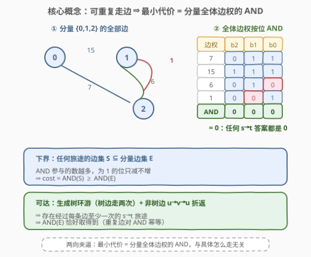
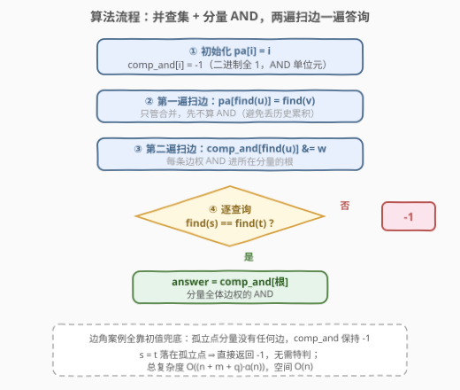
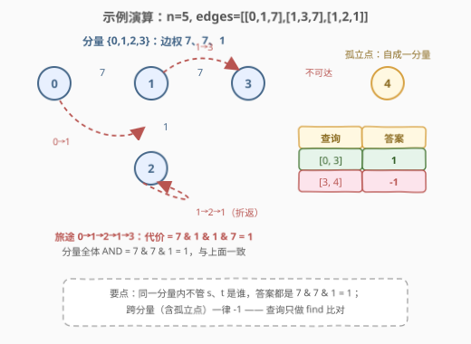

# 带权图里旅途的最小代价

- **题目名称**：带权图里旅途的最小代价
- **链接**：[3108. 带权图里旅途的最小代价](https://leetcode.cn/problems/minimum-cost-walk-in-weighted-graph/)
- **难度**：困难
- **标签**：位运算、并查集、图、数组

## 1. 题目概述

给你一个 $n$ 个节点的**带权无向图**，节点编号 $0$ 到 $n-1$，`edges[i] = [u_i, v_i, w_i]` 表示 $u_i$ 和 $v_i$ 之间有一条权值为 $w_i$ 的无向边。

一趟**旅途**（walk）是一个节点和边交替的序列，起点、终点都是图中的节点。**旅途可以多次经过同一条边、同一个节点**。若旅途依次经过的边权为 $w_0, w_1, \dots, w_k$，则这趟旅途的**代价**定义为：

$$w_0 \,\&\, w_1 \,\&\, w_2 \,\&\, \dots \,\&\, w_k$$

其中 $\&$ 为按位与。给定查询数组 `query[i] = [s_i, t_i]`，对每个查询求从 $s_i$ 出发、在 $t_i$ 结束的旅途的**最小代价**；若不存在这样的旅途，答案为 $-1$。

**示例 1**：

```text
输入：n = 5, edges = [[0,1,7],[1,3,7],[1,2,1]], query = [[0,3],[3,4]]
输出：[1,-1]
解释：查询 [0,3]：走 0→1(权7)→2(权1)→1(权1)→3(权7)，代价 = 7 & 1 & 1 & 7 = 1。
     查询 [3,4]：节点 4 是孤立点，无法到达，答案 -1。
```

**示例 2**：

```text
输入：n = 3, edges = [[0,2,7],[0,1,15],[1,2,6],[1,2,1]], query = [[1,2]]
输出：[0]
解释：走 1→2(权1)→1(权6)→2(权1)，代价 = 1 & 6 & 1 = 0；再兜圈把 7、15 也
     算进来依然是 0，0 已是理论下界。
```

**约束条件**：

- $1 \le n \le 10^5$
- $0 \le \text{edges.length} \le 10^5$
- $0 \le u_i, v_i \le n - 1$，且 $u_i \ne v_i$
- $0 \le w_i \le 10^5$
- $1 \le \text{query.length} \le 10^5$

> ⚠️ 两个易漏点：一是代价不是边权**求和**而是按位 **AND**——边走越多、1 的位只会越少，这彻底改变了最优策略；二是「旅途」不是简单路径，**点和边都可以重复经过**，这是本题能一步塌缩到连通性的题眼。

---

## 2. 解题思路

### 2.1 暴力思路

对每个查询独立搜索：从 $s$ 出发 BFS，状态为「（当前节点， 已走边权的 AND 值）」，转移时经边 $w$ 把状态里的 AND 值乘上 $\&\, w$，到达 $t$ 时取历史最小。

问题在于 AND 值的取值空间：$w_i \le 10^5 < 2^{17}$，状态数高达 $n \cdot 2^{17} \approx 1.3 \times 10^{10}$，单次查询就不可行，$q$ 高达 $10^5$ 次更是雪上加霜。而且最短路式的贪心松弛也救不了场：AND 不是「可加」度量，$(u, \text{and}_1)$ 与 $(u, \text{and}_2)$ 之间没有简单的支配关系可供剪枝。必须换视角。

### 2.2 核心观察：可重走 ⇒ 最小代价 = 分量内全体边权的 AND



**观察 1（旅途可以「扫过」整个连通分量）**：设 $s$、$t$ 位于同一连通分量 $C$。以 $s$ 为根做 DFS 得到生成树，树边「下去再回来」各走两次；非树边 $(u, v, w)$ 在首次到达 $u$ 时以 $u \to v \to u$ 的**折返**经过。这样得到一条从 $s$ 出发、**经过 $C$ 中每条边至少一次**、最终回到 $s$ 的闭游走，最后再沿树边从 $s$ 走到 $t$。重复经过不改变 AND 值（$x \,\&\, x = x$），所以这条旅途的代价恰为 $\text{AND}(E_C)$——$C$ 中**全部**边权的按位与。

**观察 2（全体边 AND 既是下界、又可达）**：任何从 $s$ 到 $t$ 的旅途都不可能离开分量 $C$，其经过的边集 $S \subseteq E_C$。按位 AND 参与的数越多，为 1 的位**只减不增**，因此：

$$\text{AND}(S) \ge \text{AND}(E_C)$$

即任何旅途的代价都不小于 $\text{AND}(E_C)$；而观察 1 说明 $\text{AND}(E_C)$ 恰好取得到。**最小代价 = $\text{AND}(E_C)$**。

> 💡 换个说法：答案的二进制中，第 $b$ 位为 1 当且仅当分量内**每一条边**的第 $b$ 位都是 1。只要有一条边在该位是 0，就把旅途绕过去踩一脚，这一位就被清掉了。

**观察 3（查询只取决于根）**：$s$、$t$ 属于不同分量 ⇒ 无旅途 ⇒ $-1$；同分量 ⇒ 答案 $\text{AND}(E_C)$。特别地，$s = t$ 且该点孤立（分量无边）时，分量 AND 是空集，代码里用全 1 初值 $-1$ 自然表示，返回 $-1$ 与题意一致。

于是工具选**并查集**：第一遍把所有边合并；第二遍把每条边权 AND 进其根的代表值；逐查询比对根即可。

### 2.3 算法流程图



整体流程：初始化 `comp_and[i] = -1`（二进制全 1，是 AND 的单位元）→ 第一遍扫边做合并 → 第二遍扫边 `comp_and[find(u)] &= w` → 对每个查询，`find(s) == find(t)` 则返回 `comp_and[根]`，否则 $-1$。

### 2.4 示例演算



以示例 1 `n = 5, edges = [[0,1,7],[1,3,7],[1,2,1]]` 走一遍：

| 查询 | `find(s)` 与 `find(t)` | 连通？ | 分量边权 | 计算 | 答案 |
|------|------------------------|--------|----------|------|------|
| `[0,3]` | 同根（分量 $\{0,1,2,3\}$） | ✓ | $\{7, 7, 1\}$ | $7 \,\&\, 7 \,\&\, 1 = 1$ | $1$ |
| `[3,4]` | $3$ 在大分量，$4$ 独自成根 | ✗ | — | — | $-1$ |

再验证示例 2：分量 $\{0,1,2\}$ 边权 $\{7, 15, 6, 1\}$，$7 \,\&\, 15 \,\&\, 6 \,\&\, 1 = 0111_2 \,\&\, 1111_2 \,\&\, 0110_2 \,\&\, 0001_2 = 0$，查询 `[1,2]` 答案 $0$ ✓。

---

## 3. 参考代码

### C++

```cpp
class Solution {
  public:
    vector<int> minimumCost(int n, vector<vector<int>>& edges, vector<vector<int>>& query) {
        vector<int> pa(n);
        iota(pa.begin(), pa.end(), 0);
        function<int(int)> find = [&](int x) -> int {
            return pa[x] == x ? x : pa[x] = find(pa[x]);
        };
        for (auto& e : edges) pa[find(e[0])] = find(e[1)];   // 第一遍：只管合并
        vector<int> compAnd(n, -1);                          // -1 = 二进制全 1，AND 单位元
        for (auto& e : edges) compAnd[find(e[0])] &= e[2];   // 第二遍：边权 AND 进根
        vector<int> ans;
        ans.reserve(query.size());
        for (auto& q : query) {
            int a = find(q[0]), b = find(q[1]);
            ans.push_back(a == b ? compAnd[a] : -1);
        }
        return ans;
    }
};
```

### Python

```python
class Solution:
    def minimumCost(self, n: int, edges: List[List[int]], query: List[List[int]]) -> List[int]:
        pa = list(range(n))

        def find(x: int) -> int:
            while pa[x] != x:
                pa[x] = pa[pa[x]]            # 路径折叠
                x = pa[x]
            return x

        for u, v, _ in edges:                # 第一遍：只管合并
            pa[find(u)] = find(v)
        comp_and = [-1] * n                  # -1 = 二进制全 1，AND 单位元
        for u, _, w in edges:                # 第二遍：边权 AND 进根
            comp_and[find(u)] &= w

        return [comp_and[find(s)] if find(s) == find(t) else -1
                for s, t in query]
```

> 💡 两个实现细节：`comp_and` 初值取 $-1$，其二进制表示全 1，是 AND 运算的单位元——孤立点分量保持 $-1$，恰好就是「无边可用」时的正确答案，无需特判；两遍扫边**必须分开**，若在合并的同时累加 AND，两个分量合并时会丢掉被吞并一方的历史累积值。

---

## 4. 复杂度分析

| 维度 | 复杂度 | 说明 |
|------|--------|------|
| 时间复杂度 | $O((n + m + q) \cdot \alpha(n))$ | 两遍扫边各 $m$ 次合并/查询，$q$ 次查询各两次 `find`，均为近似常数（阿克曼反函数 $\alpha$）；$n, m, q \le 10^5$，总量约 $4 \times 10^5$ 次近似 $O(1)$ 操作 |
| 空间复杂度 | $O(n)$ | 并查集数组 `pa` 与分量 AND 数组 `comp_and`，均长 $n$ |

---

## 5. 扩展：如果代价不是 AND 呢？

**改成 OR（越走越大）**：重复走边只会让 OR 变大，最优策略反转为「只走一条 $s \to t$ 路径」，且应尽量少走边——问题退化成 BFS 层次上再比较路径 OR，需要按位讨论，难度不小；「重复自由」这个塌缩条件完全失效。

**改成 XOR（异或）**：边走两次恰好抵消（$x \oplus x = 0$），但走奇数次等价走一次，于是所有 $s \to t$ 旅途的 XOR 值 = 「某条固定路径的 XOR」⊕「分量内所有环的 XOR 张成空间」。最小值要用**线性基**（异或高斯消元）在环空间里逼近，这是「最大权异或路径」一族（如 847 之前的经典题）的标准工具。

**对比小结**：AND / XOR 因「重复有界、可抵消或幂等」而享受连通性塌缩或线性基；而「简单路径 + 一般聚合函数」的版本往往没有多项式解。面试中先问清「边能不能重复」，往往直接决定题目难度档位。

---

## 6. 面试要点

1. **为什么答案只与连通分量有关，而与具体路径无关？**

   - 旅途可重复经过点和边 ⇒ 能构造出经过分量内每条边至少一次的旅途（生成树环游 + 非树边折返）；而任何旅途又只能用到分量内的边。两向夹逼，答案 = 分量全体边权的 AND。

2. **AND(E_C) 为什么是下界？为什么可达？**

   - 下界：旅途边集 $S \subseteq E_C$，AND 参与的数越多 1 位只减不增，故 $\text{AND}(S) \ge \text{AND}(E_C)$。可达：闭游走把每条边都踩到，代价恰为 $\text{AND}(E_C)$（重复边对 AND 幂等）。

3. **s = t 或孤立点怎么处理？**

   - $s = t$ 时构造同样成立（闭游走后走树路径回 $s$）。孤立点分量无边，AND 空集用全 1 初值 $-1$ 表示，直接返回 $-1$，与无旅途语义一致，代码零特判。

4. **为什么 `comp_and` 初值是 -1？两遍扫边为什么不能合成一遍？**

   - $-1$ 的补码全 1，是 AND 的单位元，保证「没 AND 过任何边」时值不受污染。合并时若同时累加，需要显式合并两棵树的累积 AND（`comp_and[new_root] &= comp_and[old_root]`），一遍写法容易漏；拆成「先全部合并、再统一累加」更不易错。

5. **如果查询是在线的、边在动态加入，怎么做？**

   - 并查集合并不可撤销但支持增量加边：每来一条边，合并根并把两棵树的 `comp_and` 与新边权 AND 到一起；查询照旧 `find` 比对。若要支持删边，则需要离线倒序处理或 LCT 级别的结构。

---

## 7. 同类练习题

- [547. 省份数量](https://leetcode.cn/problems/number-of-provinces/)（[题解](../0501-0600/547_省份数量.md)）：并查集模板题，本题的第一块积木
- [684. 冗余连接](https://leetcode.cn/problems/redundant-connection/)（[题解](../0601-0700/684_冗余连接.md)）：并查集判环，体会「合并失败」信息的用法
- [1697. 检查边长度限制的路径是否存在](https://leetcode.cn/problems/checking-existence-of-edge-length-limited-paths/)：同样是并查集批量回答图上查询，多了「按边权排序 + 离线」的维度
- [1631. 最小体力消耗路径](https://leetcode.cn/problems/path-with-minimum-effort/)：图上最小化路径聚合值（瓶颈边），并查集按边权升序合并的另一经典应用
- [839. 相似字符串组](https://leetcode.cn/problems/similar-string-groups/)：并查集分组思想在非图论语境下的迁移
