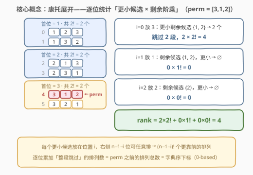
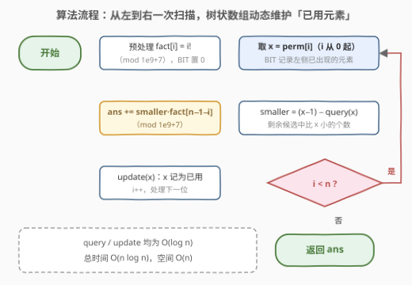

# LeetCode 查找排列的下标 题解

## 1. 题目概述

- **标题 / 题号**：查找排列的下标（#3109，medium）
- **链接**：https://leetcode.cn/problems/find-the-index-of-permutation/
- **难度**：中等
- **标签**：树状数组、线段树、二分查找、分治、归并排序、数学（康托展开）

> ⚠️ 本题为 LeetCode 付费题，题意描述根据官方示例用例与 hints 重建，可能与官方题面有出入。

**题意**：给定一个长度为 $n$ 的数组 `perm`，它是 `[1, 2, ..., n]` 的一个**排列**。把 `[1, 2, ..., n]` 的**所有排列**放进一个数组并按**字典序**排序，返回 `perm` 在这个数组中的**下标**（0 开始）。

由于答案可能非常大，返回值需对 $10^9 + 7$ **取模**。

**示例 1**：

```text
输入：perm = [1,2]
输出：0
解释：按字典序只有 2 种排列：[1,2], [2,1]，[1,2] 在下标 0。
```

**示例 2**：

```text
输入：perm = [3,1,2]
输出：4
解释：按字典序共 6 种排列：
[1,2,3], [1,3,2], [2,1,3], [2,3,1], [3,1,2], [3,2,1]
[3,1,2] 在下标 4。
```

**约束**：

- $1 \le n = perm.length \le 10^5$
- `perm` 是 `[1, 2, ..., n]` 的一个排列

> 💡 本题是 [60. 第k个排列](../0001-0100/60_第k个排列.md) 的**镜像问题**：60 题从「序号」还原「排列」（康托展开的**解码**方向），本题从「排列」反求「序号」（**编码**方向）。60 题 $n \le 9$ 可以 $O(n^2)$ 慢慢算；本题 $n \le 10^5$，逼着把逐位统计升级成树状数组——60 题解 5.1 节里那句「优化仅具理论意义」，在本题成了必选项。

## 2. 解题思路

### 2.1 暴力思路：三条路都走不通

1. **生成全部排列再排序查找**：$n!$ 个排列，$n = 10^5$ 时 $n!$ 约有 $4.6 \times 10^5$ 位，连 $n = 20$ 都装不下内存，彻底不可行。
2. **`next_permutation` 步进**：从最小排列 `[1,2,...,n]` 出发逐步前进到 `perm`，步数恰是答案本身，最大可达 $n! - 1$ 步——同样是天文数字。
3. **$O(n^2)$ 朴素康托展开**：逐位统计时，用布尔数组/线性扫描数「左侧已出现且 $\le x$」的元素，每位 $O(n)$、总 $O(n^2)$。$n = 10^5$ 时约 $\frac{n^2}{2} \approx 5 \times 10^9$ 次操作，超时。

> ⚠️ 前两条死于「排名本身是 $n!$ 量级」这个事实；第三条其实只差最后一步——把「统计已用元素中 $\le x$ 的个数」从 $O(n)$ 降到 $O(\log n)$。这正是**树状数组**（BIT）的招牌能力：单点标记 $O(\log n)$ + 前缀计数 $O(\log n)$。

### 2.2 核心观察：康托展开（排列 → 序号的「编码」方向）



**分组观察**（与 60 题完全对称）：$n!$ 个排列按字典序排列时，**首位相同的排列连续成段，每段恰好 $(n-1)!$ 个**。

- 若 `perm[0] = x`，则首位取 $1, 2, \ldots, x-1$ 的所有段都整段排在 `perm` 之前，共 $(x-1) \times (n-1)!$ 个排列；
- 固定首位后，问题缩小为「剩余 $n-1$ 个候选上的同型子问题」，对 `perm[1]`、`perm[2]`…… 如法炮制。

于是**字典序下标**（0-based，即 `perm` 前面的排列个数）为：

$$\text{rank} = \sum_{i=0}^{n-1} c_i \cdot (n-1-i)! \pmod{10^9+7}$$

其中 $c_i$ = 处理到第 $i$ 位时，**剩余候选中比 `perm[i]` 小的元素个数**（又称 **Lehmer 码** / 康托系数）。

**如何 $O(\log n)$ 求出 $c_i$？** 这里用到 `perm` 是排列的福利：

- 比 $x$ 小的数总共有 $x - 1$ 个（值域恰为 $1..n$ 互异）；
- 其中已经出现在左侧（已用）的有 $\text{query}(x)$ 个——用一个**树状数组**维护「已用元素」的出现标记，前缀和直接查；
- 剩下的就是还没用的：

$$c_i = (x - 1) - \text{query}(x)$$

值域 $1..n$ 天然就是 BIT 的下标，**免离散化**。结算完当前位后 `update(x)` 把 $x$ 标记为已用，继续右移。

> 💡 **一个漂亮的巧合（面试加分点）**：由于 `perm` 是 $1..n$ 的排列，每个数都会出现，所以「比 $x$ 小且还没用」⇔「比 $x$ 小且出现在右侧」。也就是说 $c_i$ 恰好等于 [315. 计算右侧小于当前元素的个数](../0301-0400/315_计算右侧小于当前元素的个数.md) 要求的 `counts[i]`——**本题 = 315 题的输出逐位乘上阶乘权重再求和**。315 的归并排序、树状数组解法可以原封不动搬过来当「系数计算器」。

**取模细节**：排名可达 $n!-1$（$n=10^5$ 时约 $4.6 \times 10^5$ 位），必须全程模 $10^9+7$：阶乘表边乘边取模；贡献项 $c_i \cdot \text{fact}[n-1-i]$ 两个因子都 $< 10^9+7$，乘积 $< 10^{18} < 2^{63}$，用 `long long` 累加后再取模即可（Python 天然大数无此忧）。

### 2.3 算法流程图



流程分五步：

1. **预处理阶乘表**：`fact[i] = i! mod 1e9+7`，$i = 0..n-1$；树状数组 `c[]` 清零（语义：值为下标的元素是否已出现在左侧）。
2. **从左到右扫描** `i = 0..n-1`，取 $x = perm[i]$。
3. **查系数**：`smaller = (x−1) − query(x)`，即剩余候选中比 $x$ 小的个数。
4. **累加贡献**：`ans = (ans + smaller × fact[n−1−i]) mod 1e9+7`——每个更小候选都能把后面 $n-1-i$ 位任意排，整段跳过。
5. **标记已用**：`update(x)`，转下一位；扫完返回 `ans`。

### 2.4 示例演算

![示例演算：[3,1,2] → 4](../images/p3109_example_walkthrough.svg)

以官方示例 2 `perm = [3,1,2]`（$n=3$，`fact = [1, 1, 2]`）逐位追踪：

| $i$ | $x$ | 已用集合 | query(x) | $c_i = (x{-}1)-\text{query}$ | $(n{-}1{-}i)!$ | 贡献 | ans |
|-----|-----|---------|----------|------------------------------|----------------|------|-----|
| 0 | 3 | $\varnothing$ | 0 | $3-1-0 = 2$ | $2! = 2$ | 4 | 4 |
| 1 | 1 | $\{3\}$ | 0 | $1-1-0 = 0$ | $1! = 1$ | 0 | 4 |
| 2 | 2 | $\{1,3\}$ | 1 | $2-1-1 = 0$ | $0! = 1$ | 0 | 4 |

- **i=0 放 3**：首位若是 1 或 2，各有 $2! = 2$ 个排列整段垫前 → $2 \times 2! = 4$；
- **i=1 放 1**：候选 $\{1,2\}$ 中没有比 1 小的 → 0；
- **i=2 放 2**：候选 $\{2\}$ 中没有更小的 → 0。

最终 `ans = 4`，即 `[3,1,2]` 是字典序第 5 个排列、下标 4，与示例一致。示例 1 `[1,2]` 同法得 $0 \times 1! + 0 \times 0! = 0$——最小排列天然下标 0，模板无需特判。

## 3. 参考代码

### C++

```cpp
class Solution {
    static constexpr int MOD = 1'000'000'007;

    int n;
    vector<int> c;  // 树状数组：值为下标的元素是否已出现在左侧

    void update(int x) {  // 元素 x 记为已用（单点 +1）
        for (; x <= n; x += x & -x) c[x]++;
    }

    int query(int x) {  // 已用元素中值 <= x 的个数（前缀和）
        int s = 0;
        for (; x > 0; x -= x & -x) s += c[x];
        return s;
    }

  public:
    int getPermutationIndex(vector<int>& perm) {
        n = perm.size();
        c.assign(n + 1, 0);

        vector<long long> fact(n);  // fact[i] = i! mod 1e9+7
        fact[0] = 1;
        for (int i = 1; i < n; i++) fact[i] = fact[i - 1] * i % MOD;

        long long ans = 0;
        for (int i = 0; i < n; i++) {
            int x = perm[i];
            // 剩余候选中比 x 小的个数 = (x-1) - 左侧已出现且 <= x 的个数
            int smaller = x - 1 - query(x);
            ans = (ans + smaller * fact[n - 1 - i]) % MOD;
            update(x);
        }
        return ans;
    }
};
```

### Python

```python
class Solution:
    def getPermutationIndex(self, perm: List[int]) -> int:
        MOD = 10**9 + 7
        n = len(perm)

        fact = [1] * n                        # fact[i] = i! mod 1e9+7
        for i in range(1, n):
            fact[i] = fact[i - 1] * i % MOD

        tree = [0] * (n + 1)                  # 树状数组：已用元素的标记

        def update(x: int) -> None:           # 元素 x 记为已用
            while x <= n:
                tree[x] += 1
                x += x & -x

        def query(x: int) -> int:             # 已用元素中 <= x 的个数
            s = 0
            while x:
                s += tree[x]
                x -= x & -x
            return s

        ans = 0
        for i, x in enumerate(perm):
            smaller = x - 1 - query(x)        # 剩余候选中比 x 小的个数
            ans = (ans + smaller * fact[n - 1 - i]) % MOD
            update(x)
        return ans
```

> ⚠️ **溢出检查**（C++）：`smaller` 是 `int` 但 $< n \le 10^5$，`fact` 是 `long long` 且 $< MOD$，故 `smaller * fact[...]` 按 `long long` 计算、最大约 $10^{14}$，加 `ans`（$< MOD$）后仍远小于 $9.2 \times 10^{18}$，安全。

## 4. 复杂度分析

| 维度 | 复杂度 | 说明 |
|------|--------|------|
| 时间复杂度 | $O(n \log n)$ | 阶乘表预处理 $O(n)$；主循环 $n$ 次，每次 `query` / `update` 各 $O(\log n)$ |
| 空间复杂度 | $O(n)$ | 树状数组 $O(n)$ + 阶乘表 $O(n)$ |
| 暴力对比 | $O(n^2) \approx 5 \times 10^9$ | 朴素逐位线性统计在 $n = 10^5$ 下超时；BIT 版约 $3 \times 10^6$ 次树内循环，快约 3 个数量级 |

## 5. 扩展

### 5.1 换个方向扫：本题 = 315 题的阶乘加权版

2.2 节提到「剩余候选中更小」⇔「右侧更小」，这给出了一个从**右往左**的等价写法：BIT 维护「右侧已见元素」，每步 $c_i = \text{query}(x-1)$（右侧严格小于 $x$ 的个数），再 `update(x)`。这与 [315. 计算右侧小于当前元素的个数](../0301-0400/315_计算右侧小于当前元素的个数.md) 的树状数组解法**逐行同构**；315 的归并排序 + 索引数组解法也能直接产出全部 $c_i$（官方标签里的 Merge Sort / Divide and Conquer 即由此而来）。三个系数计算器任选其一：

| 计算器 | 方向 | 单次复杂度 | 备注 |
|--------|------|-----------|------|
| BIT 从左到右（本文） | 维护「已用」 | $O(\log n)$ | $c_i = (x-1) - \text{query}(x)$，免离散化 |
| BIT 从右到左 | 维护「右侧已见」 | $O(\log n)$ | $c_i = \text{query}(x-1)$，与 315 完全同构 |
| 归并排序 + 索引数组 | 分治 | $O(\log n)$ 摊还 | 315 题解一原样迁移 |

### 5.2 与 60 题拼成康托双射闭环，1830 是重复元素版

康托展开建立「排列 ↔ $[0, n!-1]$ 整数」的双射，两道题正好各走一半：

- **60 题（解码）**：序号 $k$ → 排列。把 $k-1$ 写成阶乘进制 $\sum d_i \cdot i!$，逐位从候选中取第 $d_i$ 个；$n \le 9$，$O(n^2)$ 足矣。
- **本题（编码）**：排列 → 序号。逐位统计 $c_i$ 加权求和；$n \le 10^5$，必须 $O(n \log n)$。

若元素**可重复**（多重集排列），排名公式需除以重复元素阶乘的乘积：$\text{rank} = \sum c_i \cdot \dfrac{(m-1-i)!}{\prod_v (\text{cnt}_v!)}$（$m$ 为剩余长度，$\text{cnt}_v$ 为各值剩余次数），对应 [1830. 使字符串有序的最少操作次数](https://leetcode.cn/problems/minimum-number-of-operations-to-make-string-sorted/)——那道题本质就是「重复版康托展开」求排名再推操作数。

## 6. 面试要点

1. **为什么 $c_i$ 可以用 $(x-1) - \text{query}(x)$ 直接算，不用真的维护候选集合？**

   - `perm` 是 $1..n$ 的排列：值互异且全覆盖，比 $x$ 小的数恰好 $x-1$ 个；BIT 记录其中已出现在左侧的 `query(x)` 个，相减即「还没用」的。副产品：值域 $1..n$ 直接当 BIT 下标，**免离散化**；若是一般数组就需先离散化或改用平衡树。

2. **$O(n^2)$ 的朴素康托展开差在哪？为什么必须 BIT/线段树？**

   - $n \le 10^5$，逐位线性统计已用元素约 $\frac{n^2}{2} \approx 5 \times 10^9$ 次操作，超时。BIT 把「单点标记 + 前缀计数」都压到 $O(\log n)$，总体 $O(n \log n) \approx 3 \times 10^6$ 次树内循环。线段树、`std::set` + 二分、归并统计同理可做，复杂度同阶。

3. **取模有哪些坑？**

   - 排名可达 $n! - 1$，必须全程模 $10^9+7$：阶乘表**边乘边模**；C++ 中贡献 `smaller * fact[]` 两个因子都 $< MOD$，乘积 $< 10^{18}$，`long long` 累加后再模一次即可，不会溢出；每轮循环内取模、返回前无需再特殊处理。Python 无溢出问题，公式照写。

4. **答案为什么可能「非常大」？本题和 60 题在数据范围上的差别意味着什么？**

   - $n = 10^5$ 时 $n!$ 约 $4.6 \times 10^5$ 位，排名本身无法用任何整型装下，所以题目才要求取模。60 题 $n \le 9$、$k \le 362880$，既不用取模，$O(n^2)$ 也够快——同一套数学，两档数据范围把实现难度拉开一档。

5. **和 60 / 315 题的关系怎么一句话讲清？**

   - 康托双射的**两个方向**：60 题解码（序号→排列），本题编码（排列→序号）；而本题的系数 $c_i$ 恰是 315 题的输出（右侧更小个数），「3109 = 315 的计数 × 阶乘权重求和」。能把三题串成一条线，基本就掌握了「排列 ↔ 序号」互转的全套工具。

## 同类练习题

| # | 题目 | 与本题的关联 |
|---|------|-------------|
| 60 | [第k个排列](https://leetcode.cn/problems/permutation-sequence/)（[站内题解](../0001-0100/60_第k个排列.md)） | 康托展开的**解码**方向（序号→排列），与本题编码方向互为逆操作，拼成完整双射 |
| 315 | [计算右侧小于当前元素的个数](https://leetcode.cn/problems/count-of-smaller-numbers-after-self/)（[站内题解](../0301-0400/315_计算右侧小于当前元素的个数.md)） | 树状数组/归并统计「右侧更小个数」，其输出正是本题的康托系数 $c_i$ |
| 1830 | [使字符串有序的最少操作次数](https://leetcode.cn/problems/minimum-number-of-operations-to-make-string-sorted/) | **带重复元素**的康托展开（排名除以重复值阶乘），本题互异元素的进阶版 |
| 1643 | [第 K 条最小指令](https://leetcode.cn/problems/kth-smallest-instructions/) | 组合数系「解码」——由序号逐位还原组合对象，与 60 同族、换个计数对象 |
| — | [剑指 Offer 51 / LCR 170. 数组中的逆序对](https://leetcode.cn/problems/shu-zu-zhong-de-ni-xu-dui-lcof/)（[站内题解](../0101-0200/LCOF51_数组中的逆序对.md)） | 逆序对总数 $= \sum c_i$，相当于本题去掉阶乘权重的裸计数版 |
