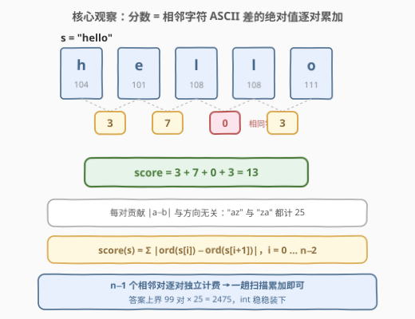
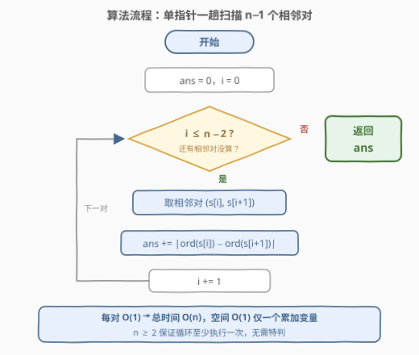
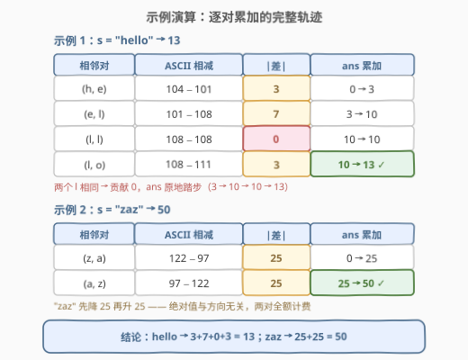

# LeetCode 字符串的分数 题解

## 1. 题目概述

- **标题 / 题号**：字符串的分数（#3110，easy）
- **链接**：https://leetcode.cn/problems/score-of-a-string/
- **难度**：简单
- **标签**：字符串

**题意**：给你一个字符串 `s`。一个字符串的 **分数** 定义为相邻字符 **ASCII** 码差值绝对值的和。

请你返回 `s` 的 **分数**。

**示例 1**：

```text
输入：s = "hello"
输出：13
解释：s 中字符的 ASCII 码分别为 'h' = 104，'e' = 101，'l' = 108，'o' = 111。
所以 s 的分数为 |104 − 101| + |101 − 108| + |108 − 108| + |108 − 111| = 3 + 7 + 0 + 3 = 13。
```

**示例 2**：

```text
输入：s = "zaz"
输出：50
解释：'z' = 122，'a' = 97。
所以 s 的分数为 |122 − 97| + |97 − 122| = 25 + 25 = 50。
```

**约束**：

- $2 \le s.length \le 100$
- `s` 只包含小写英文字母

> 💡 读题关键：分数的定义式就一行——$\text{score}(s) = \sum_{i=0}^{n-2} \left| s_i - s_{i+1} \right|$（按 ASCII 码比较）。一共恰好 $n-1$ 个**相邻对**，每对独立「计费」一次，互不影响。这题的考点不是「怎么优化到 $O(n)$」（它天生就是 $O(n)$），而是把定义式一字不差地翻译成循环，**不过度设计**。

## 2. 解题思路

### 2.1 朴素思路：先转 ASCII 数组，再逐对求差

最直白的写法分两趟：第一趟把每个字符的 ASCII 码转存进数组 `a[]`，第二趟遍历 $i = 0 \ldots n-2$ 累加 $|a_i - a_{i+1}|$。这当然正确，但 ASCII 数组是**多余的中间产物**——相邻对在原串上原地就能取到，转存一遍没有换来任何信息。要削减的正是这一步：一趟扫描，边取相邻对边累加，空间降到 $O(1)$。

> ⚠️ 更「重」的暴力（如枚举所有字符对 $(i, j)$ 再筛出相邻的）在本题毫无意义——定义只关心**相邻**对，跳跃枚举纯属负优化。滑动窗口、DP 之类的重型工具同样用不上：每对贡献只依赖这两个字符本身，天然无后效性，一个累加变量就是全部状态。

### 2.2 核心观察：n−1 个相邻对，一趟扫描逐对累加



把 $n$ 个字符想成数轴上的 $n$ 个点（坐标为 ASCII 码），分数就是**相邻点距之和**：

- 一共恰好 $n - 1$ 个相邻对 $(s_0,s_1), (s_1,s_2), \ldots, (s_{n-2},s_{n-1})$；
- 每对贡献 $\left| s_i - s_{i+1} \right|$，**与方向无关**——`"az"` 和 `"za"` 贡献同为 25（示例 2 里 `"zaz"` 先降后升来回震荡，两对各全额计 25）；
- **相同字符贡献 0**（示例 1 中两个 `l` 之间），进而**分数为 0 当且仅当所有字符相同**；
- 小写字母 ASCII 码 $97 \sim 122$，单对差值 $\le 25$，对数 $\le 99$，故 $ans \le 99 \times 25 = 2475$，`int` 绰绰有余；$n \ge 2$ 保证循环至少执行一次，无边界特判。

> 💡 **一个漂亮的对照（面试加分点）**：如果把定义里的绝对值去掉，$\sum_{i=0}^{n-2} (s_{i+1} - s_i)$ 会**望远镜式**地错位相消，只剩 $s_{n-1} - s_0$——首尾一减，中间全消，根本不用扫描。而加上绝对值后中间项不再抵消，答案成为序列的**总变差**（total variation），必须老老实实逐对累加。一对绝对值，区分了「白送的恒等式」和「真扫描」两类题。

### 2.3 算法流程图



流程只有三步：

1. `ans = 0`；
2. `for i = 0 .. n-2`：`ans += |ord(s[i]) − ord(s[i+1])|`；
3. 返回 `ans`。

### 2.4 示例演算



| 输入 | 相邻对轨迹 | 累加过程 | 结果 |
|------|-----------|---------|------|
| `"hello"` | (h,e) → (e,l) → (l,l) → (l,o) | 3 → 10 → **10** → 13 | **13** |
| `"zaz"` | (z,a) → (a,z) | 25 → 50 | **50** |

`"hello"` 演示了「相同字符贡献 0」——两个 `l` 之间累加值原地踏步（10 → 10）；`"zaz"` 演示了「绝对值与方向无关」——先降 25 再升 25，两对都全额计费。

## 3. 参考代码

### C++

```cpp
class Solution {
  public:
    int scoreOfString(string s) {
        int n = s.size(), ans = 0;
        for (int i = 0; i + 1 < n; i++) {
            ans += abs(s[i] - s[i + 1]);   // char 提升为 int 后相减，差值 ∈ [−25, 25]
        }
        return ans;
    }
};
```

### Python

```python
class Solution:
    def scoreOfString(self, s: str) -> int:
        return sum(abs(ord(a) - ord(b)) for a, b in zip(s, s[1:]))
```

> 💡 写法盘点：`zip(s, s[1:])` 错位配对天然枚举相邻对（Python 3.10+ 还可写 `itertools.pairwise(s)`，免掉 $O(n)$ 的切片）；显式循环版 `ans = 0` + `for a, b in zip(...)` 同样成立。C++17 可用 `std::adjacent_difference` 先生成差分数组再 `accumulate`（两趟、多一个数组，不如原地一趟）；C++23 才有 `views::adjacent<2>`。**循环条件建议写 `i + 1 < n` 而非 `i < n - 1`**——后者在 `n` 为无符号 0 时会下溢成大数（本题 $n \ge 2$ 踩不到，但防御性写法是廉价的好习惯）。

## 4. 复杂度分析

| 维度 | 复杂度 | 说明 |
|------|--------|------|
| 时间复杂度 | $O(n)$ | 恰好遍历 $n-1$ 个相邻对，每对 $O(1)$ |
| 空间复杂度 | $O(1)$ | 仅 `ans` 与下标；朴素两趟版需 $O(n)$ 存 ASCII 数组，Python `s[1:]` 切片亦为 $O(n)$ |
| 答案规模 | $\le 2475$ | $99$ 对 × 单对最大差 $25$，`int` 无溢出风险 |

## 5. 扩展

### 5.1 去掉绝对值：望远镜求和 vs 总变差

2.2 节的对照值得展开。不带绝对值的版本逐项错位相消：

$$\sum_{i=0}^{n-2} (s_{i+1} - s_i) = s_{n-1} - s_0$$

中间字符全部抵消，答案只依赖首尾——这与前缀和（`303` 区间和）是同源的「错位相消」技巧。带上绝对值后，和式变成序列的**总变差**（total variation），衡量序列上下震荡的剧烈程度，是信号处理中的常用统计量，没有捷径、必须逐项累加。识别「这题能不能望远镜」几乎是这类线性扫描题的第一直觉。

### 5.2 同一骨架的变体家族

本题的骨架是「**枚举相邻对 → 按贡献函数聚合**」，换贡献函数或换拓扑就是一道新题：

| 变体 | 贡献函数 / 改动 | 对应题目 |
|------|----------------|----------|
| 布尔版 | $\sum [s_i \ne s_{i+1}]$（不同则计 1） | [3019. 按键变更的次数](../3001-3100/3019_按键变更的次数.md) |
| 环形版 | 首尾再补一对 $\left| s_{n-1} - s_0 \right|$，聚合改 `max` | 3423. 循环数组中相邻元素的最大差值 |
| 任意配对版 | 配对关系从「相邻」换成「同位」，求 $\sum \left| \text{idx}(t_i) - \text{idx}(s_i) \right|$ | 3146. 两个字符串的排列差 |
| 单调段版 | 相邻对比较结果驱动最长段维护 | [3105. 最长的严格递增或严格递减子数组](3105_最长的严格递增或严格递减子数组.md) |

## 6. 面试要点

1. **为什么这题连 DP / 滑动窗口都不需要？**

   - 每个相邻对的贡献只由这一对字符决定，既不依赖前缀状态也不影响后缀计算——天然无后效性，全局答案就是局部贡献的直和。一趟 `for` + 一个累加变量即最优解。识别「定义即算法」的题目并克制地直接翻译，本身就是考点。

2. **`abs(s[i] - s[i+1])` 在 C++ 里有什么类型细节？**

   - 两个 `char` 在算术前会**整型提升**为 `int` 再相减，差值范围 $[-25, 25]$，取绝对值后不可能溢出，返回 `int`（上界 2475）也安全。若字符集扩大到任意字节，`signed char` 的负值同样先提升为 `int`，减法依然安全。

3. **循环边界 `i < n - 1` 和 `i + 1 < n` 有区别吗？**

   - 语义等价，但 `s.size()` 返回无符号类型，`n - 1` 在 `n = 0` 时下溢成 `SIZE_MAX` 导致越界；`i + 1 < n` 则天然安全。本题 $n \ge 2$ 踩不到坑，防御性写法体现边界意识。

4. **去掉绝对值后答案是什么？为什么？**

   - $\sum_{i=0}^{n-2}(s_{i+1}-s_i) = s_{n-1} - s_0$，即末字符与首字符的 ASCII 码差——逐项错位相消。绝对值正是本题「必须逐对扫描」的唯一原因，能主动指出这一点会加分（见 5.1）。

5. **分数的上界是多少？能取到吗？**

   - $99 \times 25 = 2475$：对数至多 $n - 1 \le 99$，单对差至多 $122 - 97 = 25$。两界可**同时**取到：长度 100 的串 `"azaz...az"` 让 99 对全为 25，所以 2475 是紧的上界——顺手就给出了一个构造性证明。

## 同类练习题

| # | 题目 | 与本题的关联 |
|---|------|-------------|
| 3019 | [按键变更的次数](https://leetcode.cn/problems/number-of-changing-keys/)（[站内题解](../3001-3100/3019_按键变更的次数.md)） | 本题的**布尔版**——贡献函数从 $\|a-b\|$ 换成 $[a \ne b]$，同样一趟相邻对扫描 |
| 3423 | [循环数组中相邻元素的最大差值](https://leetcode.cn/problems/maximum-difference-between-adjacent-elements-in-a-circular-array/) | 本题的**环形 + max 版**——首尾补一对，聚合函数从求和换成取最大 |
| 3146 | [两个字符串的排列差](https://leetcode.cn/problems/permutation-difference-between-two-strings/) | 配对关系从「相邻」换成「同位」，仍是 $\|\cdot\|$ 差值求和的骨架 |
| 2016 | [增量元素之间的最大差值](https://leetcode.cn/problems/maximum-difference-between-increasing-elements/) | 相邻对扫描维护「前小后大」的最大差，一趟 $O(n)$ 的同款直觉 |
| 3105 | [最长的严格递增或严格递减子数组](https://leetcode.cn/problems/longest-strictly-increasing-or-strictly-decreasing-subarray/)（[站内题解](3105_最长的严格递增或严格递减子数组.md)） | 相邻对比较结果驱动的最长单调段维护，「只看相邻对」视角的另一种聚合 |
