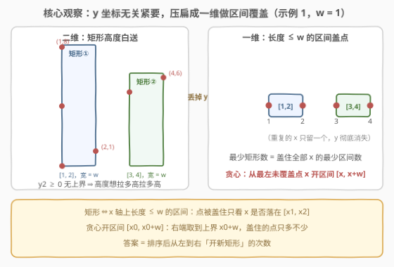
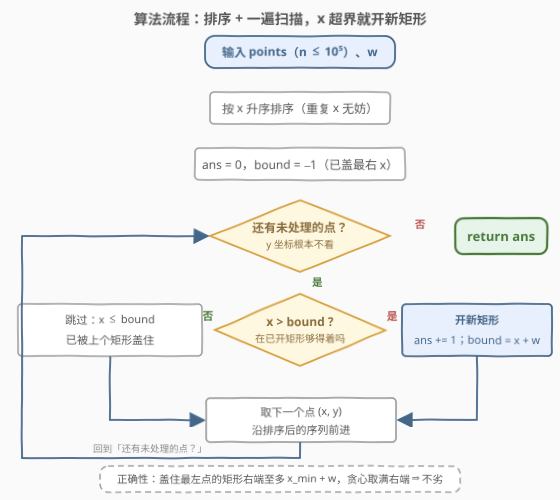
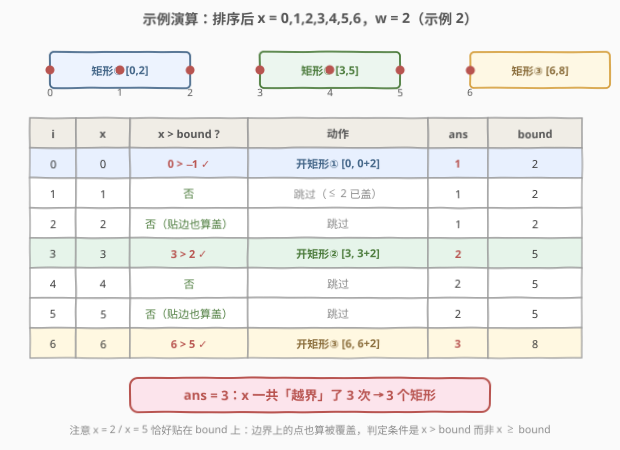

# 覆盖所有点的最少矩形数目

- **题目名称**：覆盖所有点的最少矩形数目
- **链接**：[3111. 覆盖所有点的最少矩形数目](https://leetcode.cn/problems/minimum-rectangles-to-cover-points/)
- **难度**：中等
- **标签**：贪心、数组、排序

## 1. 题目概述

给你一个二维整数数组 `point`，其中 `points[i] = [x_i, y_i]` 表示二维平面内的一个点。同时给你一个整数 `w`。你需要用矩形**覆盖所有**点。

每个矩形的左下角在某个点 `(x_1, 0)` 处，且右上角在某个点 `(x_2, y_2)` 处，其中 $x_1 \le x_2$ 且 $y_2 \ge 0$，同时对于每个矩形都**必须**满足 $x_2 - x_1 \le w$。

如果一个点在矩形内或者在边上，我们说这个点被矩形覆盖了。

请你在确保每个点都**至少**被一个矩形覆盖的前提下，**最少**需要多少个矩形。

> 注意：一个点可以被多个矩形覆盖。

**示例 1**：

```text
输入：points = [[2,1],[1,0],[1,4],[1,8],[3,5],[4,6]], w = 1
输出：2
解释：一个矩形的左下角在 (1, 0)，右上角在 (2, 8)；另一个矩形的左下角在 (3, 0)，右上角在 (4, 8)。
```

**示例 2**：

```text
输入：points = [[0,0],[1,1],[2,2],[3,3],[4,4],[5,5],[6,6]], w = 2
输出：3
解释：三个矩形的区间分别是 [0,2]、[3,5]、[6,6]。
```

**示例 3**：

```text
输入：points = [[2,3],[1,2]], w = 0
输出：2
解释：两个矩形分别退化为竖线段 [1,1] 与 [2,2]。
```

**约束条件**：

- $1 \le \text{points.length} \le 10^5$
- $\text{points[i].length} = 2$
- $0 \le x_i, y_i \le 10^9$
- $0 \le w \le 10^9$
- 所有点坐标 $(x_i, y_i)$ 互不相同

> 💡 读题关键：矩形的**左下角被钉死在 x 轴上**（$y = 0$），右上角的 $y_2$ 只要求非负、**没有上界**；唯一的宽度约束是 $x_2 - x_1 \le w$。这两条合起来意味着「高度是白送的，宽度才是稀缺资源」——整道题只围着 $x$ 坐标转。

---

## 2. 解题思路

### 2.1 暴力思路：枚举矩形组合

最朴素的想法是尝试所有可能的矩形放置方案，但左下角横坐标 $x_1$ 与右上角 $(x_2, y_2)$ 都是实平面上连续可取的，方案空间无穷大，无从枚举。退一步，先做两个「降维」观察：

1. $y_2 \ge 0$ 且无上界 ⇒ 把 $y_2$ 取得足够大（比如该矩形要盖的点中最大的 $y$），任何 $y \ge 0$ 的点都能盖住——**纵坐标彻底失去存在感**；
2. 一个矩形真正起作用的只有 $x$ 方向上的覆盖区间 $[x_1, x_2]$，且长度至多 $w$。

于是问题变成：给 $n$ 个 $x$ 坐标，用**最少数量的「长度 ≤ w 的区间」**盖住它们。即使如此，直接枚举「每个矩形的左端点放在哪个位置」依然是指数级的；$n \le 10^5$ 的规模要求一个 $O(n \log n)$ 级别的方案。

### 2.2 核心观察：一维化 + 贪心开区间



**第一步（降维）**：只保留每个点的 $x$ 坐标，问题重写为——

> 用最少数量的区间 $[x_1, x_1 + w]$（$x_1$ 任取）盖住所有 $x_i$。

**第二步（贪心）**：把 $x$ 升序排序后，从最左的未覆盖点 $x_0$ 入手：

- $x_0$ 必须被某个矩形盖住，而这个矩形的左端 $x_1 \le x_0$，右端 $x_2 \le x_1 + w \le x_0 + w$；
- 所以**任何**盖住 $x_0$ 的矩形，右端都不会超过 $x_0 + w$；
- 那不如直接把区间开成 $[x_0, x_0 + w]$——左端钉在 $x_0$ 上、右端顶到理论上限，盖住的后续点**只多不少**。

这就是经典的**交换论证**：设最优解中盖住 $x_0$ 的矩形区间为 $[x_1, x_2]$，由 $x_1 \le x_0 \le x_2$ 及 $x_2 - x_1 \le w$ 知 $x_2 \le x_0 + w$。把它的区间换成 $[x_0, x_0 + w]$：左端右移到 $x_0$——由于 $x_0$ 是**最左**未覆盖点，$x_0$ 左侧的点早已被更早的矩形盖住，甩掉它们无妨；右端变为 $x_0 + w \ge x_2$，盖住的点只多不少。替换后矩形数不变、可行性保持，而新的第一个矩形与贪心的选择完全一致——对余下未覆盖的点逐轮归纳，可得贪心解与最优解使用的矩形数相同。

> 💡 一句话：**最左的点反正要盖，盖它的矩形右端至多 $x_0 + w$，那就让右端顶满**。之后 $[x_0, x_0 + w]$ 内的所有点全部顺带解决，把问题严格变小，再对余下的点如法炮制。

实现上甚至不需要显式分组：排序后线性扫描，维护 `bound` = 当前矩形能盖到的最右 $x$；遇到 $x > \text{bound}$ 的点就「开新矩形」（`ans += 1`，`bound = x + w`），否则跳过。

### 2.3 算法流程：排序 + 一遍扫描



1. 将 `points` 按 $x$ 升序排序（重复的 $x$ 无需去重，见下方面试要点 3）；
2. 初始化 `ans = 0`，`bound = -1`（哨兵：保证第一个点必然开新矩形，因为 $x_i \ge 0 > -1$）；
3. 依次遍历每个点的 $x$：
   - 若 $x > \text{bound}$：开新矩形，`ans += 1`，`bound = x + w`；
   - 否则：该点已被当前矩形覆盖，跳过；
4. 遍历结束，`ans` 即答案。

### 2.4 示例演算



以示例 2 为例，排序后 $x = 0,1,2,3,4,5,6$，$w = 2$：

| i | x | 判定 $x > \text{bound}$? | 动作 | ans | bound |
|---|---|--------------------------|------|-----|-------|
| 0 | 0 | $0 > -1$ ✓ | 开矩形① $[0, 2]$ | 1 | 2 |
| 1 | 1 | 否 | 跳过 | 1 | 2 |
| 2 | 2 | 否（贴边也算盖） | 跳过 | 1 | 2 |
| 3 | 3 | $3 > 2$ ✓ | 开矩形② $[3, 5]$ | 2 | 5 |
| 4 | 4 | 否 | 跳过 | 2 | 5 |
| 5 | 5 | 否（贴边也算盖） | 跳过 | 2 | 5 |
| 6 | 6 | $6 > 5$ ✓ | 开矩形③ $[6, 8]$ | 3 | 8 |

7 个点只「越界」3 次，答案 **3**。两个细节值得咀嚼：$x = 2$ 与 $x = 5$ **恰好贴在 `bound` 上**——边界上的点也算被覆盖，所以判定条件是严格大于 $x > \text{bound}$；另外 $w = 0$ 时（示例 3）矩形退化为竖线段，每个不同 $x$ 各需一个矩形，同一套代码自然处理。

---

## 3. 参考代码

### C++（排序 + 线性扫描）

```cpp
class Solution {
  public:
    int minRectanglesToCoverPoints(vector<vector<int>>& points, int w) {
        sort(points.begin(), points.end());          // 按 x 升序（y 顺带，无所谓）
        int ans = 0;
        long long bound = -1;                        // 当前矩形能盖到的最右 x（含）
        for (const auto& p : points) {
            if (p[0] > bound) {                      // 够不着 → 开新矩形
                ++ans;
                bound = (long long)p[0] + w;         // 右端顶到理论上限 x + w
            }
        }
        return ans;
    }
};
```

### Python（同款扫描）

```python
class Solution:
    def minRectanglesToCoverPoints(self, points: List[List[int]], w: int) -> int:
        ans, bound = 0, -1
        for x, _ in sorted(points):   # 只取 x，y 直接丢弃
            if x > bound:
                ans += 1
                bound = x + w
        return ans
```

> 💡 **溢出提醒（C++）**：$x + w$ 最大 $2 \times 10^9$，虽然恰好低于 `int` 上限 $2147483647$，但已贴在悬崖边上；用 `long long` 存 `bound` 是更稳的写法（Python 无此顾虑）。`bound` 初始化为 $-1$ 是哨兵：坐标非负，保证第一个点必定开新矩形，省掉「第一个点特判」。

---

## 4. 复杂度分析

| 维度 | 复杂度 | 说明 |
|------|--------|------|
| 时间复杂度 | $O(n \log n)$ | 瓶颈在排序；扫描部分每个点 $O(1)$ 判定一次 |
| 空间复杂度 | $O(1)$ | 仅 `ans` / `bound` 两个滚动变量（不计排序的栈/临时空间） |

> 💡 $n \le 10^5$ 下排序约 $17$ 次比较/元素，绰绰有余。若题目给的是「$x$ 坐标已排序」或 $x$ 值域很小，可省去排序做到 $O(n)$，但本题无此福利。

---

## 5. 扩展：区间调度贪心一族

本题是「**点固定、区间动**」的最少覆盖问题，它与一整族经典贪心互为镜像：

| 题目 | 谁固定 | 谁动 | 贪心策略 |
|------|--------|------|----------|
| 3111（本题） | 点 | 长度 ≤ w 的区间 | 从最左点开区间，右端顶满 |
| 435 无重叠区间 | — | 区间（删最少） | 按右端点升序保留 |
| 452 射气球 | 气球（区间） | 箭（点） | 排序后从最左区间的右端点射 |
| 1326 灌溉花园 | 花园（线段） | 水龙头（各自区间） | 站在当前最远到达处，选延伸最远的龙头 |

四道题共享同一个骨架：**按左端点排序后，总盯着「最紧迫的未解决目标」（最左未盖的点 / 最先结束的区间），用当前决策把它一劳永逸地解决掉**。另一个方向的变化是 1024 视频拼接：区间长度不再统一，贪心变成「覆盖当前起点的区间中，右端延伸最远者」——从「顶满宽度」升级为「挑最长手臂」。掌握这一族，面试遇到任何区间/覆盖类贪心都能对号入座。

---

## 6. 面试要点

1. **为什么 y 坐标可以完全忽略？**

   - 矩形左下角钉在 $(x_1, 0)$、右上角 $y_2 \ge 0$ 无上界：对任何 $y \ge 0$ 的点，只要把 $y_2$ 取到不小于它的最大 $y$（或干脆取 $10^9$），就必然盖住。约束里没有任何限制纵坐标的条款，所以覆盖判定完全由 $x \in [x_1, x_2]$ 决定。

2. **贪心为什么是最优的？怎么证明？**

   - 交换论证：最优解中盖住最左未覆盖点 $x_0$ 的矩形，右端至多 $x_0 + w$（因左端 $\le x_0$ 且宽 $\le w$）。把它的区间换成 $[x_0, x_0 + w]$，右端不减、左端不越过 $x_0$，被盖住的点集合不缩小，矩形数不增。归纳可得贪心解 = 最优解。

3. **重复的 x 需要先去重吗？**

   - 不需要。排序后相同的 $x$ 必然连续出现：第一次出现时 `bound ≥ x` 已成立，后续重复的 $x$ 都满足 $x \le \text{bound}$，自动走「跳过」分支，不会多开矩形。去重只是省几次比较，不改变答案。

4. **`bound` 为什么初始化为 −1？判定为什么是严格大于？**

   - 坐标非负，$-1$ 作为哨兵保证第一个点必然触发开新矩形，避免特判。「点在边上也算覆盖」，$x = \text{bound}$ 的点已被盖住，故判定用 $x > \text{bound}$；写成 $\ge$ 会在贴边情形（示例 2 的 $x=2$、$x=5$）多开矩形。

5. **和 452 用最少数量的箭引爆气球是什么关系？**

   - 对偶关系：452 是「区间固定、用点去扎」，贪心是按右端点排序、在**最紧迫区间的右端点**射箭；本题是「点固定、用区间去盖」，贪心是取**最左点的 $x + w$** 作区间右端。一个把点放在区间的最右，一个把区间的右端顶到最远——「优先解决最紧迫目标」的同一枚硬币两面。

---

## 7. 同类练习题

- [452. 用最少数量的箭引爆气球](https://leetcode.cn/problems/minimum-number-of-arrows-to-burst-balloons/)：对偶版——区间固定、点动，按右端点贪心射箭
- [435. 无重叠区间](https://leetcode.cn/problems/non-overlapping-intervals/)：按右端点保留最多不重叠区间的调度贪心（本仓库已有题解）
- [1326. 灌溉花园的最少水龙头数目](https://leetcode.cn/problems/minimum-number-of-taps-to-open-to-water-a-garden/)：区间长度不统一的最少覆盖，跳到「延伸最远」处
- [1024. 视频拼接](https://leetcode.cn/problems/video-stitching/)：覆盖型贪心进阶——每次选覆盖当前起点的最长手臂
- [56. 合并区间](https://leetcode.cn/problems/merge-intervals/)：排序 + 区间处理的入门母题（本仓库已有题解）
