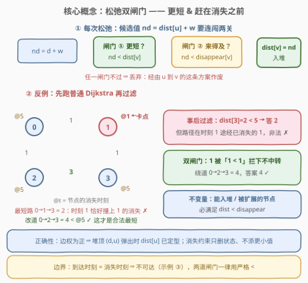
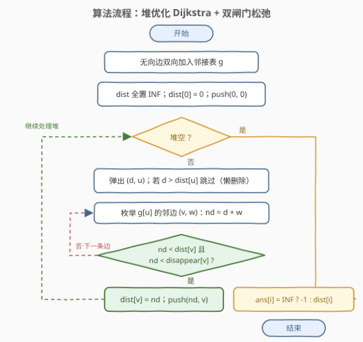
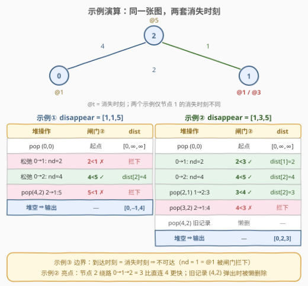

# LeetCode 访问消失节点的最少时间 题解

## 1. 题目概述

- **标题 / 题号**：访问消失节点的最少时间（#3112，medium）
- **链接**：https://leetcode.cn/problems/minimum-time-to-visit-disappearing-nodes/
- **难度**：中等
- **标签**：图、最短路、堆（优先队列）、数组

**题意**：给你一个 $n$ 个节点的**带权无向图**，`edges[i] = [u_i, v_i, length_i]` 表示 $u_i$ 与 $v_i$ 之间有一条需要 $length_i$ 单位时间通过的**无向边**。

同时给你数组 `disappear`，`disappear[i]` 表示节点 $i$ 从图中**消失的时刻**——**那一刻及以后**，你无法再访问这个节点。

请返回数组 `answer`，`answer[i]` 表示从节点 $0$ 出发到达节点 $i$ 需要的**最少**单位时间；若无法在节点 $i$ 消失前到达，则 `answer[i] = -1`。

**注意**：图可能一开始就不连通；两个节点之间也可能有多条边。

**示例 1**：

```text
输入：n = 3, edges = [[0,1,2],[1,2,1],[0,2,4]], disappear = [1,1,5]
输出：[0,-1,4]
解释：节点 0 是起点，answer[0] = 0；到节点 1 最少需 2 单位时间（0→1），
      但到达时它已消失（2 ≥ 1），answer[1] = -1；到节点 2 走直边 0→2 需 4
      单位时间，4 < 5 来得及，answer[2] = 4。
```

**示例 2**：

```text
输入：n = 3, edges = [[0,1,2],[1,2,1],[0,2,4]], disappear = [1,3,5]
输出：[0,2,3]
解释：节点 1 走 0→1 需 2 单位时间，2 < 3 来得及；节点 2 走 0→1→2 共 3
      单位时间（比直连 0→2 的 4 更快），3 < 5 来得及。
```

**示例 3**：

```text
输入：n = 2, edges = [[0,1,1]], disappear = [1,1]
输出：[0,-1]
解释：到达节点 1 的时刻恰好是 1，与它的消失时刻相等——那一刻已无法访问，
      故 answer[1] = -1。
```

**约束**：

- $1 \le n \le 5 \times 10^4$
- $0 \le \text{edges.length} \le 10^5$
- $0 \le u_i, v_i \le n - 1$
- $1 \le length_i \le 10^5$
- $disappear.length = n$
- $1 \le disappear[i] \le 10^5$

> ⚠️ 两个易漏点：一是「那一刻及以后无法访问」意味着到达时刻必须**严格小于** $disappear[i]$，恰好等于也算不可达（示例 3）；二是消失的是**节点**而不是边——**中途经过的节点同样受消失约束**，这一点决定了不能「先跑普通最短路再事后过滤」（见 2.2 的反例）。

## 2. 解题思路

### 2.1 暴力思路

两条暴力路都走不通：

- **枚举所有路径**：从节点 0 出发 DFS 所有简单路径，逐条检查「沿途每个节点的到达时刻都严格早于其消失时刻」，取合法路径的最小时间——路径数是指数级的。
- **逐时刻模拟**：把状态定为「(节点， 时刻)」在时间轴上做 BFS——时刻上限 $10^5$、节点 $5 \times 10^4$，状态空间达 $5 \times 10^9$；而且我们只关心每个节点的**最早**到达时刻，中间时刻的状态全是冗余。

本题求的是「最早到达时间」，属于**最短路**家族。朴素 $O(n^2)$ Dijkstra 在 $n = 5 \times 10^4$ 下约 $2.5 \times 10^9$ 次操作也会超时，需要**堆优化**。但本题真正的考点不是堆，而是**消失约束应该加在哪一步**。

### 2.2 核心观察：堆优化 Dijkstra + 松弛双闸门



**观察 1（等待无益，越早越好）**：每条边在任何时刻都可通行（没有「开放时间」），在节点上多等一秒只会让沿途所有到达时刻整体推迟，不会带来任何收益。因此「节点 $v$ 是否可达」只取决于从 0 到 $v$ 的**最早到达时间**：最早时间 $< disappear[v]$ 则可达，否则任何走法都来不及。

**观察 2（中途节点也会消失——不能事后过滤）**：最本能的写法是「先跑一遍普通 Dijkstra，再把 $dist[i] \ge disappear[i]$ 的改成 $-1$」。**这是错的**：从 0 到 $v$ 的最短路可能途经一个**中途就已消失**的节点 $w$——沿这条最短路走到 $w$ 的时刻可能已经 $\ge disappear[w]$，这条路根本走不通；而一条更长的绕路（避开 $w$）反而可能合法。看图中的反例：

```text
edges = [[0,1,1],[1,3,1],[0,2,1],[2,3,3]], disappear = [5,1,5,5]
```

普通 Dijkstra 得 $dist[3] = 2$（0→1→3），$2 < 5$，事后过滤判定「可达且为 2」；但这条路要在时刻 1 恰好经过节点 1，而节点 1 在时刻 1 已消失，非法。真实答案是绕道 0→2→3 的 $4$。

**观察 3（双闸门松弛，剪在入堆之前）**：正确做法是把消失检查**前移到松弛的瞬间**。对候选值 $nd = dist[u] + w$，要求它同时通过两道闸门：

$$nd < dist[v] \quad \text{且} \quad nd < disappear[v]$$

- 闸门 ①（更短）：$nd < dist[v]$，Dijkstra 的常规条件；
- 闸门 ②（来得及）：$nd < disappear[v]$，本题新增。

两道闸门都通过，才更新 $dist[v] = nd$ 并入堆。于是**不变量**成立：`dist` 数组里被写入的每个值、堆里被弹出扩展的每个节点，都满足「在消失前到达」。已消失的节点永远不会成为中转站，观察 2 的污染从根源上被杜绝。被闸门拦下的候选值也无需惋惜：经由 $u$ 到 $v$ 的其他方案时刻只会更晚（边权为正），必然同样被拦。

**观察 4（贪心定型依然成立）**：所有边权为正，堆顶 $(d, u)$ 弹出时，任何尚未生成的候选值都要再经过至少一条正权边、必然 $> d$，所以 $dist[u]$ 不可能再变小——$u$ 就此定型。消失约束只是从状态空间里**删掉**了部分候选值，从不产生新的更小值，Dijkstra 贪心正确性的证明原封不动。

> 💡 一句话：**消失约束不是「事后打分」，而是「入堆资格」**——赶不上消失的候选值，在松弛那一刻就该被扔掉。

### 2.3 算法流程图



整体流程：

1. 建邻接表：无向边**双向**加入（重边、自环天然兼容）；
2. 初始化：`dist` 全置 `INF`，`dist[0] = 0`（$disappear[0] \ge 1 > 0$，起点恒可达），小根堆压入 `(0, 0)`；
3. 循环：弹出堆顶 `(d, u)`，若 `d > dist[u]` 说明是过期记录，跳过（懒删除）；否则枚举 `u` 的邻边 `(v, w)`，算出 `nd = d + w`，过**双闸门**后更新 `dist[v]` 并入堆；
4. 收集答案：`dist[i]` 仍为 `INF` 则输出 $-1$，否则输出 `dist[i]`。

### 2.4 示例演算



示例 1 与示例 2 用的是**同一张图**，仅节点 1 的消失时刻不同（@1 vs @3），演算表见上图。三个看点：

- **示例 ①**：直边 0→1 的候选值 $nd = 2$ 被「$2 < 1$」拦下，节点 1 从未入堆，最终 $-1$；节点 2 走直边 $4 < 5$ 合法。
- **示例 ②**：节点 2 先由直边记下 $dist[2] = 4$，随后被绕路 0→1→2 的 $3$ 覆盖——**绕路反而更快**；过期的堆记录 $(4, 2)$ 后来弹出时被懒删除跳过。
- **示例 ③**：$nd = 1 = disappear[1]$，**恰好相等也被拦下**——两道闸门一律用严格小于。

## 3. 参考代码

### C++

```cpp
class Solution {
  public:
    vector<int> minimumTime(int n, vector<vector<int>>& edges, vector<int>& disappear) {
        vector<vector<pair<int, int>>> g(n);
        for (auto& e : edges) {              // 无向边双向入表，重边/自环天然兼容
            g[e[0]].push_back({e[1], e[2]});
            g[e[1]].push_back({e[0], e[2]});
        }

        const int INF = INT_MAX;
        vector<int> dist(n, INF);
        priority_queue<pair<int, int>, vector<pair<int, int>>, greater<>> pq;
        dist[0] = 0;                          // disappear[0] >= 1 > 0，起点恒可达
        pq.push({0, 0});

        while (!pq.empty()) {
            auto [d, u] = pq.top();
            pq.pop();
            if (d > dist[u]) continue;        // 懒删除：过期记录
            for (auto [v, w] : g[u]) {
                int nd = d + w;               // 入堆的 d < 1e5，w <= 1e5，不会溢出
                if (nd < dist[v] && nd < disappear[v]) {   // 双闸门
                    dist[v] = nd;
                    pq.push({nd, v});
                }
            }
        }

        vector<int> ans(n);
        for (int i = 0; i < n; i++) ans[i] = dist[i] == INF ? -1 : dist[i];
        return ans;
    }
};
```

### Python

```python
class Solution:
    def minimumTime(self, n: int, edges: List[List[int]], disappear: List[int]) -> List[int]:
        g = [[] for _ in range(n)]
        for u, v, w in edges:                 # 无向边双向入表
            g[u].append((v, w))
            g[v].append((u, w))

        INF = float('inf')
        dist = [INF] * n
        dist[0] = 0                           # disappear[0] >= 1 > 0，起点恒可达
        pq = [(0, 0)]                         # 小根堆：(到达时刻, 节点)

        while pq:
            d, u = heapq.heappop(pq)
            if d > dist[u]:                   # 懒删除：过期记录
                continue
            for v, w in g[u]:
                nd = d + w
                if nd < dist[v] and nd < disappear[v]:   # 双闸门
                    dist[v] = nd
                    heapq.heappush(pq, (nd, v))

        return [d if d != INF else -1 for d in dist]
```

> 💡 实现细节：起点无需特判消失（$disappear[0] \ge 1 > 0$ 恒合法）；`int` 溢出无需担心——能入堆的 $d$ 都满足 $d < disappear \le 10^5$，故 $nd = d + w < 2 \times 10^5$；懒删除保证每个节点最多被有效扩展一次，堆里允许存在过期副本。

## 4. 复杂度分析

| 维度 | 复杂度 | 说明 |
|------|--------|------|
| 时间复杂度 | $O((n + m) \log n)$ | 每条无向边存为两条有向弧，每条弧至多在其尾节点定型时被松弛一次，松弛成功才入堆；堆操作 $O(\log n)$，$n \le 5 \times 10^4$、$m \le 10^5$ |
| 空间复杂度 | $O(n + m)$ | 邻接表 $O(n + m)$、`dist` 数组 $O(n)$、堆中至多 $O(m)$ 个记录 |

## 5. 扩展：几个变体讨论

**如果允许「在节点上等待」**：依然无益。边随时可通行，等待只会推迟后续所有到达时刻，最优策略仍是立刻沿最短路出发；本题的解法原样适用。

**如果边权可以为 0**：Dijkstra 依然正确——贪心定型只依赖**非负**权（0 权边不破坏「堆顶即最短」），双闸门判断不受影响。

**如果边权可以为负**：贪心定型失效（更晚出发经负边可能更早到达），必须换 Bellman-Ford/SPFA；且「绕路更优」会让等待策略变得有意义，问题的性质彻底改变。

**如果 `disappear` 会被在线修改、多次询问**：每次修改后重跑一遍 $O((n+m)\log n)$ 是基线；更进一步可按消失时刻离线（时间分片/线段树分治），把每次询问的图版本固化后批量跑最短路。

## 6. 面试要点

1. **为什么不能先跑普通 Dijkstra、再事后把 `dist[i] >= disappear[i]` 改成 -1？**

   - 因为**中途节点也会消失**：到 $v$ 的最短路可能途经一个「到达时刻 $\ge$ 消失时刻」的中转点，这条路实际走不通；事后过滤会把它误判为可达，而真正的答案可能是绕开该中转点的更长路径（见 2.2 反例：正确答案 4 被误判为 2）。

2. **松弛时的两个条件分别防什么？只保留「来得及」一个行不行？**

   - $nd < dist[v]$ 保证每次覆盖严格变小，是 Dijkstra 的常规剪枝，防止过期/次优状态反复入堆；$nd < disappear[v]$ 保证合法。若去掉前者，`dist[v]` 可能被更晚的合法值反复覆盖，不仅复杂度退化，最终答案还可能不是最小值——两个条件缺一不可。

3. **到达时刻恰好等于消失时刻算不算到达？**

   - 不算。题面说「那一刻及以后无法访问」，所以判定必须用**严格小于**；示例 3（$nd = 1 = disappear[1]$ 返回 $-1$）就是专门考这个边界。

4. **Dijkstra 的贪心定型为什么在「会消失的图」上依然成立？懒删除是什么？**

   - 边权为正：堆顶 $(d, u)$ 弹出时，一切尚未生成的候选值都要再过至少一条正权边、必然更大，故 $dist[u]$ 定型；消失约束只删候选、不添更小值。懒删除指堆里允许残留过期记录，弹出时用 `d > dist[u]` 识别并跳过，省去堆的删除操作。

5. **重边、自环、不连通、起点本身这些边界怎么处理？**

   - 邻接表天然兼容重边与自环（自环的 $nd = d + w > d$ 永远过不了闸门 ①）；不连通的节点 `dist` 保持 `INF`，输出时统一转 $-1$；起点由约束 $disappear[0] \ge 1 > 0$ 恒可达，`answer[0] = 0` 无需特判。

## 同类练习题

| # | 题目 | 与本题的关联 |
|---|------|-------------|
| 743 | [网络延迟时间](https://leetcode.cn/problems/network-delay-time/)（[题解](../0701-0800/743_网络延迟时间.md)） | 堆优化 Dijkstra 母题，本题去掉截止时间后的纯净版 |
| 787 | [K 站中转内最便宜的航班](https://leetcode.cn/problems/cheapest-flights-within-k-stops/)（[题解](../0701-0800/787_K站中转内最便宜的航班.md)） | 同样是「松弛时附加约束」的最短路，与本题双闸门同构 |
| 1334 | [阈值距离内邻居最少的城市](https://leetcode.cn/problems/find-the-city-with-the-smallest-number-of-neighbors-at-a-threshold-distance/) | Dijkstra 求全源最短路后按距离阈值过滤的变体 |
| 1976 | [到达目的地的方案数](https://leetcode.cn/problems/number-of-ways-to-arrive-at-destination/) | 在 Dijkstra 定型的基础上叠加路径计数 |
| 2045 | [到达目的地的第二短时间](https://leetcode.cn/problems/second-minimum-time-to-reach-destination/) | 时间维度上的最短路变体，求严格大于最短的次短路 |
