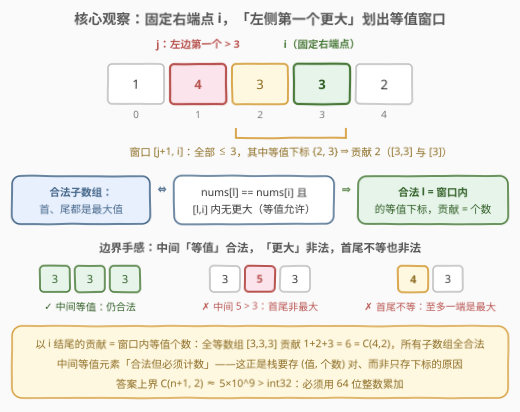
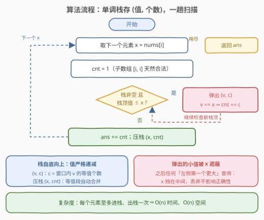
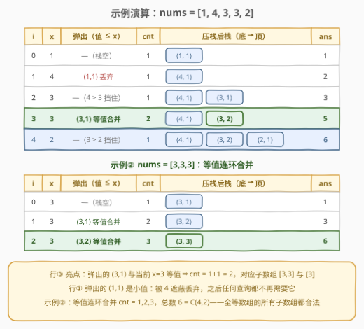

# LeetCode 边界元素是最大值的子数组数目 题解

## 1. 题目概述

- **标题 / 题号**：边界元素是最大值的子数组数目（#3113，hard）
- **链接**：https://leetcode.cn/problems/find-the-number-of-subarrays-where-boundary-elements-are-maximum/
- **难度**：困难
- **标签**：栈、数组、单调栈、二分查找

**题意**：给你一个**正**整数数组 `nums`。

请你求出 `nums` 中有多少个**子数组**，满足子数组中**第一个**和**最后一个**元素都是这个子数组中的**最大**值。

**示例 1**：

```text
输入：nums = [1,4,3,3,2]
输出：6
解释：6 个满足条件的子数组：
      [1]（max=1）、[4]（max=4）、[3]（max=3，下标 2）、[3]（max=3，下标 3）、
      [2]（max=2）、[3,3]（max=3，下标 2~3）。
```

**示例 2**：

```text
输入：nums = [3,3,3]
输出：6
解释：全部 6 个子数组都满足——首尾都是 3，也确实是各自区间的最大值。
```

**示例 3**：

```text
输入：nums = [1]
输出：1
```

**约束**：

- $1 \le \text{nums.length} \le 10^5$
- $1 \le \text{nums}[i] \le 10^9$

> ⚠️ 两个易漏点：一是中间元素**等于**最大值时子数组仍然合法（如 $[3,3,3]$ 整体），所以「断窗」的判定必须用**严格大于**；二是答案上界是 $\binom{n+1}{2} \approx 5 \times 10^9$，超过 `int32` 范围，必须用 64 位整数累加。

## 2. 解题思路

### 2.1 暴力思路

枚举所有子数组 $[l, r]$（$O(n^2)$ 对），对每对维护区间最大值判断「首 = 尾 = max」——即便用增量维护把单次判断降到 $O(1)$，总复杂度仍是 $O(n^2)$，$n = 10^5$ 时约 $10^{10}$ 次操作，必然超时。

瓶颈在于「成对枚举首尾」。突破口是把子数组**按右端点归类**：对每个固定的右端点 $i$，一次性求出「以 $i$ 结尾的合法子数组个数」，再对全体 $i$ 求和。

### 2.2 核心观察：左边第一个更大元素划出「等值窗口」



**第一步：条件转化。**「首、尾都是最大值」等价于什么？最大值唯一地由数值确定，若首尾都是最大值，则首尾必须**相等**且等于区间最大值：

$$\text{合法}[l, i] \iff \text{nums}[l] = \text{nums}[i] \;\text{且}\; [l,i]\ \text{内没有元素} > \text{nums}[i]$$

注意**等号是允许的**：$[3,3,3]$ 里中间的 3 也是最大值，但首尾仍然是最大值，合法。真正非法的是中间出现**严格更大**的元素（如 $[3,5,3]$），以及首尾不相等（如 $[4,3]$，至多一端是最大值）。

**第二步：固定右端点。** 设 $j$ 为 $i$ 左侧**第一个**满足 $\text{nums}[j] > \text{nums}[i]$ 的下标（不存在则 $j = -1$）。则：

$$\text{以 } i \text{ 结尾的合法子数组} = \{\, [k, i] : k \in [j+1,\, i] \ \text{且}\ \text{nums}[k] = \text{nums}[i] \,\}$$

两个方向都成立：

- 若 $k$ 在窗口内且等值：$[k, i]$ 中所有元素都 $\le \text{nums}[i]$（$j$ 是左侧第一个更大的），故最大值就是 $\text{nums}[i] = \text{nums}[k]$，首尾都是最大值 ✓
- 反之若 $[l, i]$ 合法：区间内无元素 $> \text{nums}[i]$，说明这样的元素都在 $l$ 左边，即 $l > j$；又需 $\text{nums}[l] = \text{nums}[i]$ ✓

于是答案 $= \sum_i f(i)$，其中 $f(i)$ = 窗口 $[j+1, i]$ 内**等值下标的个数**。

**第三步：(值, 个数) 单调栈。** 窗口边界 $j$ 是经典的「左侧第一个更大」——单调栈在弹栈时天然给出。难点是等值计数：中间的等值元素既不能断窗、又必须被数进来，而且等值下标**不必连续**（如 $[1,5,3,1,3]$ 中下标 2 与 4 的两个 3 之间隔着 1，仍属同一窗口）。让栈元素从「下标」升级为「(值 $v$, 个数 $c$)」即可一并解决：

- 栈自底向上**值严格递减**，每项 $(v, c)$ 表示「到目前为止未被更大元素遮蔽的 $v$ 的出现次数」；
- 扫描到 $x = \text{nums}[i]$ 时，弹出所有值 $\le x$ 的栈顶：值 $< x$ 的直接丢弃（被 $x$ 遮蔽），值 $= x$ 的把个数**合并**进 `cnt`；
- 合并完成后 `cnt` 恰好等于 $f(i)$——栈中值为 $x$ 的项（严格递减保证至多一项）恰好覆盖窗口内所有等值下标：窗口外的等值下标早已被某个 $> x$ 的元素「遮蔽弹掉」了。

> 💡 一句话：**严格递减栈找「左边第一个更大」划窗口，(值, 个数) 对把窗口内的等值下标一段段攒起来，弹到等值就合并、弹到更大就停**。

### 2.3 算法流程图



整体流程：

1. 空栈开始，`ans = 0`；
2. 对每个 $x = \text{nums}[i]$：`cnt = 1`（子数组 $[i,i]$ 天然合法，自己等于自己）；
3. 弹出所有值 $\le x$ 的栈顶，等值项的个数累加进 `cnt`；
4. `ans += cnt`，压栈 $(x, \text{cnt})$；
5. 扫描结束返回 `ans`。

被弹出的小值无需惋惜：它们已被 $x$ 遮蔽，之后任何位置的「左侧第一个更大」查询，要么命中 $x$、要么命中更左边的更大元素，与被丢弃者无关——这正是单调栈 $O(n)$ 的摊还来源。

### 2.4 示例演算



以示例 1 `nums = [1,4,3,3,2]` 为例逐行演算（见上图主表）：

- **行 ①**：$x=4$ 弹出 $(1,1)$，$1 < 4$ 是小值直接丢弃——下标 0 的 1 被永久遮蔽；
- **行 ③**：$x=3$ 弹出 $(3,1)$，**等值合并**得 `cnt = 2`，对应子数组 $[3,3]$（下标 2~3）与 $[3]$（下标 3），这是本题最关键的一步；
- **行 ④**：$x=2$ 时栈顶 $(3,2)$ 的 $3 > 2$ 挡住，不弹，窗口只有自己。

示例 2 `[3,3,3]` 则是等值连环合并：`cnt` 依次为 $1, 2, 3$，总数 $6 = \binom{4}{2}$——全等数组的**所有**子数组都合法，这也印证了答案必须用 64 位整数。

## 3. 参考代码

### C++

```cpp
class Solution {
  public:
    long long numberOfSubarrays(vector<int>& nums) {
        long long ans = 0;
        vector<pair<int, long long>> st;      // (值, 未被遮蔽的等值个数)，自底向上严格递减
        for (int x : nums) {
            long long cnt = 1;                // 子数组 [i, i] 天然合法
            while (!st.empty() && st.back().first <= x) {
                if (st.back().first == x) {
                    cnt += st.back().second;  // 等值合并：窗口内的等值下标攒起来
                }
                st.pop_back();                // 小值被 x 遮蔽，直接丢弃
            }
            ans += cnt;                       // cnt = 以 i 结尾的合法子数组数
            st.emplace_back(x, cnt);
        }
        return ans;
    }
};
```

### Python

```python
class Solution:
    def numberOfSubarrays(self, nums: List[int]) -> int:
        st = []                               # (值, 个数)，自底向上严格递减
        ans = 0
        for x in nums:
            cnt = 1                           # 子数组 [i, i] 天然合法
            while st and st[-1][0] <= x:
                if st[-1][0] == x:
                    cnt += st[-1][1]          # 等值合并
                st.pop()                      # 小值被 x 遮蔽，直接丢弃
            ans += cnt
            st.append((x, cnt))
        return ans
```

> 💡 实现细节：弹栈条件是 `<=` 而非 `<`——等值项必须弹出并合并，否则栈不再严格递减，「左侧第一个更大」的查询会错位；个数字段用 `long long`，单个值的等值段长度可达 $n$。

## 4. 复杂度分析

| 维度 | 复杂度 | 说明 |
|------|--------|------|
| 时间复杂度 | $O(n)$ | 每个元素恰好进栈一次、至多出栈一次，弹栈总代价摊还 $O(n)$；一趟扫描无回溯 |
| 空间复杂度 | $O(n)$ | 栈深度上界 $n$（严格递减序列，如 $[5,4,3,2,1]$ 全部驻留栈中） |

## 5. 扩展：两种同源解法

**二分解法（对应标签 Binary Search）**：先用一趟单调栈预处理 $\text{leftGreater}[i]$（左侧第一个更大下标），同时为每个值维护**有序下标表** `pos[v]`；则 $f(i)$ = `pos[nums[i]]` 中落在 $[\text{leftGreater}[i]+1,\ i]$ 内的下标个数，二分即可。时间 $O(n \log n)$、空间 $O(n)$。它与栈解法计算的是同一个量，只是把「等值计数」从栈上挪到了值域索引上。

**等值分组视角（DSU 可解）**：把「窗口内无更大元素」换成整体表述——对每个值 $x$，用所有 $> x$ 的元素把数组切段，切出的每段里值为 $x$ 的下标构成一个**等值组**，组内**任意**两个下标 $(k, i)$ 都合法（中间只有等值与更小元素）。设组大小为 $m$，则该组贡献 $\binom{m}{2} + m = \binom{m+1}{2}$，答案为所有组贡献之和。核对示例 1：$x=3$ 的组 $\{2,3\}$ 贡献 $\binom{3}{2}=3$，四个单元素组各贡献 1，合计 6 ✓。按值从大到小激活位置、用并查集合并只被更小值隔开的相邻等值段，即可离线求出所有组大小——这也是官方 hint 提到 DSU 的原因。栈解法中每个 $(x, \text{cnt})$ 合并项正是这样一个组的「前缀」：组内第 $k$ 个成员贡献 $k$，求和恰为 $\binom{m+1}{2}$。

## 6. 面试要点

1. **「首尾都是最大值」为什么能转化为「首尾相等 + 中间无更大」？等号为什么允许？**

   - 最大值由数值定义：首尾都是最大值 ⟺ 首尾相等且都等于区间最大值 ⟺ 首尾相等且区间内没有严格更大的元素。中间等值元素（如 $[3,3,3]$ 的中间 3）同样是最大值，但**不违反**「首尾也是最大值」，所以断窗判定必须严格大于；若误用 $\ge$，等值段会被错误切断，$[3,3,3]$ 这类用例直接算错。

2. **栈里为什么存 (值, 个数) 对，而不是像 739/84 那样只存下标？**

   - 本题要对每个右端点统计窗口内**等值下标的个数**，而等值下标可以不连续（中间夹着更小元素）；只存下标无法在弹栈时把散落的等值一并数出。把「个数」并入栈项后，等值段在弹栈合并时自然累加，摊还 $O(1)$ 完成计数。

3. **弹掉的元素以后还会被用到吗？会不会漏算？**

   - 不会。弹出的小值 $v < x$ 已被 $x$ 遮蔽：对之后任何位置，其「左侧第一个更大」要么是 $x$（若查询值 $< x$），要么是 $x$ 左边的更大元素（若查询值 $\ge x$），被丢弃者永远排不上。等值项则没有被丢弃，而是合并进了新栈项——计数信息无损。

4. **答案为什么必须用 64 位整数？**

   - 全等数组（如 $10^5$ 个 1）的所有 $\binom{n+1}{2} \approx 5 \times 10^9$ 个子数组都合法，超过 `int32` 上限 $2.1 \times 10^9$；C++ 返回值与累加器都要用 `long long`（Python 天然大整数无此问题）。

5. **本题与 901 股票价格跨度、84 柱状图最大矩形的单调栈有何异同？**

   - 三者都在维护「左侧第一个更大/更小」的序关系：84 弹栈时用「左右第一个更小」夹出宽度，901 弹栈时把跨度**累加**到新栈项，本题则把**等值个数**累加到新栈项——后两者的「合并计数」思想完全同源，本题只是把合并的对象从跨度换成了等值频次，并叠加了「严格递减保证至多一个等值项」这一额外性质。

## 同类练习题

| # | 题目 | 与本题的关联 |
|---|------|-------------|
| 739 | [每日温度](https://leetcode.cn/problems/daily-temperatures/)（[题解](../0701-0800/739_每日温度.md)） | 单调栈找「右侧第一个更大」的母题，先掌握裸套路再回来做本题 |
| 901 | [股票价格跨度](https://leetcode.cn/problems/online-stock-span/)（[题解](../0901-1000/901_股票价格跨度.md)） | 弹栈时把跨度累并进新栈项——与本题「等值个数合并」思想同源 |
| 84 | [柱状图中最大的矩形](https://leetcode.cn/problems/largest-rectangle-in-histogram/)（[题解](../0001-0100/84_柱状图中最大的矩形.md)） | 单调栈 + 两侧第一个更小夹宽度的经典hard |
| 1856 | [子数组最小乘积的最大值](https://leetcode.cn/problems/maximum-subarray-min-product/)（[题解](../1801-1900/1856_子数组最小乘积的最大值.md)） | 单调栈确定「元素作为最值」的管辖区间，贡献法计数 |
| 2104 | [子数组范围和](https://leetcode.cn/problems/sum-of-subarray-ranges/) | 单调栈统计每个元素作为区间最大/最小值的子数组个数，贡献法求和 |
