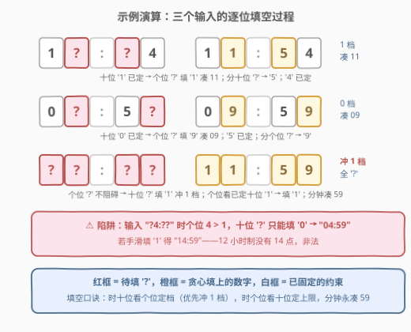

# 替换字符可以得到的最晚时间

- **题目名称**：替换字符可以得到的最晚时间
- **链接**：[3114. 替换字符可以得到的最晚时间](https://leetcode.cn/problems/latest-time-you-can-obtain-after-replacing-characters/)
- **难度**：简单
- **标签**：字符串，枚举

## 1. 题目概述

给你一个字符串 `s`，表示一个 **12 小时制** 的时间格式 `"HH:MM"`，其中一些数字（可能没有）被 `"?"` 替换。`HH` 的取值范围为 `00` 至 `11`，`MM` 的取值范围为 `00` 至 `59`。

你需要将 `s` 中的**所有** `"?"` 字符替换为数字，使得结果字符串代表的时间是一个**有效**的 12 小时制时间，并且是可能的**最晚**时间。返回结果字符串。

**示例 1**：

```text
输入：s = "1?:?4"
输出："11:54"
解释：通过替换 "?" 字符，可以得到的最新 12 小时制时间是 "11:54"。
```

**示例 2**：

```text
输入：s = "0?:5?"
输出："09:59"
解释：通过替换 "?" 字符，可以得到的最新 12 小时制时间是 "09:59"。
```

**约束条件**：

- $s.length = 5$
- $s[2]$ 是字符 `":"`
- 除 $s[2]$ 外，其他字符都是数字或 `"?"`
- 输入保证在替换 `"?"` 字符后至少存在一个介于 `"00:00"` 和 `"11:59"` 之间的时间

> 💡 读题关键：全场只有 **5 个字符、4 个可变位**，合法时刻一共 $12 \times 60 = 720$ 个——值域小到可以**全量枚举**（官方 hint 也是这个方向）。同时 `"HH:MM"` 是**定长零填充**格式且 `":"` 固定在第 3 位，所以**字典序最大 ⇔ 时间最晚**，这为「从高位到低位逐位贪心」铺平了道路。注意是 12 小时制：小时上界是 `11` 而不是 `23`（个位 $\ge 2$ 时十位必须为 `0`），这是本题唯一的陷阱。

---

## 2. 解题思路

### 2.1 暴力思路：从 11:59 倒序枚举 720 个时刻

把候选答案想成一张「全量时刻表」：合法时刻只有 $12 \times 60 = 720$ 个。从最晚的 `11:59` 开始**倒序**枚举，每个时刻格式化成 `"HH:MM"` 后与 `s` 逐位比对——`"?"` 视为**通配符**（匹配任何数字），其它字符必须相等。第一个匹配的时刻即为答案，立刻返回。

- **正确性显然**：枚举顺序就是「从最晚到最早」，先命中的必然是合法解里最晚的那个；
- **复杂度** $O(720 \times 5)$，对单次调用毫无压力；
- 官方 hint 正是这条路："Iterate over all possible times that can be generated from the string and find the latest one."

> ⚠️ 两个细节：① 必须从 `11:59` 往 `00:00` **倒着**枚举，「从早到晚枚举取最后命中」虽然结果相同但要多扫全表；② 输入保证至少存在一个合法时刻，循环不会空转到底，无需兜底返回值。

### 2.2 核心观察：逐位贪心——小时两位互相耦合，分钟两位完全独立


由于**字典序最大 ⇔ 时间最晚**，可以从高位到低位逐位独立地取最大——唯一的例外是**小时的两个数字位互相耦合**：

- **分钟两位完全独立**：合法分钟 `00–59` 中，十位 $\le 5$（否则个位无论填什么都非法），故 `'?'` 填 `'5'`；个位 `0–9` 任意，`'?'` 填 `'9'`。分钟**永远凑 `59` 最优**，且不受小时影响。
- **小时两位互相耦合**：合法小时 `00–11` 只有**两个十位档**：
  - **`0` 档**（`00–09`）：个位自由 `0–9`，该档最优 `09`；
  - **`1` 档**（`10–11`）：个位只能 `0–1`，该档最优 `11`——**更晚，优先冲**。
  - 于是：时十位是 `'?'` 时，只要个位**不是** `2–9` 的数字（即 `'?'` 或 $\le 1$），就填 `'1'` 冲 `1` 档；否则十位只能退而填 `'0'`。时个位是 `'?'` 时反过来**看已定的十位**：十位 `'0'` 填 `'9'`（凑 `09`），十位 `'1'` 填 `'1'`（凑 `11`）。
- **固定字符不是障碍**：它们只是「约束已被钦定」，贪心只在剩余自由度里取最大。

处理顺序必须是 **先时十位、再时个位**（个位的填法依赖十位已定），分钟两位随意。

### 2.3 算法流程图


流程只有四步判断：

1. `s[0] == '?'`：看 `s[1]`——是 `'?'` 或 $\le '1'$ 则填 `'1'`，否则填 `'0'`；
2. `s[1] == '?'`：看 `s[0]`——是 `'0'` 则填 `'9'`，是 `'1'` 则填 `'1'`；
3. `s[3] == '?'`：填 `'5'`；
4. `s[4] == '?'`：填 `'9'`。

### 2.4 示例演算



| 输入 | 时十位 `s[0]` | 时个位 `s[1]` | 分十位 `s[3]` | 分个位 `s[4]` | 结果 |
|------|--------------|--------------|--------------|--------------|------|
| `"1?:?4"` | `1`（已定） | `?` → 十位为 `1`，填 `1` | `?` → `5` | `4`（已定） | **`11:54`** |
| `"0?:5?"` | `0`（已定） | `?` → 十位为 `0`，填 `9` | `5`（已定） | `?` → `9` | **`09:59`** |
| `"??:??"` | `?` → 个位是 `?`，冲 `1` 档填 `1` | `?` → 十位为 `1`，填 `1` | `?` → `5` | `?` → `9` | **`11:59`** |
| `"?4:??"` | `?` → 个位 `4 > 1`，退 `0` 档填 `0` | `4`（已定） | `?` → `5` | `?` → `9` | **`04:59`** |

第四行是关键陷阱：若手滑给时十位填 `'1'` 得 `"14:59"`——12 小时制没有 14 点，**非法**。个位 $\ge 2$ 必须退 `0` 档。

---

## 3. 参考代码

### C++

```cpp
class Solution {
  public:
    string findLatestTime(string s) {
        if (s[0] == '?')
            s[0] = (s[1] == '?' || s[1] <= '1') ? '1' : '0';
        if (s[1] == '?')
            s[1] = (s[0] == '0') ? '9' : '1';
        if (s[3] == '?') s[3] = '5';
        if (s[4] == '?') s[4] = '9';
        return s;
    }
};
```

### Python

```python
class Solution:
    def findLatestTime(self, s: str) -> str:
        s = list(s)
        if s[0] == '?':
            s[0] = '1' if s[1] in '?01' else '0'
        if s[1] == '?':
            s[1] = '9' if s[0] == '0' else '1'
        if s[3] == '?':
            s[3] = '5'
        if s[4] == '?':
            s[4] = '9'
        return ''.join(s)
```

### Python（倒序枚举保底版）

```python
class Solution:
    def findLatestTime(self, s: str) -> str:
        for t in range(11 * 60 + 59, -1, -1):        # 11:59 → 00:00
            cur = f"{t // 60:02d}:{t % 60:02d}"
            if all(a == '?' or a == b for a, b in zip(s, cur)):
                return cur
```

> 💡 写法盘点：贪心版 C++ 直接原地修改 `std::string`（`s[i]` 返回引用），零额外空间；Python 字符串不可变，转 `list` 再 `join`。判断 `s[1] in '?01'` 与 `s[1] == '?' or s[1] <= '1'` 等价（`'?'` 的 ASCII 码 63 大于数字字符，**不能**只写 `s[1] <= '1'`，否则 `"??:??"` 会错误地走 `0` 档）。枚举版 `a == '?' or a == b` 是通配匹配的惯用写法；`f"{h:02d}"` 的零填充保证与输入格式对齐。

---

## 4. 复杂度分析

| 维度 | 复杂度 | 说明 |
|------|--------|------|
| 时间复杂度 | $O(1)$ | 贪心版恒定 4 次判断；倒序枚举版 $O(720 \times 5)$，同为常数级 |
| 空间复杂度 | $O(1)$ | 贪心版原地修改 5 字符（Python 经 `list` 中转）；枚举版仅格式化缓冲 |
| 正确性依赖 | 输入保证有解 | 若无此保证，枚举版循环走完需返回空串/标记值，贪心版则需额外校验 |

---

## 5. 扩展

### 5.1 24 小时制版本（LeetCode 1736）

本题是 [1736. 替换隐藏数字得到的最晚时间](https://leetcode.cn/problems/latest-time-by-replacing-hidden-digits/) 的 12 小时制变体。24 小时制下 `HH` 范围扩为 `00–23`，耦合规则多一档：

- 时十位 `'?'`：个位 $\le 3$ 或 `'?'` → 填 `'2'` 冲 `2` 档；个位 $\ge 4$ → 填 `'1'`；
- 时个位 `'?'`：十位 `'2'` → 填 `'3'`；十位 `'0'/'1'` → 填 `'9'`。

档位从 2 档变 3 档（`0x` / `1x` / `2x`），但「十位定时个位、个位限十位」的双向耦合结构完全一致——改两行判断即可迁移。

### 5.2 两种范式的取舍：逐位贪心 vs 倒序枚举

- **逐位贪心**把值域约束**前移**到每一位的分支判断里：$O(\text{位数})$，但耦合关系（本题就一处）要自己分析清楚，写错一处档位就错答案；
- **倒序枚举**把合法性检查**推迟**到整串比对时：$O(|值域| \times \text{位数})$，「不用动脑」且天然正确——只要枚举顺序对，首个命中必为最优。

值域小（本题 720）时枚举版是保底神器；值域一大（比如 `"HH:MM:SS"` 也才 86400，但若换成任意长的数字串）就只能靠逐位贪心或数位 DP。面试里**两版都写、讲清取舍**是最佳答法。

---

## 6. 面试要点

1. **为什么字典序最大等价于时间最晚？**

   - `"HH:MM"` 定长、`":"` 固定第 3 位、数字零填充——位权严格对齐，逐字符比较与数值比较结果一致：先比小时（高位权重大），小时相同再比分钟。这也是「从高位到低位贪心」合法性的根基。

2. **小时的两位为什么要一起考虑？单独每位取最大不行吗？**

   - 时十位单独取最大是 `'1'`，但它是否合法依赖个位（个位 $\ge 2$ 时只能是 `0`）；时个位的最大值又依赖十位（`0` 档到 `'9'`，`1` 档只到 `'1'`）。**双向耦合**，这是本题全部难点；分钟两位彼此独立，永远凑 `59`。

3. **如果改成求「最早时间」，贪心规则怎么变？还有耦合吗？**

   - 全部改填最小：`'?'` 一律填 `'0'`，得 `"00:00"`（除非有固定字符）。**耦合消失了**——`0` 档的个位 `0` 永远合法。耦合只存在于「冲最大」的方向：最晚要抢 `1` 档受个位牵制，最早落 `0` 档无任何阻碍。这个不对称性值得主动指出。

4. **倒序枚举版在面试里会被嫌弃吗？**

   - 不会，官方 hint 就是它。$720 \times 5$ 是常数级开销；它的价值在于「枚举顺序即最优序」这一构造——先命中即返回。但当值域扩大（如含秒）或字符位变多时，逐位贪心的 $O(\text{位数})$ 优势才显现（见 5.2）。

5. **输入 `"?4:??"` 期望输出什么？手滑会错在哪？**

   - 个位 `4 > 1`，时十位只能填 `'0'`，输出 **`"04:59"`**。常见手滑是给十位无脑填 `'1'` 得 `"14:59"`——12 小时制没有 14 点，非法。另一个隐蔽坑：判断条件写成 `s[1] <= '1'` 而漏掉 `s[1] == '?'`，因为 `ord('?') = 63 > ord('1')`，`"??:??"` 会错误退到 `0` 档输出 `"09:59"`。

---

## 7. 同类练习题

- [1736. 替换隐藏数字得到的最晚时间](https://leetcode.cn/problems/latest-time-by-replacing-hidden-digits/)：本题的 **24 小时制原版**（`HH: 00–23`），档位从 2 档扩到 3 档，耦合结构完全同款
- [2864. 最大二进制奇数](https://leetcode.cn/problems/maximum-odd-binary-number/)：贪心逐位填字符求最大——末位必须钉一个 `1`，其余 `1` 全往高位堆，「约束钉死 + 其余贪心」的骨架
- [2697. 字典序最小回文串](https://leetcode.cn/problems/lexicographically-smallest-palindrome/)：贪心逐位替换求**最小**（方向相反的同类题），成对位置取较小字符
- [3106. 满足距离约束且字典序最小的字符串](3106_满足距离约束且字典序最小的字符串.md)（[站内题解](3106_满足距离约束且字典序最小的字符串.md)）：字典序极值 + 逐位贪心的进阶版——多了一个「距离预算」的全局约束，高位尽量 `-26`、预算耗尽前 `-1` 收尾
